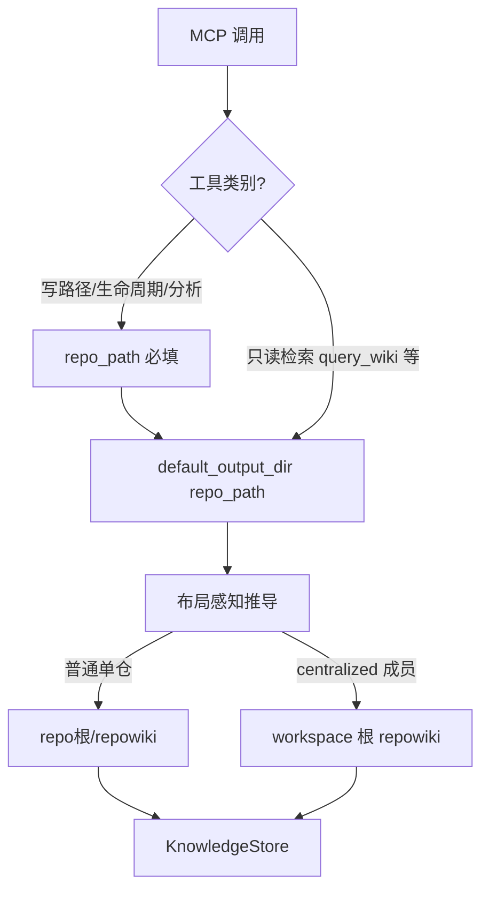

## 需求概述

上一轮事故（smoke 进程把临时 output_dir 持久化进 repo 根 DB，导致后续 session 恢复时索引被清空/错位）暴露了 `output_dir` 参数面的设计冗余。用户经盘点讨论后选定激进收敛方案（方案 B），核心诉求：

1. **机制收敛一步到位**：`output_dir` 本质是 `repo_path` 的（布局感知）纯函数，不应成为可跨进程持久化、可自由指向仓库外的全局状态。
2. **接口收敛**：除只读检索工具外，移除各工具 schema 上的 `output_dir` 参数；输出目录由 `repo_path` 经布局自动推导（普通单仓 → `repo根/repowiki`，centralized 成员 → workspace 根 repowiki），不落库、不可被外部进程改写。
3. **全工具收敛**：包括 `query_wiki`/`note_query` 等只读检索工具在内的所有工具统一移除显式 `output_dir` 参数；输出目录一律由 `repo_path` 经 `default_output_dir` 布局推导（跨仓显式寻址改用 `repo_path=<业务仓目录>` + `repo=` 过滤，孤立 wiki 直接以仓库根为 repo_path）。
4. **文档/模板同步**：workspace 模板、AGENTS.md 注入、prompts、hook、README/docs 中所有 `output_dir=` 书写同步收敛，避免旧示例引导调用方继续传参。
5. **回归保护**：确保 centralized/colocated 布局路由语义不被破坏，并新增"外来 output_dir 不得污染 session/索引"的防护回归测试。

方案保持既有布局机制（`workspace_layout.default_output_dir` 已实现布局感知推导），不改写布局语义本身。

## 技术栈

- Python（现有 codewiki MCP server，无新增依赖）
- 复用现有布局路由原语：`workspace_layout.default_output_dir / resolve_workspace / routing_for_write / is_centralized_corpus`（codewiki/mcp/tools/workspace_layout.py）
- 复用现有事故防护原语：`cache._foreign_output_dir`（codewiki/mcp/cache.py:359，判定"repo 外路径 + repo 拥有 repowiki/"）

## 核心设计洞察（收敛的关键）

事故根因链中，"污染"的唯一入口是 **session 创建/恢复时从 cache 读取持久化的 output_dir**：

- `SessionStore.find_or_restore`（codewiki/mcp/session.py:156-211）第 190-196 行 `output_dir = cache.get_output_dir()` 优先于 `<rp>/repowiki` fallback；
- `analysis.py:276/518` 两处 analyze 成功后 `cache.set_output_dir(...)` 落库；
- `cache.py` 的 `set_output_dir`（402 行）已加"repo 外且 repo 有 repowiki 则忽略"的防护，`get_output_dir`（386 行）也已部分加固——但持久化键仍存在、仍被恢复路径消费。

**因此优雅收敛点是：让 session.output_dir 恒等于 `default_output_dir(repo_path)`**。改两条路即可令所有 handler 内 `session.output_dir` 引用（doc_writer/crosslink/evidence/batch_ingest 等数十处）无需逐一修改即自动正确：

1. session 创建（analyze 成功后 create session 传入的 output_dir）与恢复（find_or_restore）一律改由 `default_output_dir(repo_path)` 推导；
2. `cache.set_output_dir / get_output_dir` 退役（删除方法与全部调用点），`repo_meta` 不再承载 output_dir 键——外来进程在机制上无法再改写任何后续会话的目录指向。

## 解析链（收敛后目标态）



## 关键技术决策与取舍

1. **全工具移除参数**（用户最终确认，推翻了此前的"只读保留"）。所有工具（含 `query_wiki`/note_query 等只读检索）schema 不再暴露 `output_dir`；输出目录一律由 `repo_path` 经 `default_output_dir` 布局推导，跨仓显式寻址改用 `repo_path=<业务仓目录>` + `repo=` 过滤。
2. **handler 容忍层（平滑过渡）**：为兼容既有调用方（AGENTS.md 约定、skill、hook、旧脚本）在过渡期仍携带的 `output_dir` 参数，handler 内部解析保留"显式值仅用于**校验告警**，不改变推导结果"的降级路径：若显式值与 `default_output_dir(repo_path)` 不一致且落在 repo 外，按 `_foreign_output_dir` 同款判定拒绝/忽略并告警日志；MCP server 对未知/多余参数的宽容度决定是否可直接硬删——先核查 registry/server 参数校验实现（registry.py 已存在 repo_path 默认注入机制，见 2945 行注释）。
3. **兼容层不做长期保留**：收敛后 `resolve_output_dir`（store_bridge.py:34）命中路径收敛为"session（恒为推导值）> repo_path 推导"；显式 `output_dir` 仅告警忽略（`_warn_ignored_output_dir`），不改变推导结果；不传 session 且无 repo_path 时维持原 ValueError 契约。
4. **不做大范围 handler 改写**：`session.output_dir` 字段保留（内存态），仅保证其赋值来源恒为布局推导，从而全部内部引用自动正确——避免 53 个文件的无谓改动（最小爆破面）。

## 风险与性能

- 性能无新增热点（default_output_dir 走 workspace_layout 进程级缓存 `_cache`，见 workspace_layout.py:46）。
- 风险点：centralized 语义（业务仓分析落 workspace 共享 corpus、repo= 过滤、routing_for_write 分区）绝不可破坏——所有改动必须复用现有布局原语，禁止手写 `<repo>/repowiki` 拼接路径。
- 风险点：MCP schema 移除参数后，registry 的工具说明、prompts.py 的 usage 文本、AGENTS.md 注入模板若残留 output_dir= 示例，会引导 agent 传已被忽略的参数——文案同步与代码收敛必须同批完成。
- 爆破面控制：不动布局语义、不动 task-memory/团队协作层、不动 close_session 的索引重建逻辑本身；仅收敛"目录从哪来"。

## 目录结构（改动文件）

```
codewiki/mcp/cache.py                       [MODIFY] 退役 set_output_dir/get_output_dir 与 repo_meta 中 output_dir 键的写入/读取；保留 _foreign_output_dir 或上移到统一收敛 helper 供 handler 校验复用
codewiki/mcp/session.py                     [MODIFY] find_or_restore（约 190-196 行）改 default_output_dir(repo_path) 推导；不再调用 cache.get_output_dir
codewiki/mcp/tools/analysis.py              [MODIFY] 移除两处 cache.set_output_dir 调用（约 276、518 行）；session 创建时 output_dir 由 default_output_dir 推导
codewiki/mcp/tools/store_bridge.py          [MODIFY] resolve_output_dir/store_for 收敛注释与降级校验路径（session 恒为推导值；显式 output_dir 仅读工具）
codewiki/mcp/registry.py                    [MODIFY] 写路径工具 schema 移除 output_dir 参数描述；核对/兼容未知参数策略
codewiki/mcp/server.py                      [MODIFY] 核查参数校验宽容度（如需要）
codewiki/mcp/tools/note_query.py            [MODIFY] handle_query_wiki（778 行）保留 output_dir 寻址；文档串更新为"第二跳优先 repo_path"
codewiki/mcp/tools/workspace_layout.py      [MODIFY]（如需要）抽出统一收敛 helper，集中 repo 外 output_dir 判定
codewiki/templates/workspace/agents-md-workspace.md.tpl      [MODIFY] 第二跳 query_wiki(output_dir=业务仓repowiki) → repo_path=<业务仓目录>；第一跳去掉显式 output_dir
codewiki/templates/workspace/repo-map.md.tpl                [MODIFY] 新增业务仓示例注释（29 行）同步改为 repo_path
codewiki/templates/workspace/readme.md.tpl                  [MODIFY] 27 行 output_dir= 示例同步
codewiki/templates/workspace/agents-md-workspace-centralized.md.tpl  [MODIFY] 核对一跳文案（应为无 output_dir 写法）
codewiki/mcp/prompts.py / codewiki/mcp/tools/doctrine.py / distill_conversation.py / review_changes.py / note_ingest.py 等 [MODIFY] 文案与内部透传校对（以盘点清单为准）
codewiki/hooks/task_session_start.py / codewiki/agents/wiki-recall.md / codewiki/cli/commands/query.py  [MODIFY] output_dir= 示例收敛
tests/test_layout_routing.py / test_runtime_layout.py / test_centralized_layout_fixes.py / test_workspace_layout.py / test_team_layout.py / test_workspace_analyzer_layout.py / test_query_repo_filter.py  [MODIFY] 断言适配
tests/test_output_dir_convergence.py        [NEW] 新增回归：外来目录 set 被拒/不落库、restore 走布局推导、centralized 路由不回归
docs/（多仓 Harness 工作区两份设计文档等）与 AGENTS.md/README  [MODIFY] 文案同步（output_dir= 收敛为 repo_path）
```

## 实现要点

1. 先盘点后动手：用 code-explorer 精确列出 `set_output_dir`/`get_output_dir`/`arguments.get("output_dir")`/`session.output_dir` 的全部消费点，生成收敛清单，避免漏改或误删 centralized 相关调用。
2. 复用而非新造：repo 外 output_dir 的拒绝判定直接沿用 `cache._foreign_output_dir` 的语义（必要时上移为共享函数），三态回退（无 workspace/非成员/colocated → `<repo>/repowiki`）已由 `default_output_dir` 保证。
3. 文案与代码同批：模板/AGENTS/prompts/README 的任何 output_dir= 残留都会让收敛"名存实亡"——todo 中把文案面与 schema 面绑在同一里程碑。
4. 日志纪律：repo 外 output_dir 被忽略/拒绝时输出 warning（复用现有 logger），不带路径大 payload、不刷屏（每调用一次即可）。

## Agent Extensions

### SubAgent

- **code-explorer**
- Purpose: 在收敛改动前精确盘点 `output_dir`/`session.output_dir` 的全部消费点、MCP schema 参数定义位置、模板与 docs 中所有 `output_dir=` 文案面，产出收敛清单，避免大范围重构漏改。
- Expected outcome: 输出按"数据/恢复层、handler 解析层、schema 定义层、模板/prompts/hook/docs 文案层"分组的完整文件与行号清单，作为后续改动与回归的依据。

### Skill

- **verify-and-stop**
- Purpose: 收敛与文案同步完成后，跑布局/会话/centralized 全套测试并核对回归验收条件（外来目录不落库、restore 走布局推导、centralized 路由不回归、既有测试全绿），只验证不扩范围。
- Expected outcome: 给出回归测试通过证明与残留输出_dir 消费点为零的验收结论。