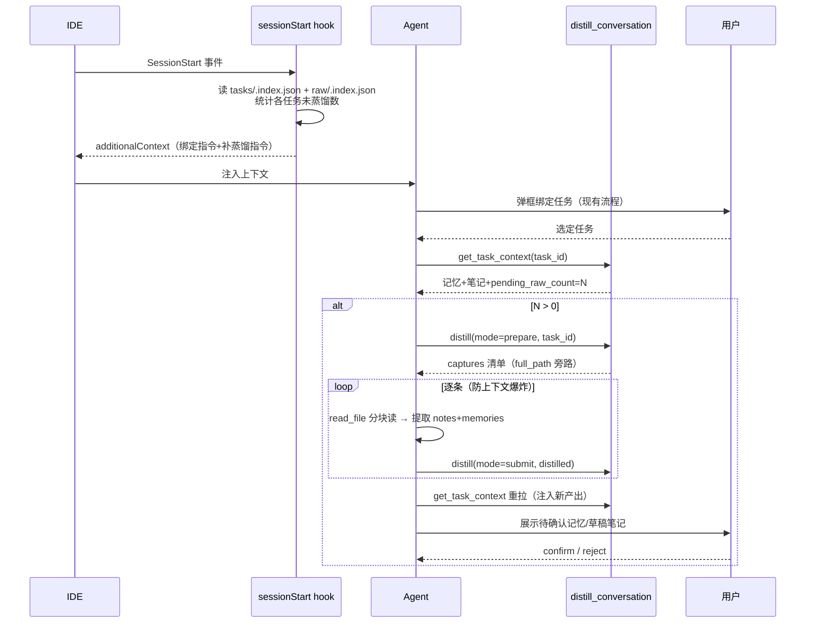

## 用户需求

在 sessionStart 时**补蒸馏本任务相关的积压对话**，并把蒸馏产出的记忆和经验**注入当前会话上下文**，让蒸馏触发从"靠 Agent 自觉"变为"机制保证"——任何智能体（哪怕不会主动反思）新建会话时都会被引导完成补蒸馏与上下文注入。

## 产品概述

会话开始 → hook 弹框绑定任务（现有）→ 绑定后检查本任务未蒸馏的积压对话 → Agent 以 Mode C（prepare→逐条提取→submit）补蒸馏 → 重新拉取任务上下文，把新产出的待确认记忆与草稿笔记注入当前会话 → 向用户展示待确认项走 confirm/reject 闸门。

## 核心功能

- **sessionStart 盘点注入**：hook 读取 raw 索引统计每个任务的未蒸馏对话数，有积压时在 additionalContext 追加"补蒸馏"硬性指令（含任务级数量），无积压时不打扰
- **按任务过滤蒸馏**：`distill_conversation` 支持 `task_id` 参数，prepare/submit/批量/后台模式均只处理该任务的积压对话
- **上下文注入**：`get_task_context` 返回本任务未蒸馏对话数（确定性触发信号）及关联笔记的状态（draft/stable），蒸馏后重拉即可把待确认记忆与草稿经验注入上下文
- **评审闸门不变**：注入仅作只读展示并标注"待确认"；记忆须 confirm_task_memories 落盘，笔记须 confirm_note 转正
- **文档与提示词同步**：AGENTS.md 任务段模板、task-workflow prompt 更新工作流，并移除 prompt 中诱导直调 `add_task_memory` 的条目

## 技术栈

- Python 3 标准库（hook 脚本保持零 codewiki 依赖、同步返回、15s 超时约束）
- MCP 工具层（FastMCP 风格的 handler 函数，现有模式）
- 测试沿用 `tests/` 现有 pytest 风格（test_task_manager.py、test_distill_cleanup.py 等）

## 实现方案

**核心决策：hook 只做"盘点 + 指令注入"，蒸馏重活由绑定后的 Agent 以 Mode C 执行。** sessionStart hook 在任务绑定之前触发且不能跑 LLM，因此"本任务相关"的过滤必须下沉到 MCP 工具层（绑定后 Agent 已知 task_id）。hook 的价值是把"补蒸馏"变成每次会话的确定性指令，而非依赖 Agent 自觉。

**关键链路**（全部复用现有机制，无新架构）：

1. **盘点数据源已就绪**：`capture_conversation` 维护的 `repowiki/raw/.index.json` 每条含 `relpath/content_hash/source_session/status/task_id`（已核实 L609-615），hook 读单个 JSON 即可按任务统计 `status != distilled` 的积压数，O(条目数)、无 codewiki import、不写盘。
2. **task_id 过滤**：在 `handle_distill_conversation` 解析 targets 后增加过滤——索引存在时按索引条目的 task_id 筛选（O(1)/条，沿用 capture 的 index-first 模式），索引缺失时回退 frontmatter 扫描（`_parse_frontmatter` + `_unquote_fm`，与 L538 蒸馏路由读 task_id 的方式一致）。
3. **注入走现成链路**：`get_task_context` 已聚合 memories + pending_memories + related_notes，只需补 `pending_raw_count`（蒸馏触发信号）与 related_notes 的 `status` 字段（区分 draft/stable，供展示时标注"待确认"）。
4. **评审闸门零改动**：蒸馏双轨产出 notes（draft）/memories（pending）的 confirm/reject 流程不变；注入是只读展示。



**性能与可靠性**：hook 新增一次 JSON 读取（KB 级），远低于 15s 超时；盘点失败静默降级为现有行为（try/except 包裹，绝不破坏任务绑定）。Mode C 逐条处理沿用 prepare 返回的 one-at-a-time 指令，上下文不爆炸。索引与 frontmatter 双兜底保证过滤在索引缺失/过期时仍正确。

## 实现要点（防回归）

- **双副本同步**（已沉淀教训）：`task_session_start.py` 改动必须同时落在源副本 `codewiki/hooks/` 与项目副本 `.codebuddy/hooks/`，内容完全一致，否则随包分发的用户拿不到新行为
- **hook 只读不写**：盘点仅读 JSON，任何异常回退到现有消息，`continue: true` 不受影响
- **顺手修根因**：`_prompt_task_workflow` L977 "手动追加进度：add_task_memory" 是上轮违规的诱导源，替换为"进度记忆只由蒸馏产出并经确认落盘"的表述
- **指令措辞**：补蒸馏指令须明确"绑定任务之后、开始回答用户提问之前执行；若用户明确表示紧急，可先答复、会话结束前补蒸馏"，避免与现有"硬性执行顺序"段冲突
- **不改 confirm 语义**：注入展示必须标注"待确认"，禁止在 confirm 前把 pending 内容当正式记忆引用

## 目录结构

```
d:/repos/CodeWiki-CN/
├── codewiki/
│   ├── hooks/
│   │   └── task_session_start.py        # [MODIFY] 源副本：新增 _count_pending_raws(repo_path) 读 raw/.index.json 按任务统计；_build_message 在有积压时追加「补蒸馏」指令段（绑定后执行 prepare(task_id)→逐条提取→submit→重拉 get_task_context→展示待确认项）
│   └── mcp/
│       ├── prompts.py                   # [MODIFY] _TASK_MEMORY_AGENTS_SECTION 模板会话开始流程补"补蒸馏"步骤；_prompt_task_workflow 同步更新并移除 add_task_memory 诱导行
│       └── tools/
│           ├── capture_conversation.py  # [MODIFY] 导出共享只读助手 pending_raws_by_task(output_dir)（index-first，frontmatter 兜底），供 distill 过滤与 get_task_context 计数复用
│           ├── distill_conversation.py  # [MODIFY] handle_distill_conversation 新增 task_id 参数：targets 解析后按任务过滤（prepare/submit/批量/Mode B 全模式生效）；无匹配返回 noop 并说明
│           └── task_manager.py          # [MODIFY] handle_get_task_context 增加 pending_raw_count 与 pending_raws 清单（截断展示）；related_notes 条目补 status 字段
├── .codebuddy/hooks/
│   └── task_session_start.py            # [MODIFY] 项目副本：与源副本保持逐字一致（分发一致性教训）
├── AGENTS.md                            # [MODIFY] 本仓 TEAM-MEMORY-TASK 块与新模板同步（会话开始流程加补蒸馏步骤）
└── tests/
    ├── test_task_manager.py             # [MODIFY] 补 get_task_context 的 pending_raw_count/related_notes status 用例
    ├── test_distill_cleanup.py          # [MODIFY] 补 task_id 过滤用例：prepare/批量只命中本任务 raw、索引缺失回退 frontmatter、无匹配 noop
    └── test_task_session_start.py       # [NEW] 子进程运行 hook 脚本：有积压时 additionalContext 含补蒸馏指令与数量、无积压时不含、索引损坏时降级不报错
```

## 关键接口

```python
# capture_conversation.py 新增共享助手（index-first，frontmatter 兜底）
def pending_raws_by_task(output_dir: Path) -> Dict[str, List[Dict[str, str]]]:
    """按 task_id 聚合未蒸馏 raw 条目；无 task_id 的归入 "" 键。"""


# distill_conversation 新参数（现有参数不变）
# arguments["task_id"]: Optional[str] — 仅蒸馏该任务的积压对话

# get_task_context 返回新增字段
# "pending_raw_count": int, "pending_raws": [{"relpath", "captured_at"}...],
# related_notes 条目: {"relpath", "title", "status"}
```

## Agent Extensions

### SubAgent

- **code-explorer**
- Purpose: 实现前核查 `_iter_raw_files`、`handle_get_task_context`、`_TASK_MEMORY_AGENTS_SECTION` 的全部调用点与引用面，确认 task_id 过滤与返回字段扩展不破坏现有调用方（smoke_test_mcp.py、team-memory-hook prompt 内嵌说明等）
- Expected outcome: 产出受影响调用点清单，保证改动 blast radius 可控、无遗漏同步点

### MCP

- **codewiki**
- Purpose: 编码前用 `query_wiki` 检索已有 decision/pitfall 笔记（如"任务归属在采集阶段决定""双副本同步"等），实现后用 `list_pending_memories`/`get_task_context` 实测验证新字段与过滤行为
- Expected outcome: 方案与既有决策一致不重复踩坑；改完即可端到端验证 task_id 过滤与注入链路