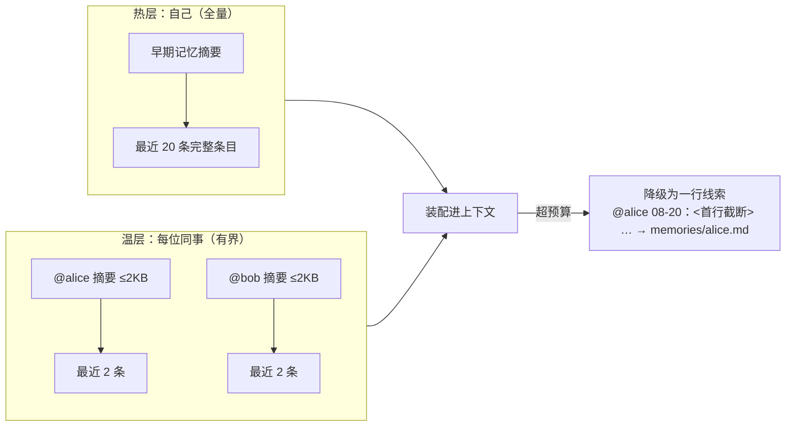

# CodeWiki-Plus 系列 10：一个人用是记忆，一群人用才是资产——知识库团队化的两昼夜

> 前九篇我们一直在跟一个仓库较劲：把代码读成文档，把对话蒸成经验，把零散经验聚成团队共识。系列 5 的结尾埋过一个伏笔——"当第二个人开始用这个知识库，整套机制突然全是窟窿"。这一篇把那个伏笔兑现：从四份设计文档出发，讲 CodeWiki-Plus 怎么把一个"单人记忆体"改造成"团队资产"，以及最后那 48 个小时里，真实发生了什么。

---

## 引子：第二个人来了，一切开始漏水

先讲一个真实的场景。

同事把仓库 clone 下来，装上插件，随口问了一句："上次你说的那条 MCP 参数长度的坑，我怎么搜不到？"

翻记录——笔记确实提交了，他也确实 pull 了。但检索就是搜不出来，而且**没有任何提示**。

这不是 bug，是设计上的欠账。我们复盘时把它拆开，发现单人使用时一切正常，一旦 N≥2，四件事同时漏水：

| 现象 | 真相 |
|------|------|
| 刚 pull 下来的笔记搜不到 | 他本机的索引是旧的，工具不知道索引该更新了 |
| 我常查的笔记，在他那儿是冷的 | 热度账本每人一本，"热"这个字没有团队口径 |
| 两人各写一条笔记，git 必报冲突 | 索引、目录页、日志都是"整文件重写"，第二个人一定撞车 |
| 不知道一条经验是谁提的 | 系统里压根没有"人"这个概念，作者一栏永远是工具版本号 |

四条看着不相干，根因是同一个：**有些东西是本机的临时状态，有些东西是全队共享的事实，这条边界从来没被划清楚过。**

于是我们花了十二天，从一次调研开始，把这条边界画了出来。

---

## 一、先做一次"不抄功能"的调研

故事要从一份调研报告讲起。

我们完整读了腾讯开源的 `teamai-cli`（一个"团队 AI 配置分发工具"，8.9 万行 TypeScript）。它和 CodeWiki 定位完全不同——它管的是"一个团队怎么让 AI 干活"，我们管的是"一个仓库的代码知识"。它的代码解析靠正则，比我们的 AST 差得远；但它在"知识怎么在团队里流动"这件事上，比我们成熟得多。

调研下来，最值钱的不是任何一项功能，而是三个机制：

**第一，它知道"什么时候该沉淀经验"。** 它不去问 AI "你觉得这段对话有价值吗"，而是去数客观痕迹：用户打断了几次、拒绝工具调用几次、有没有说"不对，应该是……"。加权算分，过线才提示。最妙的是它的防误报设计——"会话够长够复杂"这类加分封顶 10 分，而阈值是 20 分，**意味着一个又长又顺、毫无摩擦的会话在数学上就不可能触发**。真正较劲过的对话才会被记住。

**第二，它把"有没有被用上"变成了数据。** 每次检索命中记一张隐式票，AI 实际引用了哪条记一张显式票。票数回流到排序，还驱动四件事：热门的上浮、冷门的淘汰、被反复验证的晋升成正式知识、**被反复搜到却从没人用的标记为"内容不行，该重写"**。最后这条是我们在自己的 16 项质量检查里完全没有的维度。

**第三，也是本篇的重点：多个人写同一批文件，它靠"每人一个文件"解决。** 知识库全员共读、不分你我；但遥测、投票这类高频写入的数据，严格每人一个文件（`sessions/<user>/`）。文件层面天然不冲突，git 只管普通的文件合并。

顺带抄回来的还有一份"克制清单"——他们明确不做的事：不做贡献者排行榜（竞争性排名伤害团队文化）、不做机器学习推荐（简单频率就够用）、不做 Web 前端。还有一个被砍掉的功能特别有教育意义：他们曾经做过"每次工具调用后自动检索知识库"，后来删了，理由是噪音大、命中率低、和主动检索重复。**结论是：被动、高频、事后的自动注入是失败的；低频、事前、由 Agent 主动发起的才成立。**

调研的结论只有一句话：**CodeWiki 缺的不是功能，是"多人共享时的正确性"。**

---

## 二、四个断层：把"感觉不对"变成"清单"

带着这句话回头审自己的代码，我们把漏水点固化成了四个断层，每一条都带着源码证据：

1. **索引静默过期**：搜索入口只检查"索引里有没有数据"，从不检查"索引新不新"。队友 pull 下来的新笔记，本机的索引里没有，且优先命中——于是"搜不到刚拉下来的知识"。
2. **信号本机碎片化**：热度数据库和采纳记录都在 `.gitignore` 里，纯本机私有。一条笔记两个人各采纳了 2 次，谁都够不着晋升门槛 3 次。
3. **聚合文件系统性冲突**：每写一条笔记，就全量重写目录页和索引文件；日志是往文件**顶部**插一行。两个人先后写笔记，必冲突，频率随人数线性上涨。
4. **无身份**：作者一栏返回的是工具版本号，不是人。遥测数据分不清谁是谁，跨机器还可能互相覆盖。

顺手也排除了两个"看着像问题、其实不是"的坑，避免白投入：冷启动不需要额外提交忽略文件（实测可用）；二进制缓存数据库**不能**提交——它没法合并，两人各写一条笔记后再 pull，git 只能二选一，**落选方的笔记会从检索里静默消失**，比现状更糟。

---

## 三、第一刀：让索引自己长好

第一个要治的是"搜不到刚拉下来的知识"。思路很朴素：**在搜索入口加一道极便宜的新鲜度检查，不一致就自动重建，对调用方零感知。**

判据分三层，一层比一层细，但都只扫文件清单、不读文件内容：

- **数量对不对**：磁盘上有多少篇 md，索引里有多少条；
- **名单对不对**（数量巧合相等时的兜底）：两边的文件名集合是否一致；
- **改没改过**（内容变了但文件数没变的死角）：随机抽几个文件，看修改时间是不是晚于索引构建时间。

第三层专门覆盖团队里最高频的一个场景：同事把你 pull 下来的草稿确认了，文件数没变，但内容状态变了。

两个配套的设计细节值得抄：

- **失败降级，绝不阻塞**。重建失败就继续用旧索引返回结果，只在结果里附一句"索引可能过期"。**检索永远不会因为自愈失败而中断**——这条后来成了整个项目的通用原则。
- **一分钟缓存**。同一个目录每分钟最多扫一次，避免分页式连续调用反复扫描。

顺手修了一个陈年老伤：项目配置里存的是绝对路径，同事机器上必然失效。改成相对路径，读取端两种形态都认。

---

## 四、第二刀：每人一个文件

第二刀是整个团队化的枢纽，也是从 `teamai-cli` 借来的最值钱的一招。

先把一个约束说清楚：**在 git 的世界里，没有分布式锁**。两个人在两台机器上写东西，唯一能保证不打架的，是"这个文件只有一个人会写"。换句话说——**文件所有权就是锁**。

于是有了两条贯穿全局的规则：

- **git 只存内容**：人写过的、审过的知识，以及少量标量配置，入库；
- **派生物一律本地可重建**：索引、缓存、计数器、运行态，全部请出版本库，需要时扫描重建。

### 遥测：从"每人一本私账"到"全队一本公账"

以前，检索热度躺在本机的 SQLite 里，gitignore，写完没人看。现在改成入库的一行文本日志，**每个人一个文件**：

```
repowiki/.meta/telemetry/
  ├── alice.jsonl
  ├── bob.jsonl
  └── ...
```

文件内容极简，一个人一次检索就是一行：

```json
{"t": "hit", "doc": "notes/xxx.md", "at": "2026-08-26", "n": 6}
```

几个关键取舍：

- **同一个文档、同一天只记一行**，数字累加。五个人的团队跑一年，也就几万行，聚合一次几十毫秒；
- **采纳事件带幂等键**，同一个人同一段会话重复提交只算一次，不靠数据库主键；
- **聚合是纯函数**：把整个目录的事件流重放一遍就得到全队口径的热度，目录没变就直接用缓存，不需要维护一张聚合表。事实源只有一个，"双写不一致""镜像表互相覆盖"这类麻烦从设计里消失。

这一改，热度的语义就变了：以前"热"是"我常查"，现在是"我们常查"。最有意思的是晋升门槛——**"不同的人各自采纳过"比"同一个人采纳很多次"更有说服力**，所以晋升证据里加了一个"不同人数"的字段。

### 任务记忆：一个人的日记 vs 全队的进度

同一套思路用在了任务记忆上，但多了一个绕不开的问题：**如果每人只加载自己的记忆，那还叫团队吗？**

Bob 看不到 Alice 上周定的方案，必然重复劳动；可要是全员全量加载，内容量随人数线性膨胀，话多的人还会把别人的条目全挤掉。

最后的答案叫**分层加载**，可以类比成团队站会：



- 自己的记忆**全量**加载——单人使用时行为零变化，这是存量兼容的底线；
- 同事的记忆只加载**摘要 + 最近两条**。为什么是"最近两条"而不是"最热两条"？因为任务记忆没有消费回路，热度只能是拍脑袋的权重，**时间戳是唯一诚实的信号**；而"他最近在忙什么"恰恰是最能防止撞车的信息；
- 一旦超预算，**降级为一行线索**而不是直接丢弃——保住线索，只降信息量；
- 压缩时**每人只压自己的文件**，永远不碰别人的。代价是摘要按作者碎片化，但摘要本来就是有损压缩，按作者分片反而保留了"谁早期做了什么"的脉络。

一句话总结这刀：**读共享，写分片。**

---

## 五、第三刀：把冲突从"天天碰"改成"几乎不碰"

前两刀解决"搜不到"和"算不准"，第三刀解决"天天撞车"。

核心原则只有一句：**文件要么独占（每人一个），要么追加（只往末尾写），要么不入库（可重建）。** 剩下的冲突，是"两个人对同一段知识有不同理解"——那是有意义的冲突，工具只负责让它可见、可归因，裁决留给人。

三个具体改造：

**日志从"插队"改成"排队"。** 以前每次写笔记，往日志文件**顶部**插一行——两个人都插第一行，必冲突。现在改成按月分片、往文件**末尾**追加：git 对不同位置的追加能自动合并，跨月自动换文件。真实原因是朴素的：**插队必冲突，排队不冲突。**

**配置里的时间戳不再乱刷新。** 每次代码分析都会刷新一个"生成时间"字段，全员最高频、最无意义的冲突来源就是这个。改成对自动维护字段算哈希，实质没变就不回写。

**把派生物请出版本库。** 一次提交动了 68 个文件：目录页（191 行）、任务索引（40 行）、来源注册表（64 行）、二十几个会话绑定文件，全部 `git rm --cached`。

这里有个常被问的问题：**目录页不入库，新同事 clone 下来第一眼看什么？** 答案是读的时候发现没有就重建，秒级，结果和入库版逐字节一样。因为它本来就是机器生成的目录，不是人写的知识。

顺带补了并发保护：所有"读—改—写"的地方统一套上跨平台文件锁 + 临时文件原子替换。这一步的验收标准是我们特意加严的——**必须用两个真实进程并发递增，断言零丢失**，不能只靠单进程里的线程测试。因为真实的威胁模型是"多个 IDE 窗口各自开着一个 MCP 服务进程"。

---

## 六、同步的红线：工具永不碰你的工作树

团队化绕不开最后一个问题：**要不要自动 pull / push？**

一个很常见的直觉是"每次写文件前先 pull 一下，保证基线最新"。我们把它否掉了，理由说三条通俗的：

1. **冲突发生在 push，不在 pull。** 写之前 pull 只保证"这一瞬间"基线最新，你写完到推送之间，别人照样能推，冲突原样出现。pull 只是把过期的窗口缩小，不消灭冲突。
2. **pull 会动你的工作树，而你的工作树里有没提交的业务代码。** 知识目录里的文件刚被工具写过，永远是"脏"的，pull 遇到脏文件会直接拒绝；加 `--autostash` 更糟，它把你没提交的代码藏起来，弹回来冲突时状态一团乱。**工具擅自改动用户的工作区是红线。**
3. **方向反了。** 冲突概率由"两次推送的间隔"决定，不由 pull 的频率决定。配合前面那一套（每人一个文件、只追加、按仓分区），绝大多数合并且是 git 能自动完成的 trivial 合并——**提高推送频率才降冲突，提高拉取频率只降"语义过期"风险。** 前者才值得自动化。

最终收敛成三个动作，且全部有门控：

| 动作 | 时机 | 关键约束 |
|------|------|----------|
| **拉取校验**（告警） | 每会话一次 | 只读的 `git fetch`，只告诉你"远端前进了 N 个提交，建议先同步"，不执行任何同步 |
| **快进拉取** | 会话开始时 | 只在"这个仓库里没有业务代码"时允许；工作树不干净就跳过 |
| **写后推送** | 一批写入完成后 | 默认关闭；`git add` 的路径硬限定在知识目录内，物理上不可能把业务文件卷入 |

贯穿三者的一条不变量，值得单独拎出来：**数据不丢，延迟到达。**

任何失败——断网、凭据过期、推送竞争——都只降级，不抛错、不阻塞、不回滚。推送竞争就自动 `fetch + rebase` 重试，重试耗尽就保留本地提交、报告人工，由下一次成功推送捎带送达。唯一会改变远端状态的动作是"成功的推送"，其余一切都是可重试的本地状态。

还有一条刻意的设计：**只要知识目录所在的仓库里同时装着业务代码，就永远只允许只读告警**。工具不碰你的代码，这条信任红线比便利性重要。

---

## 七、昨天：从方案到落地的十四个小时

前面讲的都是设计。9 月 2 日这一天，它们全部落地了。看时间线：

| 时间 | 事情 |
|------|------|
| 19:28 | 布局去噪 + 并发收口（一次提交动了 68 个文件，新增 532 行测试） |
| 19:28 | 本仓自己先迁移到新布局，第一个月度日志分片产生 |
| 20:05 | 归属与新鲜度：笔记加上 `author`、页面重生成前比对代码指纹 |
| 20:49 | 同步最后一块：快进拉取 + 写后推送 |
| 21:41 | 真仓验收发现两个洞：推送前得先把用户已有的暂存区保护起来，锁文件不能被卷进提交 |
| 22:15 | 补掉 4 个漏网的裸写点 |
| 22:46 | **给 112 篇存量笔记回填作者** |
| 23:00 | 并行的另一份借鉴方案定稿（15 项裁决） |

最想讲的是倒数第二项。

团队化有个尴尬的先有鸡还是先有蛋的问题：**你想统计"这条经验被几个人采纳过"，可历史上那些笔记根本没记录是谁写的。** 于是我们写了个命令，按 git 提交历史溯源——每篇笔记第一次进版本库是哪个提交的，那个提交的作者就是它的作者。

跑完的结果：**112 篇笔记全部回填成功，91 篇是一个人写的，21 篇是另一个人写的**。

这件事的意义不在数字本身。它意味着从这一天起，知识库里每一条经验都有主人了：谁的踩坑、谁的决策、谁提的方案，一眼可见。后来我们给这个归属定的策略也很克制——**只记录，不阻断**：你改别人的笔记时，工具会提示一句"这条笔记的作者是 X"，但不拦你，因为知识库本来就是共享的。

还有一处有意思的插曲。那天评审时有人质疑："并发锁的测试只在线程层跑过，凭什么说多进程安全？" 这个质疑是对的——真实的威胁模型是多个独立进程。于是验收标准被改成：起两个真实子进程并发递增，断言零丢失。测试数从 670 涨到 681。

---

## 八、今天：机器开始替团队记账，以及一个诚实的尴尬

9 月 3 日上午，跑了两件事。

**第一件，遥测数据第一次以"团队共享资产"的身份进了版本库。** 六个用户文件、470 行事件，记录着过去十天里每个人检索过什么、采纳过什么。这里面第一次出现了"按文件检索"的新事件类型。

顺便说一个实测出来的、挺打脸的事实：**那六个文件名，实际只对应两三个人。** 剩下的都是身份识别兜底失败的产物——有的机器没配 git 用户名，退到了操作系统登录名（"Administrator"），有的连登录名都拿不到，退成了字面量"local"。同一个人被记成了三个身份，热度数据自然也就碎成了三份。

这正是后来把身份链改成"优先用 git 邮箱"的原因：邮箱几乎人人配置，且全局唯一。一行代码，消除最大的碎片源。文档里给这个身份定的调子也很清醒：**命名空间不是鉴权**——能提交进这个仓库的，就是团队可信成员，身份只用来分文件，不用来设权限。

**第二件，把积压的 10 个测试失败清零了。** 其中有一个是真 bug：给页面元数据追加新字段时，字段被插到了整个块的末尾而不是块内部，导致 YAML 解析崩坏，页面指纹永远读不出来。

另外三个失败特别值得一提，因为它们本身就是团队化的隐喻：**测试里硬编码了 `master` 分支名**（在默认分支是 `main` 的机器上直接失败）、**断言里写了 Windows 风格的路径**（在 macOS 上被判成相对路径）。

一个人写的测试里，藏满了他机器的假设。这些假设在自己机器上永远正确，换台机器就崩——**这跟"单人知识库搬到团队里就漏水"是同一件事的两种表现。** 修完之后，全量 769 项测试，0 失败。

---

## 九、六条可以带走的经验

如果你也在做团队向的 AI 工具或知识系统，这六条是我们踩实了的：

1. **防错靠结构，不靠人的自觉。** 别写"请记得先 pull"的文档，去改文件布局，让冲突在结构上不发生。
2. **git 世界没有分布式锁，文件所有权就是锁。** "每人只写自己的文件"这句话，把"独占 / 追加 / 不入库"三类之外的冲突全部消灭。
3. **派生物不入库，事实源只有一个。** 一切能靠扫描重建的东西都请出版本库。事实源一多，就必然要为"同步不一致"买单。
4. **同步不进写热路径。** 高频小操作配网络往返是灾难；改成低频、批量、可降级的动作。
5. **失败只降级，不抛错、不阻塞、不回滚。** "数据不丢，延迟到达"——用户能容忍晚一点到，不能容忍东西没了或者工具卡住。
6. **剩下的冲突是有意义的冲突。** 两个人对同一段知识理解不同，这是需要人来裁决的信号，不是需要自动化掉的噪音。工具的职责是让它可见、可归因。

还有一条元经验：**"不做什么"和"做什么"同样值得写下来。** 不做排行榜、不做机器学习推荐、不做写前自动 pull、不做二进制缓存入库——这些否决记录，比功能清单更能防止后来者重复踩坑。

---

## 十、还在路上

两昼夜落地了主体，但有几件事还在半路：

- **真仓验收**：写后推送在假远端上跑通了竞争重试，还没在多仓工作区的真实仓库里实跑；
- **集中式布局的全局派生文件**：知识全部汇总到一个仓库时，目录页这类文件会变成全队高频写的单点，治理优先级最高；
- **默认"搭便车"**：知识目录和业务代码同仓时，工具零 git 动作，知识随你自己的业务仓同步节奏到达——这是比任何自动同步都克制的做法；
- **团队口径的采纳数据刚开始攒**：晋升机制里"不同人数"这个门槛能不能生效，得等数据攒够再看；
- **并行的另一条线**：同期还在推进另一份借鉴（检索成本可见性、按文件反查历史知识、"对端新鲜度"改用 git 提交时间判定），那是另一个关于"检索到底贵不贵、准不准"的故事。

最后回到开头那个问题。同事搜不到的那条笔记，现在能搜到了——而且他搜到的时候，系统知道他搜过，知道他有没有真的用上，也知道这条经验最初是谁写的。

**一个人用的时候，它是一本记忆；能安全地在几个人之间流动之后，它才算是一项资产。**

---

<!-- codewiki:referenced-docs: ["docs/团队知识库支持优化设计方案.md", "docs/团队化文件冲突治理与同步策略设计方案.md", "docs/任务记忆多人协作分片设计方案.md", "docs/teamai-cli-调研与借鉴分析.md"] -->
