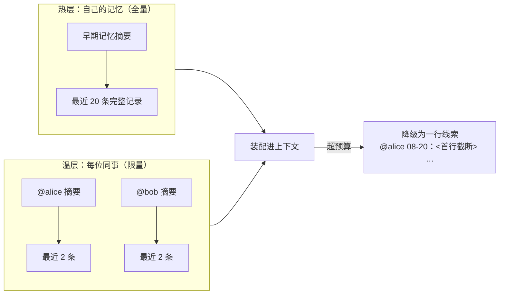

# CodeWiki-Plus 系列 10：一个人用是记忆，一群人用才是资产——知识库团队化的两昼夜

> 从四份设计文档出发，讲 CodeWiki-Plus 怎么把一个"单人记忆体"改造成"团队资产"


---

## 引子：第二个人来了，一切开始漏水

先讲一个真实的场景。

同事把仓库克隆下来，装上插件，随口问了一句："上次你说的那条工具参数长度的坑，我怎么搜不到？"

翻记录——笔记确实提交了，他也确实拉取了。但就是搜不出来，而且**没有任何提示**。

这不是 bug，是设计上的欠账。我们复盘时把它拆开，发现一个人用时一切正常，一旦人多了一个，四件事同时漏水：

| 现象 | 背后的真相 |
|------|------|
| 刚拉取下来的笔记搜不到 | 搜索靠的是"目录卡片"（索引），他机器上的卡片是旧的，系统不知道该换新卡片了 |
| 我常查的笔记，在他那儿排不上号 | "这条知识多人常查"的账记在各自电脑里，没有全队一本账 |
| 两人各写一条笔记，git 必报冲突 | 目录页这类文件每次都是整个重写，第二个人一定撞车 |
| 不知道一条经验是谁提的 | 系统里压根没有"人"这个概念，作者一栏永远写着工具版本号 |

四条看着不相干，根因是同一个：**有些东西是"我这台电脑上的临时状态"，有些东西是"全队共享的事实"，这条边界从来没被划清楚过。**

于是我花了两周，从一次调研开始，把这条边界画了出来。

---

## 一、先做一次"不抄功能"的调研

故事要从一份调研报告讲起。

我们完整读了腾讯开源的 `teamai-cli`（一个"团队 AI 配置分发工具"，将近 9 万行代码）。它和 CodeWiki 定位完全不同——它管的是"一个团队怎么让 AI 干活"，我们管的是"一个仓库的代码知识"。它读代码的方式比我们粗糙；但它在"知识怎么在团队里流动"这件事上，比我们成熟得多。

调研下来，最值钱的不是任何一项功能，而是三个机制：

**第一，它知道"什么时候该提醒你沉淀经验"。** 它不去问 AI "你觉得这段对话有价值吗"，而是去数客观痕迹：用户打断了几次、拒绝工具几次、有没有说"不对，应该是……"。加权算分，过线才提示。最妙的是它的防误报设计——"会话够长够复杂"这类加分封顶 10 分，而阈值是 20 分，**意味着一个又长又顺、毫无摩擦的会话在数学上就不可能触发**。真正较过劲的对话才会被记住。

**第二，它把"有没有被用上"变成了数据。** 每次搜索命中记一张"被动票"（有人翻到过它），AI 实际引用了哪条记一张"主动票"（有人真用上了它）。票数回流到排序，还驱动四件事：热门的上浮、冷门的淘汰、被反复用过的晋升成正式知识、**被反复搜到却从没人真用的，标记为"内容不行，该重写"**。最后这条是我们在自己的 16 项质量检查里完全没有的维度。

**第三，也是本篇的重点：多个人写同一批文件，它靠"每人一个文件"解决。** 知识库全员共读、不分你我；但记账、投票这类人人高频写的数据，严格每人一个文件。文件层面天然不冲突，git 只管普通的文件合并。

顺带抄回来的还有一份"克制清单"——他们明确不做的事：不做贡献者排行榜（竞争性排名伤害团队文化）、不做机器学习推荐（简单数次数就够用）、不做 Web 界面。还有一个被砍掉的功能特别有教育意义：他们曾经做过"每次工具调用后自动查一遍知识库"，后来删了，理由是噪音大、命中率低、和主动搜索重复。**结论是：被动、高频、事后的自动注入是失败的；低频、事前、由 Agent 主动发起的才成立。**

还有一份后来（9 月 1 日，按 v0.21.0 逐文件核过源码）补上的证据，值得单独说，因为它几乎是我们后面所有设计的原型：

- **它永远不碰用户的业务工作树。** 所有 git 写操作都发生在两类隔离工作区里（一次性的临时副本用完即删 + 一个持久的报告副本）。源码注释写得很直白："在用户的工作树上跑这些操作，会毁掉他们没提交的业务代码。"
- **高频噪音数据单独放一条"没有父提交"的孤儿分支。** 记账、投票这类"一天写几十次"的数据被挪出主分支，理由是 "must NOT pollute main"。
- **搜索索引不入库。** 他们的 `search-index.json` 只活在本机，拉取时重建，设计文档里那句原话是 "Rebuilt at pull time, no sync conflicts"——**不进版本库流通，就不会有同步冲突**。我们后来那条"git 只存内容，派生本地可重建"的总纲，源头就是这句。

同一个参照样本也露了软肋：他们有一份全局的 `graph-index.json`（整个不可分割的大 JSON）**是入库的**，跨机器并发写没有锁，只能靠"必须经评审单点合入"+ 本机建议性锁兜底，自己的 CHANGELOG 里还留着过一次"并发推送互相覆盖导致数据丢失"的事故。**整文件派生物只有两条出路：要么不入库，要么入库但强制单点写入——不能两头都不做。** 这条反例后来直接决定了我们的做法。

调研的结论只有一句话：**CodeWiki 缺的不是功能，是"多人共享时的正确性"。**

---

## 二、四个断层：把"感觉不对"变成"清单"

带着这句话回头审自己的代码，我们把漏水点固化成了四个断层，每一条都带着源码证据：

1. **搜索的目录卡片会过期，但没人管。** 搜索入口只检查"卡片盒里有没有卡片"，从不检查"卡片是不是最新的"。队友拉取下来的新笔记，本机卡片里没有——于是"搜不到刚拉下来的知识"。
2. **记账各记各的。** 热度和采纳记录都在"不上传名单"（gitignore）里，纯本机私有。一条笔记两个人各采纳了 2 次，谁都够不着"累计 3 次"的晋升门槛。
3. **共享文件每次整个重写。** 每写一条笔记，就把目录页和索引整个重写一遍；日志还往文件**最顶上**插一行。两个人先后写笔记，必冲突，人越多撞得越勤。
4. **没有"人"。** 作者一栏写的是工具版本号，不是人。记账数据分不清谁是谁，换台电脑还可能互相覆盖。

顺手也排除了两个"看着像问题、其实不是"的坑，避免白投入：新同事克隆下来不需要额外提交忽略文件（实测可用）；缓存数据库**不能**提交——它是二进制的，没法合并，两人各写一条笔记后再拉取，git 只能二选一，**落选方的笔记会从搜索里无声消失**，比现状更糟。

---

## 三、第一刀：让目录卡片自己保持新鲜

第一个要治的是"搜不到刚拉下来的知识"。思路很朴素：**每次搜索之前，先花极小的代价检查一下卡片新不新，不对就自动重建，用的人完全无感。**

检查分三层，一层比一层细，但都只扫文件清单、不读文件内容：

- **数量对不对**：磁盘上有多少篇笔记，卡片上记了多少条；
- **名单对不对**（数量碰巧相等时的兜底）：两边的文件名单是否一致；
- **改没改过**（内容变了但文件数没变的死角）：随机抽几个文件，看修改时间是不是晚于卡片上次整理的时间。

第三层专门覆盖团队里最高频的一个场景：同事把你拉取下来的草稿确认了，文件数没变，但内容状态变了。

两个配套的设计细节值得抄：

- **失败就降级，绝不卡住人。** 重建失败就继续用旧卡片返回结果，只在结果里附一句"索引可能过期"。**搜索永远不会因为自愈失败而中断**——这条后来成了整个项目的通用原则。
- **一分钟缓存。** 同一个目录每分钟最多检查一次，避免连续搜索时反复扫描。

顺手修了一个陈年老伤：项目配置里存的是绝对路径（形如 `/Users/zhang/...`），同事机器上必然失效。改成相对路径，读取端两种形态都认。

**后来这条路上又补了三铲（9 月 3 日检索层重构后核对）：**

- **闸门收成一个。** "要不要重建"的判断原先散在两个调用点，新增检索路径就可能漏掉。现在全部收进唯一入口（`codewiki/mcp/tools/wiki_search.py:80` 的索引新鲜度闸门），于是无论是查询、蒸馏时的去重召回，还是"按文件反查历史笔记"的预检，都自动拥有新鲜度，不需要各自实现一遍。
- **卡片换了地方。** 现在的卡片主要住在 SQLite 缓存库里（`<repo>/.codewiki/analysis_cache.db`），老的 JSON 卡片退成了机器上还没建过分析缓存时的兜底路径——代码注释里那句提醒很关键："真正的索引在 SQLite 里，别再拿 JSON 文件名判断有没有索引。"
- **顺手把目录页也重建了。** 判定为过期时除了重建搜索卡片，还会连带重建同样是机器生成、同样会随拉取冲突失效的目录页；质量检查跑之前也会先确保目录页存在（没有就地重建），免得一 clone 下来就被判"目录缺失"。

---

## 四、第二刀：每人一个文件

第二刀是整个团队化的枢纽，也是从 `teamai-cli` 借来的最值钱的一招。

先把一个约束说清楚：**在 git 的世界里，没有"两个人同时写、系统自动帮你排队"这种事。** 两台电脑各写各的，唯一能保证不打架的办法，就是让"这个文件只有一个人会写"。换句话说——**文件归谁，谁才有笔。文件所有权就是锁。**

于是有了两条贯穿全局的规则：

- **git 只存内容**：人写的、审过的知识，以及少量配置，入库；
- **一切能重新生成的东西不入库**：索引、缓存、计数器、运行状态，全部请出版本库，需要时扫描重建。

### 记账：从"每人一本私账"到"全队一本公账"

以前，搜索热度躺在本机的一个数据库里，不上传，写完没人看。现在改成入库的纯文本日志，**每个人一个文件**：

```
repowiki/.meta/telemetry/
  ├── alice.jsonl
  ├── bob.jsonl
  └── ...
```

文件内容极简，一个人一天搜了某个文档几次，就是一行：

```json
{"t": "hit", "doc": "notes/xxx.md", "at": "2026-08-26", "n": 6}
```

几个关键取舍（以下均按当前代码核对）：

- **同一个文档、同一天只记一行**，次数累加。实现的细节比想象中周全：它不是只盯文件的最后一行，而是**从后往前整篇扫**，找到今天这条同文档的记录再原地累加——因为一次查询会同时命中十几篇笔记，各篇的写点是交错的，只看末尾会漏掉合并。五个人的团队跑一年也就几万行。
- **"真用上了"的事件带防重复编号**：编号是"人/会话"，重复采集同一段对话时只算一次。幂等放在**汇总阶段**做（按编号去重，而不是靠数据库主键），因为采用事件是纯追加写入，永远不必"先读再改"。
- **同一个人的两条写路径互相串行**："合并同名行"是读-改-写，"记录采用"是追加，两者共用同一把针对自己文件的锁；别人的文件我们根本不打开。
- **汇总是纯计算**：把整个目录重放一遍得到全队口径；文件没变（按名字+修改时间做快照）就用上次的缓存结果。**旧的 SQLite 记账表已经彻底退役**——没有迁移脚本、不存在双写，重放全部分户文件永远能得到正确结果。事实源只有一个，"两份数据对不上"这类麻烦从设计里消失。

还有一个克制的地方值得抄：**"按文件反查"这类预检动作也会被记进账，但它的票不进热度排名。** 它表示"有人路过瞥了一眼"，不等于"有人真读了"，两条管道在代码层面就是分开的——混进来会把前面辛苦攒的热度稀释掉。这一改，"热"的语义就变了：以前是"我常查"，现在是"我们常查"。

（当初中途记过一笔"晋升证据里要加'不同人数'字段，三个人各采纳一次比一个人采纳十次更有说服力"——诚实说，当前实现只汇出了**全队口径的采纳总数**（两人各采纳一次记两次），"不同人数"这一维还停留在设计里，没进代码。）

### 任务记忆：一个人的日记 vs 全队的进度

同一套思路用在了任务记忆上，但多了一个绕不开的问题：**如果每人只看得到自己的记忆，那还叫团队吗？**

Bob 看不到 Alice 上周定的方案，必然重复劳动；可要是全员记忆全量加载，内容随人数线性膨胀，话多的人还会把别人的条目全挤掉。

最后的答案叫**分层加载**，可以类比成团队站会：



- 自己的记忆**全量**加载——一个人用的时候行为零变化，这是兼容的底线；只有那种"整份记忆挤在一个文件里"的老任务存在时，新机制会把它当作热层的一部分读进来，读出结果和改造前逐字节一致。真的装不下时才"只留最近 20 条 + 告诉你还剩多少"，而不是静默截断；
- 同事的记忆只加载**摘要 + 最近两条**。为什么是"最近两条"而不是"最热两条"？因为任务记忆没有消费回路，"热度"只能是拍脑袋的权重，**时间戳是唯一诚实的信号**；而"他最近在忙什么"恰恰是最能防止两个人干同一件事的信息；
- 一旦内容太多装不下，**降级为一行线索**（一行不超过 60 字，保住时间与作者）而不是直接扔掉——保住线索，只降信息量；每位同事单独给 2KB 预算，超出的才降级，**摘要永远不降级**；
- **两档读取的成本是分开的**：只问"这任务是干嘛的"时拿摘要视图（别人的条目一行都不带，默认 5 条），真要接手干活时才给完整上下文视图（别人的摘要 + 最近两条，默认 20 条）。便宜的调用不该付贵的账单；
- 压缩时**每人只压自己的文件**，永远不碰别人的；压出来的原文另存归档，只增不删。压缩也有明确的触发门槛——自己的文件同时越过"40 条 / 24KB"且有窗口外条目才提示，而不是每天催你整理。代价是摘要按作者各自成段，但摘要本来就有损，按作者分片反而保留了"谁早期做了什么"的脉络。

一句话总结这刀：**读共享，写分片。**

---

## 五、第三刀：把冲突从"天天碰"改成"几乎不碰"

前两刀解决"搜不到"和"算不准"，第三刀解决"天天撞车"。

核心原则只有一句：**文件要么独占（每人一个），要么只往末尾追加，要么干脆不入库（随时可重建）。** 剩下的冲突，是"两个人对同一段知识有不同理解"——那是有意义的冲突，工具只负责让它看得见、查得到是谁写的，裁决留给人。

四个具体改造：

**日志从"插队"改成"排队"。** 以前每次写笔记，往日志文件**最顶上**插一行——两个人都插第一行，必冲突。现在改成按月分文件、往文件**末尾**追加：git 对"两个人各自在文件不同末尾追了几行"能自动合并，跨了月自动换新文件。道理很朴素：**插队必冲突，排队不冲突。**

**配置里的时间戳不再乱刷新。** 每次代码分析都会刷新一个"生成时间"字段，全员最高频、最无意义的冲突来源就是它。改成给自动维护的字段算一份"指纹"（内容摘要），实质没变就不回写。

**把能重新生成的文件请出版本库。** 一次提交动了 68 个文件：目录页（191 行）、任务索引（40 行）、来源注册表（64 行）、二十几个会话绑定文件，全部从版本库移出（本地保留）。

**把"不入库"从文档里的一句话，变成机器会执行的检查。** 在文档里写"派生文件别提交"没用——人会忘，新人压根不知道。现在质量检查里专门有一项：扫描版本库**实际跟踪了哪些文件**，凡是"本机可以重建"的文件还在库里，就报一条警告，并直接给出修复命令（专用迁移命令会用"从版本库移除、文件留在本机"的方式处理，不会删你的数据）；初始化新仓库时，这份忽略清单也会被自动写进 `.gitignore`。约定由此从"记得这么做"升级成"跑一次就知道"。

这里有个常被问的问题：**目录页不入库，新同事克隆下来第一眼看什么？** 答案是：读的时候发现没有，就地重建，秒级完成，结果和入库版逐字节一样。因为它本来就是机器生成的目录，不是人写的知识。跑质量检查之前也会先确保它在——否则克隆下来第一次检查就会被误判成"目录缺失"，那是假警报。

顺带补了并发保护：所有"先读、再改、后写"的地方统一套上跨平台文件锁 + 临时文件原子替换（先写个临时文件，再一次性换名字顶上去，读的人永远不会读到半个文件）。这一步的验收标准是我们特意加严的——**必须起两个真实进程同时加计数，断言一次都不丢**，不能只靠单进程里的多线程测试。因为真实的威胁是"多个编辑器窗口各自开着一个服务进程"。

并发这块后来还补了两处（9 月 4 日）：**锁文件的落点被集中到知识库根的一个隐藏目录**（文件名是"目标文件路径的哈希"，所以只要目标确定，锁芯就确定，与是否相邻无关），内容树里再也看不到散落的锁尾巴；**清理策略则故意做成不对齐**——Windows 上释放即删（因为"删不掉"就等于"有人在用"，天然安全），Unix 上一律保留不删（那边存在"释放方删了文件、等锁方手里的旧句柄还指向旧 inode"的竞争，删了反而让两把锁互不互斥）。这种"看起来不一致、其实各自有理由"的决定，值得留下记录，否则半年后一定有人来"统一"它。

---

## 六、同步的红线：工具永不碰你的工作区

团队化绕不开最后一个问题：**要不要自动拉取 / 推送？**

一个很常见的直觉是"每次写文件前先拉取一下，保证基线最新"。我们把它否掉了，理由说三条通俗的：

1. **冲突发生在推送，不在拉取。** 写之前拉取只保证"这一瞬间"基线最新，你写完到推送之间，别人照样能推，冲突原样出现。拉取只是把过期的窗口缩小，不消灭冲突。
2. **拉取会动你的工作区，而你的工作区里有没提交的业务代码。** 知识目录里的文件刚被工具写过，永远是"脏"的，拉取遇到脏文件会直接拒绝；让它自动暂存更糟，它把你没提交的代码藏起来，弹回来冲突时状态一团乱。**工具擅自改动用户的工作区是红线。**
3. **方向反了。** 冲突概率由"两次推送隔多久"决定，不由拉取频率决定。配合前面那一套（每人一个文件、只追加、按仓库分片），绝大多数合并都是 git 能自动完成的简单合并——**提高推送频率才降冲突，提高拉取频率只降"信息落后"的风险。** 前者才值得自动化。

最终收敛成三个动作，且全部有开关控制：

| 动作 | 时机 | 关键约束 |
|------|------|----------|
| **拉取校验**（只提醒，不动手） | 每次会话一次 | 只做只读的远端查询，只告诉你"远端新了 N 个提交，建议先同步"，不执行任何同步 |
| **快进拉取**（只进不退的更新） | 会话开始时 | 每进程每仓库一次；只做"快进"，永远不自动合并、不自动变基 |
| **写后推送** | 一批写入完成后 | 默认关闭；暂存范围硬限定在知识目录路径内；与我方已暂存内容冲突时直接放弃本次推送 |

贯穿三者的一条不变量，值得单独拎出来：**数据不丢，晚点没关系。**

任何失败——断网、凭据过期、推送撞车——都只降级，不报错卡死、不回滚撤销。推送撞车就自动"取回远端、把本地提交挪到最新之上"再试，重试上限 5 次；耗尽就保留本地提交、报告人工，等下一次成功推送捎带送达。**唯一会改变远端状态的动作是"成功的推送"**，其余一切都是可以重来的本地状态。分支还没推到远端时也不白烧重试预算——它直接告诉你"已提交到本地，等分支发布后自动搭载"。

### 那条"同仓就不许自动同步"的红线，后来改了（9 月 8 日）

原稿写到这里有一条绝对的表述：**"只要知识目录所在的仓库里同时装着业务代码，就永远只允许只读提醒。"** 这条在 9 月 8 日被推翻了，过程值得记一笔，因为它是一次典型的自我修正：**用"一刀切禁止"替代思考，看起来最安全，实际上既没有消除风险，也没有把真正的边界讲清楚。**

当时的担心是：业务代码和知识混在一个 git 仓库时，工具的自动同步会误伤用户的代码。但把它拆开看，这个担心其实站不住——它把"路径范围"和"整仓范围"混成了一件事：

- **自动推送早就只暂存知识目录这一个路径**，业务文件从来没进过待提交清单——它限定的是"路径"，从来不是"整仓"；
- **快进拉取本就自带保护**——`--ff-only` 不会合并、不会变基，远端更新一旦碰到本地未提交的改动，git 自己会拒绝并且一个文件都不动。原先那道"工作区必须干净"的前置检查，反而让"改动互不重叠"这种明明能安全前进的情况也被拦住了。

于是这道结构性门控被删掉了，同仓也能用。**但删门的同时，真正的边界反而被写清楚了——同步的单位是分支，不是路径。** 快进拉取会把整条分支（包括你没推送的业务提交）往前推；推送也是整条分支发布，你没推送的业务提交会跟着知识的车一起出去。这不是漏洞，是明确接受的事实：**既然选择了同仓，知识与代码就是同一份出版物。**

没退让的边界只剩三条，而且都是同一句话的不同侧面——**工具绝不替你处置你的东西**：

- **不碰你已经暂存的内容。** 发现暂存区里有非工具的改动，直接放弃本次推送并告诉你原因，绝不悄悄替你提交；
- **不强制推送、不回滚、不删改动。** 失败就保留现场，交回人工；
- **不替你裁决版本纠纷。** 真岔了就只报个案——"本地领先几笔、落后几笔，建议先同步"，一个字符都不动。

一句话版本：**红线从"我不敢碰"，细化成了"我不替你做决定"。**

---

## 七、昨天：从方案到落地的十四个小时

前面讲的都是设计。9 月 2 日这一天，它们全部落地了。看时间线：

| 时间 | 事情 |
|------|------|
| 19:28 | 文件布局去噪 + 并发收口（一次提交动了 68 个文件，新增 532 行测试） |
| 19:28 | 本仓自己先迁移到新布局，第一个月度日志分片产生 |
| 20:05 | 归属与新鲜度：笔记加上 `author`、页面重新生成前先比对代码指纹 |
| 20:49 | 同步最后一块：快进拉取 + 写后推送 |
| 21:41 | 真仓验收发现两个洞：推送前得先把用户已有的暂存内容保护起来，锁文件不能被卷进提交 |
| 22:15 | 补掉 4 个漏网的无锁写入点 |
| 22:46 | **给 112 篇存量笔记回填作者** |
| 23:00 | 并行的另一份借鉴方案定稿（15 项裁决） |

最想讲的是倒数第二项。

团队化有个尴尬的先有鸡还是先有蛋的问题：**你想统计"这条经验被几个人采纳过"，可历史上那些笔记根本没记录是谁写的。** 于是我们写了个命令，按 git 提交历史溯源——每篇笔记第一次进版本库是哪个提交的，那个提交的作者就是它的作者。

跑完的结果：**112 篇笔记全部回填成功，91 篇是一个人写的，21 篇是另一个人写的**。

这件事的意义不在数字本身。它意味着从这一天起，知识库里每一条经验都有主人了：谁的踩坑、谁的决策、谁提的方案，一眼可见。后来我们给这个归属定的策略也很克制——**只写数据，不设门禁**：`author` 会被写进笔记头部作为多用户治理的数据地基（采纳计数、晋升机制都指着它），但你改别人的笔记时工具不会拦你，因为知识库本来就是共享的。

**9 月 8 日回头看这个决定，它押对了。** 现在知识库里有 **188 条笔记，每一条都带着 `author`**——回填的那批没退化，之后新建的也自动带上。分布是这样的：91 条属于 A，73 条属于 B，21 条属于 C，**外加 3 条兜底成 `local` 的孤儿**。有意思的是 A 和 B 这 164 条大概率同属于一个人——机器换了 git 邮箱，账本就分了家。**同一个人被记成多个身份这个问题，到今天还在制造痕迹**，只是规模从"一条经验碎成三份"缩小到了"偶尔多一个身份"。

还有一处有意思的插曲。那天评审时有人质疑："并发锁的测试只在单进程的多线程里跑过，凭什么说多进程安全？" 这个质疑是对的——真实的威胁是多个独立进程。于是验收标准被改成：起两个真实子进程并发加计数，断言零丢失。测试数从 670 涨到 681。

---

## 八、今天：机器开始替团队记账，以及一个诚实的尴尬

9 月 3 日上午，跑了两件事。

**第一件，记账数据第一次以"团队共享资产"的身份进了版本库。** 六个用户文件、470 行记录，记着过去十天里每个人搜过什么、真用上过什么。这里面第一次出现了"按文件反查历史知识"的新事件类型。

（到 9 月 8 日，这份账本长到了 **6 个文件、847 行**——增长不慢，但因为它按"人×文档×天"合并，行数只随"是否活跃"增长，不会被调用次数乘上去。）

顺便说一个实测出来的、挺打脸的事实：**那六个文件名，实际只对应两三个人。** 剩下的都是身份识别兜底失败的产物——有的机器没配 git 用户名，退到了操作系统登录名（"Administrator"），有的连登录名都拿不到，退成了字面量"local"。同一个人被记成了三个身份，热度数据自然也就碎成了三份。

这正是后来把身份链改成"优先用 git 邮箱"的原因：邮箱几乎人人配置，且全局唯一。今天代码里的完整优先级是这样的——**环境变量 > 本机缓存 > git 邮箱 > git 用户名 > 系统登录名 > 兜底字符串**。环境变量排第一是留给假名/共享机器的：想用代号分账由你说了算；缓存排第二是为了"第一次认定之后不再漂移"，避免同一台机器今天用邮箱明天用用户名。文档里给这个身份定的调子也很清醒：**名字只是用来分文件的，不是用来验身份的**——能提交进这个仓库的，就是团队可信成员；身份只分账本，不设权限。

**第二件，把积压的 10 个测试失败清零了。** 其中有一个是真 bug：给页面元数据追加新字段时，字段被插到了整个配置块的末尾而不是块内部，导致解析崩坏，页面指纹永远读不出来。

另外三个失败特别值得一提，因为它们本身就是团队化的隐喻：**测试里硬编码了 `master` 分支名**（在默认分支是 `main` 的机器上直接失败）、**断言里写了 Windows 风格的路径**（在 macOS 上被判成另一种路径）。

一个人写的测试里，藏满了他自己机器的假设。这些假设在他的机器上永远正确，换台机器就崩——**这跟"单人知识库搬到团队里就漏水"是同一件事的两种表现。** 修完之后，全量测试 0 失败；到 9 月 8 日，这个数字是 **902 项**，质量检查也从当初的 16 项涨到了 **24 项**——新增的那几项，恰好全是团队化之后才看得见的病。

### 一个回头兑现的桥段

还记得第一节从 `teamai-cli` 借的那条吗——**"被反复搜到却从没人真用的，标记为内容不行，该重写"**，当时专门记了一句：这是我们自己质量检查里完全没有的维度。

它现在有检查了，名字叫"低采纳"：一条已经审过的笔记，**最近 60 天内被召回过至少 5 次，却一次都没被真正采用**，就会被报一条警告"可能相关但不够可执行"。三个数字（5 / 0 / 60）都可以在项目配置里改。

这里有个容易被忽略、却决定了这个检查有没有用的设计：**冷启动保护。** 如果整个知识库里一条"真用上了"的记录都还没有，它一条警告也不报——因为这时候"没人采用"说明的是**管道还没通**，不是内容不行。少了这个阀门，这个功能上线第一天就会把所有热门笔记骂一遍，然后被永久关闭。

这条检查到底是"发明"还是"补欠账"？我们倾向后者：**它把记账从"描述过去"推到了"指导修改"。** 热度只告诉你"大家都在看"，只有"看过却不用"才告诉你"这篇得改"。

---

## 九、七条可以带走的经验

如果你也在做团队向的 AI 工具或知识系统，这七条是我们踩实了的：

1. **防错靠结构，不靠人的自觉。** 别写"请记得先拉取"的文档，去改文件布局，让冲突在结构上就不可能发生。
2. **git 世界没有"帮忙排队"这回事，文件所有权就是锁。** "每人只写自己的文件"一句话，把冲突消灭在大半。
3. **能重新生成的不入库，事实源只有一个。** 一切能靠扫描重建的东西都请出版本库。事实源一多，就必然要为"两份数据对不上"买单。
4. **同步不要挤进高频写入的路径。** 高频小操作配网络往返是灾难；改成低频、批量、失败了就先放着的动作。
5. **失败只降级，不报错卡死、不回滚。** "数据不丢，晚点没关系"——用户能容忍晚一点到，不能容忍东西没了或者工具卡住。
6. **剩下的冲突是有意义的冲突。** 两个人对同一段知识理解不同，这是需要人来裁决的信号，不是需要自动化掉的噪音。工具的职责是让它看得见、查得到是谁写的。
7. **约定不落进可执行检查，就等于没约定。** "派生文件别入库"写在文档里没用——人会忘，新人不知道。把它变成一条会跑的检查 + 一条能修的命令（我们那条命令的做法是"从版本库移除、文件留在本机"，永远不会删数据），约定才真正活下来。反过来也成立：**凡是检查发现了却修不了的问题，要么补上修复路径，要么承认它需要人裁决**，别悬着。

还有一条元经验：**"不做什么"和"做什么"同样值得写下来。** 不做排行榜、不做机器学习推荐、不做写前自动拉取、不做缓存数据库入库——这些否决记录，比功能清单更能防止后来者重复踩坑。同理，**一条曾经写死、后来被推翻的红线，比一条从没被挑战过的红线更有价值**（见第六节）：把推翻的理由一起记下来，否则半年后一定有人把它加回去。

---

## 十、还在路上（附 9 月 8 日核对的现状）

当时的五条待办，现在的答案：

| 当时的待办 | 9 月 8 日的状态 |
|------|------|
| **真仓验收** | ✅ 已实跑，而且正是在真仓里发现了两个洞（见第七节 21:41）。后续还在同仓场景上放松了一刀（见第六节），并补了"分支未发布时不烧重试预算"的处理 |
| **集中式布局的全局派生文件** | 🟡 一半缓解。那份"可重建清单"对集中式同样生效——搜索索引、任务索引、锁文件都不入库；真正剩下的单点是**共享池页面的来源标签**（约定"只增不减"），以及"某成员仓被移出后，引用它的页面会不会变孤儿"——这两块现在有检查盯守，但并不自动修复，仍要人裁决 |
| **默认"搭便车"** | ✅ 仍是默认语义。`git_sync` 默认模式是只读提醒，写后推送默认关闭，"工具零 git 动作、知识随你自己的业务仓到达"的原意没变 |
| **团队口径的采纳数据** | 🟡 数据在攒（账本 847 行），但"不同人数"这个门槛还没写进代码——目前只有全队口径的采纳总数。配套的"低采纳"检查先落地了 |
| **并行的另一条线** | ✅ 已落地（搜索结果的成本标注、按文件反查、"知识描述的对象变没变"改用 git 提交时间判定） |

除此之外，还有两件**新欠下来的账**，诚实记在这里：

- **身份碎片没有根除。** 3 篇笔记兜底成了通用的机器名，同一个人的两个 git 邮箱也还没合并。要做也不难——提供一条"把身份 A 归并到身份 B"的命令即可，但它会改写历史账本，得先想清楚副作用。
- **置信分层与负反馈还在施工。** 眼下图景是：笔记只有"草稿/已确认/已废弃"三种状态，检索对"验证过的经验"和"未验证的推测"一视同仁。下一期的方向是给每条资产打上显式的置信层级（强/弱/影子），并补一条负反馈通道——被标记为误召回的笔记要能真的降价。**这才是 teamai-cli 那套"票驱动资产生命周期"的最后一块拼图**，而且必须在不引入任何锁的前提下把它做出来。

最后回到开头那个问题。同事搜不到的那条笔记，现在能搜到了——而且他搜到的时候，系统知道他搜过，知道他有没有真的用上，也知道这条经验最初是谁写的。

**一个人用的时候，它是一本记忆；能安全地在几个人之间流动之后，它才算是一项资产。**

---

<!-- codewiki:referenced-docs: ["docs/团队知识库支持优化设计方案.md", "docs/团队化文件冲突治理与同步策略设计方案.md", "docs/任务记忆多人协作分片设计方案.md", "docs/teamai-cli-调研与借鉴分析.md", "notes/2026-09-07-团队化文件冲突治理核心决策git-只存内容派生本地可重建写前自动-pull-否决d10-d12-延迟到达语义.md", "notes/2026-09-01-teamai-cli-多人文件冲突处理全景靠划分防冲突不靠锁v0210-源码核实.md"] -->
