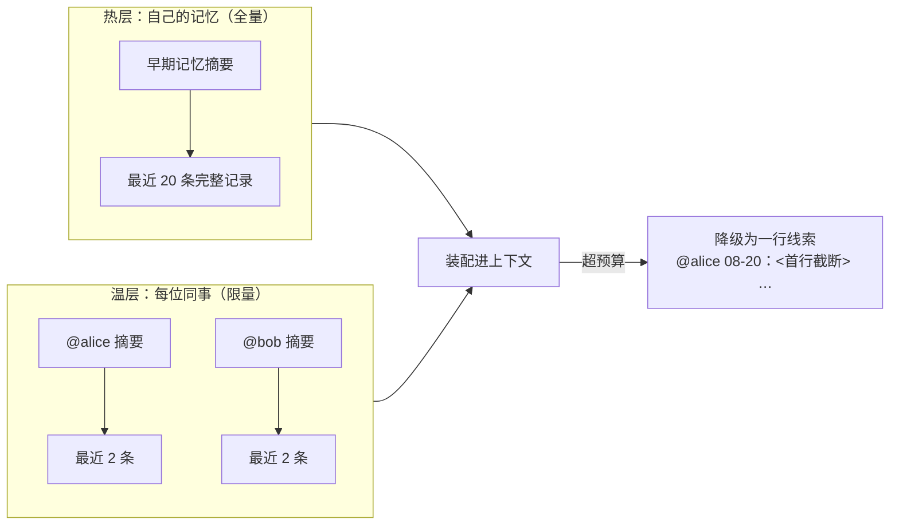

# CodeWiki-Plus 系列 10：一个人用是记忆，一群人用才是资产——知识库团队化的两昼夜

> **本篇导读：** 一个人用时一切正常；第二个人加入，搜索、记账、写文件、署名四处同时漏水。解法是划清边界——git 只存内容、派生本地可重建，记账按人分文件，冲突靠结构消灭。


---

## 引子：从多Agent协作说起

当我在不同电脑上开发同一个代码库并同时使用codewiki-plus时，我会遇到一些问题。

| 现象 | 背后的真相 |
|------|------|
| 刚拉取下来的笔记搜不到 | 搜索靠的是索引，他机器上没有见过索引或者索引是旧的，系统检索不到知识回退到了传统grep |
| 两边各写一条笔记，git 必报冲突 | 目录页这类文件每次都是整个重写，第二个人一定撞车 |
| 不知道一条经验是谁提的 | 系统里压根没有"人"这个概念，作者一栏永远写着工具版本号 |

三条看着不相干，根因是同一个：**有些东西是"我这台电脑上的临时状态"，有些东西是"全队共享的事实"，这条边界从来没被划清楚过。**

于是我花了两周，把这条边界画了出来。

---

## 一、先做一次"不抄功能"的调研

故事要从一份调研报告讲起。

在开源社区找到了一些同类产品，调研下来，最值钱的不是任何一项功能，而是三个机制：

**第一，什么时候该提醒你沉淀经验。** 不要只让 AI 主动感知 "你觉得这段对话有价值吗"，而是去数客观痕迹：用户打断了几次、拒绝工具几次、有没有说"不对，应该是……"。加权算分，过线才提示。但一个又长又顺、毫无摩擦的会话则不需要触发沉淀。真正较过劲的对话才会被记住。

**第二，把"有没有被用上"变成了数据。** 每次搜索命中以及AI 实际引用了哪条要做统计。票数回流到排序，还驱动四件事：热门的上浮、冷门的淘汰、被反复用过的晋升成正式知识、被反复搜到却从没人真用的标记为"内容不行，该重写"。

**第三，也是本篇的重点：多个人写同一批文件，它靠"每人一个文件"解决。** 知识库全员共读、不分你我；但记账、投票这类人人高频写的数据，严格每人一个文件。文件层面天然不冲突，git 只管普通的文件合并。


调研的结论只有一句话：**CodeWiki 缺的不是功能，是"多人共享时的正确性"。**


---

## 三、第一刀：让目录卡片自己保持新鲜

第一个要治的是"搜不到刚拉下来的知识"。思路很朴素：**每次搜索之前，先花极小的代价检查一下卡片新不新，不对就自动重建，用的人完全无感。**

检查分三层，一层比一层细，但都只扫文件清单、不读文件内容：

- **数量对不对**：磁盘上有多少篇笔记，卡片上记了多少条；
- **名单对不对**（数量碰巧相等时的兜底）：两边的文件名单是否一致；
- **改没改过**（内容变了但文件数没变的死角）：随机抽几个文件，看修改时间是不是晚于卡片上次整理的时间。

第三层专门覆盖团队里最高频的一个场景：同事把你拉取下来的草稿确认了，文件数没变，但内容状态变了。

---

## 四、第二刀：每人一个文件

第二刀是整个团队化的枢纽。

先把一个约束说清楚：**在 git 的世界里，没有"两个人同时写、系统自动帮你排队"这种事。** 两台电脑各写各的，唯一能保证不打架的办法，就是让"这个文件只有一个人会写"。换句话说——**文件归谁，谁才有笔。文件所有权就是锁。**

于是有了两条贯穿全局的规则：

- **git 只存内容**：人写的、审过的知识，以及少量配置，入库；
- **一切能重新生成的东西不入库**：索引、缓存、计数器、运行状态，全部请出版本库，需要时扫描重建。

### 记账：从"每人一本私账"到"全队一本公账"

以前，搜索热度躺在本机的一个数据库里，不上传，写完没人看。现在改成入库的纯文本日志，**每个人一个文件**：

```
repowiki/.meta/telemetry/
  ├── alice.jsonl
  ├── bob.jsonl
  └── ...
```

文件内容极简，一个人一天搜了某个文档几次，就是一行：

```json
{"t": "hit", "doc": "notes/xxx.md", "at": "2026-08-26", "n": 6}
```

### 任务记忆：一个人的日记 vs 全队的进度

同一套思路用在了任务记忆上，但多了一个绕不开的问题：**如果每人只看得到自己的记忆，那还叫团队吗？**

Bob 看不到 Alice 上周定的方案，必然重复劳动；可要是全员记忆全量加载，内容随人数线性膨胀，话多的人还会把别人的条目全挤掉。

最后的答案叫**分层加载**，可以类比成团队站会：



- 自己的记忆**全量**加载——一个人用的时候行为零变化，这是兼容的底线；只有那种"整份记忆挤在一个文件里"的老任务存在时，新机制会把它当作热层的一部分读进来，读出结果和改造前逐字节一致。真的装不下时才"只留最近 20 条 + 告诉你还剩多少"，而不是静默截断；
- 同事的记忆只加载**摘要 + 最近两条**。为什么是"最近两条"而不是"最热两条"？因为任务记忆没有消费回路，"热度"只能是拍脑袋的权重，**时间戳是唯一诚实的信号**；而"他最近在忙什么"恰恰是最能防止两个人干同一件事的信息；
- 一旦内容太多装不下，**降级为一行线索**（一行不超过 60 字，保住时间与作者）而不是直接扔掉——保住线索，只降信息量；每位同事单独给 2KB 预算，超出的才降级，**摘要永远不降级**；
- **两档读取的成本是分开的**：只问"这任务是干嘛的"时拿摘要视图（别人的条目一行都不带，默认 5 条），真要接手干活时才给完整上下文视图（别人的摘要 + 最近两条，默认 20 条）。便宜的调用不该付贵的账单；
- 压缩时**每人只压自己的文件**，永远不碰别人的；压出来的原文另存归档，只增不删。压缩也有明确的触发门槛——自己的文件同时越过"40 条 / 24KB"且有窗口外条目才提示，而不是每天催你整理。代价是摘要按作者各自成段，但摘要本来就有损，按作者分片反而保留了"谁早期做了什么"的脉络。

一句话总结这刀：**读共享，写分片。**

---

## 五、第三刀：把冲突从"天天碰"改成"几乎不碰"

前两刀解决"搜不到"和"算不准"，第三刀解决"天天撞车"。

核心原则只有一句：**文件要么独占（每人一个），要么只往末尾追加，要么干脆不入库（随时可重建）。** 剩下的冲突，是"两个人对同一段知识有不同理解"——那是有意义的冲突，工具只负责让它看得见、查得到是谁写的，裁决留给人。

---

## 六、同步的红线：工具永不碰你的工作区

团队化绕不开最后一个问题：**要不要自动拉取 / 推送？**


最终收敛成三个动作，且全部有开关控制：

| 动作 | 时机 | 关键约束 |
|------|------|----------|
| **拉取校验**（只提醒，不动手） | 每次会话一次 | 只做只读的远端查询，只告诉你"远端新了 N 个提交，建议先同步"，不执行任何同步 |
| **快进拉取**（只进不退的更新） | 会话开始时 | 每进程每仓库一次；只做"快进"，永远不自动合并、不自动变基 |
| **写后推送** | 一批写入完成后 | 默认关闭；暂存范围硬限定在知识目录路径内；与我方已暂存内容冲突时直接放弃本次推送 |

贯穿三者的一条不变量，值得单独拎出来：**数据不丢，晚点没关系。**

没退让的边界只剩三条，而且都是同一句话的不同侧面——**工具绝不替你处置你的东西**：

- **不碰你已经暂存的内容。** 发现暂存区里有非工具的改动，直接放弃本次推送并告诉你原因，绝不悄悄替你提交；
- **不强制推送、不回滚、不删改动。** 失败就保留现场，交回人工；
- **不替你裁决版本纠纷。** 真岔了就只报个案——"本地领先几笔、落后几笔，建议先同步"，一个字符都不动。

一句话版本：**红线从"我不敢碰"，细化成了"我不替你做决定"。**

---

## 九、七条可以带走的经验

如果你也在做团队向的 AI 工具或知识系统，这七条是我们踩实了的：

1. **防错靠结构，不靠人的自觉。** 别写"请记得先拉取"的文档，去改文件布局，让冲突在结构上就不可能发生。
2. **git 世界没有"帮忙排队"这回事，文件所有权就是锁。** "每人只写自己的文件"一句话，把冲突消灭在大半。
3. **能重新生成的不入库，事实源只有一个。** 一切能靠扫描重建的东西都请出版本库。事实源一多，就必然要为"两份数据对不上"买单。
4. **同步不要挤进高频写入的路径。** 高频小操作配网络往返是灾难；改成低频、批量、失败了就先放着的动作。
5. **失败只降级，不报错卡死、不回滚。** "数据不丢，晚点没关系"——用户能容忍晚一点到，不能容忍东西没了或者工具卡住。
6. **剩下的冲突是有意义的冲突。** 两个人对同一段知识理解不同，这是需要人来裁决的信号，不是需要自动化掉的噪音。工具的职责是让它看得见、查得到是谁写的。
7. **约定不落进可执行检查，就等于没约定。** "派生文件别入库"写在文档里没用——人会忘，新人不知道。把它变成一条会跑的检查 + 一条能修的命令（我们那条命令的做法是"从版本库移除、文件留在本机"，永远不会删数据），约定才真正活下来。反过来也成立：**凡是检查发现了却修不了的问题，要么补上修复路径，要么承认它需要人裁决**，别悬着。

还有一条元经验：**"不做什么"和"做什么"同样值得写下来。** 不做排行榜、不做机器学习推荐、不做写前自动拉取、不做缓存数据库入库——这些否决记录，比功能清单更能防止后来者重复踩坑。同理，**一条曾经写死、后来被推翻的红线，比一条从没被挑战过的红线更有价值**（见第六节）：把推翻的理由一起记下来，否则半年后一定有人把它加回去。

---


最后回到开头那个问题。同事搜不到的那条笔记，现在能搜到了——而且他搜到的时候，系统知道他搜过，知道他有没有真的用上，也知道这条经验最初是谁写的。

**一个人用的时候，它是一本记忆；能安全地在几个人之间流动之后，它才算是一项资产。**


