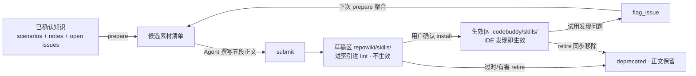

# CodeWiki-Plus 系列 13：把知识编译成行为——从 WikiSkill 论文到 skill-creator 的两区制闸门

> 前面十二篇，我们把"对话 → 笔记 → 场景块 → Doctrine"这条知识管线修到了能自动生长的程度。但一直有个没解决的问题：**这些知识是"被动等人查"的。** Agent 记不记得 `query_wiki`、查没查到、查到了照不照做，全看缘分。这一篇讲我们怎么把已确认知识再往前推一步——**编译成 SKILL.md 行为指令，让 IDE 主动触发、直接改变 Agent 行为**。为了少走弯路，我们先把 Google Research 的 WikiSkill 论文和它的开源实现 wikiskill 源码通读了一遍，抄了该抄的，也划清了绝不照抄的。

---

## 引子：知识库的天花板，是"没人来查"

CodeWiki 的知识管线跑顺之后，知识资产长这样：一条条踩坑笔记、一层层聚合出的场景块、团队共识 Doctrine。它们的消费方式只有一个——Agent 主动检索。

这个模型的脆弱之处在于，**检索这个动作本身没有保障**。知识再准，Agent 不知道它存在；Agent 想起来了，查询词不对也可能擦肩而过；查到了，也可能只是"主题相邻"而不是"对症下药"。我们的遥测数据看得更清楚：大量笔记被高频召回却零采纳——标题相关，内容不够 actionable。

与此同时，行业里出现了另一种思路：把经验**编译成技能文件**（SKILL.md），放进 IDE 的技能发现目录。宿主在每次会话开始时按 description 自动判断是否加载，命中就把 SOP 直接塞进上下文。知识从"等人查阅"变成"主动生效"。

Google Research 与 Virginia Tech 的论文 **WikiSkill**（arXiv:2608.27454）是这个方向最完整的一份公开工作，而且它把实现开源了（github.com/ashutoshsinghpr7/wikiskill，v0.1.4）。所以在动手设计之前，我们做了一件事：**把论文的全部表格和三千行源码读透，搞清楚哪些是真结论、哪些是幻觉、哪些是它自己承认没解决的缺口。**

结论一句话：论文的机制主张值得相信，**但它那套自动闭环我们一条都不照抄**。下面从论文数据讲起。

---

## 一、论文给了什么：一张让人无法忽视的成绩单

WikiSkill 的核心是三层结构：**raw 执行轨迹 → wiki 持久知识层 → skills 技能层**，配四个角色（Inference Agent 执行、Skill Proposer 提案、Wiki Maintainer 维护、门控验证）。五模型 × 五基准的实验结果是这样的（Table 1，三次完整演化平均）：

| 模型 | 无技能 | 最强竞品 | WikiSkill | 相对无技能 |
|---|---|---|---|---|
| Qwen-3.5-4B | 26.2 | 35.2 | **38.5** | +12.3 |
| Qwen-3.5-9B | 29.9 | 42.3 | **47.4** | +17.5 |
| Qwen-3.6-27B | 39.4 | 53.3 | **63.3** | +23.9 |
| Gemma-4-31B | 41.3 | 49.1 | **54.9** | +13.6 |
| Gemini-3.5-Flash | 49.5 | 56.1 | **68.1** | +18.6 |

它是**唯一一个全模型平均第一、且几乎不出现劣化**的方法。竞品的表现相当不稳定：EvoSkill 把 Qwen-9B 的 LiveMath 从 28.2 拉到 58.1，转头把 Gemma-4-31B 从 33.9 打到 29.8；SkillOpt 把 Gemini Flash 的 SealQA 从 29.4 打到 28.2。

但对我们设计真正有指导意义的，是三张**次要表格**。

### 消融表：wiki 绝对不能给执行者看

四配置消融（Table 3，Gemini-3.5-Flash）比主结果更有信息量：

| 执行者可见 wiki | 提案者可见 wiki | 平均分 |
|---|---|---|
| —（无技能基线） | — | 40.4 |
| 否 | 否 | 48.7 |
| 是 | 否 | 45.3 |
| **否（默认）** | **是** | **63.7** |
| 是 | 是 | 60.9 |

两个关键读数：

- **执行者看 wiki 在两种配置下都有害**（-3.4 和 -2.8）。让干活的 Agent 直接看到知识库，它会去"抄答案"，代价独立于提案质量而存在。wiki 是给**提炼者**看的，不是给**执行者**看的；
- **即使没有持久知识层，"看轨迹提案 + 验证门控"本身也比无技能高 8.3 分**（48.7 vs 40.4），wiki 层再叠加 +15.0 分。也就是说，**编译动作本身就值钱，不必等知识库完美**。

第一条直接印证了 CodeWiki 一直坚持的分工：**知识归知识，行为归行为，两者不该混在一个上下文里喂给同一个角色**。后来它成了 ADR-0004 的一等公民。

### 迁移表：发现是一回事，执行是另一回事

跨模型迁移（Table 2）里有三个反直觉的事实：

- **他模型的技能比自进化的技能更好用**：Qwen-9B 用 Qwen-27B 生成的技能，SpreadSheet 从 24.3 涨到 50.5，而它自己进化的只有 33.6；
- **小模型的技能也能惠及大模型**：Qwen-4B 的技能把 Gemma-31B 的 LiveMath 提到 73.1；
- **负迁移是实锤的**：Qwen-4B 的 SpreadSheet 技能把 Gemini-Flash 从 50.5 打到 18.1。原因是小模型把自己的"低层 workaround"（单行 Python、字符串转换）写进了技能，反而**约束了强模型使用端到端脚本**；碎片化诊断流程还会耗尽强模型的交互预算。

同样的模式在 OfficeQA 上重复了一次：Qwen-4B 的技能把自己从 30.2 降到 28.5，却把 Qwen-27B 从 42.1 提到 52.9。

**"发现"和"执行"是两种能力。** 这句话给了我们的半闭环设计论文级背书：**用强模型提炼，把执行交给宿主自己的 Agent。**

### 接受率与接受时点：多轮回流不是玄学

Table 4 换算出两个数字：技能**创建**的提案接受率 26%~52%，技能**编辑**只有 13%~36%——**提案过半被拒是常态**。被拒的内容不是浪费，它进 wiki 供下一轮复用，这正是论文的复利主张。

Table 5 的接受时点分布则回答了"要迭代几轮"：约四到六成接受发生在前两轮，但 mid/late 仍占 42%~61%（SealQA 最持续：mid 33% + late 28%）。**技能提炼不是一轮收敛的事**，多轮回流的半闭环设计有数据支撑。

### 论文自己承认的三个缺口

Limitations 里有三条，恰好正对我们的两个未决问题：

1. 全量注入、未评估检索与触发（技能数量增长后会成为问题）；
2. 严格 `>` 门控会排除"当场不涨、后续有用"的中性提案；
3. **无自动 wiki 修剪机制**，模式页和日志持续累积。

第 3 条后面会要命。

---

## 二、读完源码，幻想破灭了一半

论文漂亮，实现是另一回事。wikiskill 仓库里有一份 `docs/RUNS.md`，作者老老实实记了六次真实运行：

| Run | 模型 | 结果 |
|---|---|---|
| 1 | deepseek-v4-flash | 验证集满分，触发提前停止，正确行为 |
| 2 | 同上 + 陷阱任务 | 提案 R_val=1.0 不大于 R_best → **拒绝** |
| 3 | 同上，修复版 | 提案让 1 题回归（0.8889）→ **拒绝** |
| 4 | gemma-3-4b 免费档 | 整 run 作废：12% session 启动失败，死 session 被旧沙箱残留交付物**幻影评分** |
| 5 | gemini-2.5-flash-lite | 提案导致两题回归 → **拒绝**，成本 $0.086/迭代 |
| 6 | 同上，3 迭代 | 6/48 启动失败，proposer 直接 `no_action`，零技能接受 |

**截至 v0.1.4，这套实现从未在 live 运行中成功接受过一个提案。** 作者自己在文档里写："acceptance remains test-proven, not live-proven." 论文那些漂亮的接受率，依赖的是更强的 proposer 模型。

这个事实直接决定了我们的第一个"不做什么"：**不建自动评分门控**。我们没有 held-out 基准，也不打算造一个；而 wikiskill 六次 live 运行零接受、每迭代几毛钱成本的数据说明，在弱模型条件下自动门控的收益本身就存疑。

### 源码里三种仓库的分工

再看目录布局，我们发现了这个工程最有价值的一处设计——**三个 git 仓库，职责完全不同**：

```
workspaces/<domain>/
├── raw/traces/iter-<NN>/     # 不可变轨迹（已存在则抛错）
├── wiki/                     # 独立 git 仓：只 commit，永不回滚（纯审计）
├── skills/active/            # 独立 git 仓：接受=commit，拒绝=reset --hard
├── runs/                     # state.json + proposals/ + 每次 agent run 的 stdout
└── bench/tasks/              # 任务沙箱
```

"知识只增不减、技能可回滚"这个语义，靠**物理上分仓**实现，而不是靠代码里的 if-else。这个思路我们后来原样搬到了两区制里。

还有两个细节值得记：

- **防幻影评分**：每次 rollout 前强制重新物化沙箱、删掉任务规格之外的所有文件；session 首行 `tool_call_count==0` 判定为启动失败。这两条都是 Run 4 那次事故之后固化成代码的；
- **陷阱任务基准**：`bench.py` 里的双 bug 调试脚本，在**生成时 assert 两个 bug 不会互相抵消**（`assert buggy_val != int(expected), "trap debug-boundary: bugs compensate!"`）——防止"错错得对"让陷阱任务失真。这是自建技能验证基准的好样板。

### 抄到的三件具体东西

1. **description 写成"条件 + 行动"**。仓库里 5 个真实演化产物的 description 全部如此，比如：`ripgrep/search_files silently skips binary-detected files — verify empty search results with grep -a / file / xxd before concluding 'not found'`。比"搜索技能"这种抽象概括利于触发判定得多；
2. **证据段带量化回链**。`spec-literal-execution` 里写 `FAIL: spec-format2-1 (0.0). PASS: spec-format1-1, spec-format3-1 (1.0)`；`script-exec-blocked` 写 `Hit in 3/4 analyzed traces`。任务 ID + 分数 + 命中率，可追溯。我们把它本地化为"依据：notes/xxx.md 的 Y 结论"；
3. **`no_action` 是一等合法结果**。提案可以明确写"这轮不改"，不触发验证 rollout，也照样写进审计链。`harness.py:140-147`。诚实比产出重要。

### 反面教材：三个必须自己补的洞

- **退役机制不存在**。源码 grep `retire|deprecat|delete_skill|remove_skill` **零命中**。已接受的技能永远不会被主动移除，只能被后续 patch 慢慢改写。它没爆炸，靠的是入口严（严格门控）+ 寿命短（≤8 轮演化）。**我们没有自动门控，入口松，退役不是可选项而是必需**；
- **同名 create 静默覆盖**。`gating.py:74-84` 对同名目录 `os.makedirs(exist_ok=True)` 后直接覆写文件，无冲突检测。全库唯一有名字冲突意识的地方是 `transfer` 的 `--force`；
- **去重全靠 prompt 纪律**。"Do NOT create duplicate patterns" 写进提示词，没有任何程序化相似度计算。唯一的结构性防重手段，是把**完整被拒提案 JSON 内嵌进 skill-impact.md**，让下一轮 proposer 读到。

三条合起来指向一个判断：**wikiskill 的自动化闭环我们不要，但它暴露出的风险我们必须用机制补上。**

---

## 三、CodeWiki 的选择：半闭环 + 两区制闸门

于是方案定档为**半闭环**（内部称"方案 C"）：

| | WikiSkill（全闭环） | CodeWiki（半闭环） |
|---|---|---|
| 执行者 | 自带 Inference Agent，跑基准 | 宿主自己的 Agent，跑真实任务 |
| 提炼者 | Skill Proposer（专用 agent） | 宿主 Agent（Mode C：工具不内嵌模型） |
| 门控 | `R_val > R_best` + git 回滚 | **人工确认闸门** |
| 反馈 | 自动评分 | `flag_issue` 人工标记 |
| 退役 | 无 | `retire` 模式，正文保留审计 |

不做的三件事写得很死：**不建自动评分门控**、**不编 Inference Agent 编排**（那是重做 wikiskill，而 CodeWiki 的采集管线天然回流）、**不做跨工作区技能迁移**。

技能一旦生效就会影响后续每一次会话，风险远高于一条笔记。所以整个生命周期被**物理隔离成两个区**（ADR-0004）：



- **草稿区** `repowiki/skills/`：与 notes 同层的知识资产，进搜索索引、进 lint 扫描，但 IDE 永远不会扫描 repowiki 内部——**草稿在物理上不可能生效**。`status: draft` 只是标记，**目录边界才是闸门**；
- **生效区** `.codebuddy/skills/`：宿主 IDE 的技能发现目录。只有 `install` 这个**用户显式动作**才写得进去，工具永不自动安装，修订后也永不自动覆盖。

这里有个反直觉但重要的补充：**草稿区进索引，但 `query_wiki` 不召回它**。理由是语义隔离——技能是行为指令，不是检索知识；如果它能被检索召回，Agent 会把 SKILL 正文当知识引用，把两种语义搅在一起。过滤收口在检索入口一处，与既有的新鲜度闸门同位置。

**install 时剥离全部管理元数据**是另一处设计：生效区文件只留 `name` / `description` / 正文。因为宿主会把整个文件读进上下文，管理字节在那里是纯 token 浪费——wikiskill 用独立 `PURPOSE.md` 文件承载溯源，动机相同，我们从 install 侧解决。

---

## 四、四个动作：prepare / submit / install / retire

工具叫 `skill_creator`，四个 mode，沿用 `note_consolidation` 的 Mode C 骨架（工具不内嵌 LLM，正文由调用方 Agent 产出）。

### prepare：零副作用的只读勘察

返回候选素材（未被任何技能吸收的场景块 + stable 状态的笔记，带 est_tokens 阅读成本）、既有技能名下的 **open issues**、草稿区索引、**冲突预检**（topic 与既有技能 name/description 相似度）、**容量分级**（绿 / 橙 ≥9 只准 UPDATE / 红 ≥12 先合并）、写作规范全文、防碎片纪律。纯只读，可反复调用。

### submit：全量校验后才落盘

任何一条违规，**整批不落盘**，并返回具体规则名：`name_slug` / `description_trigger` / `body_too_large`（>8KB）/ `sensitive_content`（绝对路径、密钥）/ `source_refs_required` / `name_conflict` / `batch_fragmentation` / `capacity_orange|red`。成功后自动写**双向溯源互链**（技能 `source_refs` ⇄ 素材 `compiled_into`）、追加 `revisions` 审计、重建索引。

**空产出合法**：素材不足、不值得编译时，提交空 report 返回 `no_action`——这不是失败，是诚实（这条直接抄自 wikiskill）。

### install：用户点头才发生

做三件事：剥离管理元数据 → 写入生效区 → 回写审计三元组 `installed_at` / `installed_to` / `installed_hash`。幂等，重复调用无副作用。

`installed_hash` 用的是**规范化哈希**（sha256(name+description+body)）——因为草稿区有管理元数据、生效区没有，整文件哈希永远对不上。规范化哈希只比对实质内容，是漂移检测的比对契约。

### retire：正文保留，永不复活

草稿标 deprecated、revisions 记原因、**正文保留供审计**、清除 installed_*，同时从生效区移除。`reason` 必填，退役后的草稿拒绝重新 install。

### lint 八项 + 容量纪律

草稿区纳入 `lint_wiki` 扫描（进索引就进 lint，不留法外之地）：

| 规则 | 级别 |
|---|---|
| name slug 合规 / description 含触发语义 / frontmatter 完整 / 正文 ≤8KB / 无敏感串 / 修订必有 revisions | error |
| 素材过期联动 `possibly_stale` / install 后草稿漂移 `drift` / 容量橙线 | warning |

容量硬顶 12 份、橙线 9（类比 scenario 的 15）。防碎片纪律沿用既有约定：默认 UPDATE、每批最多新建 1 份、新建前对比 ≥2 份最相似技能。

---

## 五、反馈闭环：不需要学新工具

**负面反馈 = `flag_issue`。** 试用中发现技能漏了情况或给了错指引，对技能条目打一个问题标记（issue_type 建议 `skill-ineffective`）。下次 `prepare` 会自动聚合该技能名下的 open issues 作为修订素材 → submit（`action=updated`，revisions 留痕）→ reinstall。**不为技能新造一条反馈通道**——这是"单点收敛"纪律的延伸。

**正面反馈 = 沉默即默认。** 好用就是不 flag 不 retire，无需任何操作。这是有意取舍：IDE 不回报技能触发次数，没有可靠数据源；为了"点赞"再造一条通道不值得。

**素材过期联动。** 技能 `source_refs` 指向的素材后来被更新、退役或删除 → lint 报 `possibly_stale`，提醒你决定 revise 还是 retire。**只提示，绝不自动修订**——触发永远显式。

**漂移不自动修复。** install 之后草稿又被修订 → 规范化哈希 ≠ `installed_hash` → lint 报："草稿已修订，生效区仍旧版，建议 reinstall"。reinstall 由人决定。生效永远是用户动作。

---

## 六、什么时候该编译？只提示，永不自动执行

工具是显式的，但"什么时候该考虑编译"不该全靠用户想起。我们加了三处**只提示、永不自动执行**的触发点：

| 触发点 | 命中含义 | 提示形态 |
|---|---|---|
| UserPromptSubmit（claude 家族 hook） | 你正在做的事像某份未安装草稿 | `install` 指针 |
| L2 submit（场景聚合） | 新场景块像技能素材 | `prepare` 指针 |
| 蒸馏 submit | 新笔记标题匹配到草稿 | `install` 指针 |

三个配套设施，每个都有一个被实测推翻的假设：

**1. 状态语义补全。** 原实现 install 从不写 status，草稿永远是 draft，匹配器就没法知道"哪些还没装"。补齐后：`install` 置 `stable`（已安装，不再推荐），`submit updated` 置回 `draft`（生效区已是旧版，重新可推荐），`deprecated` 永不复活。

**2. 相似度取 containment，不是 Jaccard。** 这不是拍脑袋：以技能 description 的前缀当 prompt（完美匹配的上界），在真实的 `maintain-fork-pr-merge` description 上 **Jaccard 只有 0.205**——长 description 撑大了并集，0.6 的 Jaccard 闸门**永远不会触发**；同样一对，containment（交集/较小集）是 1.0。阈值设为 prompt ≥8 token（"继续""ok"不可判）、containment ≥0.5。匹配器**只返回 name + description，永不返回正文**——检索隔离的延伸。

**3. 素材判据是命令密度，不是结构。** 先看了一轮结构判据：8 个 L2 场景块的**六段骨架 100% 相同**（同一模板生成）、步骤数 5-11 全过阈值——天生零区分度，作废。唯一强信号是命令命中数：唯一被真正编译成技能的那份是 `cmd=11 / fence=4`，第二名只有 2，差 5 倍以上。于是判据定为：命令位命中 ≥3（正则带尾随空白，"提到 git"不算"执行 git"）、未被 `compiled_into` 消费过、`notes/` 回链 ≥2（单笔记背书多半是一次性事件）。

纪律上有一条硬约束：**蒸馏 worker 只把 `skill_hint` 写进汇报摘要，严禁自行调用 `skill_creator`**。install 是用户确认动作。

---

## 七、上游杠杆：捕获链路丢掉的东西，蒸馏永远找不回来

做完工具后我们回头查了一个更根本的问题：**技能的价值密度取决于素材里有多少"命令-报错-修复对、版本/参数钉子、失败轨迹"**（wikiskill 的演化产物几乎全是这类）。然后发现，这些信息在我们的捕获链路里被**系统性丢弃**：

- `capture_conversation.py` 的 `_NOISE_BLOCK_TYPES` 把 11 类块整体丢掉，工具调用块在列；
- `_ide_hook.py` 有同名集合，IDE hook 侧同样过滤；
- AGENTS.md 的捕获协议里甚至写着"丢弃工具调用细节";
- 测试里还**断言了** tool 块被过滤。

也就是说，我们主动断言了"命令和报错必须消失"。而蒸馏是下游，丢掉的永远不会回来。

治理方案是一个共享单点 `codewiki/src/tool_digest.py`（纯标准库，因为 IDE hook 路径不能依赖三方包）：

- 纯噪音（thinking/reasoning/system/context）仍无条件丢弃；
- **tool 调用保留为一行压缩形态**：`[tool: 名 · 命令首行]`，≤160 字符，**保持原始顺序**——顺序本身就是"命令→报错→修复"链；
- **tool 结果只在疑似错误时保留**：命中 is_error 标记或错误指纹（traceback / error / failed / permission denied / exit code…）→ `[tool-error: 摘录]`，≤200 字符追加预算；成功结果仍丢弃；
- 两条采集路径（MCP 工具 + IDE hook）共享同一实现，**永不漂移**。

副产品是：原本"不可得"的 toolError 摩擦信号，现在可以扫 raw 检出了。

**这是整个 skill 生成能力的上游杠杆。** 工具做得再好，素材里没有命令和报错，编译出来的技能也只是正确的废话。

---

## 八、一次真实编译长什么样

```text
你：把这个项目里"GitHub 网络不稳定怎么推代码"的经验编成一个技能

Agent：skill_creator(mode="prepare", topic="github push retry")
  ← 候选：1 个场景块 + 2 条 stable 笔记
  ← conflict_precheck：无相似技能；capacity：green (0/12)

Agent：（读素材，撰写五段正文，description =
   "当 git push 因 connection reset / 443 timeout 失败时——在
    git push（走代理）与 git -c http.proxy= -c https.proxy= push
    （直连）之间交替重试几轮；勿改全局代理配置"）

Agent：skill_creator(mode="submit", report={skills:[{
        name: "github-push-retry", action: "created", ...}]})
  ← 落草稿区，3 份素材获得 compiled_into 回链

Agent：lint_wiki(checks=["skill_sections","skill_lint"]) → 全绿
      → 向你展示草稿全文

你：可以，装上
Agent：skill_creator(mode="install", name="github-push-retry")
  ← .codebuddy/skills/github-push-retry/SKILL.md（只含 name/description/正文）

【从此每个会话，遇到 push 失败宿主自动带上这条 SOP】

两周后你：这个技能漏了一种情况——push 成功但 mergeStateStatus=DIRTY
Agent：flag_issue(page_path="skills/github-push-retry/SKILL.md", ...)
下次编译：prepare 聚合该 issue → updated（revisions +1）→ 你确认 → reinstall
```

正文骨架沿用 scenario 的五段，与论文的三段式天然对齐：

| 论文约定 | CodeWiki 五段 |
|---|---|
| When to Apply | 工作场景 / 适用条件 |
| Instructions | 核心 SOP / 判断逻辑 |
| When NOT to Apply | 禁忌与反模式 |
| Evidence | 关键事实依据（带笔记回链） |

---

## 九、方法论复盘：读一篇论文 + 一份源码，到底在读什么

这次调研最值得复述的不是任何一条机制，是**三个层次的分辨**：

**第一层：论文的主结果只能当"方向可信"的证据，不能当"这样做就行"的证据。** +12 到 +24 的平均提升是五模型五基准跑出来的，值得相信；但真正指导设计的是消融表（wiki 不能给执行者看）、迁移表（发现与执行分离）、接受时点表（多轮回流有依据）。**主结果告诉你值不值得做，次要表格告诉你怎么做。**

**第二层：源码比论文更诚实，尤其是它的失败记录。** `docs/RUNS.md` 六次真实运行零接受、$0.086/迭代，比任何漂亮表格都有价值——它直接否掉了我们原本犹豫的"要不要建自动评分门控"。**一个项目的失败史和它的功能清单同等重要，甚至更重要。**

**第三层：论文承认的缺口，是后来者的机会。** Limitations 里"无自动 wiki 修剪"这一条，在源码里被证实为 `retire|deprecat|delete_skill|remove_skill` 零命中。它没爆炸只是因为门控严、寿命短。我们入口松，`retire` 就得是必需品。

照例用一张表收尾这次的"抄了什么、没抄什么"：

| 来源 | 判断 | 落地形态 |
|---|---|---|
| 论文消融表：执行者看 wiki 有害 | 抄 | 行为指令与检索知识语义隔离，技能不进召回 |
| 论文迁移表：发现 ≠ 执行 | 抄 | 半闭环：强模型提炼、宿主执行 |
| 论文 Table 5：mid/late 仍有接受 | 抄 | 支持多轮回流（Phase 2） |
| 产物 description = 条件 + 行动 | 抄 | submit 强校验规则 `description_trigger` |
| 证据段带量化回链 | 抄（本地化） | 正文写"依据：notes/xxx.md 的 Y 结论" |
| `no_action` 合法 | 抄 | 空 report 返回 `no_action`，非失败 |
| 三仓分工（wiki 只增 / skills 可回滚） | 抄思想 | 两区制：草稿区不生效，生效区只由 install 写 |
| 自动评分门控 `R_val > R_best` | **不抄** | 无 held-out 基准 + live 零接受，改为人工闸门 |
| Inference Agent 编排 | **不抄** | 宿主执行，CodeWiki 采集管线天然回流 |
| 全量注入技能 | **不抄** | 交给 IDE 原生技能发现机制 |
| 无退役机制 | **补洞** | `retire` 模式，正文保留审计 |
| 同名 create 静默覆盖 | **补洞** | 冲突预检 + 防碎片纪律 + revisions 留痕 |
| 双文件 SKILL.md + PURPOSE.md | **不抄** | frontmatter 自承载溯源 + install 时剥离 |

回到那条贯穿整个系列的原则，这次用在了技能上：**确定性交给工具（校验、哈希、索引、lint、匹配），判断力留给 Agent（写什么、怎么组织 SOP），决定权留给人（装不装、改不改、退不退）。**

知识库从此不只是"能查到"，而是"会主动出手"。下一篇我们聊一个更硬的问题：**当知识库进入"资产治理"阶段，置信分层与负反馈闭环如何让过期知识自己浮出来、让错误知识自己被降级。**

---

*本文基于 CodeWiki-Plus 当前实现撰写，相关模块：`codewiki/mcp/tools/skill_creator.py`（四 mode 编译器）、`codewiki/src/skill_match.py`（草稿匹配器）、`codewiki/src/tool_digest.py`（工具调用两级消化）、`codewiki/mcp/tools/capture_conversation.py` 与 `codewiki/mcp/_ide_hook.py`（采集侧接入）。设计文档见 `docs/skill-creator需求与设计方案.md`，使用指南见 `docs/skill-creator使用指南.md`，调研底稿见 `docs/WikiSkill论文与wikiskill源码精读.md`，架构决策见 `docs/adr/0004-skill-scenario-split-two-zone-gate.md`。论文来源：WikiSkill, arXiv:2608.27454；源码来源：github.com/ashutoshsinghpr7/wikiskill v0.1.4（commit 02fac2c）。*
