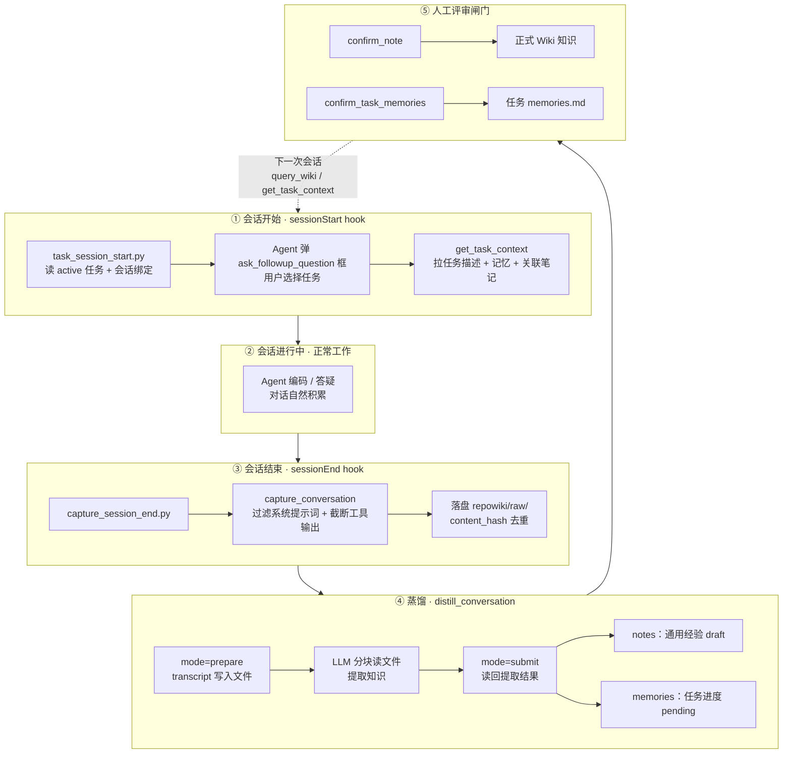
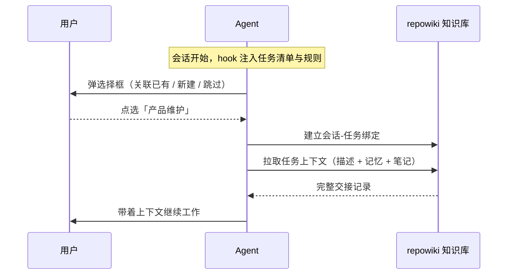
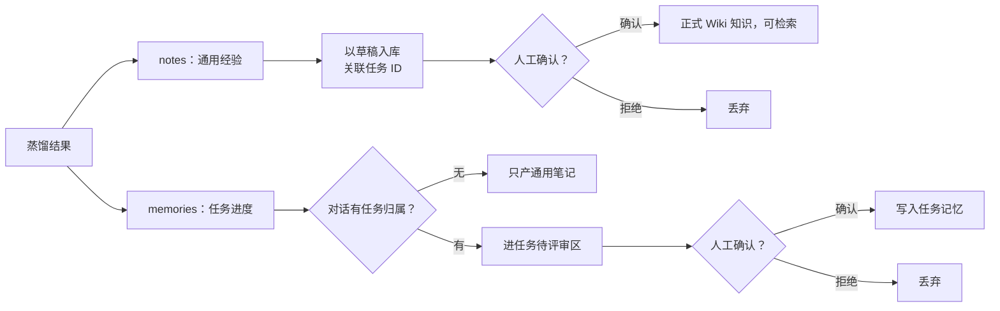

# CodeWiki-Plus 系列 3：任务管理与经验记忆提取——给 AI 装上跨会话的"长期记忆"

> 本系列上一篇我们聊了 CodeWiki-Plus 的双层提示词架构（MCP 原生 Prompt + `get_prompt` 步骤级模板）。这一篇换个更戳痛点的话题：**怎么让 AI 编程助手记住"我们上次干到哪了"，并且把踩过的坑变成团队共享的经验。**

---

## 引子：失忆的 AI

用 AI 编程助手写代码，最让人崩溃的瞬间不是它写错代码，而是——

- 昨天花半小时给它讲清楚的任务背景，今天开个新会话，它一脸茫然；
- 上周刚调试明白的坑，这周它又原封不动地踩了一遍；
- 同一个项目里，三个 Agent 各自为战，谁也不知道别人做过什么决策。

本质上，**每一次新会话，你面对的都是一个全新的、失忆的 AI**。上下文窗口再大，也装不下跨越天、跨越周的工作记忆。

从业务视角看，这种"失忆"带来的不只是体验问题，而是三笔实实在在的成本：

- **重复解释成本**：每次会话都要重新给 AI"入职培训"，项目越复杂，培训成本越高；
- **经验折损成本**：一个人踩过的坑，换个人（或换个 Agent）还要再踩一遍，团队反复交同样的学费；
- **协作断裂成本**：多人多 Agent 在同一项目上工作时，没有共享的"工作台账"，重复劳动和决策冲突不可避免。

CodeWiki-Plus 给出的答案是一套"记忆飞轮"，把记忆分成两层：

| 记忆类型 | 类比 | 例子 | 落盘位置 |
|---|---|---|---|
| **任务记忆**（memories） | 工作交接记录 | "订单模块重构已完成，还差集成测试" | `repowiki/tasks/<task_id>/memories.md` |
| **通用经验**（notes） | 团队 Wiki | "老项目方法名不可信，先读实现再下结论" | `repowiki/notes/` |

一层回答"这件事干到哪了"，另一层回答"这类事我们学到了什么"。前者服务当前任务，后者服务整个团队。

---

## 一、业务梳理：我们到底要回答哪四个问题

在谈实现之前，先把业务需求捋清楚。剥开技术外壳，这套机制真正回答的是四个问题：

**问题一：上次干到哪了？**
新会话开场，AI 应该自动知道当前任务的进度、下一步、待办事项——像一个刚交接完工作的同事，而不是一个一无所知的实习生。

**问题二：这次对话属于哪个任务？**
人和 AI 的对话总是发生在某个任务语境下。提取出来的经验必须能归属到正确的任务，否则就是一堆"无主"的孤儿数据，没法按任务回溯。

**问题三：对话怎么变成经验？**
对话本身不是资产，对话里的决策、踩坑、教训才是。需要一种机制，把有价值的东西从冗长的对话里自动"蒸馏"出来。

**问题四：经验的质量谁把关？**
AI 提取的知识不能盲信。进知识库之前必须有一道人工闸门，否则知识库迟早退化成垃圾场。

四个问题正好对应记忆飞轮的四个环节：**绑定任务 → 采集对话 → 蒸馏知识 → 人工评审**，然后下一次会话开场再检索回来，飞轮就转起来了。

两条总设计原则贯穿始终：

1. **采集零负担、蒸馏异步化**。会话开始和结束时的动作绝不能影响用户体验——不弹窗、不卡顿、不阻塞；LLM 蒸馏是重活，永远在后台跑或显式触发，永不自动发生。
2. **人机协同评审**。LLM 产出的一切只是"草稿"，人确认后才成为正式知识。知识库宁可少一条，不能被噪音污染。

---

## 二、全景图：记忆飞轮

整体架构是一个五段闭环：

下面逐段拆解，重点讲每个环节的**业务考量**和**开发思路**，具体实现点到为止。

---

## 三、会话开始：一次井井有条的"工作交接"

### 3.1 目标：先打卡，再干活

这个环节的设计目标很朴素：**会话开场、动手之前，先弄清楚"本次会话属于哪个任务"，并把该任务的"交接记录"取回来。**

完整体验是顺畅的三步：

1. IDE 开启新会话时，CodeWiki-Plus 的 hook 脚本向 Agent 的系统提示注入一段上下文：当前有哪些进行中的任务、第一件事该做什么；
2. Agent 弹出 IDE 原生的结构化选择框，用户一键选择——关联已有任务、新建任务，或者跳过；
3. 关联完成后，Agent 拉取该任务的描述、积累的记忆和关联笔记，相当于读完"交接记录"，直接接着干。

### 3.2 开发思路：让 AI"可靠地听话"比想象中难

这个流程看似简单，实际开发中踩了三个坑，对应三次思路迭代：

**坑一：AI 会无视"建议"。**
最早的注入措辞很温和——"请先弹框让用户选择任务"。结果实测发现，当用户第一条消息是个具体问题时，Agent 经常先去回答问题，弹框要么事后补、要么干脆忘了。教训很明确：**注入的上下文本质上是"软约束"，AI 有完全的自主权决定听不听。** 后来改成了禁令式的硬约束——"无论用户第一条消息问什么，本会话的第一个动作都必须是任务关联流程，严禁先探索代码或直接回答"，执行才稳定下来。

**坑二：让 AI 少做一步，可靠性就高一分。**
最初的设计是让 Agent 自己"先调工具查任务列表，再弹框"。实测发现它时常偷懒跳过查询。改进方案是把这一步挪到 hook 侧完成：注入之前就把任务标题和编号直接内联进提示词。**凡是能提前替 AI 做好的事，都提前做好；AI 自主步骤越少，流程越可靠。**

**坑三：文本问答不如原生 UI。**
一开始 Agent 是输出一段文字让用户回复编号，体验很糟。后来改用 IDE 原生的结构化选择框，用户点一下就完成选择。**有现成的交互组件，就不要发明新的交互方式。**

三个坑背后是同一条底层逻辑：**给 AI 做产品设计，不能假设它是 100% 听话的执行者，必须把可靠性做进机制里**——把"希望它做"改成"它不得不做"，把"多步自主"收敛成"一步确认"。

### 3.3 一个值得说的细节：绑定文件

关联成功后，系统会写下一份"本次会话归属哪个任务"的绑定记录。它只有一个用途：**会话结束采集对话时，据此确定对话的任务归属。** 因在会话开始时种下，果在会话结束时收获——这是有意为之的设计，下文展开。

---

## 四、任务管理：一本轻量的任务台账

任务管理是整个记忆体系的骨架，设计哲学是**能轻则轻、该稳必稳**。

一个任务就是三样东西组成的"台账"：任务描述（这件事是什么）、任务记忆（干过什么、接下来干什么，追加式增长）、待评审记忆（蒸馏出的新记忆，等人确认）。一组 MCP 工具覆盖创建、列举、绑定、记录、完成、删除、评审的全生命周期，此处不展开清单，重点讲三个业务驱动的设计决策：

**决策一：任务 ID 不可变、不支持重命名。**
最初觉得这样太死板，但想清楚知识追溯链路后就释然了：大量笔记打着任务 ID，如果任务能改名，历史知识的归属链就断了。**身份不可变是追溯可靠的前提。** 真要改名，删除重建——宁可把代价摆在明面上，不留隐患。

**决策二：任务归属在采集时就定死，蒸馏时零推断。**
这是整套机制里最克制的一处设计。最"自然"的做法是蒸馏时让 LLM 猜一段对话属于哪个任务——但推断是概率性的，猜错一次，知识就归错一次。我们的做法是**把归属决策前移到最确定的那一刻**：会话结束落盘对话时，直接读取会话开始写下的绑定文件，把任务 ID 写进对话文件，蒸馏阶段只负责读回。零推断成本，全程可追溯。

**决策三：容忍"幽灵任务"。**
任务被删除后，历史笔记上的任务 ID 不做清洗，检索也不校验任务是否还存在。理由很简单：**知识比任务长寿。** 任务会完结，但从中沉淀的经验对团队永远有价值。

此外，考虑到多人多 Agent 会并发写记忆，记忆的写入采用原子追加——先写临时文件再原子替换——保证并发不踩踏、永远写不出半个文件。这是给"多 Agent 协作"这个业务场景上的工程保险。

---

## 五、会话结束：不打扰用户的前提下，自动收走对话

### 5.1 设计目标：零感知采集

会话关闭时，系统自动采集本次对话，落盘到知识库的暂存区。这个环节的设计目标只有一个：**绝不打扰用户。**

为此装了两道"保险丝"：

- **超时兜底**：采集过程限时，超时就放弃；
- **失败静默放行**：任何环节出错，都让会话正常关闭，绝不让知识采集阻塞用户。

背后是一条清晰的业务优先级：**采集是锦上添花，用户体验是本。两者冲突时，毫不犹豫地牺牲采集。**

### 5.2 留什么、丢什么：对话清洗

原始对话里混着大量噪音，直接落盘既浪费空间又干扰蒸馏。清洗分三层：

1. **剔除系统提示词**。IDE 注入的系统提示动辄几千上万字符，全是工具说明和行为约束，不含任何用户知识——这是最大的噪音源，用"长度 + 关键词命中数"的启发式规则识别后直接丢弃。
2. **截断工具输出**。文件内容、搜索结果这类大块输出，蒸馏时几乎用不到全文，只保留头尾。
3. **给 AI 的长回复封顶**。Agent 的长篇大论里，真正有价值的内容通常已被用户问题和最终结论覆盖。

清洗看似是技术细节，实际服务的是业务目标：**让蒸馏环节的输入"小而纯"，后续的经验提取才能又快又准。**

### 5.3 对话去重与暂存区

IDE 可能重放相同的对话，用户也可能反复开关。采集时用内容哈希去重——相同对话只落盘一次；且任务 ID 参与哈希计算，**同一段对话关联到不同任务视为不同记录**，不会误去重。

落盘的对话文件带"暂存"标记：**暂存区不进检索索引、不膨胀知识库**，蒸馏完成后自动删除——数据流干净利落。

---

## 六、蒸馏：把长对话变成可复用的经验

### 6.1 先解决"房间里的大象"

蒸馏的本质，是让 LLM 通读整段对话、提炼出可复用的知识。但这里有个绕不开的矛盾：**一次真实对话动辄几百 KB，如果全文塞进宿主 Agent 的上下文窗口，还没开始提取就先溢出了。**

我们的解法很朴素：**传路径，不传内容。**

打个比方：你不会把整本书搬进会议室，而是带一张借书卡，需要时按章节去取。蒸馏工具同理：

1. **准备阶段**：工具把清洗后的对话全文写成文件，只把文件路径和大小统计返回给 Agent——上下文占用从几百 KB 降到几百字节；
2. **提取阶段**：Agent 按自己的节奏分块读文件，边读边提取；
3. **提交阶段**：Agent 把提取结果写成文件，工具读回并入库。

这个"文件旁路"设计，把"大数据要过 LLM"和"上下文窗口有限"这对根本矛盾化解了。而且用的是文件系统这个最朴素的通道，不需要任何新协议——**最可靠的方案往往是最朴素的。**

### 6.2 为什么工具自己不持有 LLM

另一个值得一提的决策：**蒸馏工具本身无状态、不持有 LLM，LLM 永远由调用方提供。**

这个决策来自对使用场景的盘点：有的调用方是服务端，可以直接注入 LLM 回调；有的是独立后台 worker，通过环境变量自建 LLM 连接；而 IDE 场景下，宿主 Agent 本身就是 LLM，正好走上面说的"准备 → 分块读 → 提交"文件旁路。

工具做成"纯管道"，同一套机制就能适配三种完全不同的运行环境。**不把环境假设做进工具里，把适配性留给调用方**——这是"工具要笨一点、把聪明留给外面"的设计哲学在本项目里最直接的体现。

### 6.3 双轨产出：通用经验与任务进度

蒸馏提示词要求**一次通读、双轨产出**，正好对应开篇的两类记忆：

两轨的分工很清晰：

- **notes 是跨任务的通用知识**——决策、踩坑、教训、架构事实。蒸馏提示词明确要求"写成自包含的，未来读者没有本次对话上下文也能看懂"；
- **memories 是任务内的进度快照**——本次做了什么、下一步做什么、待办事项。只在对话有任务归属时产出。

这个分工背后是一条业务判断：**经验有两个去处，一是团队的"维基"（服务所有人），二是任务的"交接记录"（服务下一个接手这件事的人）**，两者不可互相替代。

### 6.4 人工评审闸门：知识库的最后一道防线

注意上图里的两个菱形判断——**蒸馏产出的一切都不直接入库**：笔记是草稿，任务记忆在待评审区，人确认后才成为正式知识，拒绝则连文件带索引清理干净。

这道闸门的设立基于一个清醒的判断：**LLM 蒸馏是概率性的，知识库必须是确定性的。** 让噪音进一次库容易，清理起来却要命——所以宁可多一步人工确认。

这也与 CodeWiki 一贯的入库评审机制对齐——**知识从哪个入口进来，质量标准都一样。** 对团队来说，这意味着：凡是在知识库里检索到的东西，都是可信的。

---

## 七、总结：设计哲学与团队价值

最后把全文的机制按"业务问题 → 设计决策 → 拿到什么"收个尾：

| 业务问题 | 设计决策 | 拿到什么 |
|---|---|---|
| 新会话失忆，不知道接着干什么 | 开场弹框绑定任务，拉取交接记录 | 开场即有上下文，直接接着干 |
| AI 不听建议、跳过流程 | 软约束改禁令式硬约束，任务标题内联 | 流程可靠执行，减少 AI 自主步骤 |
| 对话归属靠"猜"不靠谱 | 采集时定死任务归属，蒸馏零推断 | 归属确定、可追溯 |
| 对话噪音干扰蒸馏 | 三层清洗：剔系统提示、截长输出 | 输入小而纯，提取更准 |
| 全文进上下文会溢出 | 文件旁路：传路径不传内容 | 上下文占用从几百 KB 降到几百字节 |
| LLM 产出有噪音 | 草稿 / 待评审双闸门 | 入库的只有确认过的知识 |
| 采集可能打扰用户 | 超时兜底 + 失败静默放行 | 知识采集对用户完全无感 |

回头看，这套机制没有发明任何新技术：会话 hook 是 IDE 现成的能力，文件系统是最朴素的通道，弹框是 Agent 现成的组件。CodeWiki-Plus 做的是**把这些零件按正确的顺序咬合起来，并在每个环节把可靠性做足**：

> **绑定 → 采集 → 蒸馏 → 评审 → 检索**，飞轮每转一圈，AI 的记忆就厚一分。

对团队来说，这意味着三件事：

1. **AI 不再失忆**——新会话自动带着任务上下文和过往经验，和 AI 的协作从"每次从零开始"变成连续的过程；
2. **经验不再流失**——每次会话自动采集，踩过的坑沉淀成 Wiki，团队的学费不白交；
3. **知识不被污染**——所有 AI 产出都过人工闸门，检索到的都是可信知识。

这也正是"经验记忆提取"的真正意义：**它不是一项技术炫技，而是让团队的日常协作能够持续复利的方式。**

下一篇，我们聊聊这套记忆体系背后的本体论设计（`ontology.yaml`）——知识不仅要存下来，还要能被"按概念"检索到。敬请期待。

---

*本文基于 CodeWiki-Plus 当前实现撰写，相关模块：`codewiki/hooks/`、`codewiki/mcp/tools/task_manager.py`、`capture_conversation.py`、`distill_conversation.py`。*
