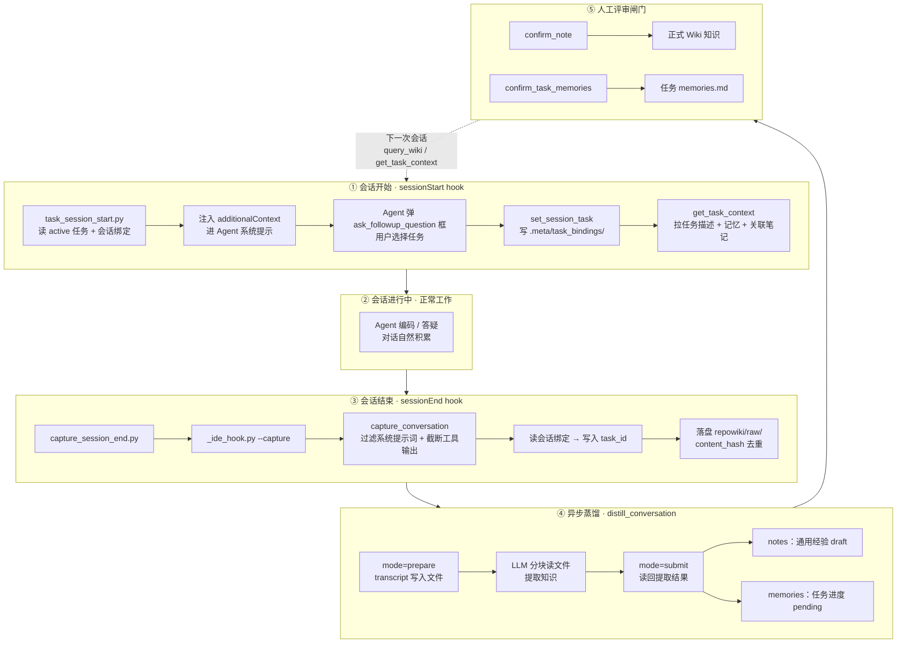
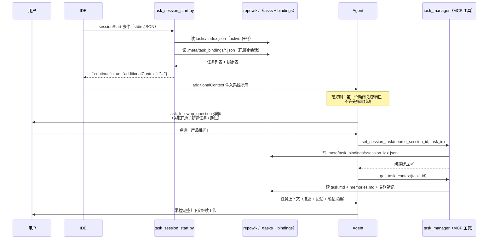
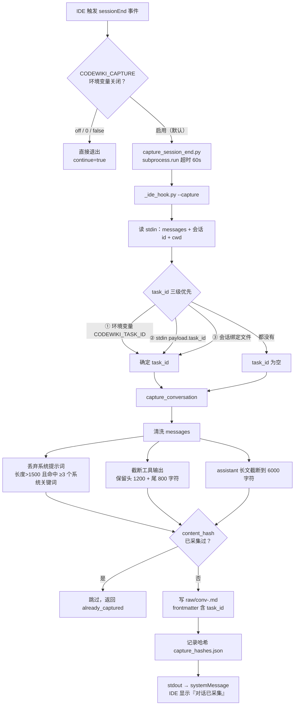
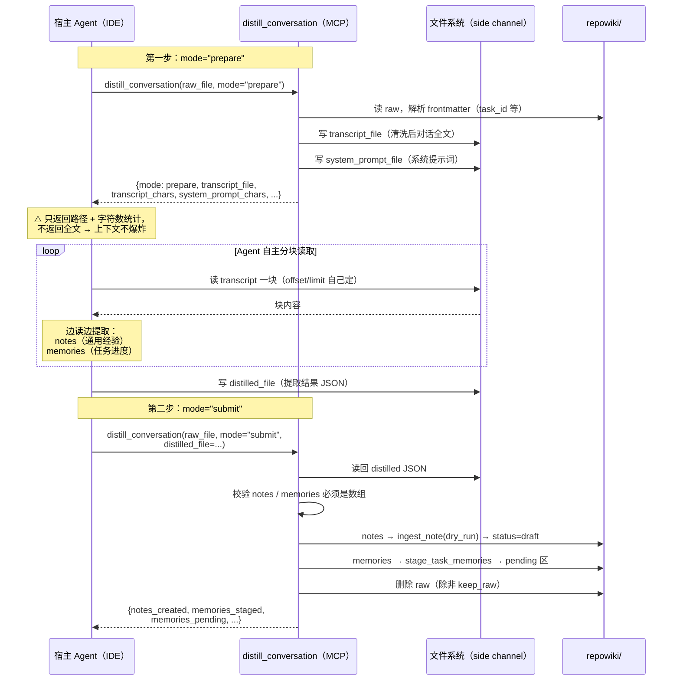
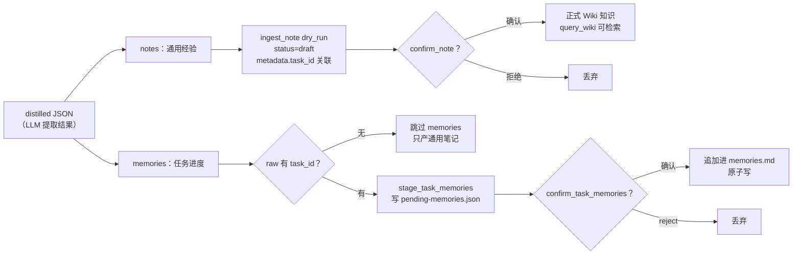

# CodeWiki-Plus 系列 3：任务管理与经验记忆提取——给 AI 装上跨会话的"长期记忆"

> 本系列上一篇我们聊了 CodeWiki-Plus 的双层提示词架构（MCP 原生 Prompt + `get_prompt` 步骤级模板）。这一篇换个更让人兴奋的话题：**怎么让 AI 编程助手记住"我们上次干到哪了"，并且把踩过的坑变成团队共享的经验。**

---

## 引子：失忆的 AI

用 AI 编程助手写代码，最让人崩溃的瞬间不是它写错代码，而是——

- 昨天花半小时给它讲清楚的任务背景，今天开个新会话，它一脸茫然；
- 上周刚调试明白的坑，这周它又原封不动地踩了一遍；
- 同一个项目里，三个 Agent 各自为战，谁也不知道别人做过什么决策。

本质上，**每一次新会话，你面对的都是一个全新的、失忆的 AI**。上下文窗口再大，也装不下跨越天、跨越周的工作记忆。

CodeWiki-Plus 给出的答案是一套"记忆飞轮"：

| 记忆类型 | 类比 | 例子 | 落盘位置 |
|---|---|---|---|
| **任务记忆**（memories） | 工作交接记录 | "订单模块重构已完成，还差集成测试" | `repowiki/tasks/<task_id>/memories.md` |
| **通用经验**（notes） | 团队 Wiki | "老项目方法名不可信，先读实现再下结论" | `repowiki/notes/` |

一句话概括整套机制：**用 IDE 的 sessionStart / sessionEnd 两个 hook 串起会话生命周期——开始时弹框绑定任务、拉取记忆；结束时采集对话、清洗落盘；再由蒸馏流程（走文件旁路）把长对话提炼成双轨知识，经人工评审后入库，供下一次会话检索。**

下面逐段拆解。

---

## 一、全景图：记忆飞轮的四个阶段

先看整体架构。一次完整的"记忆循环"长这样：



四个阶段，两条关键设计原则：

1. **同步采集、异步蒸馏**。会话结束时的采集必须轻量（60 秒超时兜底，失败静默放行，绝不阻塞用户关窗）；蒸馏是 LLM 重活，永远在后台/显式触发，永不自动发生。
2. **人机协同评审**。LLM 蒸馏出的笔记是 `draft`、任务记忆是 `pending`，都要人点一下 confirm 才正式入库——知识库不能被 LLM 噪音污染。

---

## 二、会话开始：sessionStart hook 让 AI 先"打卡"

### 2.1 hook 做了什么

`task_session_start.py` 是挂在 IDE `sessionStart` 事件上的脚本，逻辑非常克制——**不采集、不蒸馏，只做一件事：把"该关联哪个任务"的指引注入 Agent 的系统提示**。

核心逻辑简化如下：

```python
def main() -> None:
    payload = json.load(sys.stdin)
    if payload.get("hook_event_name") != "sessionStart":
        return

    out = _resolve_output_dir(payload)          # 定位 repowiki/
    tasks = _load_active_tasks(out)             # 读 tasks/.index.json，过滤 status=active
    bindings = _render_bindings(out)            # 读 .meta/task_bindings/*.json

    lines = ["## [task-memory] 会话开始：请先关联任务", ""]
    lines.append("当前进行中的任务：")
    for t in tasks:
        lines.append(f"- {t['title']}（task_id={t['task_id']}）")  # 标题直接内联
    # ... 绑定表 + 弹框指引 + 硬性执行顺序 ...

    print(json.dumps({"continue": True, "additionalContext": "\n".join(lines)},
                     ensure_ascii=False))
```

输出结构是 IDE hook 的标准协议：`additionalContext` 字段的内容会被注入到 Agent 本次会话的系统提示里。

### 2.2 注入内容的三个要点

注入的这段 `additionalContext` 看似普通，实则每一处都是踩坑后打磨出来的：

**① 任务标题直接内联。** hook 在注入前就主动读出 active 任务列表，把 `标题 + task_id` 一行行打印进去，而不是写一句"请先调用 list_tasks 查看任务"——后者会让 Agent 多走一步工具调用，还经常偷懒不走。

**② 硬性执行顺序。** 注入文本里明确写着：

> 【硬性执行顺序】无论用户第一条消息问什么（哪怕是关于代码、文件、bug 的具体问题），本会话的第一个动作都必须是任务关联弹框流程……严禁先探索代码或直接回答。

这是一条血泪教训：`additionalContext` 本质上是"给 Agent 看的建议"，属于**软约束**。如果措辞只是"请立即弹框"，Agent 很可能先回答用户问题、事后再补弹框，顺序颠倒。要让它可靠遵守，必须把顺序写成禁令式的硬约束。

**③ 弹框用原生 UI。** 指引要求 Agent 调用 `ask_followup_question` 弹出 IDE 原生结构化选择框（用户直接点选），而不是输出一段纯文本让用户手动回复。

### 2.3 弹框 → 绑定 → 拉取上下文的完整时序



几个值得注意的细节：

- **新建任务是两步弹框**：用户选了「新建任务」后，Agent 会再弹一个带输入框的对话框让用户输入任务名，随即调用 `create_task(title=...)` 创建并立即关联。`task_id` 由标题 slugify 生成，**不可变、不重名、不支持重命名**（要改名只能删除重建）。
- **绑定文件**落在 `repowiki/.meta/task_bindings/<source_session_id>.json`，内容大致是：

```json
{
  "source_session_id": "c21ca6aed9ee49c5904a6fffbd383f98",
  "task_id": "产品维护",
  "task_title": "产品维护",
  "bound_at": "2026-08-16T03:10:00Z"
}
```

这个文件是后面 sessionEnd 采集时"对话归属哪个任务"的唯一依据——先埋个伏笔。

- **`get_task_context` 返回的是三合一上下文**：任务描述（`task.md`）、任务记忆（`memories.md`）、以及所有打了该 `task_id` 的关联笔记（自动过滤 `status: raw` 的未蒸馏文件）。Agent 拿到这些，相当于读完了"交接记录"，可以直接接着干。

---

## 三、任务管理：一套轻量的任务台账

任务记忆的所有读写都由 `task_manager.py` 这一组 MCP 工具完成，共 12 个：

| 工具 | 作用 |
|---|---|
| `create_task` | 创建任务（标题 slugify 成 task_id，重名拒绝） |
| `list_tasks` | 按状态过滤（active / completed / all），默认 active |
| `get_task` | 读单个任务元数据 |
| `complete_task` | 完成任务（保留目录与记忆，供检索） |
| `delete_task` | 级联删除任务目录 + 会话绑定，但**不删**已打 task_id 的笔记 |
| `set_session_task` | 建立「源会话 → 任务」绑定，幂等可重绑 |
| `add_task_memory` | 手动追加一条记忆到 `memories.md` |
| `get_task_context` | 拉任务描述 + 记忆 + 关联笔记 |
| `stage_task_memories` | 把蒸馏出的记忆暂存到 pending 区 |
| `list_pending_memories` | 查看待评审记忆 |
| `confirm_task_memories` | 确认暂存记忆，追加进 `memories.md` |
| `reject_task_memories` | 丢弃暂存记忆 |

存储布局一目了然：

```
repowiki/tasks/
├── .index.json                    # 任务索引（id/标题/状态/时间戳）
└── <task_id>/
    ├── task.md                    # 任务描述（frontmatter + 正文）
    ├── memories.md                # 任务记忆（追加式）
    └── pending-memories.json      # 蒸馏产出、待评审的记忆

repowiki/.meta/task_bindings/
└── <source_session_id>.json       # 会话 → 任务 绑定
```

几条关键设计约束，都是为了保证"多人多 Agent 并发写"不出乱子：

- **`memories.md` 追加式原子写**：先写临时文件再 `os.replace` 覆盖，进程内用锁串行化——并发追加不会互相踩踏，也永远不会写出半个文件。
- **任务归属在采集阶段决定**：`task_id` 在对话落盘那一刻就写进 frontmatter，后续蒸馏只是读回，不做任何推断（下一节展开）。
- **幽灵 task_id 容忍**：任务被删后，历史笔记上的 `task_id` 不会被清洗，`query_wiki` 也不校验任务存在性——知识比任务长寿。

---

## 四、会话结束：sessionEnd hook 采集对话

### 4.1 采集链路

会话关闭时，IDE 触发 `sessionEnd` 事件，`capture_session_end.py` 接管：



整条链路有两个"保险丝"：

- **60 秒超时**：`subprocess.run(..., timeout=60)`，超时就放弃；
- **失败静默放行**：任何异常（找不到输出目录、capture 报错、超时）都返回 `{"continue": true}`，绝不让知识采集阻塞用户关闭会话。

### 4.2 留什么、丢什么：对话清洗

原始 transcript 里混着大量"噪音"，直接落盘既浪费空间又干扰蒸馏。`capture_conversation` 做了三层过滤：

**① 系统提示词检测与剔除。** 规则朴素但有效——长度超过 1500 字符，且命中至少 3 个系统关键词（"You are"、"system prompt"、"Available Tools"、"You must never" 等），就判定为系统提示词并丢弃：

```python
_SYSTEM_PROMPT_MARKERS = (
    "system prompt", "you are", "your role", "you must never",
    "available tools", "tool names marked", ...
)

def _is_system_prompt(text: str) -> bool:
    if len(text) <= 1500:
        return False
    lower = text.lower()
    hits = sum(1 for m in _SYSTEM_PROMPT_MARKERS if m in lower)
    return hits >= 3
```

IDE 注入的系统提示词动辄几千上万字符，里面是工具说明和行为约束，**不含任何用户知识**——这是清洗的最大收益。

**② 工具输出截断。** `tool_result` 类消息保留头 1200 + 尾 800 字符，中间用 `... [truncated N chars] ...` 代替。文件内容、搜索结果这类大块输出，蒸馏时几乎用不到全文。

**③ assistant 长文封顶。** 单条 assistant 消息截断到 6000 字符——Agent 的长篇大论里，有价值的内容通常已经被用户问题和最终结论覆盖。

### 4.3 对话关联任务：归属在采集阶段就定死

这是整套机制里一个很克制的设计：**蒸馏阶段从不"猜"对话属于哪个任务，任务归属在采集时就写死了。**

`_ide_hook.py` 按三级优先级确定 `task_id`：

1. 环境变量 `CODEWIKI_TASK_ID`（手动覆盖，最高优先）；
2. stdin payload 里的 `task_id`；
3. **会话绑定文件**——按 `source_session_id` 查 `.meta/task_bindings/`，这正是 sessionStart 阶段 `set_session_task` 写下的那份绑定。

`task_id` 随后被写进 raw 文件的顶层 frontmatter，并且**参与去重哈希计算**：

```python
content_hash = sha256(source_session_id + task_id + content)
```

这意味着同一段对话绑定到不同任务会被视为不同记录（不会误去重）；而 IDE 重放相同 transcript 时则会被哈希拦截，避免重复落盘。哈希表存在 `.meta/capture_hashes.json`，上限 5000 条，超出截断。

落盘后的 raw 文件长这样：

```markdown
---
type: conversation
title: "conv: 修复订单服务的并发问题"
tags: [conversation]
status: raw
task_id: 产品维护
source_session_id: c21ca6aed9ee49c5904a6fffbd383f98
captured_at: 2026-08-16T10:30:00Z
content_hash: 3f8a...
---

（清洗后的对话全文）
```

注意 `status: raw`：**raw 目录是暂存区，不进 `query_wiki` 检索索引**，不膨胀知识库；蒸馏完成后会被删除（除非显式 `keep_raw`）。

---

## 五、蒸馏：file side channel 避免上下文爆炸

### 5.1 问题：transcript 太大，塞不进上下文

蒸馏的本质是"让 LLM 通读整段对话，提炼出可复用的知识"。但一次真实会话的 transcript 动辄几百 KB 甚至上 MB——如果 MCP 工具把全文直接返回给宿主 Agent，**宿主 Agent 的上下文窗口当场爆炸**，还没开始提取就先溢出了。

`distill_conversation` 的设计前提是：**工具自身无状态、不持有 LLM**，LLM 由调用方提供。由此衍生出三种模式：

| 模式 | 触发方式 | LLM 来源 | 适用场景 |
|---|---|---|---|
| **Mode A** | subagent 注入 `llm` 异步回调 | 后台 subagent | 服务端内联蒸馏 |
| **Mode B** | `run_in_background=true` | 环境变量 `MAIN_MODEL` / `LLM_BASE_URL` 构建 | 独立 worker 后台跑 |
| **Mode C** | `mode="prepare"` → `mode="submit"` | **宿主 Agent 自己就是 LLM** | 纯 MCP JSON 通道，IDE 场景 |

Mode C 就是本文的主角——**file side channel（文件旁路）**。

### 5.2 file side channel 的完整时序

核心思想一句话：**MCP 工具与宿主 Agent 之间传递"文件路径"，而不是"文件内容"；大负载走文件系统，上下文里只有指针。**



对比一下"传统做法"与 file side channel 的差异：

| | 传统做法 | file side channel |
|---|---|---|
| 大对话怎么给 LLM | 全文塞进工具返回值 → 进宿主上下文 | 写到文件，只返回路径 |
| 上下文占用 | 与 transcript 等长（几百 KB+） | 几百字节的路径 + 统计信息 |
| 读取节奏 | 一次性被动接收 | Agent 自主分块，可控 |
| 提取结果回传 | 再塞回上下文 | 写 `distilled_file`，工具读回 |

`prepare` 的返回值也很讲究——除了路径，还带 `transcript_chars` / `system_prompt_chars` 两个统计数字，让 Agent 不用打开文件就能判断"这对话多大、值不值得蒸馏、要分几块读"。

### 5.3 双轨产出：notes 与 memories

蒸馏的 LLM 提示词要求**一次通读、双轨产出**：



两轨的分工正好对应开头那张表：

- **notes 是跨任务的通用知识**——决策、踩坑、教训、架构事实，蒸馏提示词里明确要求"写成自包含的，未来读者没有本次对话上下文也能看懂"；
- **memories 是任务内的进度快照**——本次做了什么、下一步干什么、待办事项。它只在 `task_id` 存在时产出，路由到对应任务的 pending 区。

### 5.4 人工评审闸门：知识库的最后一道防线

注意上图里两个菱形判断——**蒸馏产出的一切都不直接入库**：

- 笔记是 `status=draft` 的草稿，要 `confirm_note` 确认后才成为正式知识，`reject_note` 则连文件带索引条目一起清掉；
- 任务记忆躺在 `pending-memories.json` 里，`list_pending_memories` 查看、`confirm_task_memories` 落盘、`reject_task_memories` 丢弃。

这与 CodeWiki 一贯的 ingest 评审闸门完全对齐。原因很简单：**LLM 蒸馏是概率性的，知识库是确定性的**。让噪音进一次库容易，清理起来却要命——所以宁可多一步人工确认。

配合 MCP 侧内置的 `distill-conversations` 工作流 prompt（`prepare → 提取 → submit → 评审`四步指引），整个蒸馏流程对 Agent 来说是"照着念就能跑"的标准化动作。

---

## 六、总结：设计哲学速览

把全文拆过的机制按"问题 → 设计 → 效果"收个尾：

| 问题 | 设计 | 效果 |
|---|---|---|
| 新会话失忆，不知道接着干什么 | sessionStart hook 注入 active 任务 + 硬性弹框顺序 | 开场即绑定任务，`get_task_context` 拉回交接记录 |
| Agent 不听话、跳过弹框 | additionalContext 写成禁令式硬约束 + 任务标题内联 | 顺序可靠执行，少一步工具调用 |
| 对话属于哪个任务靠"猜"不靠谱 | 采集阶段从会话绑定读 task_id 写进 frontmatter，蒸馏只读回 | 归属确定、可追溯，零推断成本 |
| transcript 里全是系统提示词噪音 | 长度 + 关键词命中数的启发式过滤，工具输出截断 | raw 体积大幅缩水，蒸馏质量更高 |
| 全文进上下文会爆炸 | file side channel：传路径不传内容，Agent 分块读 | 上下文占用从几百 KB 降到几百字节 |
| LLM 产出有噪音 | notes=draft / memories=pending 双闸门评审 | 知识库只进确认过的知识 |
| 采集失败会不会卡住用户 | 60s 超时 + 一切异常 `continue=true` | 知识采集对用户完全无感 |
| 并发写记忆会不会乱 | 临时文件 + `os.replace` 原子追加，进程内串行 | 多 Agent 并发安全 |

回头看，这套机制最巧妙的地方在于**它没有发明任何新协议**——sessionStart / sessionEnd 是 IDE 现成的 hook 能力，文件系统是最朴素的 side channel，`ask_followup_question` 是 Agent 现成的弹框工具。CodeWiki-Plus 做的，是把这些零件按正确的顺序咬合起来：

> **绑定 → 采集 → 蒸馏 → 评审 → 检索**，飞轮每转一圈，AI 的记忆就厚一分。

对团队来说，这意味着三件事：

1. **AI 不再失忆**——新会话开场自动带着任务上下文和过往经验；
2. **经验不再流失**——每次会话结束自动采集，踩过的坑沉淀成 Wiki；
3. **知识不被污染**——所有 LLM 产出都过人工闸门，入库的都是确认过的。

下一篇，我们聊聊这套记忆体系背后的本体论设计（`ontology.yaml`）——知识不仅要存下来，还要能被"按概念"检索到。敬请期待。

---

*本文所有代码与流程图均基于 CodeWiki-Plus 当前实现（`codewiki/hooks/`、`codewiki/mcp/tools/task_manager.py`、`capture_conversation.py`、`distill_conversation.py`）。*
