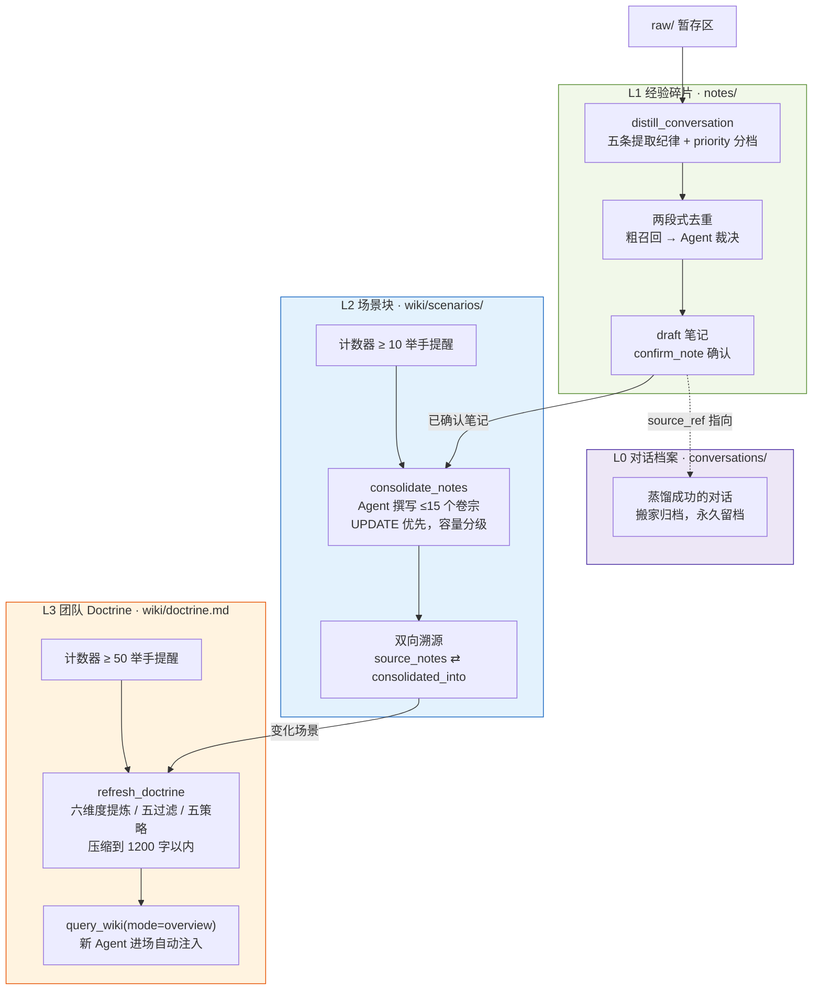
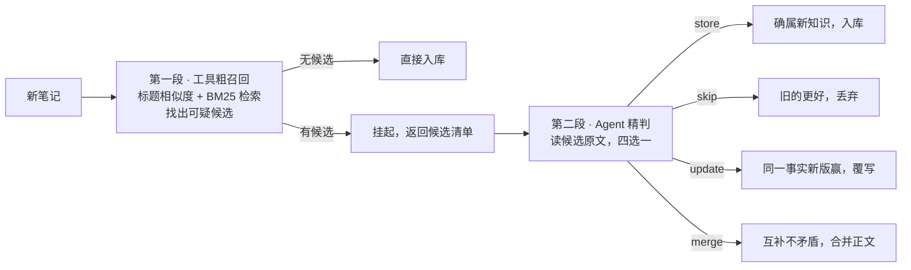

# CodeWiki-Plus 系列 4：记忆分层提取——从经验碎片到团队 Doctrine

> 本系列上一篇我们搭好了"记忆飞轮"：绑定任务 → 采集对话 → 蒸馏知识 → 人工评审，让 AI 不再失忆、让踩过的坑变成 Wiki。这一篇讲的是飞轮转起来之后发生的事：**知识只会"攒"不会"长"，笔记越积越多，检索越来越难，我们决定给记忆做一次分层升级。**

---

## 引子：飞轮转起来之后，知识开始"发胖"

上一篇的记忆飞轮上线后，团队确实在持续沉淀经验。但过了一段时间，三个新毛病浮出了水面：

- **笔记越多越难用**。从十几条涨到几十条后，检索开始"大海捞针"——命中一堆零散片段，却没有一个地方告诉你"关于这件事，我们的完整方法论是什么"；
- **同一个坑换了马甲又被记一遍**。两条笔记说的是同一件事，措辞不同、结论还略有出入，谁也不知道该信哪条；
- **新来的 Agent 依然要"从头学起"**。知识库明明很厚，却没有一个"本项目做事方式"的入口——每个新会话、每个新 Agent 都得自己把碎片拼成全貌。

更要命的是，一次例行检查给了我们当头一棒：**存量笔记的来源链接（source_ref）48 条里 48 条全部失效**——它们指向的原始对话在蒸馏完成后就被删除了。知识成了"无源之水"，想追溯某条经验当初是怎么来的，查到一半就是断崖。

从业务视角看，这是三笔新的成本：

- **检索成本**：知识只增不整，找到"正确答案"的代价随存量线性上涨；
- **信任成本**：重复、矛盾、无法溯源的知识，会让团队对整个知识库的可信度打折；
- **上手成本**：没有一个"精华层"，新成员和新 Agent 的冷启动时间永远降不下来。

CodeWiki-Plus 的答案是**记忆分层提取**——让记忆像金字塔一样逐层生长：

| 层级 | 类比 | 例子 | 落盘位置 |
|---|---|---|---|
| **L0 对话档案** | 照片底片 | "那次关于缓存击穿的完整讨论" | `repowiki/conversations/` |
| **L1 经验碎片** | 便签条 | "缓存击穿须用互斥锁重建" | `repowiki/notes/` |
| **L2 场景块** | 档案柜里的卷宗 | "缓存类问题的排查 SOP 与禁忌" | `repowiki/wiki/scenarios/` |
| **L3 团队 Doctrine** | 老师傅的口诀本 | "本项目做事方式 1200 字精华" | `repowiki/wiki/doctrine.md` |

一层比一层薄，一层比一层贵：L0 保真、L1 保细、L2 成体系、L3 成原则。

---

## 一、业务梳理：分层提取到底回答哪几个问题

在谈实现之前，先把业务问题捋清楚。分层提取真正回答的是四个问题：

**问题一：碎片怎么不变成垃圾？**
笔记入库是第一道关。LLM 从对话里提取知识天生带噪音——鸡毛蒜皮记一堆、指代不清记一堆、个人建议当成团队决策记一堆。提取环节必须有纪律，否则后面的层再精致，原料就是坏的。

**问题二：碎片堆多了怎么办？**
几十条笔记里，关于同一件事的往往有三五条。需要一种机制定期把碎片"卷宗化"——按工作对象和方法体系归拢成数量有限、持续更新的场景块，而不是让便签条无限堆积。

**问题三：拿什么给新人"读档"？**
一个新 Agent 接触项目，最需要的不是某条具体知识，而是"这个团队怎么做事"——哪些 SOP 要遵守、哪些禁忌不能碰、遇到取舍按什么逻辑判断。这需要从场景块再往上压缩一层，压成一份随时能一口气读完的"团队操作原则"。

**问题四：知识怎么自证清白？**
任何一条知识，都应该能回答"你是从哪来的"。原始对话必须留档，溯源链路必须完整——这不是可有可无的审计需求，而是知识库公信力的地基。

四个问题正好对应金字塔的四层建设：**L1 纪律 → L2 聚合 → L3 压缩 → L0 留档**。

两条总设计原则从上一篇延续下来，并各加了一句新的：

1. **工具做确定性簿记，Agent 做概率性推理**。所有"动脑子"的环节（提取、聚合、压缩）都由宿主 Agent 的模型完成，工具只负责协议、校验和记账——工具要笨一点，把聪明留给外面；
2. **触发永远显式，提醒绝不代办**。分层聚合是 LLM 重活，永不自动发生；但计数器会"举手提醒"——是否动手，永远由用户拍板。

---

## 二、全景图：记忆金字塔

整体数据流是一个逐层上升的金字塔，每一层都有自己的触发节奏：



值得交代一句这套设计的出处。分层蒸馏的思路来自对 TencentDB-Agent-Memory（TAM）的源码级调研：它的记忆管线同样是 L0 原始对话 → L1 原子记忆 → L2 场景块 → L3 团队画像，逐层蒸馏、触发式调度。我们借鉴的是**分层哲学和协议设计**，但运行形态做了根本改造——TAM 是服务端常驻的"推送式"管线（定时器 + 后台 Worker 自动干活），CodeWiki-Plus 是无状态 MCP 工具链的"拉取式"协议（计数器提醒 + 显式触发 + Agent 亲自操刀）。同一个金字塔，两种盖法；我们选了和自己架构基因一致的那种。

下面逐层拆解。

---

## 三、L1 提取纪律：宁缺毋滥

### 3.1 目标：把噪音挡在入库之前

飞轮转得越久越明白一个道理：**知识库的质量上限不在"能记多少"，而在"敢拒多少"。** L1 是知识进库的第一道关，这一关的纪律松一寸，后面每一层的治理成本就涨一尺。

我们给蒸馏提示词加了五条硬性纪律：

1. **独立完整**——每条笔记必须跳出当次对话也能看懂，禁用"这个""上面说的"之类指代；
2. **准确归因**——某个人的建议不等于团队决策，只有明确拍板、采纳、验证过的才能写成定论，没确认的必须写"正在讨论"；
3. **归纳合并**——强相关的多轮讨论合并成一条，不把同一个结论拆成碎片；
4. **AI 输出须被采纳**——AI 自己产出的方案，只有人类采纳或实践验证过才配进知识库；
5. **低价值丢弃**——寒暄、一次性请求、代码里显而易见的东西，一律不记。

配套一个 **priority 分档**：每条笔记带 0-100 的优先级，90 以上映射高严重度（检索加权），**70 以下直接丢弃**——连入库的资格都没有。提示词里同时告诉 LLM："拿不准值不值得记的，就别记。"

### 3.2 两段式去重：工具召回，Agent 裁决

提取纪律解决"该不该记"，去重解决"是不是记过了"。这是 L1 最难的地方：纯字符串匹配抓不住"换个说法的重复"，纯 LLM 判断又贵又慢。

我们的做法是两段式分工：



工具负责把"疑似重复"的候选捞出来（确定性、便宜），Agent 负责判断"到底是不是重复"（概率性、需要理解语义）。端到端验收时这个机制真实演练了一次：新笔记召回了三条主题相关的旧笔记（调研记录、文件命名约定等），Agent 通读后判定"相关但非重复"，裁决 store 放行——机器提效、人脑（Agent 脑）把关，各干各擅长的事。

### 3.3 开发手记：一个引号引发的悬案

验收时撞上一个隐蔽 bug：两条明显高度相似的笔记，相似度就是算不过阈值。排查半天，发现根因在 frontmatter 的标题字段——入库时标题是带 JSON 引号写入的，而相似度计算直接拿了带引号的原文分词，首尾两个 token 粘着引号，永远匹配不上。**引号把相似度系统性压低了。**

修复只有一行（解析时先去引号），但教训值得记：**文本相似度这类"软逻辑"，最容易在输入清洗这种"硬细节"上翻船。** 这条经验后来自己也成了一条笔记——知识库就是这么喂自己的。

---

## 四、L2 场景块：把便签条整理进档案柜

### 4.1 目标：让知识"成卷宗"

便签条再多，也只是便签条。L2 要回答的问题是：**关于同一件事，我们的完整方法论是什么？**

答案是一种新的知识形态——**场景块**：按工作对象和方法体系组织的卷宗，每份卷宗固定九个章节，核心是五类可复用内容：

- **SOP**——以后类似工作按什么流程做；
- **判断逻辑**——团队为什么这样取舍；
- **禁忌与反模式**——哪些做法不能再出现；
- **原则**——哪些约束要长期遵守；
- **经验**——哪些方法可以被 Agent 和团队复用。

注意场景块**不是项目日报**：事实和任务只能作为方法的来源和适用条件出现，流水账式的记录被明确禁止。一份好的场景块，读起来应该像"这件事的操作手册"，而不是"这件事的会议纪要"。

### 4.2 容量治理：档案柜只有十五格

场景块最大的设计决策是**硬性容量上限：15 个**。

这个数字背后的判断是：场景块的价值在"少而全"。不设上限，聚合就会退化成"另一种形式的堆积"——三个月后你面对的不是 50 条散乱笔记，而是 40 个散乱卷宗，问题只是换了个形状。

容量治理配套一套分级预警，像交通灯一样约束 Agent 的行为：

| 灯色 | 水位 | 行为约束 |
|---|---|---|
| 绿灯 | < 12 | 正常操作 |
| 黄灯 | 12-13 | 优先 UPDATE 或主动 MERGE |
| 橙灯 | 14 | 只准 UPDATE，禁止新建 |
| 红灯 | ≥ 15 | 必须先 MERGE 到上限以下 |

策略优先级永远是 **UPDATE > MERGE > CREATE**——"默认动作是更新，不是新建"；真要新建，必须先通读至少两份最相似卷宗确认塞不进去，且每批最多新建一份。删除则走软删标记，由工具统一清理。

这套机制运行至今，本仓库 25 条确认笔记聚合成 5 个场景块，容量 5/15——卷宗薄而满，正是想要的状态。

### 4.3 触发与提醒：计数器举手，用户拍板

聚合什么时候发生？我们的答案是**计数器提醒制**：

- 每次有笔记被确认，聚合计数器加一；
- 计数越过阈值（默认 10），下一次用户确认笔记时，工具在响应里附带一条提醒："已有 N 条笔记待聚合，建议执行 consolidate_notes——请先询问用户"；
- 提醒过一次就闭嘴，直到又积累若干条才再次开口（防唠叨机制）；
- 用户同意，Agent 才启动聚合；用户说"以后再说"，流程到此为止。

这里有一条从上一篇延续下来的产品判断：**给 AI 做自动化，"提醒"和"代办"之间必须划一条清晰的线。** 计数器永远只举手，绝不动手——聚合是重组知识库的大动作，它的启动权必须在人手里。

### 4.4 双向溯源：卷宗知道自己由哪些便签变成

聚合完成后，工具在两边都记账：场景块的 frontmatter 记下"我由哪些笔记聚合而来"（source_notes），被吸收的笔记记下"我并入了哪个卷宗"（consolidated_into）。被完全吸收的旧笔记走退役流程退出检索，但文件和链接都留着——**知识可以被整理，不能被销毁。**

---

## 五、L3 团队 Doctrine：老师傅的口诀本

### 5.1 目标：一口气读完的"本项目做事方式"

金字塔的塔尖回答的是冷启动问题：一个全新的 Agent 接触项目，第一眼应该看到什么？

不是 50 条笔记，不是 5 个卷宗，而是一份**1200 字以内的团队操作原则（Team Operating Doctrine）**——像老师傅带徒弟时传下来的口诀本：篇幅必须是一口气读完的，内容必须是换了任何项目场景都能拿起来就用的。

为此提示词给 LLM 定了三条死规矩：

**六维度提炼**——只从六个角度收内容：SOP、原则（Principle）、决策逻辑（Decision Logic）、边界（Boundary）、反模式（Anti-pattern）、Agent 规则。项目名、版本号、任务状态这类低层事实一律不收，除非它们能抽象成跨场景的规则。

**五条过滤器**——每句话写入前过五道筛子：通用性（换个项目还成立吗）、完整性（脱离原文还看得懂吗）、可执行性（Agent 能照着改变行为吗）、稳定性（三个月后还有效吗）、精炼性（还能更短或合并吗）。**任何一条不过，宁可不写。**

**五种增量策略**——Doctrine 不做加法做减法：新证据佐证旧原则就"强化"，出现新规则才"补充"，旧原则被推翻就"修正"，文档写散了就整体"重构"，只有项目状态没有新知识就"不改"。核心心法一句话：**能不写就不写，能合并就合并。**

### 5.2 消费入口：新 Agent 进场即"读档"

Doctrine 写完不是放在那里等人看的，它的消费入口做进了检索协议：`query_wiki(mode=overview)`——任何 Agent 按惯例先做的"项目定向"调用——会自动注入 Doctrine 全文加场景导航（每个卷宗一行：标题、热度、摘要，按需下钻）。

这意味着冷启动体验变成了：**新 Agent 的第一个查询，就带着整个团队的做事方式回来。** 场景块不整本注入，只给导航——渐进式披露，上下文永远花在刀刃上。

本仓库的首份 Doctrine 压到 1165 字，开篇一句 Operating Thesis 定调，五个章节覆盖原则、SOP、决策逻辑、禁忌、Agent 规则。它现在是我们每个新会话真正的"第零份上下文"。

### 5.3 级联提醒：卷宗动了，口诀本要不要更新？

L3 的触发除了自己的计数器（默认 50 条确认笔记），还有一条级联通道：每次场景聚合完成，如果 Doctrine 计数器恰好也越线了，聚合响应里会顺带提醒"卷宗刚更新，要不要顺带刷新 Doctrine"。一次点头，两层一起刷新——**把相关的决策放在同一个时刻让用户做，是我们的提醒机制一贯的审美。**

---

## 六、L0 对话档案：知识的底片

### 6.1 48/48 的教训

金字塔动工的契机，是文章开头那次检查：存量 48 条笔记的来源链接，48 条全部指向已被删除的原始对话。

原来的设计把 raw 暂存区当"用完即弃的中转站"——蒸馏完成，原文即删。这在存储上是干净的，在知识治理上却是断崖的：**蒸馏是有损压缩，把底片扔了，照片就再也无法回溯。** 当有人质疑某条知识的出处时，系统给不出任何证据。

修复方案是给 L0 一个正式的安身之所：蒸馏成功的对话不再删除，搬家到 `conversations/` 永久归档，笔记的来源链接同步改写到归档路径。暂存区回归本职——它只是队列，永远轻装；档案另立门户，只进不出。

### 6.2 链接优先，零索引

归档设计有一个反直觉的决策：**归档对话不进检索索引。**

担心很直白：几百份全文对话灌进索引，会不会拖慢检索、污染结果？我们真跑了基准：倒排索引的查询耗时和文件数量基本解耦——1000 份对话压上去，单次查询也就从 20ms 涨到 82ms，用户无感；真正的成本在索引重建，随归档量线性增长。

但最后让我们拍板"零索引"的不是性能账，而是产品账：**检索的入口应该永远是知识层，对话只是知识的出处。** 对话是低信噪比文档，放它进默认检索，等于让噪音和高价值知识抢排名。正确的发现路径是链接式的——检索命中笔记，笔记露出来源链接，需要原话时顺着链接下钻读档案。

于是设计收敛成一句话：**链接优先，零索引。** 不花一分索引成本，换来一条永远点得开的溯源链。至于"按对话正文反查"的能力——先不做，值得找回的对话一定有笔记指向它；真到了需要的那天，再加不迟。

### 6.3 留一个隐私出口

归档成为默认后，补了一个反向开关 `drop_raw`：明确标注隐私的对话，蒸馏完就删，绝不入档。**默认留档是为了知识，允许删除是为了人。** 两个方向都要有门。

---

## 七、使用示例：把金字塔跑一遍

机制讲完了，落到日常是什么手感？下面五个场景按真实 MCP 工具参数写，在任何接了 CodeWiki 工具链的 Agent 里照抄就能跑。整条链路只有一种节奏：**准备（工具交材料）→ Agent 动脑子 → 提交（工具记账）**。

### 场景 1 · 采集：一场有沉淀价值的对话结束

```jsonc
capture_conversation({
  "conversation": "<本次对话 transcript>",
  "task_id": "cache-governance"      // 可选：挂到长线任务上
})
```

对话落进 `raw/` 暂存区（`conv-<id>.md`，status 待蒸馏），工具顺手打个摩擦分——被纠正过、返工过的对话分数更高，蒸馏时排在前面。**此时它不进检索、不打扰任何人**，只是安静排队。

### 场景 2 · 蒸馏：Agent 亲自当 LLM，两次往返

第一次往返，取材料和纪律：

```jsonc
distill_conversation({ "mode": "prepare" })
// → 待蒸馏清单（conversation_id + 预览，按摩擦分降序）+ 蒸馏系统提示词（五条纪律）
```

Agent 通读 transcript，按纪律提取；第二次往返交卷：

```jsonc
distill_conversation({
  "mode": "submit",
  "distilled": {
    "conv-20260815-143022": {
      "notes": [{
        "title": "缓存击穿须用互斥锁重建，热点探测先行",
        "note_type": "pitfall",
        "priority": 88,
        "scene": "缓存治理",
        "related_modules": ["cache"],
        "content": "## Background\n……\n## 正确做法\n……"
      }],
      "memories": ["完成缓存击穿互斥锁重建方案，压测待补"]
    }
  }
})
```

接下来全是工具的确定性簿记：priority<70 的条目直接丢弃；两段式去重召回疑似重复时挂起、等 Agent 四选一裁决；幸存笔记以 **draft** 入库，任务进度进任务记忆暂存区等确认；原始对话搬家到 `conversations/` 永久归档，笔记的 source_ref 同步改写到归档路径。明确标注隐私的对话传 `"drop_raw": true`，蒸馏完即销毁、不入档。

### 场景 3 · 评审：草稿变成正式知识

```jsonc
confirm_note({ "note_file": "notes/cache-breakdown-mutex.md", "by": "human:zhangsan" })
// → status 升为 stable，追加 verified 事件，stale_after 按类型窗口刷新
```

不够格就 `reject_note` 并给理由，评审意见一并留痕。每次确认让聚合计数器加一——**越线时工具会在响应里举手提醒，但动不动手永远等你拍板。**

### 场景 4 · 聚合：计数器举手之后

同样是 Mode C 两段协议：

```jsonc
consolidate_notes({ "mode": "prepare" })
// → 待聚合笔记 + 现有卷宗索引 + 容量红绿灯 + 聚合系统提示词
```

Agent 通读笔记、撰写或更新卷宗，然后提交动作报告：

```jsonc
consolidate_notes({
  "mode": "submit",
  "report": { /* CREATE / UPDATE / MERGE 动作清单 */ }
})
```

工具校验容量（红灯拒绝新建）、落盘卷宗、记双向溯源（source_notes ⇄ consolidated_into）、被完全吸收的旧笔记软删退役，最后计数器清零。

### 场景 5 · 刷新 Doctrine，然后消费

```jsonc
refresh_doctrine({ "mode": "prepare" })
// → 现行 Doctrine + 近期变化的场景 + 六维度提炼提示词

refresh_doctrine({
  "mode": "submit",
  "content": "<Agent 重写后的 Doctrine 全文，≤1200 字>",
  "by": "human:zhangsan"
})
```

消费端则零成本——新 Agent 进场的第一次检索就自带读档：

```jsonc
query_wiki({ "query": "缓存", "mode": "overview" })
// → Doctrine 全文 + 场景导航（每卷宗一行摘要）+ 命中的知识层，按需下钻
```

五个场景对应的触发节奏，一张表收拢：

| 场景 | 工具 | 什么时候做 |
|---|---|---|
| 采集 | `capture_conversation` | 有沉淀价值的对话结束后，随手一次 |
| 蒸馏 | `distill_conversation` | 显式执行；建议每日/每周批量 |
| 评审 | `confirm_note` / `reject_note` | 蒸馏完成后逐条过目 |
| 聚合 | `consolidate_notes` | 计数器提醒时（默认 10 条确认笔记） |
| Doctrine | `refresh_doctrine` | 计数器提醒时（默认 50 条）或聚合级联提醒 |
| 消费 | `query_wiki(mode="overview")` | 每个新会话开场 |

注意整条链路里工具只干两种活——**交材料、记账本**；判断全在 Agent，启动权全在用户。五个调用打完，金字塔就转完了一圈。

---

## 八、后续演进：给金字塔打的两块补丁

文章主体写的是金字塔怎么盖。但系统跑了一段时间后，我们又补了两块东西——一块管"存下的知识会不会腐"，一块管"分层在检索里到底算不算数"。它们不是新的层，却是这套设计真正闭环的关键，值得在正文里交代一笔。

### 8.1 保鲜机制：知识有了"复核期"

先是一次盘点暴露的尴尬：过期判定粗糙得像拍脑袋。lint 按**创建日期**判过期，一刀切 90 天；更要命的是，`confirm_note` 明明会往笔记里写 `stale_after`（绝对过期日），lint 却压根不读这个字段——**确认一条笔记，对它的保鲜毫无影响**。评审动作和知识寿命各过各的，这等于保鲜机制是摆设。

修复方案延续了本文的一贯审美：**零新增字段，只把已有的 `stale_after` 真正激活**。判定基准从"写下多少天"换成"复核期过没过"，复核期按知识类型给不同的保质期：

| 类型 | 窗口 | 理由 |
|---|---|---|
| workaround | 45 天 | 临时方案天然短命 |
| known_issue | 60 天 | 已知问题通常随修复而失效 |
| general | 120 天 | 一般知识的默认档 |
| pitfall / lesson / bug_fix | 180 天 | 坑和教训的保质期较长 |
| decision / architecture | 365 天 | 决策与架构事实最长寿 |

ingest / confirm 写入时按 note_type 查表（窗口全部在 `schema.yaml` 的 `conventions.freshness` 里可调），确认即按类型窗口续期。配套两条人性化规则：**过期不自动作废**——只是 lint 举手提醒复核（确认仍准确就 confirm 续期，已过时就 reject 退役），"提醒绝不代办"的线在这里照旧；**近期被检索过的笔记自动顺延**——有人还在用，就说明它还活着。存量笔记则有一个幂等回填脚本兜底：`stale_after = max(现值, 最后一次 verified 时间 + 类型窗口)`，让历史上确认过的知识在新机制下不冤枉。`wiki_stats` 也随之多了个健康度指标：`freshness {due, fresh}`，一眼看出库里有多少知识到了复核期。

一句话：**知识的寿命不再由"写下的日子"决定，而由"最后一次被验证的日子 + 这类知识应有的保质期"决定。**

### 8.2 权威度加权：分层开始反哺检索

第二块补丁回答一个更尖锐的问题：**金字塔建好了，检索认不认这个层级？** 原来的回答是不认——BM25 只看文本相似度，Doctrine 和一条随手笔记同台竞技，草稿和确认过的知识平起平坐。

现在检索分变成了 **BM25 × 权威度系数**（收敛在 0.7-1.3 之间，只调序、不翻盘），系数由三组确定性规则叠加：

- **类型权重**——笔记按含金量加权：decision +0.15 > pitfall +0.12 > lesson / architecture +0.10 > workaround +0.05；
- **状态闸门**——评审状态直接参与排名：stable +0.05，draft -0.25，deprecated -0.35，**未确认的知识自动沉底，被否决的近乎隐身**；
- **层级加成**——金字塔的层第一次变成了检索参数：L3 Doctrine +0.20，L2 场景块 +0.15，`raw/sources/` 的第三方素材 -0.20。

边界也划得很清楚：**相似性判断豁免权威度**——蒸馏去重的粗召回走纯相似度（`apply_authority=False`），因为那里问的是"像不像"，不是"谁更重要"。权威度是排名概念，不是相似性概念，两处各用各的。

至此，金字塔第一次完成了对检索的反哺：**层级越高、越被验证过的知识，嗓门越大。** 分层不再只是存储结构，它同时是检索参数——这大概是"知识会生长"最实际的注脚。

---

## 九、总结：设计哲学与团队价值

照例把全文机制按"业务问题 → 设计决策 → 拿到什么"收个尾：

| 业务问题 | 设计决策 | 拿到什么 |
|---|---|---|
| 提取带噪音，什么都往库里记 | 五条提取纪律 + priority<70 直接丢弃 | 入库即精品，源头干净 |
| 换个说法的重复防不住 | 工具粗召回 + Agent 精判四动作 | 去重既快又懂语义 |
| 笔记越积越多，知识不生长 | ≤15 场景块 + 容量分级预警 + UPDATE 优先 | 碎片成卷宗，少而全 |
| 聚合何时做没人记得 | 计数器举手提醒，用户拍板才动手 | 永不自动，也永不遗忘 |
| 新 Agent 冷启动从零学起 | 1200 字 Doctrine 注入 overview 定向 | 进场即读档，带着原则开工 |
| Doctrine 越写越臃肿 | 六维度 / 五过滤 / 五策略，做减法 | 塔尖永远一口气读完 |
| 来源链接全断，知识无法自证 | L0 归档 + 链接改写，零索引不花成本 | 每条知识都回得去现场 |
| 聚合重组是危险操作 | 双向溯源 + 软删退役，只整理不销毁 | 知识可整理，不可丢失 |
| 知识存久了悄悄腐烂 | 类型感知 `stale_after` 复核期，超期举手不自动作废 | 寿命跟着"最后验证日"走 |
| 检索不认层级，良莠同台 | BM25 × 权威度系数（0.7-1.3）：类型 + 状态 + 层级 | 越精炼越验证，嗓门越大 |

回头看这次升级，真正有意思的不是"多建了三层"，而是每一层都在重复同一条方法论——**把确定性交给工具，把判断力留给 Agent，把决定权留给用户**。工具负责计数、召回、校验、搬家这些永远不会错的事；Agent 负责理解、归并、提炼这些必须聪明的事；而"动不动手、信不信任"，永远在人手里。

对团队来说，这意味着三件事：

1. **知识会生长了**——从便签到卷宗到口诀本，存量越大，金字塔越结实，而不是越臃肿；
2. **冷启动消失了**——新 Agent 的第一个查询就带回整个团队的做事方式，"入职培训"变成一次自动读档；
3. **知识能自证了**——任何一条经验都能顺着链接回到它诞生的那场对话，公信力有了地基。

这也正是"分层提取"的真正意义：**它不是给记忆做仓储升级，而是让团队的认知从"越攒越乱"变成"越攒越利"。**

下一篇，我们回到上一篇结尾留的那个钩子——本体论设计（`ontology.yaml`）：知识不仅要分层存下来，还要能被"按概念"找到。敬请期待。

---

*本文基于 CodeWiki-Plus 当前实现撰写，相关模块：`codewiki/mcp/tools/distill_conversation.py`（L1 纪律与两段式去重、L0 归档）、`note_consolidation.py`（L2 场景聚合）、`doctrine.py`（L3 Doctrine）、`aggregation_state.py`（计数器与提醒）、`knowledge_loop.py`（检索溯源露出、保鲜判定）、`wiki_lint.py`（stale_notes 复核提醒）、`codewiki/mcp/cache.py`（权威度加权）、`scripts/migrate_freshness.py`（保鲜回填）。设计文档见 `docs/团队记忆融合-L2场景聚合与L3-Doctrine设计方案.md` 与 `docs/新鲜度机制设计方案.md`，TAM 调研见 `docs/TencentDB-Agent-Memory-记忆提取机制分析.md`。*
