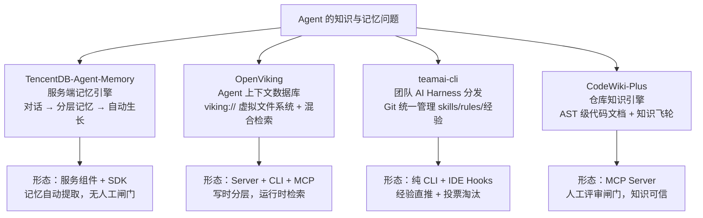

# CodeWiki-Plus 系列 6：Agent 的记忆放在哪——四个开源记忆与知识系统横评

> 系列前五篇都在讲 CodeWiki-Plus 自己：文档生成、双层 Prompt、任务记忆、分层提取、知识飞轮。这一篇换个视角，把我最近深度调研的四个同类项目放在一起横向对比——腾讯的 TencentDB-Agent-Memory、火山引擎的 OpenViking、腾讯的 teamai-cli，以及本系列的主角 CodeWiki-Plus。四个项目，两家大厂一个个人开源，竟然在同一时间窗口里、在六个核心机制上独立收敛出了高度相似的答案，又在最关键的哲学问题上分道扬镳。这篇文章把每个项目的功能讲清楚，再讲它们互相之间的差异与互补。

---

## 引子：Agent 的"失忆症"成了 2026 年的公共问题

写过 AI 编码助手的人大概都经历过这样的场景：上周刚教会 Agent"这个项目的 OrderService.process() 只做参数校验"，这周它又信心满满地基于方法名做了一次错误假设；团队群里讨论过的上线禁忌，新会话的 Agent 一无所知；甚至同一个会话里，聊到第一百轮时它已经忘了第一轮的结论。

这不是模型能力问题，是**架构问题**：模型的上下文窗口是易失的，而团队的知识需要持久的。于是 2026 年，"给 Agent 装记忆/知识系统"成了一个明确的赛道。这个赛道上同时出现了四条很有代表性的路线：

四者的关系不是"四个竞品"，而是**同一个问题的四个切面**：TencentDB-Agent-Memory 管"对话里长出记忆"，OpenViking 管"运行时存取上下文"，teamai-cli 管"团队的 AI 工作方式分发与经验运营"，CodeWiki-Plus 管"代码仓库本身的知识化"。下面逐个讲。

---

## 一、TencentDB-Agent-Memory：一台全自动的记忆流水线

腾讯云开源的 TencentDB-Agent-Memory（v2.0.1-beta）是四者中**最重的工程**：四个服务组件（核心记忆引擎 MemoryCore、知识引擎 MemoryKnowledge、管理面板 MemoryPanel、协议代理 MemoryProxy）加一套 Python/TypeScript 双语言 SDK，可以以插件或独立服务形式部署，支持 Redis 分布式队列、分布式锁、多 Worker 并发——一看就是奔着企业级生产环境去的。

它的核心是一套 **L0→L3 分层记忆管线**，把杂乱对话逐层提炼成越来越抽象、越来越可复用的知识：

| 层级 | 保存什么 | 物理形态 |
|------|---------|---------|
| L0 原始对话 | 完整工作对话记录 | 按天分片 JSONL + 索引 |
| L1 原子记忆 | 事实、任务、方法、资产四类结构化工作记忆 | JSONL + 向量库/全文索引 |
| L2 场景块 | 围绕工作方法组织的场景知识（SOP、判断逻辑、禁忌） | scene_blocks/*.md，上限 15 个 |
| L3 团队 Doctrine | 团队级操作原则（≤1200 字） | 单个 persona.md |

整条管线全自动：对话按游标增量落 L0，攒够 5 轮（新会话有 1→2→4→8 的预热策略）触发 L1 提取——单次 LLM 调用同时完成"工作情境切分 + 四类记忆提取"，低于 70 分的碎片直接丢弃；L1 完成后级联触发 L2，由一个**沙箱化的 LLM Agent 带工具直接改写场景文件**（默认 UPDATE 优先于新建，物理上看不到敏感元数据、没有删除权限）；L3 在累计 50 条新记忆或 L2 主动请求时，把跨场景的稳定共识压缩成一份"团队操作 Doctrine"——强化、补充、修正、重构、不改五种增量策略，保证它始终少而准。

**最值得称道的两个机制**：一是 L1 的**两阶段去重**——向量/关键词粗召回旧记忆候选，再一次批量 LLM 精判，输出 store/skip/update/merge 四种操作，支持跨类型、多对多合并，还保留版本号和时间戳并集来记录演化历史；二是**召回也分层**——L3 Doctrine 和 L2 场景导航作为稳定内容注入 system prompt（顺便优化 prompt cache），L1 用 BM25+向量+RRF 混合检索动态注入 user prompt，整个召回限定 5 秒预算，注入不足时引导 Agent 用检索工具按需深挖（每轮限 3 次）。

**一句话总结**：它回答的是"团队的对话如何自动变成团队的方法论"，代价是全链路无人工闸门——质量全靠 prompt 纪律（"个人建议 ≠ 团队决策"、"AI 输出须人类采纳"都写成了硬规则）和去重/合并机制兜底。

## 二、OpenViking：把记忆做成一个"上下文数据库"

火山引擎的 OpenViking 自称 "The Context Database for AI Agents"，背后有 VLDB 2026 的 VikingMem 论文背书，是四者中**学术味和工程投入都最重**的一个：Python 约 2.9 万行，外加 Rust 实现的 RAG 文件系统、C++ 自研的嵌入式向量引擎、TS SDK，626 个测试文件，还有 SaaS 和私有化商业版。

它的核心主张很有意思：Agent 的上下文（记忆、资源、技能）**不应存进黑盒向量库，而应是一个 Agent 能用 ls / tree / find / grep 直接浏览的虚拟文件系统**（`viking://` 协议）。每个条目写入时被自动处理成三层：

- **L0（~100 token）**：一句话摘要，用于快速判断相关性，也是向量检索单元；
- **L1（~2k token）**：结构与要点概览，用于规划与重排；
- **L2**：原始全文，按需加载。

关键在于**目录本身也带 L0/L1 摘要**，且摘要沿目录树自底向上聚合——子目录的 L0 没变，父目录就不重新生成。这等于把文件系统树当成了天然的层级索引，检索时从根目录的百字摘要开始逐层下钻（向量混合检索 + 父分数向子节点传播），全程的"目录浏览轨迹"可观测。官方公布的 LoCoMo 长对话记忆基准上，接入后多个 Agent 的记忆问答准确率从 24%~57% 提到 80%+，同时输入 token 降 34%~91%。

会话记忆的提取用的是**简化版 ReAct 循环**：LLM 带着一组记忆工具多轮调用，产出结构化 upsert/delete 操作；12 类记忆（偏好、画像、实体、事件、经验、技能、甚至"人格"）用 YAML schema 声明，**每个字段带 merge_op 合并策略**（patch/replace/immutable/sum）——同一条偏好被第二次提取时不是覆盖整条记忆，而是按字段策略合并。同样，**没有人工确认闸门**，直接落盘。

**一句话总结**：它回答的是"Agent 运行时如何低成本、可观测地存取海量上下文"，是四者中唯一以"数据库"自居、面向任意 Agent（不只编码）的项目。注意它是 AGPLv3 许可，借鉴机制没问题，抄代码要慎重。

## 三、teamai-cli：用 Git 管好团队的"AI 工作方式"

腾讯开源的 teamai-cli（v0.20，TypeScript，npm 即装）定位是 "The team harness for AI agents"——它管的最少被人注意但最刚需：**团队里每个人用的 Claude Code / Codex / Cursor / CodeBuddy 的 skills、rules、hooks、MCP 配置，如何统一管理、评审、分发**。团队仓里声明这些资产，`teamai push` 建分支走 MR 评审，`teamai pull` 在会话启动时自动注入到本机 28 种 AI 工具的约定目录——不要求任何工具支持专有协议。团队的"AI 工作方式"因此变成了版本化、可评审、可回滚的资产。

但真正让我这个做知识库的人惊艳的，是它的**团队知识飞轮运营机制**：

**第一，摩擦信号评分。** 什么时候该提醒开发者沉淀经验？teamai 不靠模型自觉，而是 Stop 时扫描会话记录算客观分：用户打断 ×20、拒绝工具调用 ×20、纠正性发言 ×20、工具反复失败分档 10~25，阈值 20 分——而"会话规模"类加分封顶 10 分，数学上保证又长又顺的会话永远触发不了提示。真正较劲过的会话才值得记录。

**第二，经验直推 + 事后治理。** 沉淀的 learnings 直推团队仓 master、不走评审（低摩擦），代价靠一套**使用信号驱动的维护五件套**偿还：置信度公式（基础分×0.4 + 时近性×0.3 + 采纳率×0.3）、冷热标注、prune 淘汰（置信度 <0.15）、promote 晋升（置信度 ≥0.9 且 2 人以上 5 次采纳，AI 重写成正式 SOP）、以及最精妙的 quality-update——**高频召回却低采纳的知识条目，说明"内容相关但不够 actionable"，自动找同期真正被采纳的条目当范文让 LLM 重写**。

**第三，检索对 Agent 诚实。** 每次检索结果附带 `Matched: … | Missing: …`（明示没覆盖哪个查询词）、token 预算三档（2k/5k/20k）、相关性预检（任务与团队知识无关就别浪费 token）。被动式的"每次工具调用后自动检索"hook 它试过并**砍掉了**——噪音大、命中率低；最终形态是任务开始前由 subagent 主动检索。

它也做代码知识图谱（teamwiki），但用的是逐行正则提取而非 AST，深度上是个"代码事实的倒排目录"——这是它刻意的技术取舍（零依赖、全离线、跨语言）。

**一句话总结**：它回答的是"团队与 AI 协作的经验如何被捕获、运营、淘汰"，是这个赛道里"知识运营学"做得最完整的项目。

## 四、CodeWiki-Plus：把代码仓库本身变成知识库

本系列的主角。CodeWiki-Plus（MIT，PyPI 可装）是 FSoft-AI4Code/CodeWiki 的增强分支，核心改造是**零 LLM API 配置**——把原本"黑盒一键生成"的文档工具拆成 40 个细粒度 MCP 工具，由 AI IDE（CodeBuddy、Cursor、Claude Desktop）自带的 Agent 模型驱动全部文档生成，工具链只做确定性的事。

它的护城河在**代码理解深度**：tree-sitter AST 解析、依赖图/调用图构建、影响分析，覆盖 10 种语言，方法级增量更新；文档强制 Evidence-Based 断言（每条结论带代码引用和置信度），18 项 lint 检查 + health score 把质量关。产出的 `repowiki/` 是人可读的 Wiki，随代码仓库提交，clone 即得。

知识管理走的是**评审闸门流派**：对话先落 raw 暂存区（只落盘不蒸馏），显式蒸馏产出 status=draft 的笔记，**必须人工 confirm 才进入检索**；笔记带 OKF v0.2 frontmatter（类型、状态、生命周期），配合任务记忆（跨会话延续长线工作的上下文）、新鲜度机制（按笔记类型 45~365 天的时间窗）、采纳信号（Agent 声明"我真正引用了哪条文档"，权重两倍于单纯召回）、低采纳 lint、晋升机制（被反复采纳的笔记 AI 重写去个人化转正入 Wiki）。检索是零 embedding 依赖的 BM25 + 中文分词 + wikilink 多跳 + 类型权威加权，配合渐进式阅读协议控制 token 开销。

系列 5 讲过，teamai-cli 的摩擦信号、热度回流、检索透明这三个机制已经被借鉴进来。TencentDB-Agent-Memory 的分层提炼对应的就是系列 4 落地的 capture→distill→consolidate→doctrine 链路；OpenViking 这边的借鉴也已分波落地：类型权威表、注入超预算降级为"描述+分数"一行、同主题笔记的字段级预合并都已上线，目录级 L0 摘要则在设计中——四家的机制在 CodeWiki-Plus 里几乎都找到了落点，这也是本文敢把它们放在一起横评的底气。

**一句话总结**：它回答的是"Agent 读不懂这个仓库怎么办"——代码知识深度和知识可信度是两条主线。

---

## 五、放在一起看：功能对比总表

| 维度 | TencentDB-Agent-Memory | OpenViking | teamai-cli | CodeWiki-Plus |
|------|----------------------|------------|------------|---------------|
| 一句话定位 | 服务端对话记忆引擎 | Agent 上下文数据库 | 团队 AI Harness + 经验运营 | 仓库代码知识引擎 |
| 回答的问题 | 对话如何长出团队方法论 | 运行时上下文如何存取 | 团队 AI 配置与经验如何分发运营 | 仓库代码如何知识化 |
| 交付形态 | 服务组件 + SDK（可分布式部署） | Server + CLI + MCP + SaaS | 纯 CLI + IDE Hooks（npm） | MCP Server + CLI（PyPI） |
| 知识载体 | L0-L3 分层记忆 + Skill + Wiki + CodeGraph | viking:// 虚拟文件系统，L0/L1/L2 写时分层 | Git 团队仓（skills/rules/learnings/teamwiki） | repowiki/ 人读 Wiki + OKF 笔记 |
| 记忆提取 | 全自动管线，单次 LLM 完成切分+提取 | ReAct 循环提取，直接 upsert | 摩擦信号触发 + 提示词 skill 引导 | capture→distill→**confirm 闸门** |
| 去重/合并 | 两阶段去重（召回+LLM 精判，store/skip/update/merge） | 字段级 merge_op + 签名 dedup | 同标题/作者/内容合并 | distill 召回去重 + 同主题 draft 字段级预合并 |
| 检索 | BM25 + 向量 + RRF 混合 | dense+sparse 混合 + 目录递归下钻 | BM25 + 图谱加性 boost | BM25 + wikilink 多跳 + 权威加权 + 注入预算降级（零 embedding） |
| 生命周期 | 热度演化 + 场景容量分级（≤15 个，UPDATE 优先） | freshness 三态策略 + 父目录冒泡 | 投票→confidence→prune/promote/quality-update | stale_after 时间窗 + 采纳信号 + 晋升 + 类型权威表 |
| 代码理解 | CodeGraph（符号/调用关系） | RepoMap 式骨架（无依赖图） | 正则事实提取（无 AST） | **tree-sitter AST 依赖图/调用图/影响分析** |
| 使用信号 | 热度/采纳率指标 | usage 审计 + Prometheus | recalled/upvoted 双票，全面驱动治理 | 采纳声明注释 + 热度回流 + 低采纳 lint |
| 人工闸门 | 无（prompt 纪律兜底） | 无（merge 策略兜底） | learnings 无闸门，harness 资产走 MR | **有（draft→confirm 硬约束）** |
| 团队协作 | 多租户 team 隔离 | 多用户/多项目 | Git 原生（MR/push/pull/角色/订阅） | repowiki 随仓库提交 + per-user 遥测 |
| 技术栈 | TypeScript，Redis/COS，服务化 | Python + Rust + C++ | TypeScript，零 LLM SDK | Python 3.12+，零 embedding |
| 许可证 | 开源 | AGPLv3 | 开源 | MIT |

## 六、三个最值得玩味的对比轴

### 轴一：闸门放在哪——四种信任哲学

同样面对"LLM 从对话里提取的知识不可靠"，四家给出了四个位置的闸门：

- **TencentDB-Agent-Memory：闸门交给 prompt。** 把"个人建议 ≠ 团队决策"、"AI 输出须人类采纳"、priority 分档写入提取规则的硬约束，全链路无人工介入，规模化的代价是信任模型的纪律性；
- **OpenViking：闸门交给合并策略。** 提取直接 upsert，但每个字段有 merge_op，重复提取按字段策略合并，噪声靠结构性去重兜住；
- **teamai-cli：闸门后移到生命周期。** 贡献即生效（低摩擦），但"召回多、采纳少"会触发重写，无人问津会被淘汰，质量靠使用信号事后收敛；
- **CodeWiki-Plus：闸门放在入口。** 蒸馏产物一律 draft，人确认才进检索，代价是确认摩擦，收益是库里的知识天然可信、lint 和 health score 有意义。缓解摩擦的做法是从 OpenViking 借来了字段级预合并——同主题的多条 draft 先按字段策略自动合并，人只需 confirm 一次，闸门不动、摩擦减半。

这四种流派没有绝对优劣，但有适用条件：对话量大、人工不可及时，前三者是必然选择；知识要支撑高风险决策（改代码、定架构）时，入口闸门的价值凸显。我个人更认同 teamai 报告里的判断——**如果要降低闸门摩擦，必须先补上事后治理能力，否则两头落空**。

### 轴二：分层是"存储结构"还是"阅读策略"

TencentDB-Agent-Memory 的 L0-L3 和 OpenViking 的 L0/L1/L2 名字几乎一样，含义却不同：前者是**提炼深度**——越往上离原始对话越远、越抽象可复用（事实 → 场景方法 → 团队原则）；后者是**信息密度**——同一份内容的三种摘要粒度，写时生成、读时按需展开。

teamai-cli 和 CodeWiki-Plus 则把分层做成了**消费协议**：前者是 token 预算三档（route/context/lookup = 2k/5k/20k），后者是渐进式阅读（先读 overview 展开目录，再按需读详情）。四种做法殊途同归于同一个目标：**用"少拿但拿对"对抗上下文膨胀**。

### 轴三：代码理解深度——被轻视的分水岭

四个项目都想让 Agent 更懂工程，但代码理解深度差了一个数量级：

- CodeWiki-Plus：AST 级依赖图/调用图/影响分析，方法粒度；
- TencentDB-Agent-Memory 的 CodeGraph：符号与调用关系图谱，组件粒度；
- OpenViking：Aider RepoMap 式的 tree-sitter 标签骨架，只做识别符排名，无依赖图；
- teamai-cli：逐行正则提取 + 启发式依赖边，"代码事实的倒排目录"。

这不是能力高下，是定位使然——前两个把代码当一等公民，后两个只需要代码"够用来检索"。但如果你要做的是"AI 改代码"而非"AI 聊代码"，这个分水岭就是选型红线：**模糊骨架级的代码理解，撑不起影响分析和变更风险评估**。

## 七、收敛与分歧

调研完四个项目，最震撼的发现是**六个核心机制独立收敛**：分层记忆/摘要（L0-L3 vs L0/L1/L2 vs 渐进阅读）、新鲜度/生命周期管理（stale_after vs freshness 策略 vs 投票淘汰）、使用信号驱动演化（采纳注释 vs usage 审计 vs 双票制）、检索可观测（评分明细 vs 浏览轨迹 vs Matched/Missing）、会话蒸馏（四家都有对话→知识的提取链路）、渐进式加载。两家大厂、一个个人项目、一篇 VLDB 论文，在互不参考的前提下给出了同构的答案——这说明这些不是某个项目的巧思，而是**这类系统的共性需求，是"Agent 记忆"这个领域的最小共识集**。

分歧则集中在两处：信任哲学（闸门位置，见轴一）和投入哲学（全自动重管线 vs 轻量确定性的 Git 原生）。这两处分歧决定了它们各自适合的场景：

- **要让团队群聊/工作对话自动长出方法论**——TencentDB-Agent-Memory，它对"多人协作记忆的归因纪律"研究得最深；
- **要给任意 Agent 一个跨项目、跨会话的通用记忆层**——OpenViking，写时分层 + 目录递归检索的 token 效率有论文级实证；
- **要管好团队几十个人的 AI 工具配置、并把协作经验运营起来**——teamai-cli，它是唯一把"知识运营"做成完整闭环的；
- **要让 Agent 真正读懂代码仓库、把仓库知识沉淀成可信文档**——CodeWiki-Plus，AST 级理解 + 评审闸门是它的差异化。

当然，真实世界里它们更多是**拼图关系**：比如 CodeWiki-Plus 产出的 repowiki 文档，天然可以成为 OpenViking 的优质资源（两者连 frontmatter 格式都同源）；TencentDB-Agent-Memory 的 L2/L3 思想可以直接套在任何笔记体系上。这也是我做这轮调研的初衷——**看清共性和边界，才知道该借鉴什么、该互补什么、该坚持什么**。

---

## 结语

这轮横评最想传达的一个判断是：Agent 记忆系统正在从"各家巧思"阶段进入"共识收敛"阶段——分层、信号、蒸馏、透明度已经成了标配话题；而真正的竞争将发生在共识之外的两处：**你信任谁（闸门哲学），和你理解多深（代码理解）**。

横评不是终点，是选型清单：写完这篇的同时，OpenViking 借鉴的第一批已经落地——注入超预算降级为"描述+分数"、同主题笔记字段级预合并、note 类型权威表；下一篇会讲它们的落地细节，以及仍在设计中的目录级 L0 摘要。

> 关联阅读：系列 5《给知识飞轮装上传感器》（teamai-cli 三机制的落地实录）· 完整的调研报告（含源码级细节）在仓库 docs/ 目录：teamai-cli-调研与借鉴分析.md、OpenViking-调研与借鉴分析.md、TencentDB-Agent-Memory-记忆提取机制分析.md
