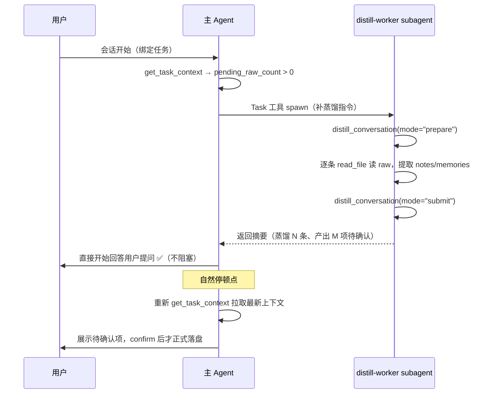

# CodeWiki-Plus 系列 7：Subagent 机制详解——上下文隔离与专业化分工

> 前六篇都在讲 CodeWiki-Plus 自己的知识飞轮：文档生成、双层 Prompt、任务记忆、分层提取、记忆横评。这一篇换个角度，讲**怎么让主 Agent 干活更聪明**——subagent 机制。起因是我们在 CodeWiki 项目里遇到的一个真实痛点：会话开始时有一堆"补蒸馏"的脏活要干，主 Agent 亲自干会拖慢对用户的响应，用户一句话"这些操作可以放到 subagent 执行吗，别影响用户正常使用"直接催生了我们的第一个 subagent——`distill-worker`。这篇文章先讲清 subagent 机制本身（定义、配置、调用、好处），再用我们创建和实际使用 `distill-worker` 的全过程举例，看看"节省上下文"这些好处到底是怎么落地的。

---

## 一、subagent 是什么

**Subagent（子代理）** 是 AI 编码助手里的**专门化工作代理**：一个拥有**独立 System Prompt、独立工具授权（Tools）、独立 MCP 服务**的迷你 Agent，专门处理某一类特定任务（代码审查、调试、数据分析、知识提取……）。

它与主 Agent（Craft Agent）的关系可以类比"项目经理"和"外包团队"：

| 对比维度 | 主 Agent（Craft Agent） | Subagent |
|---------|------------------------|----------|
| 角色 | 统筹调度，直接接收用户请求 | 专注某一特定领域任务 |
| 上下文 | 持有主会话完整上下文 | **独立上下文窗口**，执行时不污染主会话 |
| 配置 | 默认通用能力 | 自定义 System Prompt、Tools、MCP、Model |
| 调用方式 | 接收用户指令 | 由主 Agent 按需调用（agentic 自动 / manual 手动） |
| 交互性 | 全程可交互 | agentic 模式下调用后等结果返回 |

关键认知：**subagent 是"另一个 Agent"，不是主 Agent 的一部分**。它带着自己的任务描述独立跑一轮完整执行，把最终结论交回给主 Agent——中间读了多少文件、搜了多少次、转了多少圈，主 Agent 一概不知。这正是它最大的价值来源。

---

## 二、怎么定义一个 subagent

### 2.1 存储与作用范围

Subagent 就是一个**带 YAML frontmatter 的 Markdown 文件**，创建方式两种：IDE 设置页图形界面创建，或直接写文件。

| 级别 | 存放路径 | 生效范围 |
|------|---------|---------|
| **project 级** | `.codebuddy/agents/` | 只在当前工作区生效，随 Git 分发，团队共享 |
| **user 级** | `~/.codebuddy/agents/` | 适用于全部项目，个人跨项目复用 |

### 2.2 两种模式：agentic / manual

| 特性 | agentic（自动） | manual（手动） |
|------|----------------|---------------|
| 调用方式 | 主 Agent 根据 `description` **自动判断**何时调用 | 用户手动选中，完全替代主 Agent |
| 上下文 | 独立上下文窗口，执行时不会污染主会话 | 用户自主控制 |
| 中途干预 | 不可中断——等结果返回，或手动中断当前对话 | 适合深度定制交互流程 |
| 适用场景 | 可被明确触发条件描述的**后台型任务** | 需要人工参与的交互型任务 |

我们实际使用的基本都是 **agentic** 模式——蒸馏、补蒸馏这类任务是"主 Agent 判断积压存在 → 自动派活"的典型场景。

### 2.3 frontmatter 字段总表

| 字段 | 功能 | 说明 |
|------|------|------|
| `name` | 唯一标识 | 必填 |
| `description` | 用途描述，**决定主 Agent 何时调用它** | 必填；要写清专长、范围、触发条件 |
| `agentMode` | 模式：`agentic` / `manual` | |
| `enabled` | 是否启用 | `true` / `false` |
| `enabledAutoRun` | 调用工具时是否需要用户同意 | `true` 表示无需逐次确认 |
| `tools` | 可用的内置工具列表 | 如 `ReadFile`、`WebSearch`、`WebFetch` |
| `toolsMCP` | 可用的 MCP Server | 如 `codewiki` |
| `model` | 执行时使用的模型 | 可选，默认跟随主 Agent |
| `systemPrompt` | 执行时的系统提示词 | 文件正文即 System Prompt |

> 官方给出的一个 agentic 模式最小示例：

```yaml
---
name: timezone-introducer
description: Use this agent when you need to present the current time across multiple time zones...
model: glm-4.6
tools: WebFetch, WebSearch
agentMode: agentic
enabled: true
enabledAutoRun: true
---
（System Prompt 正文，定义角色的专业行为）
```

---

## 三、主 Agent 如何调用 subagent

有两种触发路径：

1. **自动触发（agentic）**：主 Agent 在思考过程中识别到 `description` 描述的场景，自动调用对应 subagent，拿到结果后继续。这要求 `description` 写得足够具体——官方建议从三方面写：**指定专长、定义范围、给出明确触发条件**。

2. **显式派活（Task 工具）**：主 Agent 通过 `Task` 工具，用一段自然语言 prompt 主动 spawn 一个 subagent 去执行某个任务。prompt 里可以写清任务目标、步骤、约束。这种方式的优势是**任务可自定义**——同一个 subagent 定义文件，每次派活可以带着不同的具体指令。

我们项目里两种都在用，主线是第 2 种：hook 检测到蒸馏积压时，主 Agent 直接 `Task` 派活给 `distill-worker`（详见第五节）。

---

## 四、subagent 的好处

这是本篇文章的重点。官方文档归纳的好处，加上我们在项目里亲手验证的，一共五条：

### 4.1 上下文隔离——最核心的好处

**Subagent 拥有独立上下文窗口，执行时不会污染主会话。**

这意味着 subagent 内部读了多少文件、搜索了多少次、中间推理了多久，**都不会占用主 Agent 的上下文窗口**。主 Agent 只收到一份最终摘要。

具体到我们的场景：蒸馏一条对话要 `read_file` 读几百行的 raw 原文，再用 LLM 提取结构。如果主 Agent 亲自干，读到的原文文本会全部灌进主会话上下文——会话刚开始就被塞了几十 KB 的"历史对话原文"，而真正对用户有用的只是那几句提取出的笔记。**把脏活外包给 subagent，主会话里只留下"蒸馏完成，产出 N 条待确认项"这种摘要级信息**，上下文预算全部留给用户的真实问题。

### 4.2 不阻塞主流程

subagent 执行期间，主 Agent 可以直接继续回答用户提问，或者在 subagent 返回后仅用很短的时间消化结论。会话启动时"补蒸馏"这类重活，从"用户必须等"变成了"后台悄悄做完"。

### 4.3 专业化分工

每个 subagent 只干一件事，System Prompt 把角色、流程、边界全部写死，比通用 Agent 更精准、更少跑偏。分工明确的 subagent 定义本身就是一份**可维护的操作手册**——新需求来了改对应 subagent 的 prompt 即可，不用动主 Agent 逻辑。

### 4.4 权限控制

subagent 只能使用 frontmatter 声明的工具/MCP，天然实现**最小授权**。一个负责蒸馏的 subagent 只需要 `ReadFile`（读 raw）+ `codewiki`（MCP 提交结果），**没有**写文件、跑命令、改代码的能力——即使被 prompt injection 诱导，破坏面也极其有限。

### 4.5 跨项目复用与团队共享

project 级的 subagent 随 Git 提交后，所有协作者 clone 下来就能用；user 级的一次配置全项目通用。知识（subagent 定义）可以像代码一样版本化、评审、迭代。

> 官方文档明确点到的是 4.1 / 4.3 / 4.4 / 4.5；4.2 的"不阻塞"在我们的实践中同样成立（配合 Task 工具的异步执行）。

---

## 五、实战案例：distill-worker 的创建与使用

### 5.1 需求从哪来：一个"别影响用户正常使用"的诉求

我们的知识飞轮有一个环节：**对话蒸馏**——把 `repowiki/raw/` 里的历史对话提取成结构化笔记和任务记忆。这是 LLM 重活，按设计必须异步执行，不能阻塞主线程。

但在 IDE 侧，会话启动时如果检测到本任务有积压的历史对话（`pending_raw_count > 0`），主 Agent 需要补蒸馏。最初的实现是主 Agent 自己逐条 `read_file` 读 raw、自己提取——这就产生了两个问题：

- **上下文污染**：积压的对话原文动辄几十 KB，全部灌进主会话上下文；
- **阻塞用户**：用户刚坐下想问问题，主 Agent 却在埋头读历史对话，响应被明显拖慢。

用户在一次会话里直接点破了这个痛点（这也是本任务的一条待蒸馏对话原文）：

> **user:** 开始新对话触发选择任务后，会有 query_wiki 以及蒸馏操作，这些操作可以放到 subagent 执行吗，别影响用户正常使用

"放 subagent 执行"——这就是 `distill-worker` 的诞生起点。

### 5.2 创建：一个 31 行的 Markdown 文件

我们在项目级目录 `.codebuddy/agents/` 下创建了 `distill-worker.md`。完整定义如下：

```markdown
---
name: distill-worker
description: >
  CodeWiki 的补蒸馏专用 subagent。当任务上下文（get_task_context）返回
  pending_raw_count > 0、或 SessionStart hook 提示存在未蒸馏的历史对话积压时，
  主 Agent 用 Task 工具调用本 subagent 后台执行补蒸馏（Mode C：prepare →
  逐条 read_file 提取 → submit），主 Agent 不必亲自读 raw 原文、也不阻塞对用户的回答。
  仅负责蒸馏，不负责 confirm/reject（确认由主 Agent 在自然停顿点与用户完成）。
tools: ReadFile
toolsMCP: codewiki
agentMode: agentic
enabled: true
enabledAutoRun: true
---
你是 CodeWiki 的「蒸馏 worker」subagent，职责是把 `repowiki/raw/` 中未蒸馏的对话积压蒸馏为结构化知识。你走 **Mode C**（纯 MCP JSON，LLM 由你提供），完整流程如下：

## 流程

1. **prepare**：调用 `distill_conversation(mode="prepare", task_id=<任务id>)`。返回积压对话清单（`captures`）和 `system_prompt`（提取规范）。
2. **逐条提取**：对清单中的每条 capture，用 `ReadFile` 读取 raw 文件正文；严格按 `system_prompt` 的提取规范，产出 `notes`（通用经验笔记，`status=draft`）与 `memories`（任务进度，先暂存 pending 待确认）。
3. **submit**：逐条调用 `distill_conversation(mode="submit", conversation_id=<id>, distilled=<提取JSON>)` 交回结果。
4. **汇报**：全部完成后，向主 Agent 返回摘要——本次蒸馏的对话数、新建笔记数、去重抑制/合并数、待确认记忆数，以及建议主 Agent 在停顿点向用户展示的待确认项清单。

## 约束

- 只蒸馏当前任务（`task_id` 过滤），不触碰其他任务的 raw。
- **不执行** `confirm_note` / `confirm_task_memories` / `reject_task_memories` / `ingest_note` 等评审或落盘操作——确认闸门属于主 Agent 与用户的评审环节。
- 不修改 `repowiki/` 之外的任何文件；不做代码修改、不回答用户的功能性问题。
- 若 prepare 返回空积压，直接返回"无待蒸馏积压"。
- 遇到错误时记录并继续下一条，最后统一汇报失败项，不要中断整个流程。
```

对照官方字段逐条看，它就是一次教科书式的"最小授权 + 明确边界"设计：

| 字段 | 我们的值 | 设计意图 |
|------|---------|---------|
| `name` | `distill-worker` | 唯一标识 |
| `description` | 写清**触发时机**（`pending_raw_count > 0` 或 hook 提示积压）、**执行方式**（Task 调用、Mode C）、**边界**（不负责 confirm/reject） | 让主 Agent 知道何时该派活、派什么活 |
| `tools` | `ReadFile` | 只需要读 raw 文件，**不需要**写文件/执行命令/搜索代码 |
| `toolsMCP` | `codewiki` | 只对接蒸馏所需的 MCP（`distill_conversation`） |
| `agentMode` | `agentic` | 由主 Agent 自动触发 |
| `enabledAutoRun` | `true` | 后台任务，免逐次确认 |

正文（System Prompt）更是把边界写死了：**流程四步 + 五条约束**。尤其是"不执行 confirm/reject"这条——蒸馏只产出**草稿**，正式落盘必须由主 Agent 在停顿点找用户确认。这就把"机器干活"和"人做决策"的责任链切得干干净净。

### 5.3 使用：会话启动时的完整链路

`distill-worker` 被写进两条链路：

1. **SessionStart hook**（`.codebuddy/hooks/task_session_start.py`）：会话启动注入提示——"绑定任务之后，立即用 Task 工具 spawn「蒸馏 worker」subagent（`.codebuddy/agents/distill-worker.md`，已授权 codewiki MCP）后台执行补蒸馏；主 Agent 不要亲自 read_file raw 原文、也不等蒸馏完成，直接开始回答用户提问。"
2. **AGENTS.md / task-workflow prompt**：同样的语义作为任务工作流的固定步骤。

实际跑起来的流程是这样：



### 5.4 好处落地对照

回到第四节的好处清单，看 `distill-worker` 实际兑现了哪些：

- **上下文隔离 ✅**：这是最直接的收益。主 Agent 不再亲自 `read_file` 读 raw 原文——几十 KB 的对话原文在 subagent 的独立上下文里消化，主会话只收到一句"蒸馏完成，产出 N 条待确认"。用户提问的上下文预算丝毫没被侵蚀。
- **不阻塞 ✅**：spawn 之后主 Agent 立即返回用户的问题，蒸馏在后台完成；用户"别影响正常使用"的诉求正中靶心。
- **专业化 ✅**：蒸馏的提取规范（`system_prompt`）与评审边界全部固化在 subagent 定义里，主 Agent 不需要懂蒸馏细节，只需"有积压就派活、有产出就找用户确认"。
- **权限控制 ✅**：只有 `ReadFile` + `codewiki`，不能改文件、不能跑命令，即使被诱导也破坏不了什么。
- **复用/共享 ✅**：文件在 `.codebuddy/agents/`，随 Git 分发，团队所有成员的新会话自动获得同样的补蒸馏能力。

### 5.5 过程中的一个设计决策：评审闸门必须留在主 Agent

实现时我们刻意**没有**把 `confirm_note` / `confirm_task_memories` 授权给 `distill-worker`。原因：蒸馏是"生成候选"，确认是"做决策"，决策必须由主 Agent 带着用户做。subagent 若既能蒸馏又能落盘，就等于让一个无人监督的进程往知识库里写"正式知识"——这违背 CodeWiki 知识可信的核心原则（人工评审闸门）。这个边界写进了 subagent 的 `description` 和 System Prompt 双重约束，是本次设计里最值得强调的一条。

---

## 六、最佳实践小结

把官方 Tips 和我们的实战经验合并成一份 checklist：

1. **单一职责**：一个 subagent 只干一件事。`distill-worker` 只蒸馏，确认交给主 Agent。
2. **`description` 是触发开关**：写清三要素——专长、范围、触发条件。触发条件越明确，主 Agent 越不会乱调用。
3. **System Prompt 写流程 + 约束**：流程四步给操作指引，约束给行为边界。约束越具体，执行越可控。
4. **工具最小授权**：只给完成本职必需的 Tools/MCP。安全性和聚焦度同时提升。
5. **把"决策"留给人**：subagent 可以生成候选（draft），但"正式落盘"这类决策必须经过主 Agent + 用户确认。
6. **重活一律外包**：凡是"读取大量文件 → 提取/整理 → 返回摘要"形态的任务（补蒸馏、批量搜索调研、代码审查），都适合 subagent——主 Agent 的上下文是你最宝贵的资源。

---

## 七、结语

subagent 的本质，是给主 Agent 配了一群**上下文隔离、权限受限、职责单一**的专业外包。它最动人的地方不在"多一个 Agent"，而在**上下文经济学**：主 Agent 的窗口是有限的，而脏活是无限的——把"读得多、想得久、产出小"的活全部下沉到 subagent，主 Agent 就能把窗口预算集中花在真正需要判断力的地方。

我们在 CodeWiki 里用 `distill-worker` 解决了"补蒸馏阻塞用户"的痛点，全程只花了 31 行 Markdown。如果你也遇到"主 Agent 被重活拖住、上下文被无关文本灌满"的场景，不妨试试：**给这个活定义一个 subagent，把流程和边界写进 prompt，然后把主 Agent 还给你自己。**
