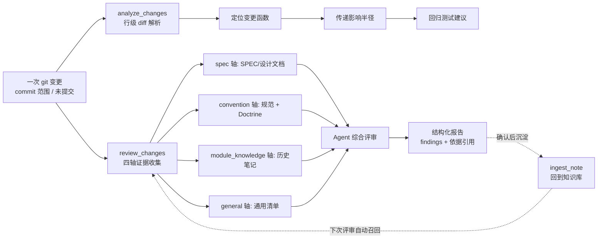

# CodeWiki-Plus 系列 8：你踩过的坑，是你同事的检查单——变更影响分析与四维代码评审

> 系列 5 给知识飞轮装上了传感器，让"该沉淀什么"变得可测；系列 7 讲清了 subagent 的上下文隔离。这一篇把视角从"知识怎么来"转向"知识怎么用"：当知识库里躺着你的编码规范、历史踩坑和团队 Doctrine 时，它们能不能在你改代码的那一刻，自动替你盯着这行改动？我们的答案是：**能。** 做法是给代码变更装上两样东西——一张"影响范围图"回答"我改到了谁"，一台"四维评审仪"回答"我改得对不对"，而评审仪的核心燃料，正是飞轮沉淀下来的经验本身。

---

## 引子：改一行代码，背后有两个问题

每个开发者都经历过这样的时刻：改一个函数的返回值，以为只影响一个调用点，上线后才发现另一个模块在拿它做校验；或者删掉一段"看起来没用"的代码，测试环境炸出一串陌生的失败。修改后的事故复盘里，最常见的两句话是——"我没想到这里会受影响"，和"这里之前约定过不能这么写，但我不知道"。

这两句话对应两个截然不同的问题：

1. **影响范围问题**：这次变更，波及了谁？——这是结构问题，可以由依赖图谱**确定性**地回答；
2. **正确性问题**：这次变更，写得对不对？——这是质量问题，答案藏在你自己的编码规范、模块的历史教训和产品文档里，需要把这些知识**组织起来对照**。

CodeWiki-Plus 对这两个问题的回答，分别是一个工具家族的两条线：`analyze_changes`（影响范围分析）和 `review_changes`（四维代码评审）。它们共用同一个输入——**同一次 git 变更**（提交范围或未提交的工作区改动），在同一套依赖图谱上工作，像体检一样把"改了什么"从头到脚查一遍。

先看全景：

两句话概括这两个工具的分工：**`analyze_changes` 告诉你改动了什么、影响了谁；`review_changes` 告诉你这么改对不对、依据是什么。** 下面分开讲。

---

## 一、第一个问题：我改到了谁——影响范围分析

### 1.1 修改前：动手之前先看水深

影响范围分析的第一种用法发生在**动手之前**。你打算重构某个函数，第一反应不该是直接改，而是问一句：谁在调用它？

`analyze_impact` 回答这个问题。给它一个组件 ID（或文件路径），它从依赖图谱出发做广度遍历，返回这张图：

- **下游依赖者（depended_by）**：哪些函数/模块在直接或间接地调用这个组件，逐层列出，带深度标记——这就是你的改动会波及的"爆炸半径"；
- **上游依赖（depends_on）**：这个组件自身依赖了什么——重构时判断"动它之前需要先理解谁"；
- 遍历方向可切换、深度可限制，还支持返回**最短调用链路径**，让你亲眼看到改动如何从 A 传到 B。

一句话：**修改前的评估是"对指定组件的预判"**——在图纸上推演，而不是在线上验证。

### 1.2 修改后：从 diff 出发，行级定位

改完代码之后，问题变成"这次变更到底碰到了哪些函数"。这不是"改了哪些文件"——一个文件改动 200 行，可能只碰到 3 个函数；反过来，一个 10 行的改动可能横跨 5 个函数。

`analyze_changes` 的做法是**行级 diff 解析**：解析 `git diff` 的每一行增删，把变更行号映射回组件（函数/类）的行号区间，精确定位"哪几个函数被改了"。从这些变更函数出发，再计算传递影响半径，并给出回归测试建议。

它支持两种输入模式：

| 输入 | 含义 | 典型场景 |
|---|---|---|
| `since`（如 `HEAD~1`） | 已提交范围 `git diff <since>..HEAD` | 评审刚提交的一笔改动、准备发 PR 前自查 |
| 留空（工作区模式） | 暂存 + 未暂存 + 新增文件 | 写了一半代码，先看看自己改到了哪里 |

返回结果里，除了变更组件清单和影响半径，还有三个诚实的边界信息：变更行落在函数体外的文件级退化、被删除函数的定位、以及尚未纳入图谱的新增文件提示——**分析不到的地方会明说，而不是假装知道**。

### 1.3 图谱保鲜：分析的前提是图谱不过期

这一切的前提是依赖图谱是新鲜的。CodeWiki-Plus 的图谱由 `analyze_repo` 构建并落 SQLite 缓存，会话间自动加载；`watch_repo` 更进一步——一个后台轮询器盯着文件指纹变化，增量重解析变更文件并热替换图谱，让"改完立刻分析"不依赖手动重建。

---

## 二、第二个问题：我改得对不对——四维代码评审

影响范围分析回答的是"结构正确"，但质量问题的答案不在图谱里。判断一次变更写得好不好，需要把四类依据组织起来逐条对照。这就是 `review_changes` 的四根评审轴：

### 2.1 四个评审轴

**spec 轴——业务正确性**。对照需求文档评审：变更是否覆盖了 SPEC 要求的全部点？有没有顺手做了需求之外的事？实现是否偏离了设计？依据来源有两种：显式传入的 SPEC 路径，或自动发现在 `docs/`、`specs/`、`.scratch/`、`openspec/` 下与变更文件名匹配的设计文档。找不到 SPEC 时工具会明说"仅能评审通用正确性"——不装懂。

**convention 轴——项目工程规范**。从知识库检索编码规范、命名约定、日志约定、错误处理约定等规范类笔记，逐条对照变更是否违反。这一轴的最高优先级依据是**团队 Doctrine**——从历次经验中提炼出的最高层项目原则，恒注入评审上下文。

**module_knowledge 轴——模块的历史教训**。按变更文件所在目录和组件名，检索该模块沉淀过的 pitfall（踩坑记录）、lesson（经验教训）、decision（技术决策）笔记。这是四轴里最特别的一根：**它不是通用规则，而是"这个模块的独家记忆"**——比如"这个文件的排序函数被并发调用过三次，千万别在里面加共享状态"。

**general 轴——通用工程基线**。内置一份语言无关清单（错误处理与资源释放、输入校验、日志、安全、并发、空值与边界、可测试性、向后兼容、性能、代码质量十类），加上按变更文件语言选择的语言专项（Python 的可变默认参数、裸 except、资源上下文管理等）。内置清单是基线，项目可以用一份 `review_checklist.yaml` 覆盖和扩展——同 id 条目覆盖内置，新 id 追加，初始化时由模板自动拷贝到项目里。

### 2.2 轴与轴打架时，听谁的

四类依据难免冲突：SPEC 说这么做，规范说那么写。评审需要一个明确的裁决顺序：

**spec > convention > module_knowledge > general**

SPEC 是业务正确性的硬约束，最高；convention 含团队 Doctrine，是工程原则；历史笔记是提醒——它告诉你"这里以前出过事"；通用清单是保底基线。冲突时不和稀泥，而是**引用双方依据、在报告中如实标注冲突**，把判断权留给看报告的人。

### 2.3 工具形态：确定性收集，推理外置

`review_changes` 的设计遵循 CodeWiki-Plus 一贯的架构原则——**无状态工具 + LLM 外置**。工具自身不持有模型、不做评审判断，只做两件确定性的事：

1. **prepare**：收集评审上下文包——diff 摘要、带行号标注的变更源码切片（变更行以 `>>` 标记）、四轴证据——写入工作区文件；
2. **submit**：校验并归档调用方交回的结构化评审报告。

中间真正的"评审"由调用方的 Agent 完成：拿着上下文包逐轴对照、产出 findings，再交回工具落盘。这个分工的好处是评审质量随调用方能力水涨船高，工具永远只做它擅长的事——确定性组装。

评审报告是可追溯的：每条 finding 带 `axis`（哪个轴）、`severity`（blocker/major/minor/nit 四级）、以及 `rule_ref` 依据引用——来源文件路径加原文摘录。**每一条批评都有出处，这是评审报告和"模型随口一说"的本质区别。**

报告落盘到工作区的 `review_reports/` 目录，跨会话可回看；而有长期价值的发现，走另一条更重要的路——回到知识库，这正是下一节要讲的重点。

---

## 三、重点：让沉淀的经验替团队盯代码

四维评审最反直觉的地方在于：**评审的质量上限，取决于你的知识库沉淀得怎么样，而不是模型聪明不聪明。** 一个没有任何规范笔记、没有任何踩坑记录的项目，review_changes 只能退回通用清单——那是任何代码评审工具都能给的基线；而一个认真运营了知识库的团队，评审时拿到的是一份"带记忆的检查单"。

这套逻辑的完整闭环是这样的。

### 3.1 经验从哪里来：飞轮的产出，就是评审的输入

前几篇系列已经讲清了知识的来源链路：会话摩擦触发沉淀提醒 → 对话蒸馏 → 草稿笔记 → **用户确认闸门** → 正式入库。这条链路产出的笔记类型，恰好一一对应评审轴：

| 笔记类型 | 沉淀内容 | 在评审中的角色 |
|---|---|---|
| pitfall | 踩坑记录：什么场景、什么错误、怎么规避 | module_knowledge 轴的核心燃料 |
| lesson | 经验教训：认知修正、正确做法 | module_knowledge 轴 |
| decision | 技术选型与方案取舍 | module_knowledge 轴 + 冲突裁决依据 |
| 规范类笔记 | 编码规范、命名约定、日志约定 | convention 轴 |
| Doctrine（L3） | 从经验碎片提炼的团队最高原则 | convention 轴的最高优先级 |

注意表格的最后一列：**笔记在评审中的角色不是事后挂接的，而是天生就是评审的依据。** 今天你踩坑后确认入库的一条 pitfall，明天同事改同一个模块时，这条笔记会自动出现在他的评审上下文里，带着"这个模块的历史记忆"审视他的改动。这就是知识飞轮和代码评审的接口：飞轮负责把经验变成可检索的知识，评审负责在正确的时刻把这些知识摆到正确的代码面前。

### 3.2 评审如何召回经验：模块粒度是关键

召回不是全库乱搜。`review_changes` 的 module_knowledge 轴按两个粒度检索：

- **变更文件所在目录**（如 `codewiki/mcp/tools`）——同目录的历史笔记优先；
- **变更命中的组件名**——直接搜函数/类名相关的经验。

命中结果再按笔记的 `related_modules` 字段与变更目录的相关性排序，把"这个模块踩过的坑"排在前面。这种设计的直觉很简单：**经验是有归属的。** "排序函数里的共享状态会出事"这条经验，对改排序函数的人是金句，对改日志工具的人只是噪音。按模块召回，就是让每条经验只在它该出现的评审里出现。

convention 轴则走另一条路线：固定的一组规范查询（编码规范、命名约定、日志约定、错误处理约定、测试约定）加上 Doctrine 全文恒注入。规范是横切所有模块的，所以不按模块过滤，而是每次都完整对照。

### 3.3 评审的产出，回流知识库

闭环的最后一段：评审发现了新问题，怎么办？

评审报告本身**不直接进检索**——它是针对特定一次变更的历史记录，写进工作区供回看。但报告里"值得复用"的发现，走人工确认闸门沉淀为笔记：

- 违反模块约定、重蹈历史覆辙的发现 → `pitfall`；
- 评审过程中做的技术取舍 → `decision`；
- 长期存在的 SPEC 与实现偏离清单 → `known_issue`。

**必须用户确认后才入库，绝不静默落盘**——这是整个体系的一致性承诺：知识库里的每一条内容都经过人的把关，所以 Agent 才敢放心把它当评审依据。一次评审沉淀的教训，下一次评审自动成为检查项。飞轮转一圈，评审就聪明一分。

### 3.4 为什么这套设计对团队格外重要

单人项目里，规范在脑子里、教训在记忆里，代码评审的边际收益有限。**这套机制的价值在团队尺度上才会完全释放：**

- **知识随 git 走**。所有笔记、规范、Doctrine 都在 `repowiki/` 里，clone 即得。新同事第一次评审，拿到的依据和十年老员工完全一样；
- **经验不随人走**。那个"千万别在支付回调里做同步通知"的教训，以前是离职同事带走的知识，现在是一条躺在 `repowiki/notes/` 里的 pitfall，下一个接手的人被它自动提醒；
- **评审标准可追溯**。每条 finding 都有 rule_ref 出处，评审不再是"我觉得"，而是"根据我们 6 月那条决策笔记，这里不该这么做"——**争论从观点之争变成事实之争**；
- **通用基线 + 项目定制**。内置清单保证任何项目都有一份像样的底线，`review_checklist.yaml` 让团队把自家的规矩写成清单。规矩是活的、可版本化的、随代码一起演进的。

---

## 四、怎么用：两条命令串起的日常工作流

日常使用轻得超出预期——两条工具调用，中间夹一段 Agent 的推理，就是一次完整评审：

**第一步：看影响。** 改完代码（或提交前），让 Agent 调一次 `analyze_changes`：这次改动碰到了哪几个函数、传递影响了哪些组件、建议跑哪些回归测试。这是三秒钟的事，换来的是"上线后炸了"的风险前置。

**第二步：做评审。** 让 Agent 调 `review_changes(mode='prepare')` 拿上下文包（可选 `spec_paths` 指定设计文档、可选 `focus` 只跑某一根轴），Agent 对照四轴产出 findings，再 `submit` 落盘。需要沉淀的发现，用户点头后 `ingest_note` 入库。

**第三步：什么都不做。** 从下一次变更开始，今天沉淀的笔记会自动出现在评审上下文里。

两个工具的边界一句话分清：**`analyze_changes` 回答"影响了谁"，`review_changes` 回答"写得好不好"**；改某个函数之前单独评估，用 `analyze_impact`；文档和代码是否一致，那是 `lint_wiki` 的活。各司其职，互不膨胀。

---

## 五、使用举例：一次变更的完整体检

用一个场景串起来。**下午三点，小李改完了支付模块的退款重试逻辑**——改了 `refund_retry` 函数的循环边界，顺手加了个缓存字段，总共 40 行，横跨 3 个函数。

他让 Agent 跑 `analyze_changes`。三秒钟后：变更命中了 `refund_retry`、`build_refund_request`、`RefundRecord` 三个组件；传递影响半径显示 12 个下游组件，其中 `webhook_notify` 模块直接依赖退款状态字段——**他加的那个缓存字段，恰恰是 webhook 通知的判断条件**；回归测试建议指向 `tests/test_refund.py`。小李意识到这个改动比想象的大，顺手把 webhook 模块的负责人拉进了评审。

接着跑 `review_changes`。评审上下文包里，四轴证据自动就位：

- **spec 轴**：自动发现命中了 `docs/specs/refund-retry-spec.md`，其中明确写着"重试间隔指数退避、上限 5 次"——小李的循环边界改成了固定间隔，被发现；
- **module_knowledge 轴**：召回了两条笔记。一条是三个月前同事踩的坑《退款重试勿在循环内做网络请求》——小李的改动里循环体正好加了一次 RPC 调用，重蹈覆辙；另一条是团队 decision《退款状态机 v2 与 webhook 通知的时序约定》，提示新缓存字段需要同步更新状态机文档；
- **convention 轴**：团队 Doctrine 里有"状态变更必须先写日志再变更"的原则，而小李的新字段写入没有日志，违反约定；
- **general 轴**：通用清单提醒缓存字段缺少失效策略，是潜在的一致性问题。

Agent 按四轴产出 6 条 findings，每一条带着依据出处。小李修正了固定间隔和 RPC 调用，补了日志，把缓存失效策略和 webhook 团队对齐。评审报告落盘，其中两条通用教训（"循环内禁止网络请求"的团队约定）经他确认后沉淀为 pitfall——**下个月新同事改退款模块时，这条经验会自动替他盯着。**

---

## 六、收尾：从"改完再想"到"改前已知"

用一张表回顾这次上线的两个工具：

| 业务问题 | 工具 | 机制 | 拿到什么 |
|---|---|---|---|
| 改了谁、影响多大 | `analyze_changes` | 行级 diff → 变更函数定位 → 传递影响半径 | 爆炸半径前置可见 |
| 该测什么 | `analyze_changes` 附带 | 命名约定启发式 + 影响面匹配 | 回归测试建议 |
| 改前预判 | `analyze_impact` | 指定组件图遍历 | 动手前的水深 |
| 是否符合需求 | `review_changes` spec 轴 | SPEC 显式传入 / 自动发现 | 缺失、超范围、偏离可见 |
| 是否符合规范 | `review_changes` convention 轴 | 规范笔记 + Doctrine 恒注入 | 工程原则被自动执行 |
| 是否重蹈覆辙 | `review_changes` module_knowledge 轴 | 按模块召回历史 pitfall/lesson | 团队的坑不再踩第二遍 |
| 是否有通用问题 | `review_changes` general 轴 | 内置清单 + 项目模板扩展 | 任何项目都有像样的底线 |
| 评审结论是否可信 | 报告 rule_ref | 每条 finding 带依据出处 | 批评可追溯，争论有事实 |

回头看，这一篇和系列 5 其实是同一件事的两面：**传感器让知识飞轮知道该沉淀什么，评审仪让知识飞轮知道该输出什么。** 沉淀的经验在改代码的那一刻被自动摆到正确的代码面前——这就是知识库从"档案室"变成"评审席"的分水岭。

CodeWiki-Plus 的价值主张可以一句话概括：**让团队的每一次踩坑、每一条规范、每一个决策，都成为下一次改代码时的自动检查项。** 影响范围分析让修改的风险可见，四维评审让修改的质量有据可依，而驱动这一切的，是你们自己沉淀的知识。

下一篇，我们聊聊评审报告积累之后的新课题：当一次次的评审发现开始堆积，如何把它们治理成一份"活的团队代码公约"——评审数据如何反哺规范本身的演进。敬请期待。

---

*本文基于 CodeWiki-Plus 当前实现撰写，相关工具：`analyze_changes`（行级 diff 影响分析，`codewiki/mcp/tools/change_analysis.py`）、`analyze_impact`（修改前组件级评估）、`watch_repo`（图谱后台保鲜）、`review_changes`（四维评审证据组装，`codewiki/mcp/tools/review_changes.py`）、`review_checklist`（通用清单与项目覆盖合并，`codewiki/mcp/tools/review_checklist.py` + 模板 `codewiki/templates/review_checklist.yaml`）、`ingest_note` / `query_wiki`（知识沉淀与检索闭环）。设计文档见 `docs/变更评审与代码审查增强设计方案.md`。评审工具测试基线 28 passed。*
