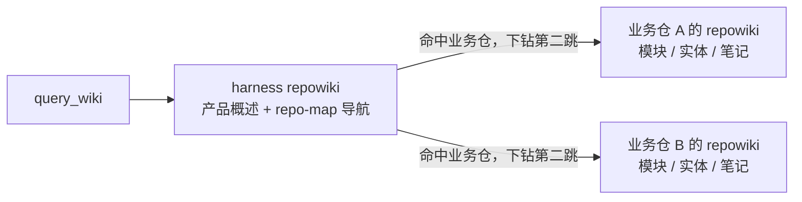

# CodeWiki-Plus 系列 9：仓库多了，知识该放哪——Harness 工作区与 Wiki 的两种布局

> 前八篇系列都围绕一个仓库打转：建飞轮、分层记忆、蒸馏经验、用评审盯住变更。但知识不止于业务代码的边界——Agent 的技能、编码规范、架构决策、协作协议，这些"怎么干活"的资产不属于业务代码，塞进业务仓就是污染；仓库多了更是无处安放。这一篇讲 CodeWiki-Plus 对这个问题的完整回答：**Harness 工作区**模型，以及在它之上长出来的两种知识布局——**同仓演进（colocated）**与**集中式（centralized）**。先说一句容易误解的：这套答案不是多仓专属——哪怕只有一个业务仓，它也成立。同一副骨架，两种布局，初始化时一次选择，此后一切自动路由。

---

## 引子：被撕成 N 份的产品线

做过产品线的开发者都熟悉这种尴尬。产品由三四个关联仓库组成：核心工具链、配套的 Web 应用、文档站，也许还有一两个服务端。代码按仓库切开了，但知识切不开——产品级的架构决策、跨仓接口约定、全线统一的编码规范、Agent 该怎么干活的协作协议，这些东西不属于任何一个仓库，却跟每一个仓库都有关。

常见的安身之所有三个，各有各的问题：

| 组织方式 | 问题 |
|------|------|
| 全部塞进一个"大仓"（monorepo） | 仓库越来越大、权限难隔离、各业务提交互相牵连 |
| 各自独立仓库、互不关联 | 缺少一个"产品级"入口来承载跨仓约定、产品知识、一键初始化 |
| 放在业务仓 | 该业务仓被污染：上游同步冲突、提交历史混杂，其他仓无法独立复用 |

三条路的共同根因是同一个：**代码可以按仓库切开，"怎么干活"的知识切不开。** 它需要一个既不属于任何业务仓、又能被所有业务仓共享的家。而且注意——这个需求不是多仓专属：**哪怕只有一个业务仓**，你同样不希望 Agent 的技能、规则、约定、wiki 这些基础设施和业务代码挤在同一个仓库里。业务仓就该只放业务代码。

CodeWiki-Plus 的回答是 **Harness 工作区**：建一个独立的 harness 主仓库承载产品级资产与"怎么干活"，业务代码仓以独立 git clone 的形式挂在它的子目录下，git 层面完全隔离——**目录上是父子，git 上是邻居**。在这副骨架之上又长出了知识落点的两种布局。故事从头讲起。

---

## 一、候选方案盘点：先排除错误答案

"多仓怎么组织"不是新问题，现成的答案很多。在讲 harness 模型之前，值得先把这些候选盘一遍——它们落选都不是能力问题，而是与诉求不匹配。本项目的诉求可以浓缩成四条：**harness 不入业务仓、提交不打架、分支松耦合、跨仓知识能分层检索。**

**git submodule——钉快照的利器，活跃开发的负担。** submodule 在父仓里只存两样东西：指向子仓某个 commit 的指针和 `.gitmodules` 配置。它擅长的是**钉版本组合**，不是日常开发：子仓永远 detached HEAD 在某个历史 commit 上，改动要先切分支、提交后先 push 子仓再回父仓 bump 指针，顺序错了父仓就引用一个远端不存在的 SHA。"父仓把子仓钉死在某个版本"与"分支松耦合"的诉求**直接相反**——它带来的只有指针负担。submodule 真正的舞台是**发布版本组合锁定**：v2.3 = 前端@abc123 + 后端@def456 这样一组可复现的 commit，"钉住"本身就是需求的场合。

**repo / meta / gitslave 等批量工具——为大团队同进同退而生。** `repo` 为 AOSP/Gerrit 生态而生，核心价值是批量同步、跨仓开同名分支、manifest 版本组合管理。落选有三个原因：一是评审闭环断裂——`repo upload` 走 Gerrit，不认 GitHub PR，引入它之后最后一公里仍要逐仓提 PR，体验只顺了一半；二是它解决的问题（几十人并行、批量操作一致性）在十人规模的团队里收益低于迁移与培训成本；三是"各仓分支互不感知"恰恰是本模型的诉求，与批量工具"同进同退"的设计取向背道而驰。它的舞台是几十人的团队、跨仓需求占比超三成、用 Gerrit 的场合。

**朴素脚本工作区——它不是候选，它是底座。** 一个产品根目录下放各仓的普通 clone，配一个几十行的批量 status/pull/checkout 脚本。零依赖、零学习成本，出了问题都是普通 git 问题。单人或两三人的团队、没有产品级知识沉淀需求时，**纯脚本工作区就已经够用，不必引入 harness 仓**。只有当"跨仓约定要有归属地、产品级知识要版本化共享、Agent 要有统一检索入口"这些诉求冒出来，才升级到 harness 模型——升级是平滑叠加，不是推倒重来。

还有一个曾经讨论过又被否决的变体，值得单独一提，因为它是后文集中式布局的直接前身：**把子仓的代码 wiki 集中生成到 harness 仓**，换取业务仓"纯净"。这个方案违反了 **one .git = one repowiki** 原则，四笔代价都不便宜：一是**漂移**——harness 里的 wiki 描述的是生成那一刻的子仓快照，子仓天天前进，wiki 立刻过时；二是**分支错配**——子仓个人分支上生成的 wiki，会随 harness 的固定分支共享给全团队，描述的是别人拉不到的代码状态；三是**检索分层稀释**——产品级索引混入上千条组件级模块文档，第一跳噪音陡增；四是 **lint 失配**——harness 的质量检查对着不存在的代码报警。这次否决被完整记在了设计文档里，也成为第四节那个问题的伏笔。

**选型速查只需要数两个数**：上月跨仓需求占比、团队规模。联动开发不足一成或团队三五人、**且没有知识沉淀需求**，纯脚本工作区够用；占比超三成、团队十几人以上且用 Gerrit，考虑 repo；需要版本组合快照，submodule 补位；需要产品级知识分层与 Agent 检索入口——进入下一节。给第一条加个注脚："纯脚本工作区够用"的前提，是你愿意把 skill、wiki、约定这些资产放进业务仓（或干脆不用它们）。一旦开始认真做 Agent 协作与知识沉淀，哪怕只有一个业务仓，也值得引入 harness——这正是下一节的主题。

---

## 二、Harness 模型：目录上是父子，git 上是隔离

Harness 工作区的结构一眼就能看懂：

```
CodeWiki-Plus-Harness/          ← harness 主仓库（独立 git，提交稳定）
├── .codebuddy/                 ← 项目级 Skill / Rule / Agent / Hooks / Command 等工具资产
├── repowiki/                   ← 产品级 Wiki：产品概述、各仓业务概述、仓库导航
│   └── wiki/repo-map.md        ← 仓库导航页（检索入口）
├── AGENTS.md                   ← Agent 工作约定（检索路由、提交纪律）
├── bootstrap.ps1 / .sh         ← 一键初始化：克隆全部业务子仓
├── codewiki-plus/              ← 业务仓 1（独立 clone，harness 的 git 不追踪）
├── webapp/                     ← 业务仓 2（独立 clone）
└── ...
```

harness 仓只存"怎么干活"：产品级知识（repowiki）、跨仓协作约定（AGENTS.md）、基础设施脚本（bootstrap）——**不存放任何业务仓的内部实现细节**。业务仓依旧是纯代码，可以干净地跟随上游：fetch、rebase、提 PR，提交历史里只有业务变更，CI 和代码评审不受任何产品级资产干扰。

这套结构靠三个结构性机制撑住，而且它们的设计哲学高度一致——**防错靠结构，不靠人的自觉**：

1. **git 隔离（`.gitignore` 红线）**。每个业务仓带自己的 `.git`，harness 仓通过 `.gitignore` 显式排除所有业务仓目录，业务代码**物理上无法**被提交进 harness 仓。新增业务仓必须登记 `/<目录>/` 条目，否则 `git add .` 会把业务仓作为裸 gitlink 误提交——所以登记是强制的，不依赖任何人记得。
2. **提交纪律**。业务代码只在业务仓内提交，harness 仓只提交 harness 资产。两条提交历史永不交汇。
3. **分支松耦合**。各业务仓自由选择主线或个人开发分支，harness 仓分支固定、互不感知、无需同步。有人在业务仓上开个人分支做实验，不影响任何人；产品级知识始终在 harness 的固定分支上团队共享。

这套模型的好处可以串成一句话：**它给了产品级知识一个不污染任何业务仓的家。** 业务仓保持纯净可跟随上游；一个 harness 仓一对多管理整条产品线，`bootstrap` 脚本一键克隆全部业务仓；Agent 的 skill、rule、command 等"怎么干活"的资产属于产品线而非某个业务仓，跨仓复用、统一演进；跨仓分析的产物（工作区总览、跨服务调用拓扑）也直接落入 harness 的 repowiki，与产品级知识同库可检索。

值得多强调一句：**harness 不是多仓的专利。** 哪怕产品线上只有一个业务仓，这套模型同样成立——价值只是从"协同"变成了"隔离"：业务仓里只有业务代码，`.codebuddy` 里的 skill、rule、command，AGENTS.md，产品级 wiki，这些协作基础设施全部住在 harness 里，业务仓不必为它们腾地方；提交历史干净，跟随上游无负担，未来长出第二个仓时结构现成，无需重构。判断要不要上 harness，标准从来不是"有几个仓"，而是"怎么干活的资产，你想让它住在哪"。

---

## 三、同仓演进：第一版答案与两跳检索

骨架立起来了，知识怎么分层？v5.5.0 给出的第一版答案有一条核心信条：**wiki 与它描述的代码同仓演进。**

产品概述、跨仓约定、仓库导航放 harness 的 repowiki；每个业务仓维护**自己的** repowiki，模块文档、实体、踩坑笔记都跟代码在同一个仓库里提交、评审、演进。检索因此是**两跳**：



第一跳查 harness，得到产品概述与仓库导航；命中哪个业务仓，第二跳就下钻到那个仓自己的 repowiki。为什么坚持同仓？因为代码和描述它的文档在同一个 git 历史里，才能一起提交、一起评审、一起回溯——改了接口顺手改文档，一次 commit 说清一件事；增量更新工具也依赖"仓库与文档同仓绑定"才能闭环。

模型落地成三个开箱即用的 MCP 工具，外加配套的工作流 Prompt：

**`init_workspace`**——把当前目录初始化为工作区，只建骨架不登记仓库：幂等的 bootstrap 脚本、`.gitignore`、仓库导航骨架、AGENTS.md 约定块、产品级 repowiki 模板。重跑不覆盖已有内容。

**`add_workspace_repo`**——接新业务仓只需传一个克隆 URL，目录名自动从 URL 推导。它做的是**事务式同步四处**：两个 bootstrap 脚本的登记表、`.gitignore`、仓库导航页——预检全部通过才动笔，不会出现"改了一半"的中间态。克隆失败只警告、不回滚登记，稍后跑一遍 `bootstrap` 即可补克隆。

**`remove_workspace_repo`**——按目录名移除业务仓，同样事务式清理四处登记，默认保留本地目录。未登记的名字是安全错误，不影响其他仓。

一个容易忽略但很实用的细节：**存量的手工工作区可以直接被接管。** 此前手工搭的 harness（手写 bootstrap 脚本、`.gitignore`、导航页）不需要迁移——工具以自然语法锚点定位登记表，直接调 `add_workspace_repo` 就能把手工登记的仓库补全接管，后续维护统一走工具。

典型流程五步走：

```text
1. init_workspace                              # 建骨架
2. 对每个业务仓 add_workspace_repo(url=...)     # 登记 + 克隆
3. 对每个业务仓 init_wiki / analyze_repo        # 建仓库级 Wiki
4. analyze_workspace(...)                       # 跨仓分析 → 工作区总览
5. 日常检索：先查产品级，命中后下钻仓库级（两跳）
```

到这里，多仓产品线的知识有了归属，检索有了路由，防错有了结构。看起来故事可以结束了——但第二版设计要回答的，恰恰是"这条信条不是对每个人都成立"。

---

## 四、第二种声音：不是每个团队都想要"同仓演进"

同仓演进跑了一段时间后，来自不同产品线的需求里冒出了第二种声音：

- 有些团队更看重**统一、可集中检索的知识库**——他们希望产品级与全部业务仓的知识落在同一个库里，一跳直达，而不是两跳换乘；
- 关联业务仓共享同一套领域词汇，**同名实体在各仓含义一致**——按仓切片等于把一张完整的词汇表撕成碎片；
- 同仓演进是有成本的：提交归属（文档和代码混在同一个提交历史里）、上游同步（业务仓紧跟上游时，夹带 wiki 的同步是额外负担）——**这些成本不是每个团队都愿意承担**。

v5.6 的设计（已定稿、尚待评审）没有推翻 harness 模型，而是在它之上引入**第二种布局模式——集中式（centralized）**：所有知识，产品级的和各业务仓的，统一落入 harness 的 repowiki；业务仓目录里不再存在 repowiki，变成纯代码。

两种布局在 `init_workspace` 时通过一个 `layout` 参数**一次性选择**，此后登记、建仓、分析、检索、写入全部按模式自动路由。命名取 `colocated`（同仓）与 `centralized`（集中）而非别的词，是因为这对词精确刻画了本质区别——**wiki 是与代码同处，还是集中于父仓**——并且与"两跳/一跳"的检索语义自然对应。最关键的一句承诺是：**集中式不改变三大结构性机制**——git 隔离、提交纪律、分支松耦合原样保留，改变的只是知识产物的落点。集中式不是回到大仓：目录上仍是父子、git 上仍隔离，业务仓依旧纯代码、可独立跟随上游。

| 维度 | `colocated`（默认） | `centralized` |
|------|---------------------|----------------|
| Wiki 落点 | 各业务仓自己的 `repowiki/` | 全部汇入 harness 的 `repowiki/` |
| 业务仓目录 | 含 `repowiki/` | 纯代码，无 `repowiki/` |
| 检索跳数 | 两跳（产品级 → 仓库级） | 一跳（整个库，可按仓过滤） |
| 提交归属 | wiki 随业务仓提交 | wiki 随 harness 仓提交 |
| 移除业务仓 | 业务仓目录带走自身知识 | 删分区目录 + 清共享池来源标 |
| 兼容性 | 完全等同 v5.5.0 | 新增模式，需显式选择 |

这里必须诚实回答第一节的伏笔：当初不是用四笔代价否决了"集中生成"吗，怎么现在又行了？当初被否决的方案，目的其实和集中式一样——换取业务仓"纯净"，区别在两层。**第一层是身份**：当初那是一条不被工具链支持的跨仓生成路径——`analyze_repo` 的增量更新依赖"仓库与输出目录同仓绑定"，跨仓生成后更新闭环直接断裂，harness 的 lint 还会对着不存在的代码报警；集中式则把这副落点做成了**一等公民的布局**，登记、建仓、分析、检索、写入、lint 全部按模式路由，断裂的闭环在工具层修复。**第二层是态度**：对工具层修不掉的代价——wiki 不随业务仓代码同仓演进带来的漂移与分支错配——当初的方案是默默承受，集中式把它变成团队在初始化时的**显式取舍**：接受"文档不与代码同仓"，换取一跳检索、统一词汇与业务仓的绝对纯净，再用新鲜度机制暴露过时、来源标注保持可溯。一句话：**代价没有消失，而是从"默默承受"变成了"显式选择、机制管理"**。

---

## 五、切线艺术：只有 modules 按仓分区

集中式把全部知识收进同一个 repowiki，立刻撞上一个核心设计问题：**哪些东西按仓隔离，哪些进共享池？** 切错了，要么是词汇表被撕碎，要么是仓库间的知识互相污染。定稿的切线规则一句话就能说清：

> **只有 `modules` 按仓分区；其余所有页型（`sources`/`entities`/`concepts`/`notes`/`comparisons`/`queries`）一律进共享池，用 frontmatter 的 `repo:`/`repos:` 标注来源。**

目录结构长这样：

```
repowiki/                        ← 唯一知识库，随 harness 仓提交
├── .meta/workspace.json         ← 布局配置（唯一新增的机器可读文件）
├── wiki/
│   ├── overview.md              ← 工作区总览 + 跨服务拓扑
│   ├── repo-map.md              ← 仓库导航页（一跳检索的索引）
│   ├── modules/                 ← ★ 唯一按仓分区
│   │   ├── codewiki-plus/
│   │   └── webapp/
│   ├── sources/                 ← 共享池，标来源
│   ├── entities/                ← 共享池，标来源
│   ├── concepts/  comparisons/  queries/
├── notes/                       ← 共享笔记池
├── tasks/  raw/  conversations/ ← 共享运行时（第七节细讲）
```

为什么这样切？看页型的本质就知道：`modules` 是**唯一"锚定代码结构"的页型**——一页对应一段仓内目录树，它描述哪段代码、结构如何，天然必须按仓隔离，所以落 `wiki/modules/<仓名>/`。其余页型都是"命名对象"或"经验知识"：一个实体、一条概念、一次踩坑。在关联业务仓共享领域词汇的前提下——两个仓里的 `Task` 就是同一个 `Task`——它们属于产品线级的共享层，按仓切片只会制造重复与割裂。**一张产品线词汇表，不该被撕成 N 份。**

`sources`（代码引用页）的归属纠结过最久：它毕竟锚定文件路径，而两个仓完全可能都有 `src/config.py`。最终仍选择不分区——引用的价值在"这份引用说明了什么"，不在路径本身。同名冲突靠**来源标注 + 页名规范**解决（页名携带仓前缀，或由 `repo:` 字段消歧），检索按 `repo=` 过滤。不为个例冲突引入目录隔离，换来的是切线规则的极简——整条规则一句话就能背下来。

还有一个"减法"决策：**平铺分区，不设 `repos/` 中间层。** 早期草案曾设计 `repowiki/repos/<仓名>/wiki/modules/` 的"仓包"结构，定稿改成了平铺的 `wiki/modules/<仓名>/`。理由很直白：真正需要按仓隔离的只有 `modules` 一个页型，为它单开一层 `repos/<仓名>/wiki/` 属于"wiki 里再套 wiki"；平铺后整棵树只有一个 `wiki/`，共享层与隔离层同处一套命名空间，心智模型最简单。代价是移除业务仓时没有一个"仓包"可以整体搬走——删一个分区目录、清一批共享池来源标，代价很小。

最后是共享池的**写入冲突策略**。分析仓 A 产出一个 `Task.md` 实体，之后分析仓 B 也产出 `Task.md`，怎么办？定稿的策略干脆利落：**直写共享池，后写覆盖；但 frontmatter 的 `repos:` 来源只增不减**——正文可以是新版，来源账本累积记录"哪些仓产出过这个实体"。"薄的再分析覆盖厚的旧版本"的风险确实存在，但不做写入时拦截，交给新鲜度机制（`stale_after` + 新鲜度检查）去暴露。这里刻意没有选两段式晋升（分析产物先落暂存区、人工确认后才晋升共享池）：那等于给每个实体加一道人工闸，把集中式的自动化红利吃光了。

---

## 六、从两跳到一跳：检索红利与"范围"模型

集中式最大的红利是检索：**一跳。** `query_wiki` 直接检索工作区唯一的 repowiki，产品级知识与全部业务仓一次覆盖；`repo-map.md` 仍是导航页，但角色从"第二跳入口"变成"仓清单与分区索引"。

但"查所有"不是正确答案。改仓库 X 的代码时，你真正需要的检索范围是"**适用于 X 的知识**"——只查该仓会漏掉产品线全局约定，查所有会被其他仓的无关内容淹没。于是检索增加了一个 `repo=` 参数，它的语义值得仔细咂摸：

| frontmatter | 范围 | 例子 |
|-------------|------|-----|
| 无 `repo:`/`repos:` | 产品线全局，对所有仓生效 | "全线统一用 ruff 做格式化器" |
| `repo: X` | 仅适用于仓 X | "codewiki-plus 必须 `uv sync --frozen`" |
| `repos: [a, b]` | 适用于指定多仓 | 两仓之间的接口约定 |

`repo=X` 返回的是：`wiki/modules/X/` 分区 + `repo:`/`repos:` **包含** X 的共享池页 + **所有无范围标的全局页**。第三类是关键：产品线级知识——跨仓编码规范、全局架构决策——对每个仓都生效，改仓 X 时漏掉全局项就等于漏掉约定。**"适用于该仓"＝"带该仓标"∪"全局"**，这正是"在 X 上干活"需要的完整范围。

`output_dir` 和 `repo=` 的分工也值得说清，两者并不冗余：`output_dir` 是**目录级定位**，指向 `wiki/modules/<名>/` 就只查该仓的 modules 分区，轻量场景用它即可；但它是单一路径，聚不拢"该仓分区 + 适用于该仓的共享池知识"这些分散在不同目录的内容——`repo=` 补的正是这个缺口。一句话：**只要 modules 用 `output_dir`，要"适用于该仓的全部"用 `repo=`。**

规范和决策则有两个载体，分工互补：**AGENTS.md 管"始终生效"**——harness 的 AGENTS.md 承载产品线约定，业务仓的 AGENTS.md 承载仓内约定，在对应目录工作时自动加载进上下文，无需查询；**共享池管"可查可溯"**——decision、note 类沉淀供按需深挖（"当初为什么选 ruff？""这个坑的来龙去脉？"），还享有采纳统计与新鲜度机制。所以改仓 X 时，规范本身已经在上下文里，`query_wiki(repo=X)` 负责捞更深的决策依据与历史脉络。

---

## 七、工程落地：让切换便宜，让不切换不受影响

布局是架构级选择，但落地必须做到两件事：选的人成本低，不选的人零感知。几个关键设计都围着这两件事转。

**配置只落一个标量。** 集中式唯一新增的机器可读文件是 `repowiki/.meta/workspace.json`，内容只有一行：`{ "wiki_layout": "centralized" }`。仓库清单不进这个文件——bootstrap 登记表仍是唯一事实源；布局也不设逐仓覆盖——它是工作区级的单一选择，不给路由逻辑留分叉的余地。

**探测加四道护栏。** 每个工具解析输出路径前，会像 git 找 `.git` 一样向上探测 `workspace.json`，四道护栏保证单库场景零影响：探测信号**只认** `workspace.json`（普通目录找不到就回退）；命中后必须**成员校验**——当前仓目录名要在登记表里，防止手动 clone 进工作区的无关仓库被劫持到集中路由；**三态回退**——没找到、找到但非成员、值为 `colocated`，一律走现状路径，行为与 v5.5.0 逐字节一致；探测结果**进程内缓存**，深嵌套目录不付反复遍历的性能税。

**运行时数据不按仓分片。** 任务记忆（`tasks/`）、对话蒸馏原料（`raw/`）、蒸馏归档（`conversations/`）一律落在工作区根。理由很简单：**任务与会话天然是工作区尺度的**——一个任务完全可能横跨两个业务仓，一条对话也可能同时涉及多仓，按仓分片只会制造"这条对话算哪个仓"这种没有好答案的问题。实现成本也低：这些路径本来就是"根 + 固定相对常量"，把根路由到工作区根，整套数据自动跟随，一行路径常量不用改。

**逐仓生成天然并行。** 集中模式下为每个仓生成 modules 是重活，好在它天然适合并行：`wiki/modules/<仓名>/` 按仓分区、目录互不相交，多个 subagent 各写各的，零冲突；分析缓存库已是 WAL 模式，容忍多进程读写；唯一需要保护的是共享池同名页的来源累积——那是读改写操作，用一把跨平台文件锁（Unix 的 `fcntl.flock`、Windows 的 `msvcrt.locking`）包住即可。配套的 `analyze_workspace` 新增 `generate_repo_wikis` 开关且**默认关闭**：跨仓拓扑分析总是执行，逐仓深度生成是重活，必须显式选择——**不顺手做重活**，是这套工具一貫的纪律。

**兼容性是硬承诺。** 三句话说完：单库场景（从没跑过 `init_workspace` 的独立仓库）完全不受影响，探测找不到配置即回退；不传 `layout` 的 `init_workspace` 与 v5.5.0 逐字节一致，存量工作区零感知；v1 不提供自动迁移工具——存量工作区想转集中式，按文档化的手工步骤走，把选择权和风险都交给用户。**默认值即兼容**，这是整个方案敢叫"零破坏"的底气。

---

## 八、怎么选：一张速查表

| 你的处境 | 选择 |
|------|------|
| 单人或两三人，无知识沉淀需求，Agent 资产放业务仓也无所谓 | 朴素脚本工作区（N 个 clone + 批量脚本） |
| 一个或多个业务仓，想把技能、约定、产品级知识请出代码仓；仓库级 wiki 接受随代码演进 | Harness + `colocated`（默认） |
| 业务仓要绝对纯净——连仓库级 wiki 都不进业务仓；或业务仓共享词汇、要一跳统一检索 | Harness + `centralized` |
| 几十人团队，跨仓需求超三成，Gerrit 评审流 | repo 等批量工具 |
| 需要锁定发布的版本组合（可复现的一组 commit） | submodule |

模型和布局都没有高下，只有匹配。判断的支点是三个问题：第一，**你想不想让业务仓只装业务代码**——技能、wiki、约定一概不进？想，那么哪怕只有一个仓也需要 harness；第二，业务仓是否共享同一套领域词汇；第三，团队愿意为同仓演进承担提交归属与上游同步的成本吗？第二问答"是"、第三问答"否"，集中式就是你的菜；反之，同仓演进不会错。

---

## 收尾：让布局成为选择，而不是信条

回头看这一篇解决的所有问题：

| 问题 | 答案 |
|------|------|
| 产品级知识没有归属地 | Harness 主仓：承载约定、导航与跨仓分析 |
| 协作基础设施污染业务仓 | 业务仓只放业务代码，技能、wiki、约定住进 harness——不分仓数 |
| 业务代码可能误入产品仓 | 三大结构性机制：`.gitignore` 红线 + 提交纪律 + 分支松耦合 |
| 接一个新仓要手改四个文件 | `add_workspace_repo`：事务式同步四处 |
| 两跳检索不够直接 | 集中式布局：一跳检索 + `repo=` 范围过滤 |
| 词汇表被按仓撕碎 | 共享池 + `repo:`/`repos:` 来源标，只有 modules 分区 |
| 老用户会不会被破坏 | 默认 `colocated` + 三态回退，单库零影响 |

Harness 工作区给了产品线知识一个不污染任何业务仓的家；两种布局则把"知识该放哪"从一个信条变成了一个配置项——**初始化时选择，此后自动路由，默认永远零破坏**。工具只做确定性的路由与落盘，"哪种布局适合我的产品线"这个判断，始终留在团队手里。

按上一篇的承诺，接下来本该讲评审报告的治理：当一次次评审的发现开始堆积，如何把它们治理成一份"活的团队代码公约"。这个选题继续有效——只是这一篇插了队，因为工作区布局是飞轮一切机制跑起来的地基：检索、沉淀、评审，都发生在某一种布局里。地基讲清楚，治理的故事才有的放矢。下一篇见。

---

*本文基于两份设计文档撰写：《多仓Harness工作区-管理模型与MCP工具》（v5.5.0，已落地，含 `init_workspace` / `add_workspace_repo` / `remove_workspace_repo` 三个 MCP 工具与配套工作流 Prompt）、《多仓Harness工作区-集中式Wiki布局设计方案》（v5.6.0，设计定稿（待评审），含 `layout` 参数、`repo=` 检索过滤与共享池路由）。两文均位于 `docs/` 目录，决策记录与兼容性细节以原文为准。*
