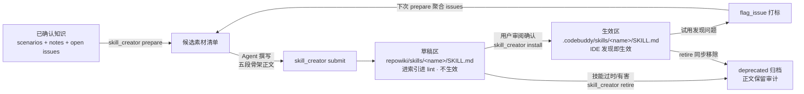

# skill-creator 使用指南：把团队经验编译成 IDE 可触发的技能

> 对应实现：`skill_creator` 四 mode（issues #24-#28，commits b12e98c/3db4827/64fb95e/e08dae6/c1beee9）·
> 设计文档：[skill-creator需求与设计方案](skill-creator需求与设计方案.md) · 架构决策：[ADR-0004](adr/0004-skill-scenario-split-two-zone-gate.md)
>
> 适用版本：CodeWiki v5.7+（codewiki MCP 49 工具）

## 这是什么

你在项目里沉淀了大量经验——CodeWiki 的知识管线已经把这些经验蒸馏成笔记（notes）、聚合为场景块（scenarios）。但这些都是**检索知识**：只有当 Agent 主动 `query_wiki` 时才被查阅，记不记得查、查没查到，全看缘分。

`skill_creator` 把这些已确认知识再往前推一步：**编译成 SKILL.md 行为指令**。技能文件放在 IDE 的技能发现目录里，宿主（CodeBuddy / Claude Code / Codex 等）在每次会话中按 description 自动判断是否加载——经验从"被动等人查"变成"主动改变 Agent 行为"。

一句话区分：

| | scenario（场景块） | skill（技能） |
|---|---|---|
| 本质 | 检索知识 | 行为指令 |
| 消费方 | Agent 主动 `query_wiki` 查阅 | 宿主 IDE 按 description 自动触发 |
| 生成工具 | `consolidate_notes` | `skill_creator` |
| 落盘位置 | `repowiki/wiki/scenarios/` | 草稿区 `repowiki/skills/` → 生效区 `.codebuddy/skills/` |
| 关系 | **上游**（技能的素材源） | 下游（source_refs 回链素材） |

## 核心机制：两区制

技能直接生效意味着风险——一份有错误指引的技能会污染所有后续会话。所以技能的生命周期被**物理隔离**成两个区（ADR-0004）：



- **草稿区**（`repowiki/skills/`）：与 notes/ 同层的知识资产。进搜索索引、进 lint 扫描，但 IDE 永远不会扫描 repowiki 内部——**草稿物理上不生效**，`status: draft` 标记没有机制强制力，目录边界才是闸门。
- **生效区**（仓库根 `.codebuddy/skills/`）：宿主 IDE 的技能发现目录。只有 `install` 这个**用户显式动作**才会把技能写进去；工具永不自动安装、修订后也永不自动覆盖（漂移只告警，reinstall 由人决定）。

**注意**：草稿区技能虽然进索引，但 `query_wiki` **不会召回**它们（检索隔离，#28）——防止 Agent 把行为指令当检索知识引用。

## 完整工作流

以下全部动作通过 MCP 工具完成（CodeBuddy / 千问办公等宿主直接对 codewiki MCP 调用），推荐直接对 Agent 说"把经验编成技能"触发 [skill-creator 工作流 prompt](#附带资源)。

### 第 1 步：准备（零副作用）

```
skill_creator(mode="prepare", repo_path="<仓库路径>", topic="计划中的技能名")
```

返回内容（**纯只读，可放心反复调用**）：

| 字段 | 用途 |
|---|---|
| `candidates.scenarios` / `candidates.notes` | 未被任何技能吸收的素材（场景块 + stable 状态的 pitfall/lesson/decision 笔记），带 est_tokens 阅读成本 |
| `open_issues_by_skill` | 既有技能名下的 open issues（试用反馈的修订输入） |
| `skills_index` | 草稿区现有技能清单（name/status/summary） |
| `conflict_precheck.warnings` | topic 与既有技能 name/description 的 Jaccard 相似度 >0.6 —— 命中说明该 UPDATE 而不是新建 |
| `capacity` | 容量分级：绿 / 橙（≥9 份只准 UPDATE）/ 红（≥12 份先合并退役） |
| `system_prompt` | 写作规范全文（description=条件+行动、五段骨架、≤8KB、证据回链） |
| `fragmentation_discipline` | 防碎片纪律（默认 UPDATE、每批最多新建 1 份、新建前对比 ≥2 份相似技能） |

`topic` 建议传：新建前预检冲突是防碎片的第一道闸。

### 第 2 步：Agent 撰写正文

这一步由宿主 Agent 完成（Mode C：工具不内嵌 LLM，正文由调用方产出）。产出的 SKILL.md 需满足：

**frontmatter**（submit 自动生成）：

```yaml
---
name: <slug>                    # slugify 后与目录名一致
description: <条件 + 具体行动>   # 一句话，IDE 据此判定是否触发
type: Skill
status: draft
generated: { by: codewiki/<ver>, at: <ts> }
stale_after: <90 天后>
metadata:
  summary: <40 字内>
  source_refs: [wiki/scenarios/xxx.md, notes/yyy.md]   # 溯源回链
  revisions: [{ at, reason, source }]                  # 审计链，每次修订追加
---
```

**正文五段骨架**（与 scenario 同构，schema 强制）：

```markdown
## 工作场景        ← 这份技能解决什么问题
## 适用条件        ← When to Apply：什么时候触发
## 核心 SOP        ← Instructions：具体步骤
## 判断逻辑        ← 遇到分叉怎么选
## 禁忌与反模式    ← When NOT to Apply：千万别做什么
```

写作纪律（submit 会拒收违规项）：

1. **description = 触发条件 + 具体行动**。对比：❌「数据库技能」 ✅「当 Agent 遇到 SQLite database is locked 报错时——先查长事务持有写锁，再设 busy_timeout，勿直接重试」
2. **正文 ≤8KB**。超限说明该拆分，或引用 scenario 而非复述。
3. **禁绝对路径与密钥**（`/Users/…`、`C:\…`、`sk-…` 模式都会被拒收）。
4. **证据段带笔记回链**：不止写 source_refs 路径，正文里写"依据：notes/xxx.md 的 Y 结论"。

### 第 3 步：提交

```
skill_creator(mode="submit", repo_path="<仓库路径>", report={
  "skills": [{
    "name": "<slug>",
    "action": "created",            # 或 updated
    "description": "当…时——先…再…",
    "body": "<五段正文>",
    "source_refs": ["wiki/scenarios/xxx.md", "notes/yyy.md"],
    "summary": "<40 字内>",
    "revision_note": "<修订原因，updated 时建议附>"
  }]
})
```

行为要点：

- **先全量校验后落盘**——任何一条违规，整批不落盘，失败返回**具体规则名**（按下表修正后重交）：

| 规则名 | 含义 |
|---|---|
| `name_slug` | name 不是合法 slug 或与目录名不一致 |
| `description_trigger` | description 太短（<10 字符）承载不了触发语义 |
| `body_too_large` | 正文超 8KB |
| `body_required` | 正文为空 |
| `sensitive_content` | 绝对路径或密钥 |
| `source_refs_required` / `source_refs_invalid` | 无素材溯源 / 路径逃逸出 repowiki |
| `name_conflict` / `not_found` | created 撞已有名 / updated 找不到草稿 |
| `batch_fragmentation` | 一批想新建多份（最多 1） |
| `capacity_orange` / `capacity_red` | 容量橙线只准 UPDATE / 红线禁止新建 |

- **成功后自动**：写双向溯源互链（技能 `source_refs` ⇄ 素材 `metadata.compiled_into`）、追加 revisions、重建搜索索引。
- **空产出合法**：素材不足不值得编译时，提交空 report `{"skills": []}` 返回 `no_action`——这不是失败，是诚实（wikiskill 的 no_action 同款语义）。

### 第 4 步：验证

```
lint_wiki(repo_path="<仓库路径>", checks=["skill_sections", "skill_lint"])
```

两项检查（#24/#27）：

- `skill_sections`（error）：五段骨架缺章节。
- `skill_lint`（error 兜底 + warning）：六项 error（name slug / description 语义 / frontmatter 完整 / 8KB / 敏感串 / revisions 审计链）+ 三项 warning（素材过期联动 possibly_stale、install 后草稿漂移 drift、容量橙线）。submit 校验过的草稿通常全绿，这项主要捕捉手改回归。

### 第 5 步：安装（仅用户确认后）

草稿审阅通过、**你明确同意后**（这是产品语义：生效是用户动作，工具不代劳）：

```
skill_creator(mode="install", repo_path="<仓库路径>", name="<slug>")
```

install 做三件事：

1. **剥离全部管理元数据**——生效区文件只留 `name` / `description` / 正文（宿主会把整个文件读进上下文，管理字节在那里全是浪费 token）；
2. **装入生效区** `.codebuddy/skills/<name>/SKILL.md`，IDE 下次扫描即可发现；
3. **写回审计三元组**到草稿：`installed_at` / `installed_to` / `installed_hash`。

`installed_hash` 是**规范化哈希**（sha256(name+description+body)）——因为草稿区带管理元数据、生效区没有，整文件哈希永远对不上；规范化哈希只比对实质内容，是后续漂移检测的比对契约。

install **幂等**：重复调用无副作用；草稿修订后重新 install 即刷新生效区。

### 第 6 步：试用、反馈与修订

安装后正常干活即可，技能会在匹配场景自动生效。两条反馈回路：

**发现问题（负面反馈）**：

```
flag_issue(page_path="skills/<name>/SKILL.md", issue_type="skill-ineffective", description="...")
```

下次 `prepare` 会自动聚合该技能名下的 open issues 作为修订素材 → submit（action=updated，revisions 留痕）→ reinstall。**不需要**为技能学新的反馈工具——flag_issue 就是全库统一的"对资产提问题"通道。

**技能过时/有害**：

```
skill_creator(mode="retire", repo_path="<仓库路径>", name="<slug>", reason="被 X 取代")
```

retire：草稿标 deprecated（revisions 记录原因、正文**保留供审计**、installed_* 清除）+ 生效区移除（IDE 不再发现）。`reason` 必填。退役后的草稿拒绝重新 install——要复活就走正常 submit 重建。

**好用（正面反馈）**：沉默即默认。不 flag 不 retire 就是认可，无需任何操作（IDE 不回报技能触发次数，没有自动统计数据源，这是有意取舍）。

## 两条自动守护

你不需要主动记得这些，但值得知道它们在后台工作：

- **素材过期联动**：技能 source_refs 指向的 scenario/note 后来被更新、退役或删除 → lint 报 `possibly_stale` warning（复用对端新鲜度语义），提醒你决定 revise 还是 retire。只提示，**不自动修订**。
- **漂移检测**：install 之后草稿又被修订（submit updated）→ 草稿规范化哈希 ≠ installed_hash → lint 报 drift warning："生效区仍旧版，建议 reinstall"。**不自动覆盖生效区**——生效永远是用户动作。

## 自动提醒：什么时候系统会提示你

三条由系统主动提出的**候选提醒**——只提示，绝不自动编译或安装：

1. **你正在做的事像某份草稿技能**（UserPromptSubmit，claude 家族 hook）：
   每次提交指令时，hook 用 name + description 匹配草稿区里**未安装**的技能
   （`status: draft`），命中就注入一行指针。文本只含 name + description——
   技能正文永远不会被塞进你的上下文（检索隔离的延伸）。
2. **新场景块像技能素材**（L2 submit 返回 `skill_hint`）：落盘后的场景块若
   命令密集（实测唯一被编译的那份命令命中 11，其余 ≤2）、未被 `compiled_into`
   消费过、且 ≥2 条笔记背书 → 提示你评估编译。
3. **蒸馏产出撞上草稿**（蒸馏 submit 返回 `skill_hint`）：新笔记标题匹配到
   草稿 → 提示 evaluate/install。蒸馏只做匹配不做素材判据——新笔记还没长成
   SOP，判据要等它被 consolidate 成 L2 才成立。

收到 `skill_hint` 怎么办：普通调用方照提示执行即可（install 前仍需你点头）；
**蒸馏 worker 的纪律是只把 hint 写进汇报摘要，不自行调用 skill_creator**。

配套的状态语义：`install` 过的草稿会从 draft 变 `stable`（不再被提醒）；
之后若草稿又被修订，会回到 draft 重新可被提醒（此时生效区已是旧版，lint 也
会报 drift）。deprecated 永不因修订复活。提醒频次随草稿量增长——草稿区超过
5 份后阈值需要重新校准。

## 完整示例：一次真实编译

```text
你：把这个项目里"GitHub 网络不稳定怎么推代码"的经验编成一个技能

Agent：skill_creator(mode="prepare", topic="github push retry")
  ← 候选：1 个场景块（repowiki/wiki/scenarios/对话蒸馏管线与raw暂存区.md）
     + 2 条 stable 笔记（fork-PR 合入、网络双通道交替重试）
  ← conflict_precheck: 无相似技能；capacity: green (0/12)

Agent：（读素材，撰写五段正文，description =
   "当 git push 因 connection reset / 443 timeout 失败时——在
    git push（走代理）与 git -c http.proxy= -c https.proxy= push
    （直连）之间交替重试几轮；勿改全局代理配置")

Agent：skill_creator(mode="submit", report={skills: [{
        name: "github-push-retry", action: "created", ...}]})
  ← completed：skills/github-push-retry/SKILL.md 落草稿区，
     3 份素材获得 compiled_into 回链

Agent：lint_wiki(checks=["skill_sections", "skill_lint"]) → 全绿
      → 向你展示草稿全文

你：可以，装上
Agent：skill_creator(mode="install", name="github-push-retry")
  ← installed：.codebuddy/skills/github-push-retry/SKILL.md
     （只含 name/description/正文）

【从此每个会话，遇到 push 失败场景宿主自动带上这条 SOP】

两周后你：这个技能漏了一种情况——push 成功但 mergeStateStatus=DIRTY
Agent：flag_issue(page_path="skills/github-push-retry/SKILL.md", ...)
下次编译：prepare 聚合到该 issue → updated（revisions +1）→ 你确认 → reinstall
```

## 边界与限制

- **素材边界**：只用已确认知识（stable 笔记 + 场景块 + open issues）。**任务记忆（task memories）不是技能素材**——它直写落盘不经确认闸门（ADR-0002），通用经验该在蒸馏双轨时落成 note，正道是重新蒸馏 raw 或手动 `ingest_note`。
- **容量**：草稿区活技能（非 deprecated）硬顶 12 份、橙线 9——类比 scenario 的容量纪律，防止技能库碎片化。满了先 retire/合并。
- **每次编译每批最多新建 1 份**，且新建前必须对比 ≥2 份相似技能（防碎片纪律，prepare 提示承载）。
- **生效区兼容性**：install 产物是标准 SKILL.md（name/description frontmatter + 正文），纯 SKILL.md 直装 `.codebuddy/skills/` 在本仓已实证可行；其他宿主（Claude Code 等）按各家技能目录规范放置即可。
- **CodeBuddy 真机发现行为**属于 T6（#29 闭环验证）的人工验收项。

## 附带资源

- MCP prompt：`skill-creator`（`prompts/list` 可取，宿主 Agent 的完整工作流指引）
- 设计文档：`docs/skill-creator需求与设计方案.md`（实施唯一输入）
- 精读底料：`docs/WikiSkill论文与wikiskill源码精读.md`（arXiv:2608.27454 + 源码调研）
- 领域词汇：`CONTEXT.md`「skill」词条 · 决策：`docs/adr/0004`
