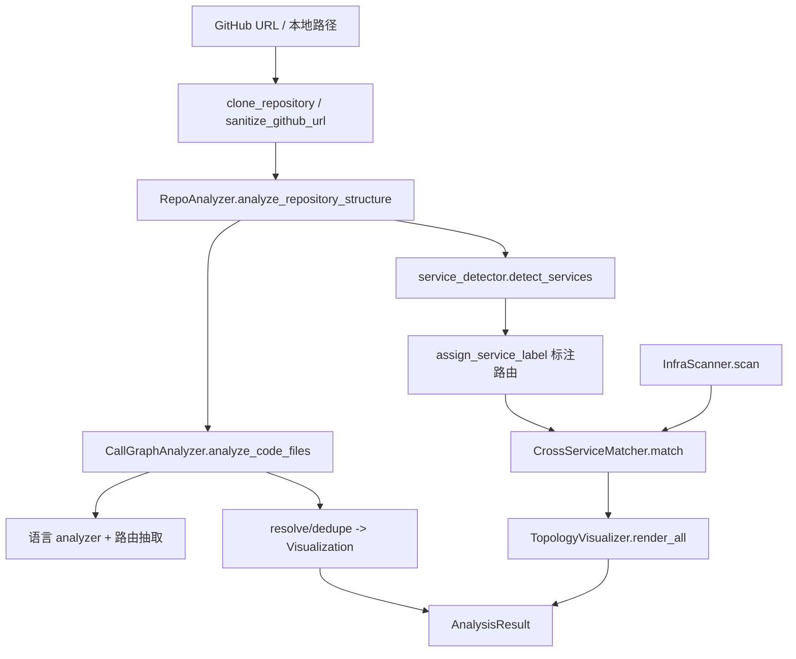

# AnalysisPipeline 模块文档

## 概述
AnalysisPipeline 是 DependencyAnalyzer 下负责**仓库分析编排**的叶子模块，位于 `codewiki/src/be/dependency_analyzer/analysis/`。它串起「克隆 → 结构扫描 → 服务边界识别 → 多语言 AST 解析生成调用图 → 跨服务路由匹配 → 基础设施扫描 → 拓扑可视化」的完整分析链路。核心入口为 `AnalysisService`，对外兼容函数 `analyze_repository` / `analyze_repository_structure_only`。支持 Python/JS/TS/Java/Kotlin/C#/C/C++/PHP/Go 等语言。

## 组件清单
| 组件 | 类型 | 文件 | 职责 |
|------|------|------|------|
| AnalysisService | class | analysis_service.py | 分析总编排（克隆、结构、调用图、清理） |
| analyze_repository | func | analysis_service.py | 兼容函数：全量分析 |
| analyze_repository_structure_only | func | analysis_service.py | 兼容函数：仅结构分析 |
| CallGraphAnalyzer | class | call_graph_analyzer.py | 多语言调用图解析与可视化数据生成 |
| TimeoutError / timeout / signal_handler | exc/ctxm/func | call_graph_analyzer.py | 单文件解析 30s 超时保护（Unix SIGALRM） |
| RepoAnalyzer | class | repo_analyzer.py | 构建过滤后的文件树与统计 |
| clone_repository / sanitize_github_url / parse_github_url | func | cloning.py | 浅克隆仓库、URL 清洗与元数据解析 |
| cleanup_repository / cleanup_repository_safe / handle_remove_readonly | func | cloning.py | 临时目录安全清理（Windows 只读处理） |
| CrossServiceMatcher | class | cross_service_matcher.py | 多仓库路由四阶段匹配引擎 |
| path_matches_template | func | cross_service_matcher.py | 段级模板匹配（{} 通配） |
| InfraScanner / InfraServiceInfo / scan_workspace_infra | class/class/func | infra_scanner.py | 从 compose/env/yml 提取服务依赖 |
| ServiceInfo | class | service_detector.py | 子服务边界数据 |
| detect_services / assign_service_label | func | service_detector.py | monorepo 子服务检测与文件归属标注 |
| _detect_from_* / _register_* / _remove_nested_services / _walk_pruned | func | service_detector.py | 五阶段检测与剪枝辅助函数 |
| TopologyVisualizer | class | topology_visualizer.py | 拓扑转 Mermaid 流程图与 Markdown 表 |

## 关键设计
按源文件分组说明核心职责。

**analysis_service.py（编排层）**：`AnalysisService` 是中枢，持有 `CallGraphAnalyzer` 实例，跟踪临时目录并在 `__del__` 中清理。`analyze_repository_full` 依次执行 `_clone_repository` → `_parse_repository_info` → `_analyze_structure`（委托 RepoAnalyzer）→ `_analyze_call_graph`（委托 CallGraphAnalyzer）→ 读取 README → 组装 `AnalysisResult`（含 `Repository`/`functions`/`relationships`/`visualization`）。`analyze_local_repository` 支持直接分析本地目录，`_filter_supported_languages` 限定支持的语言集合。两个模块级兼容函数封装了 Service，返回 `(result, None)`。

**call_graph_analyzer.py（解析层）**：`CallGraphAnalyzer` 是核心解析器。`analyze_code_files` 遍历文件、逐文件路由到语言专用 analyzer（Python 用 AST，其余用 tree-sitter），再统一抽取 HTTP/MQ 路由；完成后做 `_resolve_call_relationships`（基于 exact/simple 双索引跨语言解析 callee，用 `is_external_symbol` 区分外部调用并过滤）、`_deduplicate_relationships`、`_generate_visualization_data`（Cytoscape 元素）。`extract_code_files` 从文件树按 `CODE_EXTENSIONS` 提取代码文件；`_route_contextual_headers` 解决 C/C++ 头文件歧义。`timeout`/`signal_handler` 提供 Unix 下单文件 30s 超时。

**cloning.py（克隆/清理层）**：`clone_repository` 用 `git clone --depth 1 --filter=blob:none` 到临时目录（Windows 额外 sparse-checkout）；`sanitize_github_url` 规范化为 `https://github.com/owner/repo`；`parse_github_url` 抽取 owner/name；`cleanup_repository_safe` 通过 `handle_remove_readonly` 处理只读文件删除，失败重试。

**service_detector.py（子服务检测层）**：`detect_services` 依五阶段置信度（compose > Dockerfile > build manifest > convention dirs > Spring 配置）识别 monorepo 子服务，`_remove_nested_services` 去除嵌套边界；`assign_service_label` 用最长路径前缀把文件归属到服务。`_walk_pruned`/`_find_files`/`_find_files_glob` 是带排除目录与深度（`_MAX_DEPTH=3`）剪枝的遍历辅助。

**infra_scanner.py（基础设施层）**：`InfraScanner.scan` 解析 docker-compose、`.env`、`application.yml/.properties`，提取服务名/端口/`depends_on`/环境变量 URL 到 `service_urls`；`InfraServiceInfo` 为轻量数据载体。

**cross_service_matcher.py（跨服务匹配层）**：`CrossServiceMatcher` 借鉴 CBM 四阶段策略，目前实现 Phase 1 HTTP（精确 + `path_matches_template` 模糊回退，按段数分桶避免 O(n²)）与 Phase 2 MQ（producer↔consumer）；输出 `WorkspaceTopology`（含 links/unmatched_routes）。

**topology_visualizer.py（可视化层）**：`TopologyVisualizer.render_all` 把拓扑渲染为 Mermaid 流程图 + 跨服务调用表 + 未匹配路由表，供 overview.md 嵌入。

## 数据流（mermaid）


## 依赖关系
- [[DependencyAnalyzer]]（父模块）
- [[AnalyzerModels]]（AnalysisResult/Node/CallRelationship/RouteNode/WorkspaceTopology 等数据模型）
- [[AnalyzerUtils]]（patterns/security/external_symbols 工具）
- [[LanguageAnalyzers]]（各语言 AST analyzer）
- [[RouteExtractors]]（HTTP/MQ 路由抽取器）
- [[GraphAndSort]]（调用图构建与拓扑排序）

## 使用示例
```python
from codewiki.src.be.dependency_analyzer.analysis.analysis_service import analyze_repository

result, _ = analyze_repository("https://github.com/owner/repo")
print(result.summary["total_functions"], result.summary["total_relationships"])

# 仅结构分析
struct, _ = analyze_repository_structure_only("https://github.com/owner/repo")

# 跨服务匹配
from codewiki.src.be.dependency_analyzer.analysis.cross_service_matcher import CrossServiceMatcher
from codewiki.src.be.dependency_analyzer.analysis.topology_visualizer import TopologyVisualizer
m = CrossServiceMatcher(); m.add_repo_routes("svc-a", routes_a)
topo = m.match()
print(TopologyVisualizer().render_all(topo))
```

## 扩展点
- `CallGraphAnalyzer._analyze_code_file` 可新增语言分支接入更多 analyzer。
- `CrossServiceMatcher` 的 Phase 3/4（Channel gRPC/GraphQL/tRPC）已留占位，可扩展 `_match_channels`/`_match_typed_routes`。
- `RepoAnalyzer` 的 `include_patterns`/`exclude_patterns` 支持自定义文件过滤。
- `InfraScanner` 可新增配置源（如 Helm/Kustomize）的解析方法。
- `topology_visualizer` 可定制 Mermaid 样式或新增表格维度。

## 相关模块
- [[DependencyAnalyzer]] · [[AnalyzerModels]] · [[AnalyzerUtils]] · [[GraphAndSort]] · [[LanguageAnalyzers]] · [[RouteExtractors]]
- [[CLI]] · [[CLI_Adapter]] · [[LLM_Backend]] · [[MCP_Server]] · [[MCP_Tools_Analysis]] · [[MCP_Tools_Dependency]] · [[SharedConfig]]