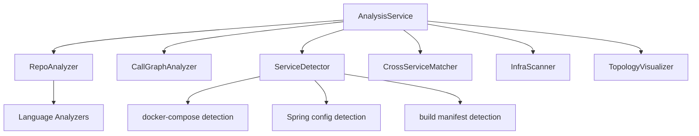

# Analysis Pipeline

## Overview

The analysis pipeline orchestrates the full repository analysis: AST parsing, call graph construction, service detection, cross-service matching, and infrastructure scanning.

## Architecture

## Components

### [AnalysisService](../../../codewiki/src/be/dependency_analyzer/analysis/analysis_service.py)
Top-level orchestrator. Two modes:
- **analyze_repository**: Full analysis with AST parsing + call graph + cross-service
- **analyze_repository_structure_only**: Lightweight structure-only analysis

### [CallGraphAnalyzer](../../../codewiki/src/be/dependency_analyzer/analysis/call_graph_analyzer.py)
Builds function-level call graphs from AST. Features:
- Signal-based timeout handling for large files
- Tree-sitter based call detection across languages
- Produces [CallRelationship](../../../codewiki/src/be/dependency_analyzer/models/core.py) objects

### ServiceDetector
Detects sub-services in monorepos via multiple strategies:
- docker-compose.yml parsing
- Dockerfile presence detection
- Build manifest analysis (pom.xml, build.gradle, package.json)
- Spring Boot configuration detection
- Convention-based directory detection
- Assigns service labels to components

### [CrossServiceMatcher](../../../codewiki/src/be/dependency_analyzer/analysis/cross_service_matcher.py)
Matches HTTP route producers to consumers across services. MQ pattern matching for async communication.

### [InfraScanner](../../../codewiki/src/be/dependency_analyzer/analysis/infra_scanner.py)
Scans workspace for infrastructure services (databases, queues, caches) from config files.

### [TopologyVisualizer](../../../codewiki/src/be/dependency_analyzer/analysis/topology_visualizer.py)
Generates Mermaid topology diagrams from cross-service analysis results.

### Cloning
Git clone/cleanup utilities for remote repository analysis.

## Business Constraints
- Signal-based timeout prevents infinite loops on large files (confidence: 0.9)
- Nested service detection: removes sub-services fully contained in parent services (confidence: 0.85)

## Cross References

- [[LanguageAnalyzers]]: Language-specific AST parsing
- [[AnalyzerModels]]: Core data models
- [[GraphAndSort]]: Graph building and topological sort
- [[RouteExtractors]]: HTTP/MQ route extraction

<!-- crosslinks (auto-generated) -->
## Related Modules
- Depends on: [AnalyzerModels](analyzermodels.md), [AnalyzerUtils](analyzerutils.md), [CLI_Utils](cli_utils.md), [LanguageAnalyzers](languageanalyzers.md), [MCP_Tools_Analysis](mcp_tools_analysis.md), [MCP_Tools_Quality](mcp_tools_quality.md), [RouteExtractors](routeextractors.md)
- Used by: [GraphAndSort](graphandsort.md), [MCP_Tools_Analysis](mcp_tools_analysis.md), [WebApp](webapp.md)
