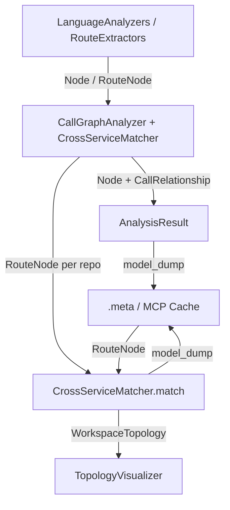

# AnalyzerModels 模块文档

## 概述
AnalyzerModels 是依赖分析子系统（`DependencyAnalyzer`）的纯数据层，定义了从单仓库静态分析到多仓库跨服务调用链匹配所需的全部 Pydantic 模型。它不包含业务逻辑，仅作为各分析阶段之间传递、聚合与持久化的「契约」。核心分为两类：

- **单仓库图模型**（core / analysis）：`Node`、`CallRelationship`、`Repository`、`AnalysisResult`、`NodeSelection`，描述函数/组件节点及其调用关系。
- **跨服务拓扑模型**（cross_service）：`RouteNode`、`CrossServiceLink`、`WorkspaceTopology`，以及枚举 `RouteProtocol`、`RouteRole`，用于 HTTP/gRPC/MQ 协议的 rendezvous 匹配。

所有模型均继承自 `pydantic.BaseModel`，因此天然支持 `model_dump()` / `model_dump_json()` 的序列化，便于落盘为 `.meta/*.json` 或被 MCP 缓存层索引。

## 组件清单
| 组件 | 类型 | 文件 | 职责 |
| --- | --- | --- | --- |
| AnalysisResult | class | models/analysis.py | 单仓库分析的完整结果聚合（节点、关系、文件树、摘要、可视化、README） |
| NodeSelection | class | models/analysis.py | 对分析结果做部分导出时的选择集合（节点 ID、是否含关系、自定义命名） |
| CallRelationship | class | models/core.py | 一条调用关系：caller→callee，含行号与是否已解析 |
| Node | class | models/core.py | 一个可分析单元（函数/类/方法）的元数据与依赖集合 |
| Repository | class | models/core.py | 被分析仓库的标识信息（url、name、clone_path、analysis_id） |
| CrossServiceLink | class | models/cross_service.py | 两个仓库间匹配成功的跨服务调用，含协议、方法、置信度 |
| RouteNode | class | models/cross_service.py | 协议无关的路由 rendezvous 点（route_key、method、path、role、component_id 等） |
| RouteProtocol | enum | models/cross_service.py | 路由协议枚举：HTTP / GRPC / GRAPHQL / MQ |
| RouteRole | enum | models/cross_service.py | 路由角色枚举：SERVER（服务端处理器）/ CLIENT（客户端调用） |
| WorkspaceTopology | class | models/cross_service.py | 工作区跨服务拓扑聚合（repos、routes、links、unmatched_routes） |

## 关键设计
**单仓库图模型**
- `Node`：主键 `id`（格式 `{relative_path}::{name}`），含 `name`、`component_type`、`file_path`、`relative_path`、`depends_on: Set[str]`、`source_code`、`start_line/end_line`、`docstring`、`parameters`、`node_type`、`base_classes`、`class_name`、`language`、`qualified_name`、`component_id`。`LanguageAnalyzers`（python.go.java.js.ts.c.cpp.csharp.kotlin.php）在扫描每个文件时调用 `Node(...)` 构造节点，`id` 同时充当 `component_id`，是后续 [[GraphAndSort]] 拓扑排序与 MCP 缓存索引的键。
- `CallRelationship`：表示 `caller` 对 `callee` 的调用，`is_resolved` 标记符号是否解析成功（外部符号判据见 [[AnalyzerUtils]]）。由 `CallGraphAnalyzer` 汇总。
- `Repository`：承载仓库定位信息，被 `AnalysisResult` 引用。
- `AnalysisResult`：把上述三者与 `file_tree`、`summary`、`visualization`、`readme_content` 打包，是 [[AnalysisPipeline]] 中 `AnalysisService.analyze_repository` 的返回类型。`NodeSelection` 则用于对已生成的 `AnalysisResult` 做增量/部分导出。

**跨服务拓扑模型**
- `RouteNode` 借鉴 CBM 的 rendezvous 设计，核心字段 `route_key`（如 `__route__POST__/api/orders/{}`，由 [[AnalyzerUtils]] 的 `make_route_key` / `make_mq_route_key` 规范化生成）、`protocol`、`method`、`path`、`role`、`component_id`、`repo_name`、`framework` 及 `extra`（协议专属扩展）。`RouteExtractors`（python_routes/java_routes/js_routes/go_routes/mq_patterns）在扫描源码时 `append(RouteNode(...))` 产出路由。
- `CrossServiceLink`：匹配成功后记录 `client_repo`/`server_repo`、双方 `component_id`/`function`，以及 `confidence`（1.0=精确，<1=模糊）。
- `WorkspaceTopology`：由 `CrossServiceMatcher.match()` 聚合全部仓库 `RouteNode` 后产出，含 `routes`、`links`、`unmatched_routes`，供 `TopologyVisualizer` 渲染 Mermaid 与 Markdown。
- 枚举 `RouteProtocol` / `RouteRole` 统一了多语言、多协议（HTTP+MQ 已覆盖 Py/Java/JS/TS/Go，gRPC/GraphQL 预留）的抽象。

**序列化 / 持久化**
- 所有模型基于 Pydantic，序列化统一走 `model_dump()`。MCP 侧将 `topology.links` / `topology.routes` 经 `model_dump()` 转为 dict 后 `json.dumps` 写入 `<output_dir>/.meta/cross_service_links.json` 与 `workspace_routes.json`；缓存层（[[MCP_Tools_Analysis]]）以 `RouteNode.model_dump()` 的字典形式 `batch_insert_routes` 入库并支持 `get_all_routes` 重建。

## 数据流（mermaid）


## 依赖关系
- 模型内部：`analysis.py` 依赖 `core.py`（`AnalysisResult` 引用 `Node`、`CallRelationship`、`Repository`）。
- 生产方：[[AnalysisPipeline]]、[[LanguageAnalyzers]]、[[RouteExtractors]]、[[AnalyzerUtils]]（路由 key 规范化）。
- 消费/持久化方：[[MCP_Tools_Analysis]]、[[SharedConfig]]（`meta_join` 定位 `.meta`）。

## 使用示例（构造 Node / AnalysisResult）
```python
from codewiki.src.be.dependency_analyzer.models.core import Node, CallRelationship, Repository
from codewiki.src.be.dependency_analyzer.models.analysis import AnalysisResult

node = Node(
    id="src/api/orders.py::create_order",
    name="create_order",
    component_type="function",
    file_path="src/api/orders.py",
    relative_path="src/api/orders.py",
    depends_on={"src/db/session.py::get_session"},
    start_line=10,
    end_line=42,
    language="python",
    component_id="src/api/orders.py::create_order",
)

result = AnalysisResult(
    repository=Repository(url=".", name="demo", clone_path="/tmp/demo", analysis_id="a1"),
    functions=[node],
    relationships=[
        CallRelationship(
            caller=node.id, callee="src/db/session.py::get_session", call_line=21, is_resolved=True
        )
    ],
    file_tree={},
    summary={"total_functions": 1},
    visualization={},
)
print(result.model_dump_json())
```

## 扩展点
- 新增语言：在 `LanguageAnalyzers` 中按 `Node(...)` 契约产出节点即可，无需改动模型。
- 新增协议：扩展 `RouteProtocol` 枚举，并在 `RouteExtractors` 中产出对应 `RouteNode`；`CrossServiceMatcher` 增加匹配分支即可。
- `RouteNode.extra` 字段为协议专属元数据预留扩展，无需改 schema。
- `WorkspaceTopology` 可自然容纳 `unmatched_routes`，便于后续模糊匹配或 CBM 语义补全。

## 相关模块
- [[DependencyAnalyzer]]：父模块。
- [[AnalysisPipeline]]：消费 `AnalysisResult` 与 `WorkspaceTopology`。
- [[AnalyzerUtils]]：提供 `make_route_key` / `make_mq_route_key` 等路由规范化工具。
- [[GraphAndSort]]：基于 `Node.depends_on` 做拓扑排序与环检测。
- [[LanguageAnalyzers]]：构造 `Node` 与 `CallRelationship`。
- [[RouteExtractors]]：构造 `RouteNode`。
- [[LLM_Backend]]：基于分析结果生成文档。
- [[MCP_Tools_Analysis]]：持久化并索引上述模型至 `.meta` 与缓存。
- [[SharedConfig]]：提供 `meta_join` 等路径解析。