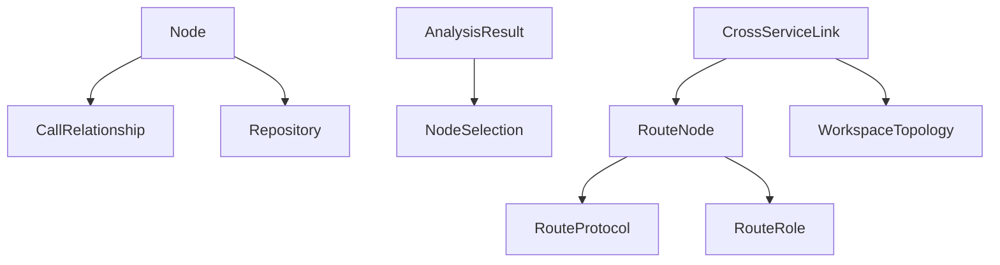

# Analyzer Data Models

## Overview

Defines the core data structures used throughout the dependency analysis pipeline: code nodes, call relationships, analysis results, and cross-service topology models.

## Architecture

## Components

### Core Models (core.py)
- **[Node](../../../codewiki/src/be/dependency_analyzer/models/core.py)**: Represents a code component (class, function, method). Fields: name, file_path, language, source_code, depends_on, depended_by, line_range
- **[CallRelationship](../../../codewiki/src/be/dependency_analyzer/models/core.py)**: Directed call edge between two nodes with call type (direct/import/indirect)
- **[Repository](../../../codewiki/src/be/dependency_analyzer/models/core.py)**: Collection of nodes with metadata (name, path, language stats)

### Analysis Models (analysis.py)
- **[AnalysisResult](../../../codewiki/src/be/dependency_analyzer/models/analysis.py)**: Full analysis output including components, dependencies, leaf nodes, language stats
- **[NodeSelection](../../../codewiki/src/be/dependency_analyzer/models/analysis.py)**: Filtered node selection for impact analysis or doc generation

### Cross-Service Models (cross_service.py)
- **[CrossServiceLink](../../../codewiki/src/be/dependency_analyzer/models/cross_service.py)**: HTTP/MQ link between producer and consumer services
- **[RouteNode](../../../codewiki/src/be/dependency_analyzer/models/cross_service.py)**: Extracted API route with method, path, handler component
- **[RouteProtocol](../../../codewiki/src/be/dependency_analyzer/models/cross_service.py)**: Enum for HTTP vs MQ communication
- **[RouteRole](../../../codewiki/src/be/dependency_analyzer/models/cross_service.py)**: Enum for producer vs consumer
- **[WorkspaceTopology](../../../codewiki/src/be/dependency_analyzer/models/cross_service.py)**: Full cross-service topology for multi-repo workspaces

## Cross References

- [AnalysisPipeline](AnalysisPipeline.md): Creates and populates these models
- [[GraphAndSort]]: Processes [Node](../../../codewiki/src/be/dependency_analyzer/models/core.py) dependencies for graph operations
- [[MCP_Cache]]: Persists [Node](../../../codewiki/src/be/dependency_analyzer/models/core.py) data to SQLite

<!-- crosslinks (auto-generated) -->
## Related Modules
- Used by: [AnalysisPipeline](analysispipeline.md), [GraphAndSort](graphandsort.md), [LanguageAnalyzers](languageanalyzers.md), [MCP_Cache](mcp_cache.md), [MCP_Tools_Analysis](mcp_tools_analysis.md), [RouteExtractors](routeextractors.md)
