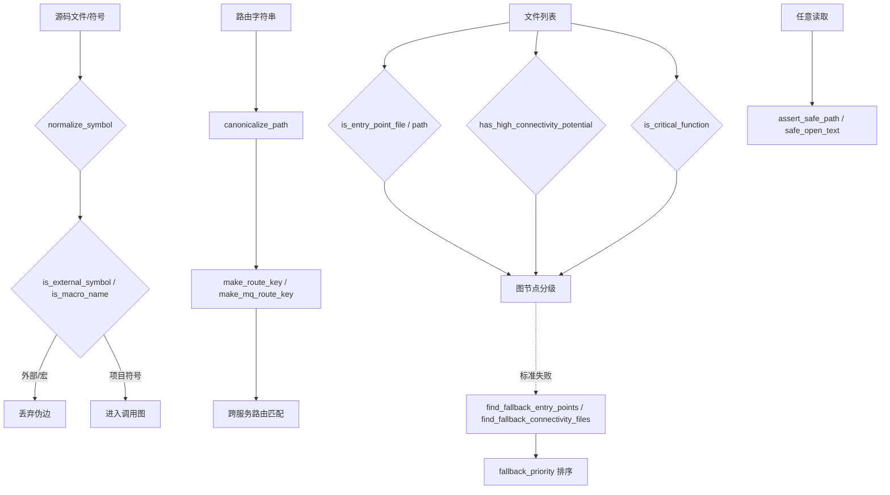

# AnalyzerUtils 模块文档

## 概述
`AnalyzerUtils` 是 `DependencyAnalyzer` 的叶子工具模块，集中存放依赖分析过程中跨语言、跨分析器复用的纯函数与配置表。它不持有状态，不发起网络调用，只提供：符号去外部化判定、彩色日志、URL/路由键规范化、入口点与高连接性启发式判定、连接性回退策略，以及路径安全读取。这些工具被 [[LanguageAnalyzers]]、[[RouteExtractors]]、[[GraphAndSort]] 及 [[MCP_Tools_Analysis]] 等模块直接调用，是分析结果准确性的底层保障。

## 组件清单
| 组件 | 类型 | 文件 | 职责 |
| --- | --- | --- | --- |
| is_external_symbol | 函数 | external_symbols.py | 判定被调用符号是否为已知外部/运行时符号（libc/STL/java.lang 等） |
| is_macro_name | 函数 | external_symbols.py | 按命名约定（全大写+下划线/≥4 字符）启发式识别 C/C++ 宏名 |
| normalize_symbol | 函数 | external_symbols.py | 将 ID/限定名/调用目标规整为可比较的短符号名 |
| ColoredFormatter | 类 | logging_config.py | 带 ANSI 颜色的日志格式化器 |
| setup_logging | 函数 | logging_config.py | 配置全局根日志（彩色控制台输出） |
| setup_module_logging | 函数 | logging_config.py | 为指定模块配置独立日志器（阻断向上传播） |
| canonicalize_path | 函数 | path_canonicalizer.py | 将多种框架路由参数语法统一为 `{}` 并裁尾斜杠 |
| make_route_key | 函数 | path_canonicalizer.py | 生成 CBM 兼容路由 QN `__route__METHOD__path` |
| make_mq_route_key | 函数 | path_canonicalizer.py | 生成 MQ 路由键 `__mq__broker__topic` |
| fallback_priority | 函数 | patterns.py | 回退入口点的打分排序（路径短、常见名优先） |
| find_fallback_connectivity_files | 函数 | patterns.py | 标准模式失败时按源目录/扩展名回退高连接文件 |
| find_fallback_entry_points | 函数 | patterns.py | 标准模式失败时回退查找入口点文件 |
| get_function_patterns_for_language | 函数 | patterns.py | 返回某语言的文本级函数定义模式 |
| has_high_connectivity_potential | 函数 | patterns.py | 依据文件名/路径/源目录估算文件连接潜力 |
| is_critical_function | 函数 | patterns.py | 依据函数名与导出模式判定关键函数 |
| is_entry_point_file | 函数 | patterns.py | 依据文件名匹配入口点 |
| is_entry_point_path | 函数 | patterns.py | 依据路径匹配入口点 |
| _inside | 函数 | security.py | 判定目标路径是否解析后位于基准目录内 |
| assert_safe_path | 函数 | security.py | 阻断符号链接与越界路径 |
| safe_open_text | 函数 | security.py | 安全只读打开文本文件（限大小、防 OOM） |

## 关键设计
### 符号处理（external_symbols.py）
模块以分层方式消除“伪未解析边”：
- `normalize_symbol` 先剥离 `::`/`()`/`&*[]`/`.` 等限定符与类型修饰，得到可比较短名；`std::` 开头的成员保留命名空间。
- `is_external_symbol` 分层判定：① 命名空间前缀规则（`java.`/`javax.`/`jdk.`/`sun.`/`std::`）对任何项目通用；② 经 `normalize_symbol` 后再比对各语言精选标准库集合（C 的 libc、C++ 的 STL 成员与 `java.lang` 类型）。Java 带点名若逃过前缀规则则视为项目包，交由解析器的包检查决定，避免误杀。
- 三个核心集合（`C_EXTERNAL_SYMBOLS`、`CPP_EXTERNAL_SYMBOLS`、`JAVA_EXTERNAL_SYMBOLS` 及 `JAVA_OBJECT_METHODS`）刻意只编码“语言级真理”，库专属名由各仓库的 include/import 映射过滤，绝不抑制项目自有类型。
- `is_macro_name` 仅在所有项目解析尝试失败后才咨询：全大写且（含下划线或长度≥4）即判为宏，但 `NON_MACRO_UPPER`（FALSE/TRUE/NULL/EOF 等）除外——宏从不被提取为组件，故对宏的调用永不产生项目边。

### 日志（logging_config.py）
- `ColoredFormatter` 继承 `logging.Formatter`，用 `colorama` 区分等级（DEBUG 蓝、INFO 青、WARNING 黄、ERROR/CRITICAL 红），时间戳蓝、模块名品红，异常链附在行末。
- `setup_logging` 清空根处理器后挂载彩色控制台 Handler，避免重复输出。
- `setup_module_logging` 为某模块创建独立 logger 并将 `propagate=False`，防止重复日志，返回 logger 供调用方使用。

### 路径与路由键（path_canonicalizer.py）
移植自 CBM 的 `cbm_route_canon_path`，核心目标：让不同框架的同一路由可比对。
- `canonicalize_path`：裁剪 `?` 查询串与 `#` 片段；依次把 JS 模板 `${...}`、Express/Rails `:name`、Spring/Axum/OpenAPI `{name}`、Flask/Rocket `<name>`/`<type:name>` 统一为 `{}`；末尾斜杠去除（保留根 `/`）。`${...}` 须在通用 `{name}` 规则前处理，避免残留 `$`。
- `make_route_key(method, path)` → `__route__METHOD__<canon>`；`make_mq_route_key(broker, topic)` → `__mq__broker__topic`，构成 [[RouteExtractors]] 与跨服务匹配的统一主键。

### 入口点判定（patterns.py）
模式表驱动：`ENTRY_POINT_PATTERNS`（精确名）、`ENTRY_POINT_PATH_PATTERNS`（路径片段）、`ENTRY_POINT_NAME_PATTERNS`（柔性名）及 `HIGH_CONNECTIVITY_PATTERNS`/`SOURCE_DIRECTORY_PATTERNS`。
- `is_entry_point_file`：先精确匹配，再对含扩展名的文件做柔性名子串匹配。
- `is_entry_point_path`：路径是否含 `cmd/main`、`src/server` 等片段。
- `has_high_connectivity_potential`：文件名/全路径/源目录三路 OR 判定高连接潜力。
- `is_critical_function`：`func_name` 命中 `CRITICAL_FUNCTION_NAMES`（main/index/app...）或代码片段含 `EXPORT_PATTERNS`（如 `export default`、`pub fn`、`func main`、`if __name__=="__main__"`）即判关键。

### 连接性回退（patterns.py）
当标准模式全失败时使用：
- `find_fallback_entry_points`：先按名（main/app/server/start/index）或入口路径召回；仍为空则取根/一级目录文件；最后用 `fallback_priority` 打分（路径越短、名越常见、扩展名越优先）排序截断 `max_files`。
- `find_fallback_connectivity_files`：先纳入 `src/lib/app/pkg/core` 下文件；不足则补入主流源码扩展名且非测试文件（`test/spec/_test`），截断 `max_files`。
- `fallback_priority` 作为模块内私有打分函数被上一函数复用（私有函数合并说明：它根据路径深度、常见名、扩展名给出负面分数，分数越低越优先）。

### 语言函数模式（patterns.py）
- `get_function_patterns_for_language` 从 `FUNCTION_DEFINITION_PATTERNS` 取语言的 `def {name}`/`func {name}`/`fn {name}`/`function {name}` 等文本模式，未命中回退 `general` 的 `{name}(`，供快速扫描定位。

### 安全（security.py）
- `_inside`：解析后判定 `target` 是否 `is_relative_to` 基准目录（兼容 py<3.9 的前缀判断）。
- `assert_safe_path`：拒绝符号链接（文件或目录）并拦截越界路径，抛 `PermissionError`。
- `safe_open_text`：先经 `assert_safe_path` 校验，再 `os.open` 加 `O_NOFOLLOW`（如支持）防 TOCTOU；`fstat` 超过 `MAX_FILE_SIZE`（2MB）抛错防 OOM（挡住 minified JS、生成 protobuf），以 `errors="replace"` 安全读取。

## 数据流（mermaid）


## 依赖关系
- 内部：依赖 `patterns.py` 的模式表、`external_symbols.py` 的集合、`path_canonicalizer.py` 的规范化链、`security.py` 的边界检查。
- 外部第三方：`colorama`（日志着色）。
- 被依赖：[[LanguageAnalyzers]]、[[RouteExtractors]]、[[GraphAndSort]]、[[MCP_Tools_Analysis]]、[[AnalysisPipeline]] 的 service_detector 等。

## 使用示例
```python
from codewiki.src.be.dependency_analyzer.utils import (
    external_symbols, path_canonicalizer, patterns, security, logging_config,
)

# 判定符号是否外部，避免垃圾边
external_symbols.is_external_symbol("c", "printf")      # True
external_symbols.is_external_symbol("cpp", "std::vector")  # True
external_symbols.is_macro_name("MAX_SIZE")              # True

# 路由键统一（Express 与 Spring 同一路径可比对）
key = path_canonicalizer.make_route_key("GET", "/users/:id")
# '__route__GET__/users/{}'

# 回退入口点
eps = patterns.find_fallback_entry_points(code_files, max_files=5)

# 安全读取
text = security.safe_open_text(repo_root, repo_root / "src/main.py")
```

## 扩展点
- 新增语言：在 `external_symbols.py` 追加该语言的标准库集合，并在 `patterns.py` 的 `CODE_EXTENSIONS`/`FUNCTION_DEFINITION_PATTERNS` 注册。
- 新框架路由语法：`canonicalize_path` 增加一条 `re.sub` 规则即可被所有路由键自动采纳。
- 新入口/连接模式：扩展 `ENTRY_POINT_*`、`HIGH_CONNECTIVITY_PATTERNS` 等表，无需改逻辑。
- 安全阈值：调 `security.MAX_FILE_SIZE` 即可放宽/收紧大文件保护。
- 颜色主题：覆写 `ColoredFormatter.COLORS`/`COMPONENT_COLORS`。

## 相关模块
- [[DependencyAnalyzer]]（父聚合模块）
- [[AnalysisPipeline]]（调用这些工具完成分析）
- [[AnalyzerModels]]（工具产出的节点/边模型）
- [[GraphAndSort]]（图构建与拓扑排序消费符号判定）
- [[LanguageAnalyzers]]（逐语言分析器复用符号/模式工具）
- [[RouteExtractors]]（使用路由键规范化做跨服务路由匹配）
- [[LLM_Backend]]（知识抽取前的依赖图基础）
- [[MCP_Tools_Analysis]]（MCP 分析工具调用回退与入口判定）
- [[SharedConfig]]（全局配置与文件管理协同）