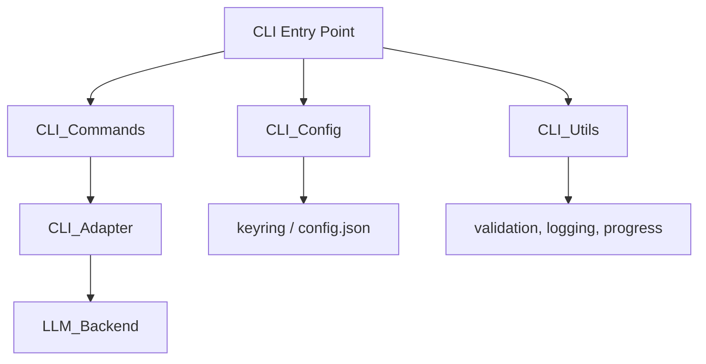

# CLI Layer

## Overview

The CLI layer provides the Click-based command-line interface for CodeWiki, including configuration management, documentation generation commands, and shared utilities. It serves as the primary user-facing entry point alongside the MCP protocol interface.

## Architecture



## Submodules

| Module | Purpose |
|--------|----------|
| [CLI_Commands](CLI_Commands.md) | Click command definitions (config set/show, generate, mcp) |
| [CLI_Config](CLI_Config.md) | [ConfigManager](../../../codewiki/cli/config_manager.py) with keyring, data models ([Configuration](../../../codewiki/cli/models/config.py), Job, LLMConfig) |
| [CLI_Utils](CLI_Utils.md) | Shared utilities: errors, validation, filesystem, logging, progress |
| [CLI_Adapter](CLI_Adapter.md) | Bridge to backend [DocumentationGenerator](../../../codewiki/src/be/documentation_generator.py) |

## Key Workflows

### [Configuration](../../../codewiki/cli/models/config.py) Setup
```
codewiki config set --api-key <key> --base-url <url> --main-model <model> --cluster-model <model>
```
Stores API credentials securely via system keyring (macOS Keychain, Windows Credential Manager, Linux Secret Service).

### Documentation Generation
```
codewiki generate [--include patterns] [--exclude patterns] [--focus modules] [--doc-type type]
```
Full pipeline: validate config → analyze repo → cluster modules → generate docs → output results.

### MCP Server
```
codewiki mcp
```
Starts the MCP stdio server for AI IDE integration.

## Design Decisions
- Click framework for mature CLI with subcommands and help generation
- Keyring-first credential storage with file-based fallback
- [ProgressTracker](../../../codewiki/cli/utils/progress.py) provides visual feedback for long-running operations
- Git branch workflow support for isolated documentation branches
