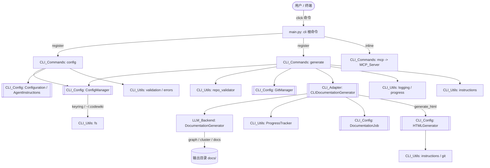
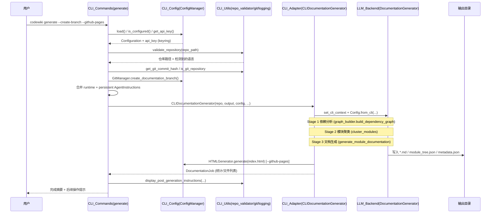

# CLI 模块文档（概览）

## 模块职责

CLI 是 CodeWiki 的顶层用户入口模块，建立在 Click 框架之上，负责把用户输入的命令转化为对后端 `LLM_Backend` 引擎的调用。它并不直接实现代码分析或文档生成逻辑，而是承担"胶水层"职责：解析命令行参数、持久化用户配置、编排文档生成流程、向用户呈现进度与结果。

CLI 把整个工具的使用面收敛为少量直观的子命令（`config`、`generate`、`mcp`、`version`），并在内部把关注点进一步拆成四个子模块：**配置管理**、**命令分派**、**后端适配**、**UI 与工具**。这样后端 LLM 引擎可以保持纯逻辑、无 CLI 依赖，而 CLI 层专注于人机交互与流程编排。

CLI 入口点位于 `codewiki/cli/main.py`，通过 `click.group()` 建立根命令 `cli`，并导入注册 `config_group`（`config`）与 `generate_command`（`generate`），以及内联的 `version` 与 `mcp` 命令。`mcp` 子命令把进程切换为 MCP 服务器模式（委托给 `MCP_Server`）。

## 子模块架构

CLI 下包含 4 个职责分明的子模块：

| 子模块 | 核心文件 | 职责 |
| --- | --- | --- |
| [[CLI_Config]] | `config_manager.py`、`git_manager.py`、`html_generator.py`、`models/config.py`、`models/job.py` | 配置持久化（密钥环/文件回退）、Git 分支与提交管理、GitHub Pages HTML 生成、任务/配置数据模型 |
| [[CLI_Commands]] | `commands/config.py`、`commands/generate.py` | 命令解析与分派：`config`（set/show/validate/agent）、`generate`（含增量更新、Git 分支、HTML）等子命令 |
| [[CLI_Adapter]] | `adapters/doc_generator.py` | 包裹后端 `DocumentationGenerator`，增加进度追踪、后端日志配置、任务生命周期管理 |
| [[CLI_Utils]] | `utils/progress.py`、`errors.py`、`validation.py`、`repo_validator.py`、`fs.py`、`logging.py`、`api_errors.py`、`instructions.py` | 进度条/控制台 UI、错误与退出码、输入校验、仓库校验、文件系统与安全写入、后处理提示 |

整体关系如下：

要点：
- **[[CLI_Commands]]** 是唯一直接面向用户交互的子模块，它依赖其余三个子模块来完成工作。
- **[[CLI_Adapter]]** 是 CLI 与后端的唯一桥接点，不直接与配置或 Git 耦合，而是由命令层把配置注入后调用。
- **[[CLI_Config]]** 同时承载"配置持久化""Git 操作""HTML 生成""数据模型"四类相对独立的职责，因此被命令层、适配层共用。
- **[[CLI_Utils]]** 是横切关注点集合，被所有上层子模块复用（进度、错误、校验、日志、文件系统）。

## 跨模块数据流

一次典型的 `codewiki generate` 调用展示了 CLI 如何串联 Config → Commands → Adapter → 后端：

关键数据流节点：
1. **配置加载**：`CLI_Commands` 通过 `CLI_Config.ConfigManager` 从密钥环或 `~/.codewiki` 读取 `Configuration`，并取出 API Key。
2. **指令合并**：运行时 CLI 选项（`--include/--exclude/--focus/--doc-type/--instructions`）与持久化的 `AgentInstructions` 合并，转换为 `agent_instructions` 字典交由后端。
3. **适配注入**：`CLI_Commands` 构造 `CLI_Adapter.CLIDocumentationGenerator`，把配置转为后端 `Config.from_cli(...)`，触发后端三阶段（依赖分析 → 模块聚类 → 文档生成）。
4. **进度回传**：`CLI_Adapter` 用 `CLI_Utils.ProgressTracker` 把后端各阶段进度反馈给用户；遇到失败封装为 `CLI_Utils.APIError`。
5. **产物收尾**：可选 HTML 生成（`CLI_Config.HTMLGenerator`）读取 `module_tree.json`/`metadata.json` 产出 `index.html`；最终以 `CLI_Config.DocumentationJob` 汇总统计。

## 设计原则

- **关注点分离**：命令解析（[[CLI_Commands]]）、持久化与 Git（[[CLI_Config]]）、后端桥接（[[CLI_Adapter]]）、横切工具（[[CLI_Utils]]）彼此独立，CLI 不污染后端引擎逻辑。
- **适配器桥接**：[[CLI_Adapter]] 是 CLI 与 `LLM_Backend` 之间唯一耦合点，封装进度上报、日志重定向（`codewiki.src.be` logger）与任务生命周期，使后端无需感知 CLI 上下文。
- **配置安全与回退**：API Key 优先存系统密钥环（macOS Keychain / Windows Credential Manager / Linux Secret Service），不可用时回退到 `~/.codewiki/credentials.json`（权限 0o600）；可用 `CODEWIKI_NO_KEYRING=1` 强制文件模式。
- **订阅模式兼容**：通过 `is_caw_provider`（claude-code / codex）区分 API 与订阅模式，配置校验与密钥要求随之调整。
- **增量与幂等**：`generate --update` 基于 `metadata.json` 的 `commit_id` 与 git diff 做受影响模块失效，仅重生成变更模块（含 `overview`）。
- **统一错误模型**：[[CLI_Utils]] 定义 `CodeWikiError` 及 `ConfigurationError`/`RepositoryError`/`APIError`/`FileSystemError`，映射到固定退出码（0/2/3/4/5），命令层用 `handle_error` 统一收口。
- **可观测性**：进度（阶段权重 + ETA）、彩色日志、verbose 调试模式由 [[CLI_Utils]] 提供，后端日志按 verbose 级别重定向到 stdout/stderr。

## 相关模块

- [[CLI_Adapter]] — 包裹后端 `DocumentationGenerator` 并上报进度
- [[CLI_Commands]] — 命令解析与分派（config / generate / mcp）
- [[CLI_Config]] — 配置持久化、密钥环、Git 管理、HTML 生成、数据模型
- [[CLI_Utils]] — 进度条/控制台 UI、错误处理、格式化工具
- [[LLM_Backend]] — 后端文档生成引擎，被 [[CLI_Adapter]] 直接调用（依赖分析、模块聚类、文档生成）
- [[DependencyAnalyzer]] — 后端依赖分析实现，由 `LLM_Backend.DocumentationGenerator` 在 Stage 1 使用
- [[AnalysisPipeline]] — 后端分析流水线，CLI 通过适配层间接驱动
- [[AnalyzerModels]] — 后端分析数据模型，与 [[CLI_Config]] 的 `DocumentationJob`/`Configuration` 对应
- [[AnalyzerUtils]] — 后端工具集（file_manager 等），适配层用于读写中间产物
- [[GraphAndSort]] — 后端模块树/依赖图构建，被适配层 `build_dependency_graph` 调用
- [[Frontend]] — GitHub Pages 前端查看器，与 [[CLI_Config]] 的 `HTMLGenerator` 产出 `index.html` 对接
- [[DocVisualizer]] — 文档可视化组件，关联 HTML 生成产物
- [[WebApp]] — Web 应用入口，可消费 CLI 生成的文档
- [[MCP_Server]] — `mcp` 子命令将 CLI 切换为 MCP 服务器模式
- [[MCP_Cache]] / [[MCP_Core]] / [[MCP_Prompts]] / [[MCP_Tools_Analysis]] / [[MCP_Tools_Dependency]] / [[MCP_Tools_DocWriter]] / [[MCP_Tools_Knowledge]] / [[MCP_Tools_Quality]] — MCP 工具集，复用同一后端分析/文档能力，与 CLI 共享配置与密钥环
- [[SharedConfig]] — 跨模块共享配置抽象，CLI 的 `ConfigManager`/`Configuration` 与后端 `Config.from_cli` 在语义上对齐
