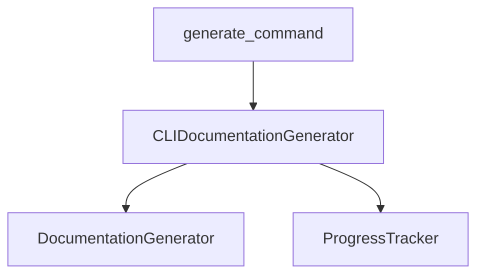

# CLI Adapter

## Overview

CLI_Adapter wraps the backend [DocumentationGenerator](../../../codewiki/src/be/documentation_generator.py) with CLI-specific progress tracking and error handling.

## Architecture

## CLIDocumentationGenerator

Core adapter class providing:
- [Config](../../../codewiki/src/config.py) conversion from CLI args to BackendConfig
- Progress tracking via [ProgressTracker](../../../codewiki/cli/utils/progress.py)
- Optional HTML generation for GitHub Pages
- Colored log output configuration

## Cross References

- [[LLM_Backend]]: [DocumentationGenerator](../../../codewiki/src/be/documentation_generator.py) engine
- [[CLI_Config]]: Job and LLMConfig models
- [[CLI_Utils]]: [ProgressTracker](../../../codewiki/cli/utils/progress.py), CLILogger

<!-- crosslinks (auto-generated) -->
## Related Modules
- Depends on: [AnalyzerUtils](analyzerutils.md), [CLI_Config](cli_config.md), [CLI_Utils](cli_utils.md), [LLM_Backend](llm_backend.md), [SharedConfig](sharedconfig.md)
- Used by: [CLI_Commands](cli_commands.md)
