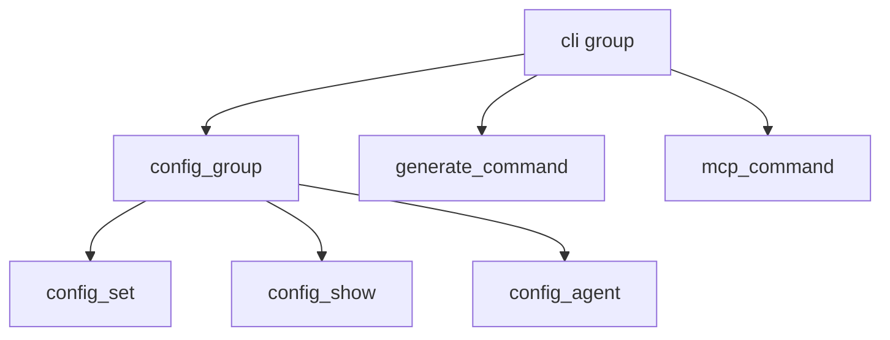

# CLI Commands

## Overview

Click-based CLI command structure for configuration management and documentation generation.

## Architecture

## Components

### config_group
- config_set: Store API credentials with keyring
- config_show: Display masked config
- config_validate: Verify correctness
- config_agent: Set agent instructions

### generate_command
Main entry point for doc generation. Supports include/exclude patterns, doc types, focus paths, incremental updates.

### main.py
Root cli group, version display, and mcp_command to start MCP server.

## Cross References

- [[CLI_Config]]: [ConfigManager](../../../codewiki/cli/config_manager.py) and models
- [CLI_Adapter](CLI_Adapter.md): CLIDocumentationGenerator
- [[CLI_Utils]]: Validation and progress

<!-- crosslinks (auto-generated) -->
## Related Modules
- Depends on: [CLI_Adapter](cli_adapter.md), [CLI_Config](cli_config.md), [CLI_Utils](cli_utils.md), [LLM_Backend](llm_backend.md), [MCP_Tools_Analysis](mcp_tools_analysis.md), [SharedConfig](sharedconfig.md)
