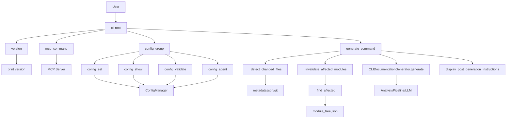

# CLI_Commands 模块文档

## 概述
CLI_Commands 是 CodeWiki 的命令行入口层，基于 Click 框架构建。它把用户意图转化为对底层生成管线、配置管理与 MCP 服务的调用。模块分为三块源文件：`main.py`（CLI 根与进程入口）、`commands/config.py`（配置子命令组）、`commands/generate.py`（文档生成命令与增量更新辅助函数）。共 15 个组件，涵盖根组定义、版本/入口、MCP 启动、配置读写校验、模式解析、以及生成命令与变更检测逻辑。

## 组件清单
| 组件 | 类型 | 文件 | 职责 |
|------|------|------|------|
| config_agent | 命令函数 | commands/config.py | 配置/查看/清除持久化 agent 指令 |
| config_group | 命令组 | commands/config.py | config 子命令容器 |
| config_set | 命令函数 | commands/config.py | 写入 API 凭证与模型/令牌参数 |
| config_show | 命令函数 | commands/config.py | 展示当前配置（密钥脱敏） |
| config_validate | 命令函数 | commands/config.py | 校验配置并测试 API 连通性 |
| parse_patterns | 工具函数 | commands/config.py | 逗号分隔模式解析为列表 |
| _detect_changed_files | 私有函数 | commands/generate.py | 基于 git 差异检测变更文件 |
| _find_affected | 嵌套函数 | commands/generate.py | 在 module_tree 中定位受影响模块 |
| _invalidate_affected_modules | 私有函数 | commands/generate.py | 删除受影响模块缓存文档 |
| generate_command | 命令函数 | commands/generate.py | 编排文档生成主流程 |
| parse_patterns | 工具函数 | commands/generate.py | 同名的模式解析（独立副本） |
| cli | 根命令组 | main.py | Click 根组与版本选项 |
| main | 入口函数 | main.py | 进程入口与顶层异常捕获 |
| mcp_command | 命令函数 | main.py | 启动 MCP stdio 服务 |
| version | 命令函数 | main.py | 打印版本信息 |

## 关键设计
### config_group / config_set / config_show / config_validate / config_agent
`config_group` 是一个 `@click.group(name="config")`，作为 `set`、`show`、`validate`、`agent` 四个子命令的容器，在 `main.py` 中通过 `cli.add_command(config_group)` 注册。

`config_set` 接收 `--api-key`、`--base-url`、`--main-model`、`--cluster-model`、`--fallback-model`、`--max-tokens`、`--max-token-per-module`、`--max-token-per-leaf-module`、`--max-depth`、`--provider`（枚举：`openai-compatible`/`anthropic`/`bedrock`/`azure-openai`/`claude-code`/`codex`）、`--aws-region`、`--api-version`、`--azure-deployment`。它先逐项校验（URL、API key、模型名、正整数），再交由 `ConfigManager` 持久化；API key 优先写入系统钥匙串（macOS Keychain / Windows 凭据管理器 / Linux Secret Service），不可用时回退加密文件。对 cluster-model 会调用 `is_top_tier_model` 提示质量风险。

`config_show` 读取 `ConfigManager`，缺配置时退出码 `EXIT_CONFIG_ERROR`；支持 `--json` 结构化输出（密钥经 `mask_api_key` 脱敏），或人类可读的分区展示（Credentials / API Settings / Output / Token / Decomposition / Agent Instructions），并通过 `is_caw_provider` 区分订阅模式（claude-code/codex 无需 key）。

`config_validate` 执行 5 步校验：配置文件存在性、API key（订阅模式跳过）、base URL（订阅模式跳过）、模型配置、`--quick` 外的 API 连通性测试（按 URL 选择 Azure/Anthropic/OpenAI SDK 的 `models.list()`）。订阅模式下改为检查 `claude`/`codex` CLI 是否在 PATH。

`config_agent` 管理持久化 `AgentInstructions`（`--include`/`--exclude`/`--focus`/`--doc-type`/`--instructions`/`--clear`）。无参数时展示当前指令，否则更新并保存；`--clear` 重置为空 `AgentInstructions`。这些指令作为 `generate` 的默认值，运行时参数可覆盖。

### parse_patterns（config.py 与 generate.py 两副本）
两处均提供 `parse_patterns(patterns_str)`，把逗号分隔字符串拆分为去空白非空列表；空输入返回 `[]`。`config.py` 版本供 `config_agent` 使用，`generate.py` 版本供 `generate_command` 的运行时指令构造使用。

### generate_command
核心生成命令。流程：校验配置（`ConfigManager.load` + `is_configured`）→ 校验仓库（`validate_repository`，自动探测语言）→ 校验 git 与可写输出目录 → （可选）`--update` 增量：调用 `_detect_changed_files` 与 `_invalidate_affected_modules` → （可选）`--create-branch` 经 `GitManager` 建分支 → 构造 `GenerationOptions` 与合并后的 `AgentInstructions`（运行时覆盖持久化）→ 组装 config dict（含 provider、各 max_token、max_depth，`commit_id` 由 `get_git_commit_hash` 提前获取以支持增量）→ 调用 `CLIDocumentationGenerator.generate()` → 用 `display_post_generation_instructions` 输出统计（module_count、total_files_analyzed、generation_time、total_tokens_used）。异常按 `ConfigurationError`/`RepositoryError`/`APIError` 分流退出码。

### _detect_changed_files / _find_affected / _invalidate_affected_modules
`_detect_changed_files` 读取 `output_dir/metadata.json` 中的 `generation_info.commit_id`，与当前 git HEAD 比对；通过 `repo.commit(prev).diff(current)` 得到变更路径，并按相对于 git root 的子目录前缀过滤（monorepo 友好），返回相对路径列表；无法判定时返回 `None`（触发全量生成）。

`_find_affected` 是 `_invalidate_affected_modules` 内的递归闭包：遍历 `module_tree.json` 的 `components`，若某组件路径与任一变更文件存在子串包含关系，则将该模块及其所有父模块加入失效集合；最后追加 `overview`（依赖子文档）。

`_invalidate_affected_modules` 据此删除对应 `{mod_name}.md` 缓存文件，使后续生成仅重算受影响模块。

### CLI 入口（cli / main / mcp_command / version）
`cli` 为 `@click.group()` 根组，挂 `@click.version_option(__version__)` 并 `ctx.ensure_object(dict)`；通过 `@cli.command()` 注册 `version`、`mcp`，以及 `config_group`、`generate_command`。

`version` 打印 `CodeWiki CLI v{__version__}` 及简介。

`mcp_command` 通过 `asyncio.run(codewiki.mcp.server.main())` 以 stdio 启动 MCP 服务，供 Claude/Cursor 等客户端调用文档生成工具。

`main` 调用 `cli(obj={})` 作为 `console_scripts` 入口，捕获 `KeyboardInterrupt`（退出 130）与未知异常（退出 1）。

## 数据流（mermaid）


## 依赖关系（上游/下游/可选项）
- 上游：`[[CLI]]`（调用方）、`[[CLI_Config]]`（ConfigManager/Config 模型）、`[[CLI_Adapter]]`（CLIDocumentationGenerator）、`[[CLI_Utils]]`（errors/repo_validator/logging/instructions）、`[[SharedConfig]]`（AgentInstructions/GenerationOptions 模型）
- 下游：`[[MCP_Server]]`（mcp_command 启动）、`[[AnalysisPipeline]]`（generate 调用）、`[[LLM_Backend]]`（校验连通性/生成调用）、`[[DependencyAnalyzer]]`、`[[DocVisualizer]]`（github_pages）
- 可选项：Git（`--create-branch`/`--update`）、`GitManager`、`WebApp`/`Frontend`（--github-pages 产物）

## 使用示例
```bash
# 配置 API 模式
codewiki config set --api-key sk-xxx --base-url https://api.anthropic.com \
  --main-model claude-sonnet-4 --cluster-model claude-sonnet-4 --fallback-model glm-4p5

# 订阅模式（无 key）
codewiki config set --provider claude-code --main-model claude-sonnet-4-5

# 校验与查看
codewiki config validate
codewiki config show --json
codewiki config agent --include "*.py" --exclude "*test*"

# 生成（含增量与 GitHub Pages）
codewiki generate --include "*.py" --doc-type architecture
codewiki generate --update            # 仅重算变更模块
codewiki generate --create-branch --github-pages

# MCP 与版本
codewiki mcp
codewiki version
```

## 扩展点
- 新增子命令：在 `commands/` 下定义 `@click.command`，于 `main.py` 注册到 `cli`。
- 新增 provider：扩展 `config_set` 的 `--provider` 枚举并在 `config_validate` 增加对应连通性分支。
- 增量策略：改进 `_find_affected` 的组件匹配规则（当前为子串包含）以支持更精确影响分析。
- 输出格式：`config_show` 的 JSON Schema 可随 `Config` 模型演进扩展。

## 相关模块
[[CLI]]、[[CLI_Adapter]]、[[CLI_Config]]、[[CLI_Utils]]、[[LLM_Backend]]、[[MCP_Server]]、[[DependencyAnalyzer]]、[[AnalysisPipeline]]、[[DocVisualizer]]、[[Frontend]]、[[WebApp]]、[[SharedConfig]]
