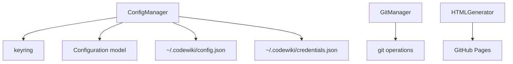

# CLI [Configuration](../../../codewiki/cli/models/config.py)

## Overview

Manages CodeWiki configuration with secure keyring storage for API keys and data models for jobs, generation options, and LLM settings.

## Architecture

## Components

### [ConfigManager](../../../codewiki/cli/config_manager.py)
- API key stored in system keychain (macOS Keychain, Windows Credential Manager, Linux Secret Service)
- Fallback to ~/.codewiki/credentials.json when keyring unavailable
- CODEWIKI_NO_KEYRING=1 env var to force file-based storage
- [Config](../../../codewiki/src/config.py) stored at ~/.codewiki/config.json

### Data Models
- **[Configuration](../../../codewiki/cli/models/config.py)**: API base_url, main_model, cluster_model, fallback_model, provider, max_tokens
- **[AgentInstructions](../../../codewiki/cli/models/config.py)**: doc_type, include/exclude patterns, custom instructions
- **[DocumentationJob](../../../codewiki/cli/models/job.py)**: [Repository](../../../codewiki/src/be/dependency_analyzer/models/core.py) path, output dir, LLM config, job statistics
- **[GenerationOptions](../../../codewiki/cli/models/job.py)**: Token limits, depth, patterns
- **[JobStatistics](../../../codewiki/cli/models/job.py)**: Module count, files analyzed, generation time
- **LLMConfig**: Model names and base URL

### [GitManager](../../../codewiki/cli/git_manager.py) & HTMLGenerator
- Git branch creation and management for doc isolation
- GitHub Pages HTML generation from markdown output

## Cross References

- [CLI_Commands](CLI_Commands.md): Uses [ConfigManager](../../../codewiki/cli/config_manager.py) for config set/show
- [CLI_Adapter](CLI_Adapter.md): Uses [Configuration](../../../codewiki/cli/models/config.py) for doc generation
- [[SharedConfig]]: Backend [Config](../../../codewiki/src/config.py) dataclass

<!-- crosslinks (auto-generated) -->
## Related Modules
- Depends on: [CLI_Utils](cli_utils.md), [DocVisualizer](docvisualizer.md), [LLM_Backend](llm_backend.md), [MCP_Tools_Analysis](mcp_tools_analysis.md), [SharedConfig](sharedconfig.md)
- Used by: [CLI_Adapter](cli_adapter.md), [CLI_Commands](cli_commands.md), [MCP_Core](mcp_core.md), [WebApp](webapp.md)
