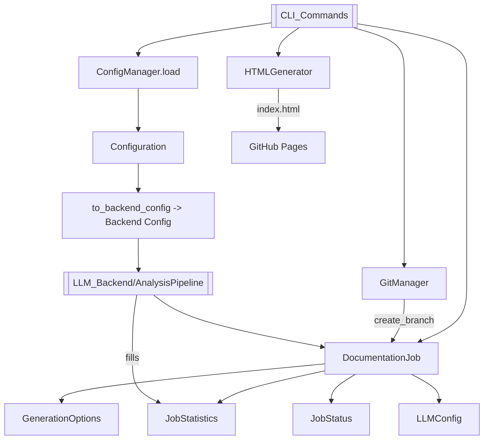

# CLI_Config 模块文档

## 概述

`CLI_Config` 是 CodeWiki CLI 的「配置与作业状态」叶子模块，负责持久化用户设置、安全存储凭据、管理 Git 仓库操作、生成 GitHub Pages 静态查看器，以及定义文档生成作业的数据模型。它是连接命令行层（[[CLI_Commands]]、[[CLI]]、[[CLI_Adapter]]）与后端生成引擎（[[LLM_Backend]]、[[AnalysisPipeline]]）之间的数据契约中枢。

模块包含 10 个组件：
- **配置管理**：`ConfigManager`（含 keyring 安全存储）、`Configuration` / `AgentInstructions`（持久化数据模型）。
- **仓库与产物**：`GitManager`（Git 分支/提交）、`HTMLGenerator`（静态查看器）。
- **作业模型**：`DocumentationJob`、`GenerationOptions`、`JobStatistics`、`JobStatus`、`LLMConfig`（运行态数据模型）。

## 组件清单

| 组件 | 类型 | 文件 | 职责 |
| --- | --- | --- | --- |
| ConfigManager | class | codewiki/cli/config_manager.py | 管理配置读写与 API key 安全存储（keyring + 文件回退） |
| GitManager | class | codewiki/cli/git_manager.py | 校验工作区、创建文档分支、提交文档、探测远程/PR URL |
| HTMLGenerator | class | codewiki/cli/html_generator.py | 生成自包含 index.html 静态查看器 |
| AgentInstructions | dataclass | codewiki/cli/models/config.py | 自定义文档智能体指令（过滤/聚焦/类型/补充指令） |
| Configuration | dataclass | codewiki/cli/models/config.py | 持久化用户配置，桥接到后端 Config |
| DocumentationJob | dataclass | codewiki/cli/models/job.py | 单次文档生成作业的完整状态与元数据 |
| GenerationOptions | dataclass | codewiki/cli/models/job.py | 作业生成选项（分支/ Pages/缓存/输出） |
| JobStatistics | dataclass | codewiki/cli/models/job.py | 作业统计信息（文件数/叶子/深度/tokens） |
| JobStatus | Enum(str) | codewiki/cli/models/job.py | 作业生命周期状态枚举 |
| LLMConfig | dataclass | codewiki/cli/models/job.py | 作业使用的 LLM 配置快照 |

## 关键设计

### ConfigManager

`ConfigManager` 是配置子系统的核心门面。构造函数探测 keyring 可用性（受 `CODEWIKI_NO_KEYRING` 环境变量控制，值为 `1/true/yes` 时强制文件存储）。存储策略分三层：
- **API key**：优先写入系统钥匙串（macOS Keychain / Windows Credential Manager / Linux Secret Service），不可用时回退到 `~/.codewiki/credentials.json`（明文但 `chmod 0o600`）。凭据不进入 JSON 配置。
- **非敏感配置**：持久化于 `~/.codewiki/config.json`（`CONFIG_VERSION="1.0"`）。

关键方法：
- `load()`：读取 JSON，校验 version，反序列化为 `Configuration`，再按序从 keyring → 文件载入 API key。
- `save(...)`：合并字段、按 provider 路由调用 `Configuration.validate()`、写入 keyring 或文件、写出 JSON。
- `is_configured()` / `get_api_key()` / `delete_api_key()` / `clear()`：完成度判断、惰性读取、清理。
- 通过 `keyring_available` / `config_file_path` 两个只读属性暴露内部状态。

其安全设计亮点在于：**运行期 keyring 失败**会降级到文件并给出告警提示，避免崩溃。

### GitManager

`GitManager` 封装 `GitPython` 操作，构造时即校验仓库合法性（否则抛 `RepositoryError`）。能力包括：
- `check_clean_working_directory()`：返回 `(is_clean, status_msg)`，列出前 3 个改动/未跟踪文件。
- `create_documentation_branch(force)`：生成带时间戳分支名 `docs/codewiki-YYYYMMDD-HHMMSS`，非 force 模式下拒绝脏工作区。
- `commit_documentation()`：将产物目录加入索引并提交，返回 commit hexsha。
- `get_remote_url()` / `get_github_pr_url()`：探测 origin 与 GitHub 对比链接（支持 SSH→HTTPS 转换）。
- `get_current_branch()` / `get_commit_hash()` / `branch_exists()`：查询辅助。

### HTMLGenerator

`HTMLGenerator` 生成 GitHub Pages 用的自包含 `index.html`。`template_dir` 默认指向包内 `templates/github_pages`，加载 `viewer_template.html`。
- `load_module_tree()` / `load_metadata()`：从 `docs_dir` 读取 `module_tree.json` 与 `metadata.json`（前者缺失时回退到简化的 Overview 结构）。
- `generate(...)`：将 `{{TITLE}}`、`{{MODULE_TREE_JSON}}`、`{{METADATA_JSON}}`、`{{CONFIG_JSON}}`、`{{DOCS_BASE_PATH}}` 等占位符替换为内联 JSON，支持自动计算 docs 相对路径。
- `_build_info_content()`：基于 `generation_info` 与 `statistics` 构造模型/时间/commit/组件数/最大深度的信息面板 HTML。
- `_escape_html()`：统一转义输入，防止 XSS。
- `detect_repository_info()`：从 git 推导仓库名、URL、GitHub Pages URL。

### AgentInstructions

`AgentInstructions` 是用户自定义文档指令的数据类，字段含 `include_patterns` / `exclude_patterns` / `focus_modules` / `doc_type` / `custom_instructions`。`to_dict()`/`from_dict()` 忽略 None；`is_empty()` 判断全空。`get_prompt_addition()` 是核心能力——将结构化指令翻译为 LLM 提示词片段：内置 `api / architecture / user-guide / developer / business / design` 六类 doc_type 的详细写作指引（其中 `design` 强调深度技术设计与 Mermaid 图），叠加 focus_modules 与 custom_instructions。

### Configuration

`Configuration` 表示持久化用户设置，字段覆盖 LLM 端点（`base_url` / `main_model` / `cluster_model` / `fallback_model`）、provider 族群（`openai-compatible` / `anthropic` / `bedrock` / `azure-openai`）及其专属参数、token 预算（`max_tokens=32768`、`max_token_per_module=36369`、`max_token_per_leaf_module=16000`、`max_depth=3`）、`default_output` 与 `agent_instructions`。
- `validate()`：经 `is_caw_provider()` 路由——订阅模式（claude-code/codex）只需 `main_model`，标准 API 模式额外校验 URL 与模型名。
- `is_complete()`：同上逻辑判断最小可用字段集。
- `to_backend_config(repo_path, output_dir, api_key, runtime_instructions)`：关键桥接方法，将持久配置与运行期指令合并（运行期优先级更高），调用 `codewiki.src.config.Config.from_cli(...)` 产出后端 Config，是 [[CLI]] 与 [[LLM_Backend]] 的衔接点。

### DocumentationJob

`DocumentationJob` 是单次运行态作业的聚合根，自动生成 `job_id`（uuid4）与 `timestamp_start`。状态迁移由 `start()` → `RUNNING`、`complete()` → `COMPLETED`、`fail(msg)` → `FAILED` 驱动（后者记录 `error_message` 与结束时间）。`to_dict()`/`to_json()`/`from_dict()` 完成与外部系统（如 [[MCP_Tools_DocWriter]]、[[WebApp]]）的序列化往返，嵌套对象（options/llm_config/statistics）递归处理。

### GenerationOptions

`GenerationOptions` 是作业开关集合：`create_branch`、`github_pages`、`no_cache`、`custom_output`。决定 [[CLI_Commands]] 是否调用 `GitManager`、是否触发 `HTMLGenerator` 以及是否绕过 [[MCP_Cache]]。

### JobStatistics

`JobStatistics` 记录 `total_files_analyzed`、`leaf_nodes`、`max_depth`、`total_tokens_used`——这些指标由 [[DependencyAnalyzer]] / [[AnalysisPipeline]] 填充，供 HTML 信息面板与 [[MCP_Tools_Quality]] 使用。

### JobStatus

`JobStatus(str, Enum)` 定义 `PENDING / RUNNING / COMPLETED / FAILED` 四态，继承自 `str` 以便 JSON 序列化时直接取 `.value`。

### LLMConfig

`LLMConfig` 是作业执行时的 LLM 配置快照（`main_model` / `cluster_model` / `base_url`），与 `Configuration` 不同，它不含 key/provider，仅记录生成期间实际使用的模型三元组，便于事后审计与复现。

## 数据流



流程：用户指令经 `ConfigManager` 载入 `Configuration`，`to_backend_config` 桥接后端；同时 `DocumentationJob` 聚合 options/statistics/status/llm_config；`GitManager` 处理分支与提交；产物经 `HTMLGenerator` 渲染为静态站点。

## 依赖关系

- **上游**：被 [[CLI]]、[[CLI_Commands]]、[[CLI_Adapter]] 调用。
- **下游**：`Configuration.to_backend_config` 依赖 `codewiki.src.config.Config`（[[LLM_Backend]]）；`ConfigManager`/`Configuration.validate` 依赖 `codewiki.src.be.backend.is_caw_provider`（[[LLM_Backend]]）；`AgentInstructions.get_prompt_addition` 输出供 [[LLM_Backend]] 提示词使用。
- **同级**：`GitManager` 与 `HTMLGenerator` 服务于产物落盘与发布；作业模型供 [[MCP_Tools_DocWriter]]、[[WebApp]]、[[MCP_Tools_Quality]] 消费。
- **工具**：依赖 [[CLI_Utils]] 的 `errors`（ConfigurationError/FileSystemError/RepositoryError）与 `fs`（safe_read/safe_write/ensure_directory）以及 `validation`。

## 使用示例

```python
# 保存并校验配置
from codewiki.cli.config_manager import ConfigManager
cm = ConfigManager()
cm.save(api_key="sk-...", base_url="https://api.openai.com/v1",
        main_model="gpt-4o", cluster_model="gpt-4o-mini")
assert cm.is_configured()

# 生成后端配置（桥接）
from codewiki.src.config import Config
cfg = cm.get_config().to_backend_config(
    repo_path="/repo", output_dir="docs", api_key=cm.get_api_key())

# 创建文档分支并提交
from codewiki.cli.git_manager import GitManager
gm = GitManager("/repo")
gm.create_documentation_branch(force=True)
sha = gm.commit_documentation(Path("docs"))

# 生成静态查看器
from codewiki.cli.html_generator import HTMLGenerator
HTMLGenerator().generate(
    output_path=Path("docs/index.html"), title="My Repo",
    docs_dir=Path("docs"), repository_url="https://github.com/u/r")
```

## 扩展点

- **Provider 支持**：新增 LLM provider 时，在 `is_caw_provider` 注册并在 `Configuration.save`/`validate`/`is_complete` 增加分支逻辑。
- **doc_type 指引**：在 `AgentInstructions.get_prompt_addition` 的 `doc_type_instructions` 字典中追加新文档类型模板。
- **凭据后端**：`ConfigManager` 可扩展为支持云密钥管理（如 AWS Secrets Manager）替代 keyring/文件回退。
- **作业字段**：`DocumentationJob` 与嵌套 dataclass 均为开放结构，`to_dict`/`from_dict` 已支持字段扩展，便于新增指标。

## 相关模块

- [[CLI]] — 命令行入口，调用本模块
- [[CLI_Commands]] — 子命令实现，驱动配置与作业
- [[CLI_Adapter]] — 适配层，桥接 CLI 与后端
- [[CLI_Utils]] — 错误处理与文件系统工具
- [[LLM_Backend]] — 通过 `to_backend_config` / `is_caw_provider` 衔接
- [[AnalysisPipeline]] — 消费作业并填充统计
- [[DependencyAnalyzer]] — 为 JobStatistics 提供分析数据
- [[MCP_Tools_DocWriter]] — 读写 DocumentationJob
- [[MCP_Tools_Quality]] — 基于 JobStatistics 评估质量
- [[MCP_Cache]] — 受 GenerationOptions.no_cache 控制
- [[WebApp]] — 展示作业与生成的 HTML 查看器
- [[Frontend]] / [[DocVisualizer]] — 与 HTMLGenerator 产物对应
