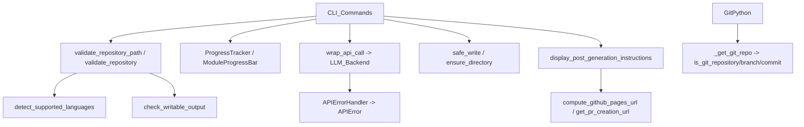

# CLI_Utils 模块文档

## 概述

`CLI_Utils` 是 CodeWiki 命令行工具的底层实用模块集合，位于 `codewiki/cli/utils/` 目录下，为上层命令（[[CLI_Commands]]、[[CLI_Adapter]]）提供错误处理、文件系统操作、进度展示、仓库校验、输入校验与生成后指引等通用能力。它不直接执行业务流程，而是被各命令与适配层复用，是 CLI 层稳定性的基石。模块定义了统一的退出码约定（0=成功、1=通用、2=配置、3=仓库、4=API、5=文件系统），并通过彩色终端输出（基于 `click`）与 GitPython 集成提升用户体验。

## 组件清单

| 组件 | 类型 | 文件 | 职责 |
| --- | --- | --- | --- |
| APIErrorHandler | class | api_errors.py | LLM API 错误分类与格式化，fail-fast 处理 |
| wrap_api_call | function | api_errors.py | 装饰式包装任意 API 调用并统一错误处理 |
| APIError | class | errors.py | LLM API 错误异常（exit code 4） |
| CodeWikiError | class | errors.py | 所有 CLI 错误的基类异常 |
| ConfigurationError | class | errors.py | 配置错误异常（exit code 2） |
| FileSystemError | class | errors.py | 文件系统错误异常（exit code 5） |
| RepositoryError | class | errors.py | 仓库错误异常（exit code 3） |
| error_with_suggestion | function | errors.py | 显示错误+建议并直接退出 |
| handle_error | function | errors.py | 捕获异常并返回对应退出码 |
| info | function | errors.py | 输出普通信息 |
| success | function | errors.py | 输出绿色成功信息 |
| warning | function | errors.py | 输出黄色警告信息 |
| check_writable | function | fs.py | 检查路径是否可写 |
| cleanup_directory | function | fs.py | 清空目录内容（保留隐藏项） |
| ensure_directory | function | fs.py | 递归创建目录（默认 0o700） |
| find_files | function | fs.py | 按扩展名递归查找文件 |
| get_file_size | function | fs.py | 获取文件字节大小 |
| safe_read | function | fs.py | 安全读取文件（捕获异常转 FileSystemError） |
| safe_write | function | fs.py | 原子写入（临时文件+rename） |
| compute_github_pages_url | function | instructions.py | 由仓库 URL 推导 GitHub Pages 地址 |
| display_generation_summary | function | instructions.py | 显示成功/失败汇总 |
| display_post_generation_instructions | function | instructions.py | 生成后 Git/Pages 指引 |
| get_pr_creation_url | function | instructions.py | 生成 PR 创建链接 |
| CLILogger | class | logging.py | 带 verbose 模式的彩色日志器 |
| create_logger | function | logging.py | 工厂函数创建 CLILogger |
| ModuleProgressBar | class | progress.py | 逐模块进度条 |
| ProgressTracker | class | progress.py | 多阶段进度追踪与 ETA 估算 |
| _get_git_repo | function | repo_validator.py | 向上查找 git.Repo 实例 |
| check_writable_output | function | repo_validator.py | 校验输出目录可写 |
| count_code_files | function | repo_validator.py | 统计受支持代码文件数 |
| get_git_branch | function | repo_validator.py | 获取当前 Git 分支名 |
| get_git_commit_hash | function | repo_validator.py | 获取当前提交哈希 |
| is_git_repository | function | repo_validator.py | 判断是否在 Git 仓库内 |
| validate_repository | function | repo_validator.py | 校验仓库有效性并返回语言分布 |
| detect_supported_languages | function | validation.py | 扫描目录返回 (语言, 数量) 列表 |
| is_top_tier_model | function | validation.py | 判断模型是否顶级（影响聚类） |
| mask_api_key | function | validation.py | 遮蔽 API Key 用于展示 |
| should_exclude_file | function | validation.py | 判断文件是否在排除目录内 |
| validate_api_key | function | validation.py | 校验 API Key 非空且长度 |
| validate_model_name | function | validation.py | 校验模型名非空 |
| validate_output_directory | function | validation.py | 校验输出目录路径 |
| validate_repository_path | function | validation.py | 校验仓库路径存在且为目录 |
| validate_url | function | validation.py | 校验 URL 格式与 HTTPS 约束 |

## 关键设计

### progress.py（进度展示）
`ProgressTracker` 将生成流程建模为 5 个加权阶段（依赖分析 40%、模块聚类 20%、文档生成 30%、HTML 生成 5%、收尾 5%），通过 `start_stage`/`update_stage`/`complete_stage` 推进，并基于已用时间与阶段权重（`get_overall_progress`）估算 `get_eta`。`ModuleProgressBar` 利用 `click.progressbar` 以模块数为长度展示逐模块进度；verbose 模式下则逐行打印模块名与缓存状态。两者均支持 verbose 开关。

### errors.py + api_errors.py（错误处理）
异常体系以 `CodeWikiError` 为基类，携带 `message` 与 `exit_code`；子类 `ConfigurationError`(2)、`RepositoryError`(3)、`APIError`(4)、`FileSystemError`(5) 固化退出码。`handle_error` 区分已知异常与未知异常并返回退出码；`error_with_suggestion` 直接 `sys.exit`。`api_errors.py` 的 `APIErrorHandler` 依据错误消息关键字（429/rate limit、401/authentication、timeout、network/connection）生成针对性排障文案，`display_api_error` 强调「fail-fast 不保留部分结果」；`wrap_api_call` 将任意函数包为 try/except，fail_fast 时抛出 `APIError`，否则仅展示并返回 None。

### fs.py（文件系统）
围绕 `FileSystemError` 提供安全封装：`ensure_directory` 递归创建（权限 0o700）并区分 PermissionError/OSError；`safe_write` 采用「临时文件 + `replace` 原子重命名」避免半写，失败时清理临时文件；`safe_read` 区分文件不存在/权限不足；`check_writable` 在路径不存在时回退检查父目录；`find_files` 按扩展名 glob 查找；`get_file_size`/`cleanup_directory`（可保留 `.` 开头项）为辅助工具。

### instructions.py（生成后指引）
`display_post_generation_instructions` 综合输出目录、文件清单、统计与下一步 Git 工作流（分支推送 / 直接提交两种路径），并调用 `get_pr_creation_url`（生成 `.../compare/<branch>`）与 `compute_github_pages_url`（解析 `github.com/owner/repo` 得 `owner.github.io/repo`）。`display_generation_summary` 负责成功/失败的最终回显。

### logging.py（日志）
`CLILogger` 提供 debug/info/success/warning/error 分级彩色输出，debug 仅在 verbose 时打印带时间戳内容；`step` 支持 `[n/total]` 步骤前缀；`elapsed_time` 返回自创建以来的耗时。工厂 `create_logger` 直接返回实例。

### repo_validator.py（仓库校验）
基于 GitPython 的 `_get_git_repo` 向上搜索父目录以支持 monorepo 子目录，`is_git_repository`/`get_git_branch`/`get_git_commit_hash` 均复用之并返回空串兜底。`validate_repository` 串联 `validate_repository_path` 与 `detect_supported_languages`，无受支持文件时抛 `RepositoryError`；`check_writable_output` 校验输出目录及其父目录写权限；`count_code_files` 依据 `SUPPORTED_EXTENSIONS` 统计。

### validation.py（输入校验）
校验函数统一抛出 `ConfigurationError` 或 `RepositoryError`：`validate_url`（支持 require_https、允许 localhost）、`validate_api_key`（非空且 ≥10 字符）、`validate_model_name`、`validate_output_directory`、`validate_repository_path`。`detect_supported_languages` 扫描 9 种语言、排除 node_modules/.git/venv 等目录后返回排序的 (语言, 数量)；`should_exclude_file` 为内部判定；`is_top_tier_model` 用于聚类策略判断；`mask_api_key` 仅显示首尾各 4 字符。

## 数据流（mermaid）



## 依赖关系

- [[CLI_Commands]] - 主要调用方
- [[CLI_Adapter]] - 复用校验与日志工具
- [[CLI_Config]] - 经 validation 校验配置
- [[LLM_Backend]] - 由 wrap_api_call 包装调用
- [[MCP_Server]] - 共享错误与文件工具

## 使用示例

```python
from codewiki.cli.utils.validation import validate_api_key, mask_api_key
from codewiki.cli.utils.errors import handle_error
from codewiki.cli.utils.fs import ensure_directory, safe_write
from codewiki.cli.utils.progress import ProgressTracker
from codewiki.cli.utils.api_errors import wrap_api_call

key = validate_api_key("sk-abcdef123456")      # 通过
print(mask_api_key(key))                        # sk-ab...3456
out = ensure_directory("~/docs/wiki")
safe_write(out / "overview.md", "# Wiki")

tracker = ProgressTracker(verbose=True)
tracker.start_stage(3, "Documentation Generation")
try:
    result = wrap_api_call(llm_client.generate, "prompt", context="overview")
except Exception as e:
    sys.exit(handle_error(e, verbose=True))
```

## 扩展点

- 新增语言支持：在 `repo_validator.SUPPORTED_EXTENSIONS` 与 `validation.detect_supported_languages` 的 `language_extensions` 同步添加。
- 新增错误类型：继承 `CodeWikiError` 并指定退出码即可被 `handle_error` 识别。
- 新增进度阶段：在 `ProgressTracker.STAGE_WEIGHTS`/`STAGE_NAMES` 扩展权重与命名。
- API 错误分类：在 `APIErrorHandler.handle_api_error` 增加关键字分支以支持新的错误模式。

## 相关模块

- [[CLI]]：顶层命令入口
- [[CLI_Adapter]]：适配器复用本模块工具
- [[CLI_Commands]]：生成/配置等子命令
- [[CLI_Config]]：配置管理与校验
- [[LLM_Backend]]：被 wrap_api_call 包装的模型调用层
- [[MCP_Server]]：对外服务共享错误与文件工具
