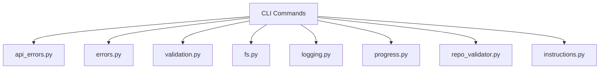

# CLI Utilities

## Overview

Comprehensive utility layer providing error handling, input validation, filesystem operations, logging, and progress tracking for the CLI interface.

## Architecture

## Components

### Error Handling
- **APIErrorHandler**: Wraps LLM API calls with retry and error classification
- **wrap_api_call**: Context manager for API call error handling
- **Error hierarchy**: [CodeWikiError](../../../codewiki/cli/utils/errors.py) → [ConfigurationError](../../../codewiki/cli/utils/errors.py), APIError, [FileSystemError](../../../codewiki/cli/utils/errors.py), [RepositoryError](../../../codewiki/cli/utils/errors.py)
- Helper functions: handle_error, error_with_suggestion, info, success, warning

### Validation
- **validate_api_key**: Validates OpenAI-compatible API key format
- **validate_model_name**: Checks model name against known providers
- **validate_output_directory**: Ensures writable, non-existent-safe directory
- **validate_repository_path**: Checks path exists and is a git repo
- **detect_supported_languages**: Scans repo for supported language files
- **should_exclude_file**: Pattern-based file exclusion logic
- **mask_api_key**: Security masking for display

### Filesystem
- ensure_directory, safe_read, safe_write, find_files, check_writable, cleanup_directory, get_file_size

### Logging & Progress
- **CLILogger**: Colored console logger with step tracking
- **[ProgressTracker](../../../codewiki/cli/utils/progress.py)**: 5-stage progress bar for doc generation pipeline
- **[ModuleProgressBar](../../../codewiki/cli/utils/progress.py)**: Per-module generation progress

### [Repository](../../../codewiki/src/be/dependency_analyzer/models/core.py) Validator
- Git operations: is_git_repository, get_git_commit_hash, get_git_branch
- Validation: validate_repository, check_writable_output, count_code_files

### Instructions
- Post-generation display instructions
- GitHub Pages URL computation and PR creation URL generation

## Cross References

- [CLI_Commands](CLI_Commands.md): Primary consumer of all utilities
- [CLI_Config](CLI_Config.md): [ConfigManager](../../../codewiki/cli/config_manager.py) uses fs.py and errors.py

<!-- crosslinks (auto-generated) -->
## Related Modules
- Used by: [AnalysisPipeline](analysispipeline.md), [CLI_Adapter](cli_adapter.md), [CLI_Commands](cli_commands.md), [CLI_Config](cli_config.md), [GraphAndSort](graphandsort.md), [LLM_Backend](llm_backend.md), [LanguageAnalyzers](languageanalyzers.md), [MCP_Cache](mcp_cache.md), [MCP_Core](mcp_core.md), [MCP_Tools_Analysis](mcp_tools_analysis.md), [MCP_Tools_DocWriter](mcp_tools_docwriter.md), [MCP_Tools_Knowledge](mcp_tools_knowledge.md), [MCP_Tools_Quality](mcp_tools_quality.md)
