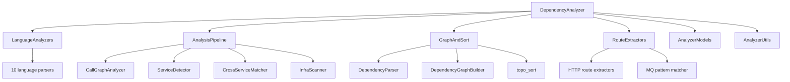

# Dependency Analyzer

## Overview

The Dependency Analyzer is the core static analysis engine of CodeWiki. It uses Tree-sitter to parse source code across 10 programming languages, builds function-level call graphs, detects monorepo sub-services, and performs cross-service HTTP/MQ dependency matching.

## Architecture

## Submodules

| Module | Components | Purpose |
|--------|-----------|----------|
| [AnalysisPipeline](AnalysisPipeline.md) | 43 | Orchestration, call graphs, service/cross-service detection |
| [LanguageAnalyzers](LanguageAnalyzers.md) | 21 | Tree-sitter AST analyzers for 10 languages |
| [RouteExtractors](RouteExtractors.md) | 28 | HTTP/MQ route extraction per language |
| [GraphAndSort](GraphAndSort.md) | 14 | Graph building, topological sort, cycle detection |
| [AnalyzerModels](AnalyzerModels.md) | 10 | Core data models ([Node](../../../codewiki/src/be/dependency_analyzer/models/core.py), [CallRelationship](../../../codewiki/src/be/dependency_analyzer/models/core.py), [CrossServiceLink](../../../codewiki/src/be/dependency_analyzer/models/cross_service.py)) |
| [AnalyzerUtils](AnalyzerUtils.md) | 20 | External symbols, patterns, security, logging, paths |

## Analysis Pipeline Flow

1. **File Discovery**: Walk repository, filter by language
2. **AST Parsing**: Tree-sitter parses each file into components
3. **Route Extraction**: Extract HTTP/MQ endpoints per language
4. **Call Graph Construction**: Build function-level dependency edges
5. **Service Detection**: Identify monorepo sub-services
6. **Cross-Service Matching**: Match producers to consumers across services
7. **Infrastructure Scan**: Detect databases, queues, caches from config
8. **Topological Sort**: Compute leaf-first processing order

## Design Decisions
- Tree-sitter chosen for reliable multi-language parsing without custom grammars
- Signal-based timeout prevents infinite loops on large files
- Tarjan's algorithm for O(V+E) cycle detection
- Incremental mode via content fingerprint comparison
