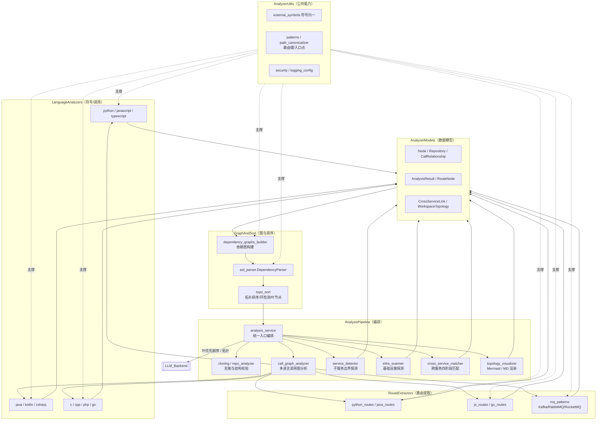
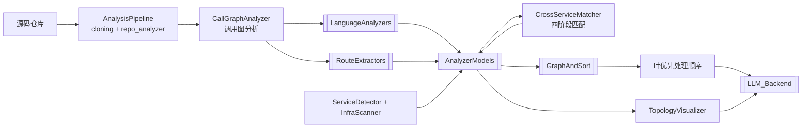

# DependencyAnalyzer 模块文档（概览）

## 模块职责

DependencyAnalyzer 是 CodeWiki 后端的顶层依赖分析模块，负责将任意（多语言）代码仓库转换为可供 LLM 文档生成消费的「节点—调用关系—路由—拓扑」结构化数据。它覆盖从仓库克隆/校验、多语言 AST 调用图分析、服务与基础设施探测、跨服务路由匹配，到依赖图构建、拓扑排序与可视化渲染的完整流水线。其输出（组件、调用关系、叶优先处理顺序、跨服务链接、Mermaid 拓扑）是 [[LLM_Backend]] 生成模块/函数级文档的核心输入。

该模块由 6 个子模块协同组成，整体遵循「解析 → 建模 → 构图 → 排序」的分层设计，并通过统一的 Pydantic 数据模型在子模块间传递。

## 子模块架构

### 子模块职责

| 子模块 | 职责 | 关键文件 |
| --- | --- | --- |
| **AnalysisPipeline** | 流水线编排：仓库克隆校验、调用图分析、服务/基础设施探测、跨服务匹配、拓扑可视化 | `analysis/analysis_service.py`、`cloning.py`、`call_graph_analyzer.py`、`service_detector.py`、`infra_scanner.py`、`cross_service_matcher.py`、`topology_visualizer.py` |
| **AnalyzerModels** | 统一分析数据模型：Node / Repository / AnalysisResult / CallRelationship / RouteNode / CrossServiceLink / WorkspaceTopology | `models/core.py`、`models/analysis.py`、`models/cross_service.py` |
| **AnalyzerUtils** | 公共能力：外部符号归一（`external_symbols`）、入口点/模式判定（`patterns`）、路径与路由键规范化（`path_canonicalizer`）、安全文件访问（`security`）、日志（`logging_config`） | `utils/*.py` |
| **GraphAndSort** | 依赖图构建（`dependency_graphs_builder`、`ast_parser.DependencyParser`）与拓扑排序（`topo_sort`：Tarjan 环检测、cycle 解析、叶节点提取），产出叶优先处理顺序 | `dependency_graphs_builder.py`、`topo_sort.py`、`ast_parser.py` |
| **LanguageAnalyzers** | 基于 TreeSitter / Python AST 的多语言符号与调用分析（py/js/ts/java/kotlin/csharp/c/cpp/php/go） | `analyzers/*.py` |
| **RouteExtractors** | HTTP 与 MQ 路由提取（python/java/js/go + MQ 生产者/消费者模式） | `analyzers/route_extractors/*.py` |

## 跨模块数据流

1. **源码入口**：`AnalysisService` 克隆并校验仓库（`cloning`、`repo_analyzer`），产出文件树。
2. **解析层**：`CallGraphAnalyzer` 调度 [[LanguageAnalyzers]] 做多语言符号/调用解析，并调用 [[RouteExtractors]] 抽取 HTTP/MQ 路由；两者均产出 [[AnalyzerModels]] 中的 `Node` / `CallRelationship` / `RouteNode`。
3. **探测与匹配**：`ServiceDetector`、`InfraScanner` 完善服务与基础设施元数据；`CrossServiceMatcher` 基于 `RouteNode` 执行四阶段跨服务匹配，生成 `CrossServiceLink` / `WorkspaceTopology`。
4. **构图与排序**：[[GraphAndSort]] 的 `DependencyParser` + `DependencyGraphBuilder` + `topo_sort` 基于 `components` 构依赖图、检测/消解环、提取叶节点，产出**叶优先处理顺序**。
5. **消费**：叶优先顺序与 `TopologyVisualizer` 渲染的 Mermaid/MD 一并交付 [[LLM_Backend]] 用于文档生成。

## 设计原则

- **分层与关注点分离**：编排（AnalysisPipeline）、解析（LanguageAnalyzers / RouteExtractors）、建模（AnalyzerModels）、图算法（GraphAndSort）、公共工具（AnalyzerUtils）职责清晰，互不越界。
- **模型驱动**：所有子模块以 Pydantic 模型（Node / RouteNode / WorkspaceTopology 等）为统一数据契约，降低耦合。
- **多语言可扩展**：语言分析与路由提取均以「注册表 + 扩展名映射」（`EXTRACTORS` 字典、`analyzers/*.py`）方式组织，新增语言只需追加 analyzer + extractor。
- **跨服务协议无关**：借鉴 CBM 的 Route 抽象（`RouteNode` + 规范化 `route_key` + `__route__METHOD__path` / `__mq__broker__topic`），统一 HTTP / gRPC / GraphQL / MQ 的匹配语义。
- **健壮性优先**：路径规范化、外部符号剔除、安全文件访问（`safe_open_text` / `assert_safe_path`）、解析超时与环消解（Tarjan SCC），确保大仓库与异常输入下仍稳定运行。
- **叶优先编排**：拓扑排序输出「依赖最少」的叶节点优先顺序，使 [[LLM_Backend]] 自底向上生成文档、复用上下文。

## 相关模块

- [[AnalysisPipeline]] — 本模块内部的流水线编排子模块
- [[AnalyzerModels]] — 统一分析数据模型子模块
- [[AnalyzerUtils]] — 公共工具子模块
- [[GraphAndSort]] — 依赖图与拓扑排序子模块
- [[LanguageAnalyzers]] — 多语言符号/调用分析子模块
- [[RouteExtractors]] — HTTP/MQ 路由提取子模块
- [[LLM_Backend]] — 消费叶优先顺序与拓扑，生成最终文档
- [[CLI_Adapter]] — 触发 `analyze_repository_*` 等分析入口
- [[MCP_Tools_Analysis]] — 暴露分析类 MCP 工具
- [[MCP_Tools_Dependency]] — 暴露依赖/拓扑类 MCP 工具
- [[SharedConfig]] — 提供 `Config`（仓库路径、include/exclude 模式、输出目录等）供各子模块共享