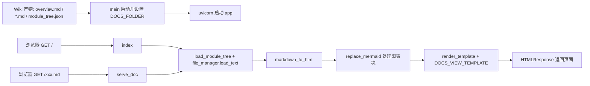

# DocVisualizer 模块文档

## 概述
DocVisualizer（位于 `codewiki/src/fe/`）是 CodeWiki 的轻量级文档可视化前端叶子模块，负责将 LLM 生成的 Markdown 文档（`overview.md`、各模块的 `.md` 文件与 `module_tree.json`）以静态可读的 HTML 页面形式托管与渲染。它基于 FastAPI 提供两个端点：根路径返回概览页，动态路径返回对应 Markdown 文档；通过 Jinja2 字符串模板完成页面装配，借助 `markdown_it` 完成 Markdown→HTML 转换，并对 Mermaid 代码块做专门后处理以支持图表渲染。该模块不依赖 LLM_Backend，仅消费已落盘的 Wiki 产物。

## 组件清单
| 组件 | 类型 | 文件 | 职责 |
|------|------|------|------|
| StringTemplateLoader | class | template_utils.py | 自定义 Jinja2 加载器，从内存字符串模板加载，无需文件系统 |
| render_template | function | template_utils.py | 创建 Jinja2 Environment（开启 HTML 自动转义）并渲染模板字符串 |
| render_navigation | function | template_utils.py | 依据 module_tree 渲染侧边导航 HTML（含 Overview 与子模块高亮） |
| render_job_list | function | template_utils.py | 渲染任务列表 HTML（仓库 URL、状态、进度、查看文档入口） |
| get_file_title | function | visualise_docs.py | 提取 Markdown 首行 `# ` 标题，失败回退到文件名 |
| index | function | visualise_docs.py | 根路由 `/`，加载并渲染 overview.md |
| initialize_globals | function | visualise_docs.py | 惰性从环境变量 `DOCS_FOLDER` 初始化全局文档目录与模块树 |
| load_module_tree | function | visualise_docs.py | 从 `.meta/module_tree.json` 读取模块树（经 `meta_resolve` 解析） |
| main | function | visualise_docs.py | CLI 入口，解析参数、校验目录、启动 uvicorn 服务 |
| markdown_to_html | function | visualise_docs.py | Markdown 转 HTML，并调用 replace_mermaid 处理图表块 |
| replace_mermaid | function | visualise_docs.py | 正则将 mermaid `<pre><code>` 块转为 `<div class="mermaid">` |
| serve_doc | function | visualise_docs.py | 动态路由 `/{filename}`，安全加载并渲染单个 .md 文档 |

## 关键设计

### 模板渲染层（template_utils.py）
- **StringTemplateLoader**：继承 `jinja2.BaseLoader`，`get_source` 直接返回内存中的模板字符串并标记不可缓存（`lambda: True`），使模板可完全内联、无需落地文件。
- **render_template**：统一创建 `Environment`，开启 `select_autoescape(['html','xml'])`、`trim_blocks`、`lstrip_blocks`，通过 `env.get_template('')` 渲染内联模板。所有页面装配均经此函数，保证一致的转义与空白处理。
- **render_navigation**：遍历 `module_tree`，对含 `components` 的分区生成 Overview 链接，对 `children` 生成子模块链接，并依据 `current_page` 高亮 `active` 类，驱动侧边栏导航。
- **render_job_list**（辅助，供任务展示场景复用）：遍历 job 列表，渲染仓库地址、状态徽章、进度及“View Documentation”跳转。

### 文档服务层（visualise_docs.py）
- **全局状态**：模块级 `DOCS_FOLDER` 与 `MODULE_TREE` 两个全局变量保存配置；`initialize_globals` 在请求时若未初始化则尝试从 `DOCS_FOLDER` 环境变量恢复，实现 reload 场景下的惰性加载。
- **load_module_tree**：通过 `codewiki.src.config.meta_resolve` 定位 `module_tree.json`（位于 `.meta/` 子目录），用 `file_manager.load_json` 反序列化；缺失或解析失败时打印警告并返回 `None`，不影响非导航页面渲染。
- **markdown_to_html / replace_mermaid**：先用 `MarkdownIt().render` 生成 HTML，再用正则 `<pre><code class="language-mermaid">(.*?)</code></pre>`（DOTALL）匹配 Mermaid 块，经 `html.unescape` 还原后包裹进 `<div class="mermaid">`，交由前端 Mermaid.js 渲染。
- **get_file_title**：读取首行，匹配 `# ` 取标题；异常或缺失时回退为文件名去下划线并 title 化。
- **index / serve_doc**：共享同一渲染上下文 `{title, content, navigation, current_page}`，注入 `DOCS_VIEW_TEMPLATE`（来自 `codewiki.src.fe.templates`）。
- **serve_doc 安全设计**：仅允许 `.md` 后缀；通过 `Path.resolve()` + `startswith(docs_folder_resolved)` 防止目录穿越；文件不存在返回 404，异常统一转 500。
- **main**：解析 `--docs-folder`(必填)、`--port`(默认8000)、`--host`(默认127.0.0.1)、`--debug`；校验目录存在性与 overview.md；将 `DOCS_FOLDER` 写入环境变量供 uvicorn reload 读取；最后以 `visualise_docs:app` 启动服务，并挂载 `/static` 静态目录。

## 数据流（mermaid）


## 依赖关系
- 模板与页面装配依赖 [[SharedConfig]]（`meta_resolve`、`file_manager`）。
- 消费由 [[LLM_Backend]]（DocumentationGenerator）与 [[MCP_Server]]（doc_writer/page_router）生成的 Markdown 与 `module_tree.json`。
- 与 [[Frontend]]、[[WebApp]] 同属前端呈现层，但本模块为独立轻量静态服务器，不依赖 WebApp 的异步任务/缓存体系。

## 使用示例
```bash
# 启动文档可视化服务（指向已生成的 Wiki 目录）
python -m codewiki.src.fe.visualise_docs \
    --docs-folder ./wiki_output \
    --port 8080 --host 0.0.0.0

# 或设置环境变量由已运行实例 reload 加载
export DOCS_FOLDER=./wiki_output
```
启动后访问 `http://localhost:8080/` 查看概览，访问 `http://localhost:8080/<module>.md` 查看具体模块文档，Mermaid 图表在页面内自动渲染。

## 扩展点
- **模板替换**：`DOCS_VIEW_TEMPLATE`（来自 `templates.py`）可整体替换为自定义布局，无需改动渲染逻辑。
- **导航结构**：`render_navigation` 兼容 `components`/`children` 嵌套结构，新增分区类型可在此扩展。
- **图表渲染**：`replace_mermaid` 为单一正则替换，可扩展支持 PlantUML 等其他图表方言。
- **静态资源**：`app.mount("/static", ...)` 指向当前目录，可改为固定资源目录以托管 CSS/JS。
- **鉴权与遍历防护**：`serve_doc` 已做路径穿越防护，可在此叠加 Token 鉴权或 MIME 白名单。

## 相关模块
- [[Frontend]]、[[WebApp]]（同层前端呈现，WebApp 提供更完整的任务/缓存/GitHub 处理能力）
- [[LLM_Backend]]（DocumentationGenerator 生成被本模块渲染的 Markdown）
- [[SharedConfig]]（提供 `meta_resolve`、FileManager 等底层能力）
- [[DependencyAnalyzer]]（其拓扑产出可被纳入 module_tree 供导航展示）
- [[MCP_Server]]（doc_writer/page_router 负责写入 Wiki 产物，本模块为只读消费端）