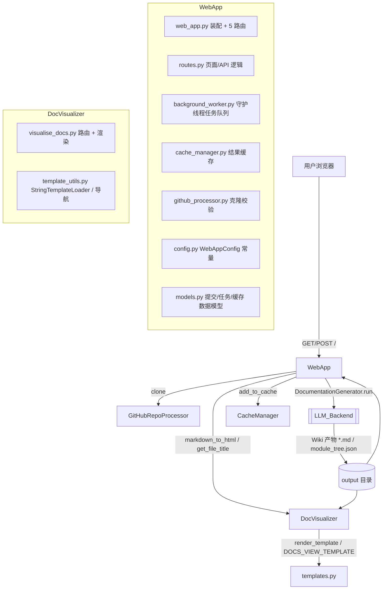
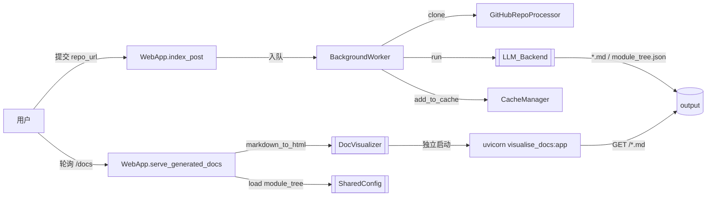

# Frontend 模块文档（概览）

## 模块职责

Frontend 是 CodeWiki 的前端呈现层，负责把 [[LLM_Backend]]（DocumentationGenerator）与 [[MCP_Server]] 生成的 Wiki 产物（Markdown 文档、`module_tree.json`、`metadata.json`）以可浏览的 Web 界面形式交付给用户。它不实现文档生成逻辑，而是聚焦于「提交 → 异步生成 → 缓存 → 渲染展示」的用户闭环。

模块由两个子模块组成：
- **WebApp**：完整的 Web 服务（FastAPI），提供图形化提交界面、后台异步任务队列、结果缓存、任务状态跟踪与文档 HTML 渲染。
- **DocVisualizer**：轻量静态文档服务器（FastAPI），只读消费已生成的 Wiki 产物，通过 Jinja2 模板与 Markdown→HTML 转换渲染页面并支持 Mermaid 图表。

二者共享 [[SharedConfig]] 的 `Config`/`file_manager` 能力，并在文档渲染上复用彼此：`WebApp` 内部调用 `DocVisualizer` 的 `markdown_to_html`/`get_file_title` 完成文档页渲染；`DocVisualizer` 则可作为独立的轻量查看器独立运行。

## 子模块架构

| 子模块 | 核心文件 | 职责 |
| --- | --- | --- |
| WebApp | web_app.py / routes.py / background_worker.py / cache_manager.py / github_processor.py / config.py / models.py | Web 服务、异步任务、缓存、文档展示 |
| DocVisualizer | visualise_docs.py / template_utils.py | 轻量静态文档服务器、模板渲染、Mermaid 处理 |

## 跨模块数据流

1. 用户通过 `WebApp` 首页提交 GitHub URL；`index_post` 校验并入队（命中缓存则直接复用）。
2. `BackgroundWorker` 守护线程取出任务，经 `GitHubRepoProcessor` 克隆后调用 [[LLM_Backend]] 的 `DocumentationGenerator.run()` 生成文档，结果写入 `output/` 并由 `CacheManager` 建索引。
3. 用户轮询 `GET /api/job/{job_id}` 获取状态；完成后 `WebApp.serve_generated_docs` 加载 `module_tree.json`/`metadata.json`，调用 `DocVisualizer.markdown_to_html` 渲染 HTML 返回。
4. `DocVisualizer` 亦可脱离 WebApp 单独启动（`python -m codewiki.src.fe.visualise_docs --docs-folder ...`），只读服务 `output/` 下的文档与模块树。

## 设计原则

- **关注点分离**：生成逻辑完全下沉到 [[LLM_Backend]]；前端只负责提交、调度、缓存与渲染。
- **异步解耦**：`BackgroundWorker` 守护线程 + `Queue` 将耗时生成与 HTTP 请求解耦，前端可轮询或稍后查看。
- **缓存优先**：以 repo URL 的 sha256 前缀为 key 缓存生成结果，避免重复消耗 LLM 配额。
- **渲染复用**：`WebApp` 直接复用 `DocVisualizer` 的 `markdown_to_html`/`get_file_title`，保证两套界面渲染一致；模板集中在 `templates.py` 便于统一换肤。
- **安全渲染**：`DocVisualizer.serve_doc` 做路径穿越防护（`resolve` + `startswith`），`render_template` 开启 HTML 自动转义。
- **配置集中**：`WebAppConfig` 以类常量统一管理目录、队列、超时、过期等参数。

## 相关模块

- [[WebApp]] — 完整 Web 服务入口（任务/缓存/展示）
- [[DocVisualizer]] — 轻量静态文档服务器（被 WebApp 复用渲染能力）
- [[LLM_Backend]] — 文档生成引擎，被前端间接驱动
- [[CLI]] / [[CLI_Adapter]] — 同一生成引擎的命令行入口
- [[MCP_Server]] — 另一文档生成/检索服务入口
- [[SharedConfig]] — 提供 `Config`/`file_manager`/`meta_resolve` 等底层能力
- [[DependencyAnalyzer]] — 其拓扑产出可纳入 `module_tree` 供前端导航展示