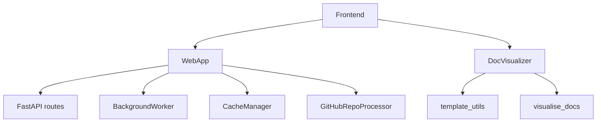

# Frontend

## Overview

The Frontend layer provides a FastAPI-based web application for submitting repositories, monitoring documentation generation jobs in real-time, and browsing generated documentation with Mermaid diagram rendering.

## Architecture

## Submodules

| Module | Components | Purpose |
|--------|-----------|----------|
| [WebApp](WebApp.md) | 15 | FastAPI app, routes, background jobs, caching, GitHub integration |
| [DocVisualizer](DocVisualizer.md) | 12 | Markdown-to-HTML rendering, Mermaid support, navigation tree |

## Key Features

### [Repository](../../../codewiki/src/be/dependency_analyzer/models/core.py) Submission
- Submit GitHub repository URLs for analysis
- Configure include/exclude patterns and doc types
- Queue generation jobs with background processing

### Real-time Monitoring
- Server-Sent Events (SSE) for live job progress
- Job status tracking: queued → running → completed/failed
- Cache management for repeated queries

### Documentation Browsing
- Markdown-to-HTML conversion with Mermaid diagram rendering
- Module tree-based navigation sidebar
- Template-driven page layout

## Design Decisions
- FastAPI for async performance and SSE support
- [BackgroundWorker](../../../codewiki/src/fe/background_worker.py) thread pool for non-blocking job execution
- [CacheManager](../../../codewiki/src/fe/cache_manager.py) for result reuse across requests
- [GitHubRepoProcessor](../../../codewiki/src/fe/github_processor.py) for automated clone-and-analyze workflow
