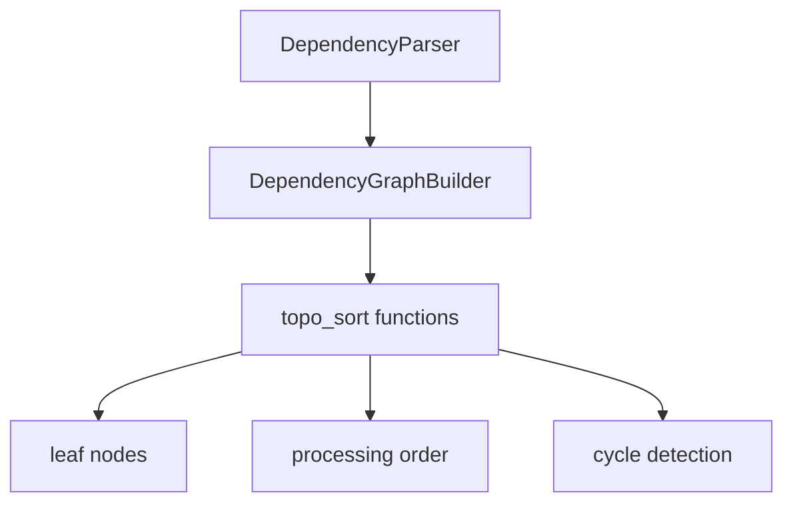

# Graph Building and Topological Sort

## Overview

Provides graph construction from component dependencies, cycle detection via Tarjan's algorithm, and topological sorting for determining documentation generation order.

## Architecture

## Components

### [DependencyParser](../../../codewiki/src/be/dependency_analyzer/ast_parser.py) (ast_parser.py)
AST-based dependency extraction using Tree-sitter. Parses import statements and function calls to build raw dependency edges.

### [DependencyGraphBuilder](../../../codewiki/src/be/dependency_analyzer/dependency_graphs_builder.py)
Constructs the full dependency graph from parsed components:
- Maps file paths to component IDs
- Builds bidirectional dependency edges (depends_on / depended_by)
- Computes high-impact components (many dependents)

### Topological Sort (topo_sort.py)
- **topological_sort**: Kahn's algorithm for linear ordering
- **detect_cycles**: Tarjan's strongly connected components algorithm
- **resolve_cycles**: Breaks cycles by removing weakest edges
- **build_graph_from_components / build_reverse_graph**: Graph construction utilities
- **get_leaf_nodes**: Identifies leaf components (no dependencies)
- **transitive_impact**: Computes blast radius of changes
- **dependency_first_dfs**: DFS traversal prioritizing dependencies

## Business Constraints
- Tarjan's algorithm ensures O(V+E) cycle detection (confidence: 0.95)
- Leaf-first ordering guarantees parent docs reference already-written child docs (confidence: 0.9)

## Cross References

- [AnalysisPipeline](AnalysisPipeline.md): Provides component data for graph building
- [AnalyzerModels](AnalyzerModels.md): [Node](../../../codewiki/src/be/dependency_analyzer/models/core.py) and [CallRelationship](../../../codewiki/src/be/dependency_analyzer/models/core.py) models
- [[MCP_Tools_DocWriter]]: Uses processing order for doc generation

<!-- crosslinks (auto-generated) -->
## Related Modules
- Depends on: [AnalysisPipeline](analysispipeline.md), [AnalyzerModels](analyzermodels.md), [CLI_Utils](cli_utils.md), [MCP_Tools_Analysis](mcp_tools_analysis.md)
- Used by: [LLM_Backend](llm_backend.md), [MCP_Core](mcp_core.md), [MCP_Tools_Analysis](mcp_tools_analysis.md), [MCP_Tools_Dependency](mcp_tools_dependency.md), [MCP_Tools_Quality](mcp_tools_quality.md)
