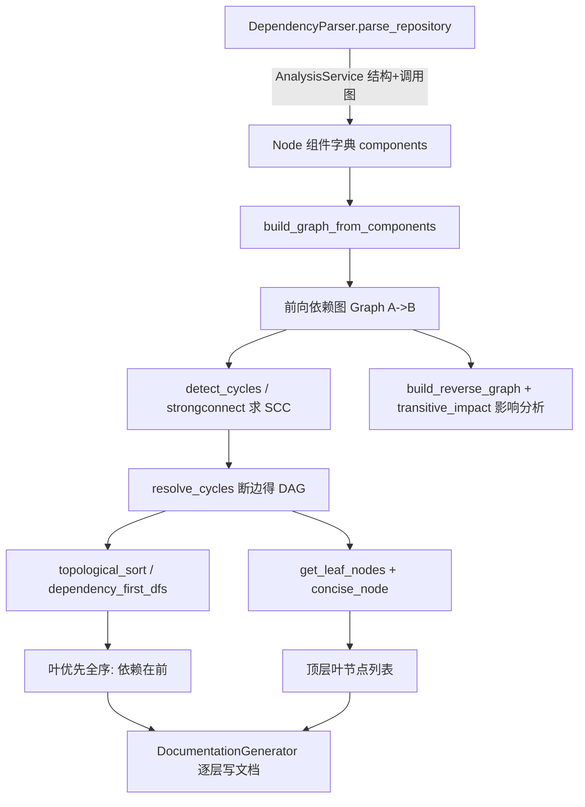

# GraphAndSort 模块文档

## 概述

GraphAndSort 是 DependencyAnalyzer 的叶子模块，负责把多语言代码仓库解析出的代码组件（函数/类/接口/结构体）及其依赖关系，转换为可遍历的**依赖图**，再经**拓扑排序**与**叶节点提取**产出「叶优先（leaf-first）」的文档生成顺序。

整个流程分为四步：
1. `DependencyParser` 调用 `AnalysisService` 做结构分析与调用图分析，生成 `Dict[str, Node]`（每个 `Node` 带有 `depends_on` 集合）。
2. `DependencyGraphBuilder` 编排解析、建图、取叶节点，落地 `dependency_graph.json` 并返回 `(components, leaf_nodes, routes)`。
3. `topo_sort.py` 提供图构建、环检测/消解、拓扑排序、叶节点 discovery、传递影响分析等纯函数工具。
4. 上游 [[AnalysisPipeline]] / 文档生成器（[[LLM_Backend]]）消费「叶优先」顺序，保证被依赖的底层组件先产出文档，上层组件引用时已有上下文。

## 组件清单

| 组件 | 类型 | 文件 | 职责 |
|------|------|------|------|
| DependencyParser | class | ast_parser.py | 编排结构+调用图分析，将 functions/relationships 落为 `Node` 组件字典，建立 id↔legacy-id 映射与 name→id 索引，填充 `depends_on`，并收集跨服务路由 |
| DependencyGraphBuilder | class | dependency_graphs_builder.py | 顶层编排：实例化 parser、调用 `build_graph_from_components` 与 `get_leaf_nodes`、按 component_type 过滤合法叶节点（class/interface/struct，无类时降级含 function），返回三元组 |
| build_graph_from_components | function | topo_sort.py | 将 `Dict[comp_id, Node]` 转为前向依赖图 `comp_id → {dep_id}`（仅保留仓库内已知组件） |
| build_reverse_graph | function | topo_sort.py | 生成反向邻接表：`A→B`（A 依赖 B）变为 `B→A`（B 被谁依赖），用于反向遍历 |
| concise_node | function | topo_sort.py | 将 `__init__` 节点归并为类名，并按合法类型（class/interface/struct 或 function）过滤非法标识符（含 error/exception 等）的叶节点 |
| dependency_first_dfs | function | topo_sort.py | DFS 遍历：先解析依赖再输出节点，自根节点（无入边）起得到「依赖先于依赖者」顺序 |
| detect_cycles | function | topo_sort.py | 用 Tarjan 强连通分量（SCC）算法检测环，返回所有规模 >1 的 SCC 作为环 |
| dfs | function | topo_sort.py | `dependency_first_dfs` 内部递归子过程：先递归所有依赖，再把当前节点加入结果 |
| get_leaf_nodes | function | topo_sort.py | 找出无任何其他节点依赖的叶节点；含动态阈值（max(400, 5%×组件数)）剪枝，超阈值时剔除作为他人依赖节点的候选 |
| resolve_cycles | function | topo_sort.py | 基于 `detect_cycles` 找出 SCC，逐环删除一条边使图变 DAG（保留无环返回） |
| resolve_files_to_components | function | topo_sort.py | 将文件路径（支持相对/绝对后缀匹配）映射到组件 ID，用于按文件定位组件 |
| strongconnect | function | topo_sort.py | Tarjan 算法的核心递归：维护 index/lowlink/stack，发现 SCC 根并弹出分量 |
| topological_sort | function | topo_sort.py | 先 `resolve_cycles`，再用 Kahn 算法（带 reverse_adj 优化到 O(V+E)）做拓扑排序，结果逆序使「依赖在前」 |
| transitive_impact | function | topo_sort.py | BFS 传递影响分析，支持 `depended_by`/`depends_on`/`both` 方向、max_depth 与路径回溯，输出受影响组件及深度/路径 |

## 关键设计

**依赖图方向约定**：全模块统一采用「自然依赖方向」——边 `A → B` 表示「A 依赖 B」。因此根节点（无入边）是底层组件，叶节点（无出边 / 不被他人依赖）是顶层组件。文档生成需「叶优先」顺序，即**先写被依赖的底层组件**，再写依赖它们的上层组件，保证回溯引用时上下文已就绪。

**建图（`build_graph_from_components`）**：遍历每个 `Node.depends_on`，仅当依赖 ID 存在于 `components` 中才建边，避免外部符号污染图结构。`DependencyParser._build_components_from_analysis` 在建图前已通过 `name_to_id` O(1) 字典做 callee 解析兜底，将 `CallerRelationship` 标注的调用关系填进 `depends_on`。

**环检测与消解**：真实代码常含循环依赖，`detect_cycles` 用 Tarjan 算法（递归 `strongconnect`）求 SCC，仅保留规模 >1 的分量作为环；`resolve_cycles` 对每个环删除一条边（优先跨模块启发式的简单实现）得到 DAG。`topological_sort` 与 `get_leaf_nodes` / `dependency_first_dfs` 都先 `resolve_cycles`，确保后续算法在 DAG 上成立。

**拓扑排序（叶优先核心）**：`topological_sort` 用 Kahn 算法，构造 `reverse_adj` 让每次出队只触碰直接依赖（`O(V+E)`），队列初始为 in-degree=0 的根节点；结果逆序（`result[::-1]`）后，**底层依赖排在前面**，正好对应文档「叶优先」顺序。若仍有环未消解，退化为返回全部节点避免流程中断。

**叶节点发现（`get_leaf_nodes` + `concise_node`）**：叶节点是「不被任何节点依赖」的组件，经 `concise_node` 做 `__init__` 归并、类型过滤（class/interface/struct；C 系无类时降级含 function）、非法标识符剔除。针对超大仓库（如 5 万组件），动态阈值 `max(400, 5%×N)` 触发剪枝，剔除同时作为他人依赖的候选，保留真正「顶层」叶节点，避免文档顺序爆炸。

**传递影响（`transitive_impact`）**：基于 `build_reverse_graph` 做 BFS，支持两种方向的变更影响面计算，可选 `track_paths` 回溯最短路径，支撑增量文档更新时的受影响模块定位。

**与文档生成的衔接**：`DependencyGraphBuilder.build_dependency_graph` 返回的 `leaf_nodes` 即为「叶优先」候选顺序入口，配合 `topological_sort` 的全序，使 [[LLM_Backend]] 的 `DocumentationGenerator` 能按依赖深度逐层产出模块文档。

## 数据流



## 依赖关系

- 依赖 [[AnalysisPipeline]]（`AnalysisService` 提供结构与调用图分析）
- 依赖 [[AnalyzerModels]]（`Node` 数据模型承载 `depends_on`）
- 依赖 [[AnalyzerUtils]]（`CODE_EXTENSIONS` 语言推断）
- 依赖 [[SharedConfig]]（`Config` 提供 `repo_path`、include/exclude 模式、输出目录）
- 产出被 [[LLM_Backend]] 文档生成器与 [[MCP_Tools_Analysis]] 增量分析消费

## 使用示例

```python
from codewiki.src.config import Config
from codewiki.src.be.dependency_analyzer.dependency_graphs_builder import DependencyGraphBuilder

config = Config(repo_path="/path/to/repo")
builder = DependencyGraphBuilder(config)
components, leaf_nodes, routes = builder.build_dependency_graph()

# 叶优先全序（底层依赖在前）
from codewiki.src.be.dependency_analyzer.topo_sort import (
    build_graph_from_components, topological_sort
)
graph = build_graph_from_components(components)
order = topological_sort(graph)   # 文档生成按此顺序遍历

# 文件变更影响分析
from codewiki.src.be.dependency_analyzer.topo_sort import (
    transitive_impact, resolve_files_to_components
)
changed = resolve_files_to_components(components, ["src/api/handler.py"])
impact = transitive_impact(graph, set(changed), direction="depended_by", max_depth=5)
```

## 扩展点

- **`resolve_cycles` 断边策略**：当前为简单删除环内一条边；可改为跨模块优先、按耦合度/扇入扇出启发式选择最弱边，降低文档顺序失真。
- **叶节点类型阈值**：`valid_types` 与 `leaf_threshold` 可按语言/规模参数化，适配更多语言范式（如 C 系函数、JS 匿名模块）。
- **`concise_node` 归并规则**：可扩展更多命名约定（如工厂函数、装饰器）归并到代表性节点。
- **`transitive_impact`**：可接入权重（依赖强度）做加权影响评分，支撑 [[MCP_Tools_Analysis]] 的更精细增量更新。

## 相关模块

- [[DependencyAnalyzer]]
- [[AnalysisPipeline]]
- [[AnalyzerModels]]
- [[AnalyzerUtils]]
- [[LanguageAnalyzers]]
- [[RouteExtractors]]
- [[LLM_Backend]]
- [[MCP_Tools_Analysis]]
- [[SharedConfig]]