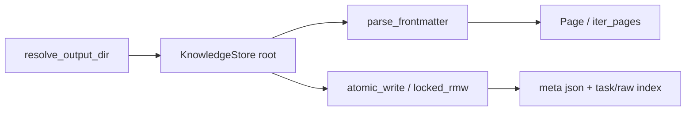

# [KnowledgeStore](../../../codewiki/src/store.py) 模块文档

## 概述
`KnowledgeStore` 是 CodeWiki 的持久化存储层（`codewiki/src/store.py` + `codewiki/src/frontmatter.py` + `codewiki/mcp/tools/store_bridge.py`），为单个 repowiki 根提供三样基础：跨进程安全的原子文件写原语（`atomic_write` + `.<name>.lck` 边车锁族）、统一 frontmatter 解析与轻量 `Page` 只读对象、以及 `KnowledgeStore` 门面（root 下路径解析、页面读写枚举、raw/任务索引缓存）。`parse_frontmatter` 是全仓库 frontmatter 解析的唯一收敛点；`resolve_output_dir` 把工具调用路由到正确的工作区知识库根（布局路由在 bridge 完成，存储层不感知多仓布局）。

## 组件清单

| 组件 | 类型 | 文件 | 职责 |
|------|------|------|------|
| `atomic_write` / `_atomic_replace_with_retry` | 函数 / 私有函数 | store.py | 崩溃安全写：同目录临时文件（pid+线程 id 命名）+ `os.replace`（5 次短退避重试抗杀软/索引器短暂占用），`finally` 清理残留临时文件 |
| `locked` | 上下文管理器 | store.py | 经 `<wiki-root>/.meta/locks/<sha256[:20]>.lck` 集中锁文件跨线程/跨进程串行化读改写序列（无 `.meta` 祖先时回退目标旁 `.<name>.lck` 边车）；锁独立文件而非目标（Windows 锁文件无法被 rename 覆盖） |
| `locked_write` | 函数 | store.py | `locked()` + `atomic_write()` 的组合写；团队布局约定下共享文件跨进程写入的标准原语 |
| `locked_rmw` | 函数 | store.py | 锁内读-转换-原子写；`transform` 返回 `None` 中止写（只读窥探），否则返回新文本 |
| `Page` | 类 | store.py | 轻量只读文档对象（relpath / 绝对路径 / frontmatter / body） |
| `KnowledgeStore`（含 `path`/`relpath`/`_read_text`/`page`/`iter_pages`/`write`/`update_frontmatter`/`content_hash`/`_raw_index`/`_rebuild_raw_index`/`read_task_index`/`write_task_index`/`find_task`） | 类 | store.py | 单个 repowiki 根的持久化门面：目录/文件路径解析、BOM 容忍读、页面解析与枚举、原子写与 frontmatter 定点更新、raw 与任务索引缓存（目录为真相、缓存校验重建） |
| `parse_frontmatter` | 函数 | frontmatter.py | 分离文档 frontmatter 与正文（全仓库唯一解析收敛点，json 解码标量值） |
| `resolve_output_dir` | 函数 | store_bridge.py | 把工具调用的 `output_dir` 解析到知识库根：集中式布局成员 → 工作区共享 repowiki；否则状态维持 `repo_path/repowiki` |

## 关键设计

- **原子文件族与集中锁**：Windows 上被打开/锁定的目标文件不能被 `os.replace` 覆盖，因此锁加在独立文件上（D19：集中存放于 `<wiki-root>/.meta/locks/`，按目标绝对路径哈希命名——锁语义只要求路径确定性映射，与相邻无关；无 `.meta` 祖先的裸 fixture 回退就地边车）；`atomic_write` 用 pid+线程 id 保证跨进程/跨线程临时名唯一，`os.replace` 带退避重试，`finally` 兜底清理。团队布局约定：跨进程共享文件（index、telemetry 等）一律经 `locked_write`/`locked_rmw`，绝不裸 `write_text`。
- **门面与 bridge 分层**：`KnowledgeStore` 构造即绑定 root，只认 root 之下的路径，不感知多仓布局；`resolve_output_dir` 是唯一的布局路由入口（集中式 vs 就地）。
- **目录为真相、索引为缓存**：任务索引 `read_task_index` 先做廉价一致性校验（目录名 id 集合 == 缓存 id 集合），失配/损坏才扫描 `task.md` frontmatter 全量重建并回写（失败不抛错）；raw 索引同理以 `conv-*.md` frontmatter 为真相（`_rebuild_raw_index`）。`content_hash` 把 `task_id` 纳入摘要，同一段对话分属不同任务不会被去重误杀。
- **frontmatter 单点解析**：所有 frontmatter 读取统一经 `parse_frontmatter`（utf-8-sig BOM 容忍 + 读取失败返回 None），旧式手工剥引号补丁（如 `_unquote_fm`）已成兼容层——统一 reader 已做 json 解码。

## 数据流（mermaid）



## 依赖关系

- 被知识库工具层各模块消费：[MCP_Tools_Knowledge](MCP_Tools_Knowledge.md)、[MCP_Tools_Quality](MCP_Tools_Quality.md)、[MCP_Tools_Workspace](MCP_Tools_Workspace.md)。
- 存储层本身不依赖任何模块页（叶子基础设施）。

## 使用示例

```python
from codewiki.src.store import KnowledgeStore, locked_rmw
store = KnowledgeStore(root)
# 跨进程安全更新 tasks/index
new = locked_rmw(store._task_index_path(), lambda t: transform(t))
for page in store.iter_pages(scope="notes"):
    print(page.relpath, page.frontmatter.get("status"))
```
