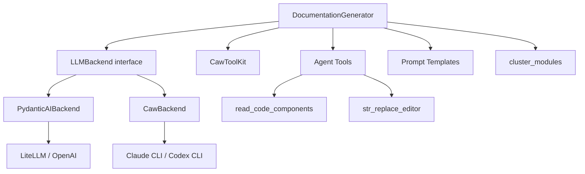

# LLM Backend

## Overview

Unified LLM abstraction layer supporting two modes: API-key based (OpenAI/LiteLLM/Pydantic-AI) and CLI-subscription based (Claude/Codex). Includes the documentation generation orchestrator and agent tools.

## Architecture

## Components

### LLMBackend (backend.py)
Abstract interface with two methods:
- **complete**: Single-shot text completion (clustering, overviews)
- **run_module_agent**: Multi-turn agent loop for per-module doc generation

### [PydanticAIBackend](../../../codewiki/src/be/pydantic_ai_backend.py)
Wraps OpenAI-compatible / Anthropic / Bedrock / Azure-OpenAI via pydantic-ai + litellm.

### [CawBackend](../../../codewiki/src/be/caw_backend.py)
Routes through claude/codex CLI using the user's OAuth subscription. No API key needed.

### [DocumentationGenerator](../../../codewiki/src/be/documentation_generator.py)
Main orchestrator: iterates modules in leaf-first order, runs LLM agent per module with access to code reading and file editing tools.

### LLM Services (llm_services.py)
- **call_llm**: Unified LLM call with fallback model support
- **create_main_model/create_fallback_models**: Model factory functions
- Azure and LiteLLM integration paths

### Cluster Modules
LLM-assisted module clustering with format_potential_core_components for prompt preparation.

### Prompt Templates (prompt_template.py)
Formats system/user prompts for clustering, leaf modules, and parent module documentation.

### Agent Tools
- **read_code_components**: Reads source code for specified components
- **str_replace_editor**: File editing tool with flake8 validation
- **generate_sub_module_documentation**: Recursive sub-module doc generation

### Backend Utils
- **validate_mermaid_diagrams**: Mermaid syntax validation via mermaid-py
- **count_tokens**: Token counting for budget management
- **is_complex_module**: Heuristic for determining if module needs agent loop

## Cross References

- [CLI_Adapter](CLI_Adapter.md): CLI wrapper of [DocumentationGenerator](../../../codewiki/src/be/documentation_generator.py)
- [GraphAndSort](GraphAndSort.md): Provides processing order for module iteration
- [AnalyzerModels](AnalyzerModels.md): [Node](../../../codewiki/src/be/dependency_analyzer/models/core.py) data consumed by agent tools
- [[SharedConfig]]: [Config](../../../codewiki/src/config.py) dataclass with LLM settings

<!-- crosslinks (auto-generated) -->
## Related Modules
- Depends on: [CLI_Utils](cli_utils.md), [GraphAndSort](graphandsort.md), [MCP_Tools_Analysis](mcp_tools_analysis.md), [MCP_Tools_Quality](mcp_tools_quality.md), [SharedConfig](sharedconfig.md)
- Used by: [CLI_Adapter](cli_adapter.md), [CLI_Commands](cli_commands.md), [CLI_Config](cli_config.md), [MCP_Core](mcp_core.md), [MCP_Tools_DocWriter](mcp_tools_docwriter.md), [MCP_Tools_Quality](mcp_tools_quality.md), [WebApp](webapp.md)
