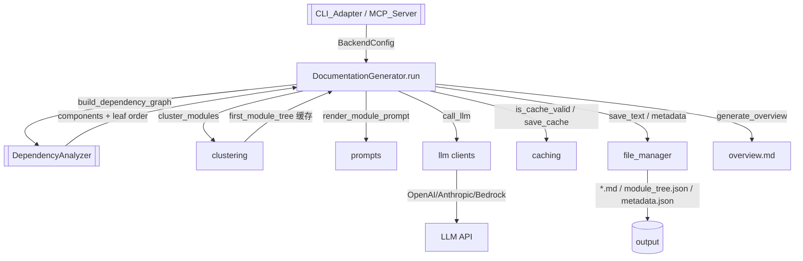

# LLM_Backend 模块文档

## 概述

`LLM_Backend` 是 CodeWiki 的文档生成后端引擎（位于 `codewiki/src/be/`），是整个工具的核心能力提供方。它把「依赖分析 → 模块聚类 → 逐模块 LLM 文档生成 → 缓存/落盘」串成可复用的能力，被 [[CLI_Adapter]]、[[MCP_Server]]、[[WebApp]] 共同调用。模块涵盖：配置抽象（BackendConfig / config_adapter）、LLM 客户端（OpenAI/Anthropic/Bedrock 多 provider）、提示词体系（prompts）、聚类（clustering）、缓存（cache / caching）、文件管理（file_manager）、以及文档生成器（DocumentationGenerator）。[[DependencyAnalyzer]] 的分析结果（依赖图、叶优先顺序）正是本模块进行聚类与文档生成的上游输入。

## 组件清单

| 组件 | 类型 | 文件 | 职责 |
| --- | --- | --- | --- |
| BackendConfig | class | backend.py | 后端全局配置（模型、token 预算、并行度、缓存开关、CLI 上下文） |
| is_caw_provider | func | backend.py | 判断 provider 是否为订阅模式（claude-code/codex） |
| set_cli_context | func | backend.py | 设置 CLI 运行上下文开关 |
| generate_cache_key / get_cache / is_cache_valid / save_cache | func | cache.py | 轻量模块级缓存实现 |
| clear_cache / generate_cache_key / get_cache / get_cache_path / invalidate_cache / is_cache_valid / save_cache | func | caching/__init__.py | 统一缓存命名空间入口 |
| cluster_modules / extract_module_names_from_tree / first_module_tree / get_component_id / group_components_by_module / load_first_module_tree / save_first_module_tree | func | clustering/__init__.py | 模块聚类：首轮树生成、按模块分组组件、缓存首轮树 |
| create_llm_client / generate_response | func | llm/__init__.py | LLM 客户端工厂与统一生成入口 |
| AnthropicClient / call_llm | class/func | llm/anthropic_client.py | Anthropic provider 封装 |
| BaseLLMClient / LLMResponse | class | llm/base.py | LLM 客户端抽象基类与响应模型 |
| BedrockClient / call_llm | class/func | llm/bedrock_client.py | AWS Bedrock provider 封装 |
| LLMClient / call_llm | class/func | llm/client.py | 通用 LLM 客户端实现 |
| OpenAIClient / call_llm | class/func | llm/openai_client.py | OpenAI 兼容 provider 封装 |
| LLMClient / call_llm | class/func | llm/llm.py | 兼容别名客户端 |
| get_prompt / list_module_prompts / render_prompt | func | prompts/__init__.py | 提示词加载/列举/渲染 |
| MODULE_PROMPTS / get_module_prompt / render_module_prompt | class/func | prompts/module_prompt.py | 模块文档提示词模板与渲染 |
| PromptConfig / load_prompt_config / render_with_prompt_config | class/func | prompts/prompt_config.py | 提示词配置（变量注入、fallback） |
| DocumentationGenerator / ModuleMetadata / create_documentation_metadata / generate_overview / generate_module_documentation / check_module_exists | class/func | documentation_generator.py | **核心**：驱动整条文档生成流水线 |
| create_documentation_metadata / extract_repo_name / file_manager / load_json / load_text / meta_join / meta_resolve / safe_join / save_json / save_text | func | file_manager.py | 文件系统与 `.meta` 路径解析 |
| BackendConfig / from_cli / from_cli_args / from_dict | class/func | config_adapter.py | 配置适配：CLI 参数/字典 → BackendConfig |
| EditTool（insert / _get_display_path 等） | class | agent_tools/str_replace_editor.py | 供 LLM 直接编辑工作区文件的确定性工具集（查看/字符串替换/插入/建文件），写前校验与展示路径规范化 |

## 关键设计

### 核心编排（documentation_generator.py）
`DocumentationGenerator` 是流水线的总指挥：
- 构造时接收 `Config`、`commit_id`、`output_dir`、`no_cache` 等；`run()` 在 `asyncio` 事件循环中依次执行：`build_dependency_graph`（依赖 [[DependencyAnalyzer]] 的 `DependencyParser`/`DependencyGraphBuilder`）→ `load_or_cluster_modules`（调用 `cluster_modules`，命中 `first_module_tree` 缓存则跳过）→ `generate_module_documentation`（对每个模块并行 LLM 生成 Markdown）→ `generate_overview`（汇总 overview.md）→ `create_documentation_metadata`（写 `metadata.json`）。
- `generate_module_documentation` 用 `module_prompt` 渲染提示词，经 `LLMClient` 生成单模块文档，再经 `file_manager.save_text` 落盘；支持缓存跳过（`is_cache_valid`）。
- `ModuleMetadata` / `create_documentation_metadata` 封装模块的 token 统计、文件清单与生成信息；`generate_overview` 聚合各模块产出生成仓库级概览。

### 配置体系（backend.py / config_adapter.py）
`BackendConfig` 聚合模型三元组、token 预算（`max_token_per_module`/`max_token_per_leaf_module`）、并行度（`max_concurrency`）、缓存与 CLI 上下文。`config_adapter.BackendConfig` 提供 `from_cli`/`from_cli_args`/`from_dict` 把 [[CLI_Config]] 的 `Configuration` 与运行参数桥接为后端配置；`from_cli` 经 [[SharedConfig]] 的 `Config.from_cli` 构造。`is_caw_provider` 区分订阅模式（无需 API key，走本地 CLI）。

### LLM 客户端（llm/）
统一抽象 `BaseLLMClient` + `LLMResponse`；`create_llm_client` 按 provider 路由到 `OpenAIClient`/`AnthropicClient`/`BedrockClient`，均实现 `call_llm`（含重试、超时、错误归一）。`llm/__init__.py` 的 `generate_response` 为上层便捷入口。`llm/llm.py` 的 `LLMClient` 作为兼容别名。

### 聚类（clustering/）
`cluster_modules` 把扁平组件按 `first_module_tree` 聚成模块；`first_module_tree` 产出首轮模块树（供 [[GraphAndSort]] 的叶优先顺序与文档生成顺序对齐），`save_first_module_tree`/`load_first_module_tree` 缓存该树避免重复 LLM 聚类；`group_components_by_module`/`get_component_id`/`extract_module_names_from_tree` 为辅助。

### 缓存（cache.py / caching/）
两套实现：`cache.py` 模块级轻量函数，`caching/__init__.py` 暴露统一命名空间（`get_cache_path`/`invalidate_cache`/`clear_cache`），基于 `generate_cache_key`（repo+commit+模块名）判断是否 `is_cache_valid`，避免对未变更模块重复调用 LLM。

### 提示词（prompts/）
`module_prompt.MODULE_PROMPTS` 是各文档类型的提示词模板；`render_module_prompt` 注入模块名/组件/依赖等变量；`PromptConfig`（load_prompt_config/render_with_prompt_config）支持从 `.codewiki/prompts/` 加载用户自定义提示词并 fallback 到内置；`get_prompt`/`list_module_prompts`/`render_prompt` 为顶层入口。

### 文件与 meta（file_manager.py）
`file_manager` 是单例，提供 `save_text`/`load_text`/`save_json`/`load_json`；`meta_resolve`/`meta_join`/`safe_join` 统一解析 `<output>/.meta/` 下的元数据路径，`extract_repo_name` 从 git URL 推导仓库名，`create_documentation_metadata` 创建文档级元数据。

### Agent 文件编辑工具（agent_tools/str_replace_editor.py）
`EditTool` 是注册给 LLM 后端的确定性文件编辑能力（被 pydantic_ai_backend / caw_toolkit 装配），提供查看、字符串替换、行插入与建文件等原子操作；`_get_display_path` 把目标路径规整为工作区相对的展示形式，写操作前对路径与偏移做校验，使模型对源码的改动可控、可预期。与 `documentation_generator` 的生成式输出不同，它面向「Agent 直接在仓库内迭代文件」。

## 数据流（mermaid）


## 依赖关系
- 上游调用方：[[CLI_Adapter]]、[[MCP_Server]]、[[WebApp]]。
- 依赖 [[DependencyAnalyzer]]（依赖图与叶优先顺序）、[[AnalyzerModels]]（Node/AnalysisResult）、[[GraphAndSort]]（构图与排序）、[[AnalyzerUtils]]（路由键规范化）。
- 依赖 [[SharedConfig]]（`Config`/`file_manager` 共享路径约定）。
- 产出被 [[DocVisualizer]] / [[Frontend]] 渲染。

## 使用示例（简化）
```python
from codewiki.src.config import Config
from codewiki.src.be.documentation_generator import DocumentationGenerator

cfg = Config(repo_path="/path/to/repo", output_dir="/path/to/repo/wiki")
gen = DocumentationGenerator(config=cfg, commit_id="abc123", no_cache=False)
await gen.run()  # 生成各模块 .md + overview.md + metadata.json
```

## 扩展点
- **新增 LLM provider**：实现 `BaseLLMClient` 子类并接入 `create_llm_client` 路由（OpenAI/Anthropic/Bedrock 已支持）。
- **自定义提示词**：在 `.codewiki/prompts/` 放置模板，`PromptConfig` 会自动加载并 fallback 内置。
- **聚类策略**：扩展 `clustering.cluster_modules` 支持更细粒度或语义聚类。
- **缓存后端**：`caching` 当前为本地文件，可替换为 Redis/对象存储。
- **文档类型**：扩展 `module_prompt.MODULE_PROMPTS` 新增架构/教程/API 等文档风格。

## 相关模块
- [[CLI_Adapter]]（包裹本模块并提供进度上报）
- [[MCP_Server]]（另一调用入口，复用聚类/缓存/文档生成）
- [[WebApp]]（经 BackgroundWorker 调用本模块）
- [[DependencyAnalyzer]]、[[AnalyzerModels]]、[[GraphAndSort]]、[[AnalyzerUtils]]（上游分析能力）
- [[SharedConfig]]（Config/file_manager 路径约定）
- [[DocVisualizer]]、[[Frontend]]（消费生成的文档）
- [[CLI]]、[[CLI_Config]]（配置与密钥环来源）