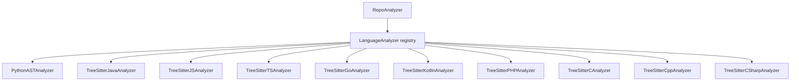

# Language Analyzers

## Overview

Tree-sitter based AST analyzers that extract components (classes, functions, methods) and their dependencies from source code across 10 programming languages.

## Architecture

## Supported Languages

| Language | Analyzer Class | Parser |
|----------|---------------|--------|
| Python | [PythonASTAnalyzer](../../../codewiki/src/be/dependency_analyzer/analyzers/python.py) | ast module (stdlib) |
| Java | [TreeSitterJavaAnalyzer](../../../codewiki/src/be/dependency_analyzer/analyzers/java.py) | tree-sitter-java |
| JavaScript | [TreeSitterJSAnalyzer](../../../codewiki/src/be/dependency_analyzer/analyzers/javascript.py) | tree-sitter-javascript |
| TypeScript | [TreeSitterTSAnalyzer](../../../codewiki/src/be/dependency_analyzer/analyzers/typescript.py) | tree-sitter-typescript |
| Go | [TreeSitterGoAnalyzer](../../../codewiki/src/be/dependency_analyzer/analyzers/go.py) | tree-sitter-go |
| Kotlin | [TreeSitterKotlinAnalyzer](../../../codewiki/src/be/dependency_analyzer/analyzers/kotlin.py) | tree-sitter-kotlin |
| PHP | [TreeSitterPHPAnalyzer](../../../codewiki/src/be/dependency_analyzer/analyzers/php.py) | tree-sitter-php |
| C | [TreeSitterCAnalyzer](../../../codewiki/src/be/dependency_analyzer/analyzers/c.py) | tree-sitter-c |
| C++ | [TreeSitterCppAnalyzer](../../../codewiki/src/be/dependency_analyzer/analyzers/cpp.py) | tree-sitter-cpp |
| C# | [TreeSitterCSharpAnalyzer](../../../codewiki/src/be/dependency_analyzer/analyzers/csharp.py) | tree-sitter-csharp |

## Component Extraction

Each analyzer extracts:
- Classes and their methods
- Functions (module-level and standalone)
- Import/dependency declarations
- Line ranges for each component

## Special Features
- **PHP**: [NamespaceResolver](../../../codewiki/src/be/dependency_analyzer/analyzers/php.py) for PHP namespace to FQN resolution
- **Python**: Uses stdlib ast module instead of tree-sitter for better reliability

## Cross References

- [AnalysisPipeline](AnalysisPipeline.md): Calls language analyzers during repo analysis
- [[RouteExtractors]]: Post-processes extracted routes for cross-service matching
- [AnalyzerModels](AnalyzerModels.md): Populates [Node](../../../codewiki/src/be/dependency_analyzer/models/core.py) objects with extracted data

<!-- crosslinks (auto-generated) -->
## Related Modules
- Depends on: [AnalyzerModels](analyzermodels.md), [AnalyzerUtils](analyzerutils.md), [CLI_Utils](cli_utils.md), [MCP_Tools_Analysis](mcp_tools_analysis.md), [MCP_Tools_Quality](mcp_tools_quality.md)
- Used by: [AnalysisPipeline](analysispipeline.md)
