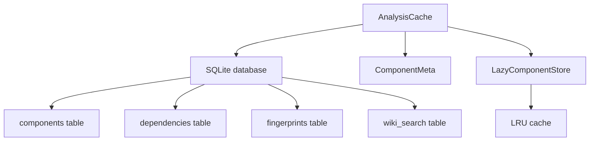

# MCP Analysis Cache

## Overview

SQLite-backed analysis cache at `.codewiki/analysis_cache.db` that persists components, content fingerprints, dependency edges, and a BM25 full-text search index. Enables incremental updates by detecting file-level changes.

## Architecture

## Components

### [AnalysisCache](../../../codewiki/mcp/cache.py)
Main cache class providing:
- **Component CRUD**: store, retrieve, remove components by file or ID
- **Fingerprint tracking**: content_hash per file for change detection
- **Incremental detection**: `detect_changes()` compares current vs cached fingerprints
- **Dependency edges**: store/query call relationships
- **Wiki search index**: BM25-ranked full-text search with jieba tokenization
- **Route storage**: HTTP/MQ route persistence for cross-service analysis

### [ComponentMeta](../../../codewiki/mcp/cache.py)
Lightweight metadata object for lazy component access. Contains: id, name, file_path, language, type, line_range — without full source code.

### [LazyComponentStore](../../../codewiki/mcp/cache.py)
Provides `.get(component_id)` with LRU caching. Returns full [Node](../../../codewiki/src/be/dependency_analyzer/models/core.py) objects on demand, while iteration yields lightweight [ComponentMeta](../../../codewiki/mcp/cache.py).

### BM25 Tokenizer
Shared tokenizer supporting:
- Chinese text via jieba segmentation (optional)
- Fallback regex tokenization
- HTML/frontmatter stripping
- Stopword filtering for EN/CN

## Business Constraints
- Content fingerprint uses SHA-256 hash for change detection (confidence: 0.95)
- LRU cache limited to 500 entries to control memory (confidence: 0.9)
- BM25 parameters: k1=1.5, b=0.75 (standard IR tuning)

## Cross References

- [[MCP_Core]]: [SessionStore](../../../codewiki/mcp/session.py) manages [AnalysisCache](../../../codewiki/mcp/cache.py) instances
- [[MCP_Tools_Analysis]]: handle_analyze_repo creates and populates cache
- [[MCP_Tools_Dependency]]: Queries cache for dependency data

<!-- crosslinks (auto-generated) -->
## Related Modules
- Depends on: [AnalyzerModels](analyzermodels.md), [CLI_Utils](cli_utils.md), [DocVisualizer](docvisualizer.md), [MCP_Tools_Analysis](mcp_tools_analysis.md)
- Used by: [MCP_Core](mcp_core.md), [MCP_Tools_Analysis](mcp_tools_analysis.md), [MCP_Tools_Knowledge](mcp_tools_knowledge.md), [MCP_Tools_Quality](mcp_tools_quality.md)
