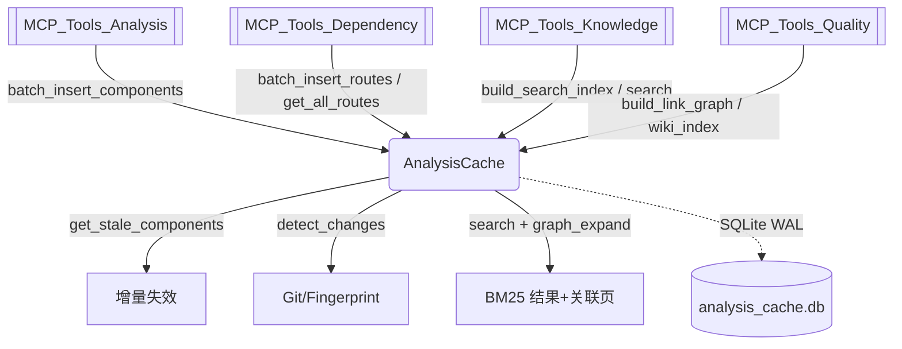

# MCP_Cache 模块文档

## 概述
`MCP_Cache` 是 [[MCP_Server]] 的持久化与检索核心，位于 `codewiki/mcp/cache.py`。它以单个 SQLite 数据库（`{repo}/.codewiki/analysis_cache.db`，WAL 模式）集中存储依赖分析的全部产物：组件元数据、依赖边、文件指纹、符号表、跨服务路由、BM25 全文检索索引以及 wiki 页面链接图。该模块向上支撑 [[MCP_Tools_Analysis]]、[[MCP_Tools_Dependency]]、[[MCP_Tools_Knowledge]]、[[MCP_Tools_Quality]] 等工具的增量更新、变更检测与语义搜索，是 MCP 服务"缓存即事实来源"的关键底座。

## 组件清单
| 组件 | 类型 | 文件 | 职责 |
| --- | --- | --- | --- |
| `AnalysisCache` | 类 | cache.py | SQLite 缓存主类，封装全部表读写、指纹/变更检测、BM25 检索与链接图 |
| `ComponentMeta` | 数据类 | cache.py | 组件轻量元数据快照，可序列化回 `Node` |
| `LazyComponentStore` | 类 | cache.py | `Node` 的 LRU 惰性加载包装，按需回源 `AnalysisCache` |
| `_build_indexable_text` | 函数 | cache.py | 构造带 frontmatter 字段加权的可索引文本 |
| `_extract_frontmatter` | 函数 | cache.py | 从 frontmatter 抽取指定键 |
| `_extract_snippet` | 函数 | cache.py | 截取命中关键词附近的片段 |
| `_extract_title` | 函数 | cache.py | 取首个 `# ` 标题作为页面标题 |
| `_parse_frontmatter_dict` | 函数 | cache.py | YAML frontmatter 解析（含降级解析） |
| `_parse_row` | 函数 | cache.py | 将 SQLite 行反序列化为 deps/base_classes/parameters |
| `_tokenize` | 函数 | cache.py | 中英文 BM25 分词器（共享给 wiki_search） |
| `_sql_chunks` | 函数 | cache.py | 将 IN 占位符列表分块以规避 999 绑定上限 |

## 关键设计
**存储模型与表结构。** `_create_tables` 建立 9 张表：`repo_meta`、`components`、`file_fingerprints`、`dependencies`、`search_index`、`search_token_index`、`search_stats`、`symbols`、`wiki_links`、`routes`。`components` 以 `content_hash` 列记录内容指纹（含迁移兼容）；`dependencies` 以 (source,target) 主键存储有向边；`routes` 承载 [[MCP_Tools_Dependency]] 的跨服务路由。

**内容指纹与增量。** `batch_insert_components` 通过 `_comp_hash` 计算 SHA256：优先用 `source_code`，否则回退到已存 hash 或结构签名（name/行号/参数/依赖），避免增量模式下误判陈旧。内部复用 `_sql_chunks` 分块删除/写入以适配大仓库。

**陈旧检测。** `get_stale_components` 对比新旧 `Node` 的 hash，返回 `added/modified/deleted` 三类列表，供上层级联失效 wiki 页面。

**变更检测。** `detect_changes` 优先 `_git_detect`（基于提交 diff 与未跟踪/暂存文件），不可用时回退 `_fp_detect`（遍历源码扩展名、比对 mtime/size/64KB 头哈希）。

**LRU 惰性加载。** `LazyComponentStore` 持有 `ComponentMeta` 全量索引、`Node` LRU（默认 500），`__getitem__` 命中缓存直接返回，未命中回源 `AnalysisCache.get_component` 并淘汰最旧项。`ComponentMeta.to_node` 可还原为依赖分析 `Node`。

**BM25 检索。** `_tokenize` 先用正则剥离 HTML 注释/frontmatter/markup，再尝试 `jieba` 中文分词，过滤停用词与单字/数字；`_build_indexable_text` 对 tags/aliases 3x、title/description/severity 2x 加权。`build_search_index` 扫描 `wiki/`、`notes/`、`raw/sources/` 生成 `search_index`+倒排 `search_token_index` 及 `avg_doc_len` 统计。`search` 实现标准 BM25（k1=1.5,b=0.75），支持 `scope`、`type_filter`、`include_notes`、`hop` 图扩散（`graph_expand` BFS+衰减）。

**链接图。** `build_link_graph` 抽取 `[[wikilink]]` 与 `[text](x.md)`，经 `_resolve_link_target`/`_resolve_md_href` 解析为 `wiki_links` 有向边；`get_related_pages` 返回关联页（in/out/both 方向）。

## 数据流（mermaid）


## 依赖关系
- [[MCP_Server]]：被 `server.py` 实例化与调用
- [[MCP_Core]]：共享 `SessionWorkspace`/配置路径
- [[MCP_Tools_Analysis]]：写入组件/路由、读取变更
- [[MCP_Tools_Dependency]]：读写 routes、依赖边
- [[MCP_Tools_Knowledge]]：构建/查询 BM25 索引
- [[MCP_Tools_Quality]]：链接图与 lint 索引
- [[LLM_Backend]]：复用 `Node`、`DependencyAnalyzer/AnalyzerModels`
- [[SharedConfig]]：读取 `WIKI_DIR`、`PAGE_TYPE_DIRS` 等常量

## 使用示例
```python
from pathlib import Path
from codewiki.mcp.cache import AnalysisCache

cache = AnalysisCache(Path("/repo"))
# 增量写入分析结果后检测陈旧组件
stale = cache.get_stale_components(new_components)
changed = cache.detect_changes()  # {'changed_files': [...], 'method': 'git'}
# 构建检索索引并搜索
cache.build_search_index(Path("/repo/.codewiki/workspace"))
results = cache.search("缓存设计", type_filter="doc", hop=1)
# 惰性读取组件
store = LazyComponentStore(cache, cache.get_all_metas())
node = store["codewiki/mcp/cache.py::AnalysisCache"]
```

## 扩展点
- **新检索源**：在 `build_search_index` 增加目录扫描分支并向 `search_index.source` 注册新类型（配合 `type_filter`）。
- **新链接语法**：扩展 `build_link_graph` 的正则与 `_resolve_*` 解析器（如 `@mention`、obsidian 别名）。
- **新指纹策略**：修改 `_comp_hash` 增加更细粒度的内容特征（行内变更、import 签名）。
- **跨仓库索引**：`search_token_index` 与 `wiki_links` 可按 `repo_name`/`output_dir` 分片以支持 monorepo 多条目检索。

## 相关模块
[[MCP_Server]]、[[MCP_Core]]、[[MCP_Prompts]]、[[MCP_Tools_Analysis]]、[[MCP_Tools_Dependency]]、[[MCP_Tools_DocWriter]]、[[MCP_Tools_Knowledge]]、[[MCP_Tools_Quality]]、[[LLM_Backend]]、[[SharedConfig]]