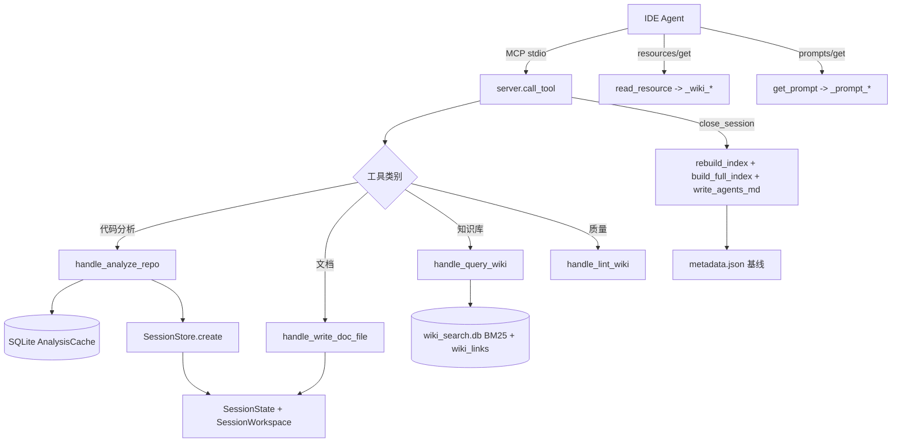

# MCP_Core 模块文档

## 概述

MCP_Core 是 CodeWiki MCP Server（`codewiki.mcp.server`）的核心骨架，负责把各类工具（代码分析、Wiki 生成、知识库管理、质量保障、跨服务分析）以 MCP 协议暴露给 IDE Agent（Cursor / Claude Desktop）。它同时承载了**工具注册与分发、Prompt 模板、只读资源（Resources）、会话状态管理、大文件落地（Workspace）、遗留工具与增量元数据**等职责，是 [[MCP_Server]] 与 [[MCP_Tools_Analysis]]、[[MCP_Tools_Dependency]]、[[MCP_Tools_DocWriter]]、[[MCP_Tools_Knowledge]]、[[MCP_Tools_Quality]]、[[MCP_Prompts]]、[[MCP_Cache]] 等子模块的顶层编排者。

核心设计要点：
- **零配置工具集 + 遗留工具集**分离：`_fine_grained_tools()` 与 `_legacy_tools()` 在 `list_tools()` 中合并返回。前者无需 LLM 配置，后者（`generate_docs`/`get_module_tree`）需 `codewiki config set`。
- **大结果落盘**：依赖图、组件索引、源码等体积大的数据写入 `.codewiki/workspace/` 目录，仅返回 `file_path`，避免撑爆 stdio 通道。
- **会话生命周期**：`analyze_repo` 创建 `SessionState`（2h TTL、最多 10 个），`close_session` 触发索引重建、AGENTS.md 注入与清理。

## 组件清单

| 组件 | 类型 | 文件 | 职责 |
| --- | --- | --- | --- |
| `_fine_grained_tools` | 函数 | server.py | 返回零配置 IDE 驱动工具定义列表（analyze_repo、write_doc_file、query_wiki 等） |
| `_legacy_tools` | 函数 | server.py | 返回需 LLM 配置的遗留工具（generate_docs、get_module_tree）定义 |
| `list_tools` | 协程 | server.py | MCP `list_tools` 处理器，合并两套工具 |
| `call_tool` | 协程 | server.py | MCP `call_tool` 分发器，按名称路由到各 handler（懒加载导入） |
| `_legacy_generate_docs` | 协程 | server.py | 遗留一句话生成文档（走 DocumentationGenerator） |
| `_legacy_get_module_tree` | 协程 | server.py | 读取已有 module_tree.json 并生成摘要 |
| `_load_config` | 函数 | server.py | 从 keyring/config.json 加载 CodeWiki 配置，遗留工具前置 |
| `_read_wiki_resource` | 函数 | server.py | 解析 `codewiki://wiki/{output_dir}/{type}` 参数化资源 |
| `_wiki_catalog` | 函数 | server.py | 扫描 wiki/ 与 notes/ 生成页面目录 |
| `_wiki_module_tree` | 函数 | server.py | 读取 module_tree.json 输出模块摘要（含嵌套 `_summarize`） |
| `_wiki_index_status` | 函数 | server.py | 查询 BM25 索引/图谱边状态（SQLite） |
| `_summarize` | 函数(嵌套) | server.py | `_wiki_module_tree` 内递归汇总模块节点 |
| `_summarize_tree` | 函数(嵌套) | server.py | `_legacy_get_module_tree` 内树形文本摘要 |
| `_text` | 函数 | server.py | 包装文本结果为 `TextContent` |
| `_resolve_path` | 函数 | server.py | 相对路径基于 cwd 解析为绝对路径 |
| `get_prompt` | 协程 | server.py | MCP `get_prompt` 分发 10 个工作流模板 |
| `list_prompts` | 协程 | server.py | 声明可用 Prompt 模板（含中文标题/描述） |
| `list_resources` | 协程 | server.py | 声明静态资源（catalog/capabilities/page-types） |
| `list_resource_templates` | 协程 | server.py | 声明参数化 wiki 资源模板 |
| `read_resource` | 协程 | server.py | 按 URI 返回资源内容（含 `_read_wiki_resource`） |
| `main` | 协程 | server.py | stdio 传输启动入口 |
| `_write_generation_metadata_from_disk` | 函数 | server.py | close_session 时写 metadata.json 基线 |
| `_write_metadata_json` | 函数 | server.py | 写 git commit + 时间戳，支撑增量检测 |
| `_prompt_generate_wiki` | 函数 | server.py | 生成 Wiki 流水线指引（6 步） |
| `_prompt_extract_knowledge` | 函数 | server.py | 外部文档知识抽取指引 |
| `_prompt_search_wiki` | 函数 | server.py | 分层搜索策略指引（BM25→图谱→深读） |
| `_prompt_quality_check` | 函数 | server.py | 质量审计指引 |
| `_prompt_incremental_update` | 函数 | server.py | 增量更新指引 |
| `_prompt_workspace_analysis` | 函数 | server.py | 多仓库工作区分析指引 |
| `_prompt_cross_service_trace` | 函数 | server.py | 跨服务调用链追踪指引（含 CBM 增强） |
| `_prompt_code_analysis` | 函数 | server.py | 纯结构分析（不生成 Wiki）指引 |
| `_prompt_impact_review` | 函数 | server.py | 修改影响范围评估指引 |
| `_prompt_architecture_review` | 函数 | server.py | 架构审查与热点分析指引 |
| `SessionState` | 数据类 | session.py | 单会话可变状态（组件/LRU 懒加载、模块树、工作区） |
| `SessionStore` | 类 | session.py | 线程安全会话仓库 + 跨会话缓存复用 |
| `SessionWorkspace` | 类 | workspace.py | 单会话磁盘工作区（写 JSON/源码、清理） |
| `_safe_filename` | 函数 | workspace.py | 组件 ID 安全文件名化（限长+hash 防碰撞） |

## 关键设计

### 1. 工具注册骨架（server.py 顶部）
`_fine_grained_tools()` 与 `_legacy_tools()` 分别返回 `mcp.types.Tool` 列表，`list_tools()` 合并二者。每个工具定义含 `name`、`description`（中文、描述工作流位置与参数）与 `inputSchema`。工具总数约 22 个，覆盖代码分析、跨服务、文档生成、知识库、质量、会话六大类。

### 2. 工具分发与并发模型（call_tool）
`call_tool(name, arguments)` 是核心路由器：
- 通过 `if/elif` 按工具名懒加载对应 `codewiki.mcp.tools.*` handler（如 `handle_analyze_repo`、`handle_query_wiki`），避免一次性导入全部依赖。
- **并发注意**：多数同步 handler 经 `asyncio.to_thread(...)` 执行，避免阻塞事件循环；`analyze_repo` / `analyze_workspace` 因 Tree-sitter C 扩展非线程安全，强制在主线程运行（可接受的一次性重操作）。
- 异常统一捕获为 `{"error": str(e)}`，保证 stdio 协议不崩。

### 3. 会话状态管理（session.py）
- `SessionState`：持有 `repo_path`、`output_dir`、懒加载 `components: LazyComponentStore`（`get(cid)` 从 SQLite 懒加载完整 `Node` 并 LRU 缓存）、`leaf_nodes`、`module_tree`、轻量 `workspace`、`cache`、`analyzed_commit` 等；`is_expired` 基于 2h TTL。
- `SessionStore`：全局单例，线程安全（RLock）。`create()` 在超过 10 个会话时按 `last_accessed` 驱逐最旧会话（仅在无其他会话使用该仓库时清理 workspace）。`find_or_restore(repo_path)` 支持**无活跃会话情况下从 SQLite 缓存恢复**——使 `analyze_impact`/`list_dependencies` 等查询工具只需 repo_path 即可工作。`get_cache(repo_path)` 实现跨会话 `AnalysisCache` 复用。

### 4. 磁盘工作区（workspace.py）
`SessionWorkspace` 管理 `repo_path/.codewiki/workspace/` 目录：`write_json`/`write_component_source`/`write_text`/`read_json` 读写大结果；`cleanup()` 只删 `sources/`（共享 JSON 跨会话保留）。`_safe_filename` 将 `file.py::Class` 式 ID 规则化为文件名（限 180 字符 + 8 位 sha1 后缀防碰撞）。`cleanup_legacy_sessions` 兼容清理旧版 `.codewiki/sessions/`。

### 5. 只读资源（Resources）
`list_resources` 暴露 3 个静态资源：`codewiki://prompts/catalog`、`codewiki://capabilities`（工具清单/分类/关键模式）、`codewiki://page-types`（page_type 路由与 wikilink 规则）。`list_resource_templates` 提供 `codewiki://wiki/{output_dir}/{catalog|module-tree|index-status}` 参数化模板，由 `_read_wiki_resource` 解析 URI（URL 解码 output_dir）后分派到 `_wiki_catalog`/`_wiki_module_tree`/`_wiki_index_status`。

### 6. Prompt 工作流模板（Prompts）
`list_prompts` 声明 10 个中文模板；`get_prompt` 经 `prompts_map` 路由到 10 个 `_prompt_*` 生成器。每个生成器基于入参（repo_path 经 `_resolve_path`）产出分步中文指引（如 generate-wiki 的「分析→聚类→处理顺序→逐模块写→总览→质检关闭」）。

### 7. 遗留工具与增量元数据
`_load_config()` 读取 `ConfigManager` + keyring；`_legacy_generate_docs` 装配 `BackendConfig` 并跑 [[LLM_Backend]] 的 `DocumentationGenerator`。`_write_metadata_json` 在 close_session 时记录 git commit 与时间戳，供下次 `analyze_repo` 增量 diff。

## 数据流（mermaid）



## 依赖关系

- 会话/缓存：`[[MCP_Cache]]`（AnalysisCache / LazyComponentStore / ComponentMeta）
- 工具实现子模块：`[[MCP_Tools_Analysis]]`、`[[MCP_Tools_Dependency]]`、`[[MCP_Tools_DocWriter]]`、`[[MCP_Tools_Knowledge]]`、`[[MCP_Tools_Quality]]`
- 提示模板：`[[MCP_Prompts]]`（MCP_Core 内的 `_prompt_*` 即其实现入口）
- 服务端骨架：`[[MCP_Server]]`
- LLM 生成：`[[LLM_Backend]]`（DocumentationGenerator / BackendConfig）
- 配置：`[[SharedConfig]]`（codewiki.src.config 的 meta_join/meta_resolve/Config）

## 使用示例

启动服务器（stdio）：
```json
{ "mcpServers": { "codewiki": { "command": "python", "args": ["-m", "codewiki.mcp.server"] } } }
```

典型工作流（代码分析 + 文档生成）：
```
analyze_repo(repo_path="/repo")          # 创建会话，建依赖图，落盘到 workspace
list_components(repo_path="/repo")        # 浏览组件（大索引返回 file_path）
save_module_tree(repo_path="/repo", module_tree={...})
get_processing_order(repo_path="/repo")
read_code_components(repo_path="/repo", component_ids=["src/auth.py::AuthService"])
write_doc_file(repo_path="/repo", filename="auth.md", page_type="module", content="...")
close_session(repo_path="/repo")          # 重建索引 + AGENTS.md 注入
```

读取只读上下文：
```
resources/get codewiki://wiki/{enc_output_dir}/index-status
prompts/get generate-wiki
```

## 扩展点（新增 MCP 工具）

1. **注册工具定义**：在 `_fine_grained_tools()` 中添加 `Tool(name=..., description=..., inputSchema=...)`
2. **实现 handler**：在 `codewiki/mcp/tools/` 下新建模块并定义 `handle_xxx(arguments, store)`；如涉及 SQLite 分析数据，复用 `SessionStore.find_or_restore` 免会话加载
3. **接入分发器**：在 `call_tool` 中增加 `elif name == "xxx": from ... import handle_xxx; return [_text(await asyncio.to_thread(handle_xxx, arguments, _store))]`
4. **大结果落盘**：用 `SessionWorkspace.write_json/write_text` 写盘并仅返回路径
5. **可选资源/模板**：如需上下文，扩展 `list_resource_templates` 与 `read_resource` 分支

## 相关模块

- `[[MCP_Server]]` — 顶层 MCP 服务端
- `[[MCP_Cache]]` — 会话级 SQLite 组件缓存与懒加载
- `[[MCP_Prompts]]` — 工作流 Prompt 模板
- `[[MCP_Tools_Analysis]]` — analyze_repo / analyze_workspace / analyze_impact
- `[[MCP_Tools_Dependency]]` — list_dependencies / list_components / query_cross_service
- `[[MCP_Tools_DocWriter]]` — write_doc_file / edit_doc_file / save_module_tree
- `[[MCP_Tools_Knowledge]]` — query_wiki / ingest_note / ingest_source
- `[[MCP_Tools_Quality]]` — lint_wiki / flag_issue
- `[[LLM_Backend]]` — 遗留 generate_docs 的文档生成后端
- `[[SharedConfig]]` — meta_join / meta_resolve / Config 等共享配置工具