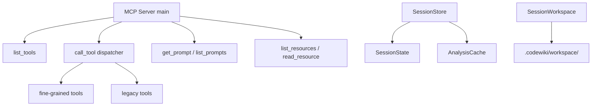

# MCP Server Core

## Overview

The MCP (Model Context Protocol) server core that implements the MCP stdio transport, manages sessions, and registers all tools, prompts, and resources for the CodeWiki knowledge management system.

## Architecture

## Components

### Server (server.py)
- **main()**: Starts MCP stdio server with asyncio event loop
- **list_tools**: Returns all 22 fine-grained + 2 legacy tool definitions
- **call_tool**: Routes tool calls to appropriate handlers
- **list_prompts/get_prompt**: Prompt catalog with workflow templates
- **list_resources/read_resource**: URI-based resource access (capabilities, wiki catalog)
- **_fine_grained_tools**: Tool definitions for code analysis, doc generation, wiki management
- **_legacy_tools**: Backward-compatible generate_docs and get_module_tree

### Session Management (session.py)
- **[SessionState](../../../codewiki/mcp/session.py)**: Mutable per-session state (session_id, repo_path, components, workspace, cache)
- **[SessionStore](../../../codewiki/mcp/session.py)**: Thread-safe in-memory store with TTL (2h) and max sessions (10)
- **find_or_restore()**: Auto-loads session from SQLite cache by repo_path

### Workspace (workspace.py)
- **[SessionWorkspace](../../../codewiki/mcp/workspace.py)**: File I/O for large results (>4KB threshold)
- Writes to `.codewiki/workspace/` shared directory
- **cleanup_legacy_sessions()**: Removes old per-session directories

## Business Constraints
- Session TTL is 2 hours, max 10 concurrent sessions (confidence: 0.95)
- Results >4KB written to workspace files to keep stdio channel lean (confidence: 0.95)
- Tree-sitter C extensions not thread-safe: analyze_repo runs on main thread (confidence: 0.9)

## Cross References

- [[MCP_Prompts]]: All prompt template functions
- [MCP_Cache](MCP_Cache.md): [AnalysisCache](../../../codewiki/mcp/cache.py) shared across sessions
- [[MCP_Tools_*]]: Individual tool handler modules
- [CLI_Commands](CLI_Commands.md): mcp_command starts this server

<!-- crosslinks (auto-generated) -->
## Related Modules
- Depends on: [CLI_Config](cli_config.md), [CLI_Utils](cli_utils.md), [GraphAndSort](graphandsort.md), [LLM_Backend](llm_backend.md), [MCP_Cache](mcp_cache.md), [MCP_Tools_Analysis](mcp_tools_analysis.md), [MCP_Tools_DocWriter](mcp_tools_docwriter.md), [MCP_Tools_Knowledge](mcp_tools_knowledge.md), [MCP_Tools_Quality](mcp_tools_quality.md), [SharedConfig](sharedconfig.md)
- Used by: [MCP_Prompts](mcp_prompts.md), [MCP_Tools_Analysis](mcp_tools_analysis.md)
