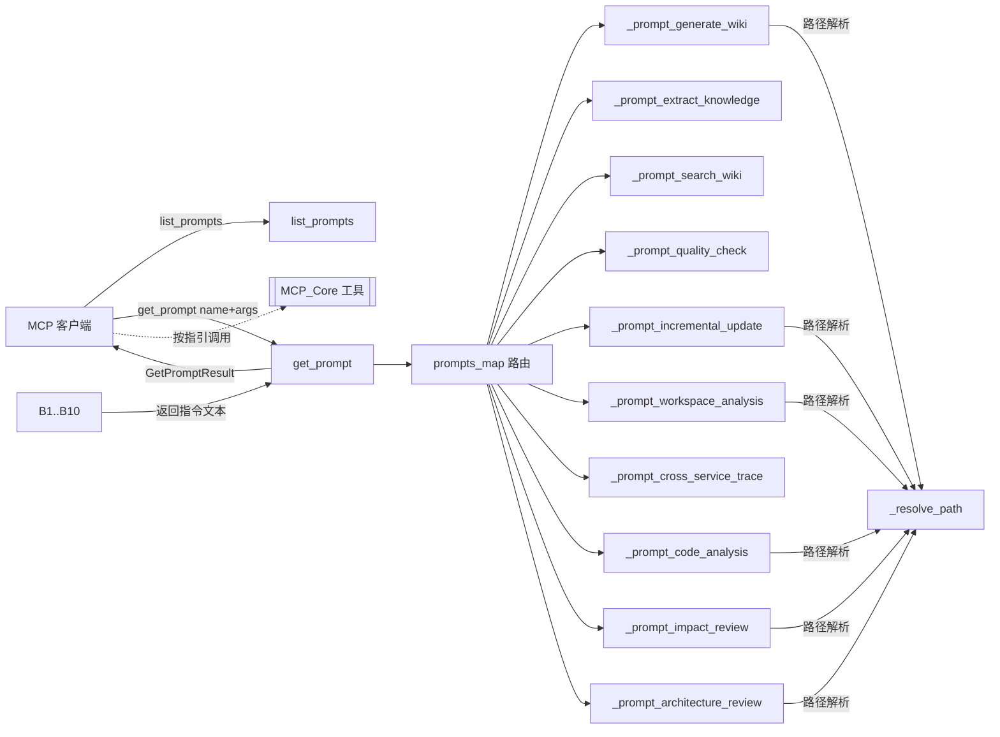

# MCP_Prompts 模块文档

## 概述
MCP_Prompts 是 CodeWiki MCP Server 的**提示词（Prompt）叶子模块**，全部实现于 `codewiki/mcp/server.py`。它向 MCP 客户端（如 Claude Desktop、Agent 工具）暴露 10 个**工作流指引模板（Prompts）**，每个模板返回一段结构化的多步骤自然语言指令，引导 Agent 调用 [[MCP_Core]] 注册的各类工具（分析、依赖、文档写入、知识、质检）完成端到端任务。

模块核心由三部分组成：`list_prompts()`（声明模板元数据）、`get_prompt()`（按名称路由到 10 个 `_prompt_*` 构建器）、以及 10 个 `_prompt_<workflow>` 纯函数。每个构建器接收 `dict[str,str]` 参数，解析路径后拼装模板字符串。提示词本身**不执行任何工具**，仅产出"该调用哪些工具、按什么顺序、注意什么"的指令文本。

## 组件清单
| 组件 | 类型 | 文件 | 职责 |
|------|------|------|------|
| `_prompt_generate_wiki` | 函数 | codewiki/mcp/server.py | 完整 Wiki 生成流水线指引（分析→聚类→撰写→总览→质检→关闭） |
| `_prompt_extract_knowledge` | 函数 | codewiki/mcp/server.py | 外部文档导入+实体/概念抽取+知识图谱构建指引 |
| `_prompt_search_wiki` | 函数 | codewiki/mcp/server.py | BM25/图谱/深度阅读三层搜索策略指引 |
| `_prompt_quality_check` | 函数 | codewiki/mcp/server.py | 文档质量审计（lint_wiki 多检查项+分级修复）指引 |
| `_prompt_incremental_update` | 函数 | codewiki/mcp/server.py | 基于变更检测增量更新受影响模块指引 |
| `_prompt_cross_service_trace` | 函数 | codewiki/mcp/server.py | 跨服务调用链追踪（RouteNode + CBM 语义）指引 |
| `_prompt_workspace_analysis` | 函数 | codewiki/mcp/server.py | 多仓库工作区分析+跨服务拓扑生成指引 |
| `_prompt_code_analysis` | 函数 | codewiki/mcp/server.py | 纯结构分析（不生成 Wiki）指令指引 |
| `_prompt_impact_review` | 函数 | codewiki/mcp/server.py | 修改影响范围评估（爆炸半径/风险分层）指引 |
| `_prompt_architecture_review` | 函数 | codewiki/mcp/server.py | 依赖图驱动的架构层次/热点/耦合分析指引 |

> 注：`list_prompts`、`get_prompt` 由 [[MCP_Core]] 模块所有权登记，本叶子模块聚焦其上方的 10 个 `_prompt_*` 构建器。

## 关键设计
### 1. 模板注册与路由
- `list_prompts()` 用 `@server.list_prompts()`（`mcp.server.Server`）异步返回 10 个 `Prompt` 对象，含 `name/title/description/arguments`，供客户端发现。
- `get_prompt(name, arguments)` 用 `@server.get_prompt()` 装饰，内部维护 `prompts_map`（name → `_prompt_*` 函数）。未知 name 返回友好的 `GetPromptResult` 错误文案；命中则调用构建器生成文本，包成 `PromptMessage(role="user", TextContent)`。
- 路径统一经 `_resolve_path()`：相对路径基于 `os.getcwd()` join，绝对路径 `normpath`，保证与 [[MCP_Core]] 的会话/workspace 解析一致。

### 2. 按职责分组的提示词构建器
- **Wiki 生命周期**：`_prompt_generate_wiki`（6 步流水线，强调叶优先顺序、Mermaid 图、wikilink、`close_session` 触发索引重建与 AGENTS.md 注入）、`_prompt_incremental_update`（analyze_repo 的 `changes` 字段驱动，定点 `edit_doc_file`/`write_doc_file`，`metadata.json` 缺失则全量）。
- **知识外部化**：`_prompt_extract_knowledge`（ingest_source + 实体/概念页面 + `[[wikilink]]` 图谱，`frontmatter_extra` 加 aliases/source_refs，全程直传 `output_dir` 无需 session）。
- **检索与质检**：`_prompt_search_wiki`（三层：BM25 `query_wiki` → 图谱 hop 扩展 → 深度阅读 `expand=true`；含 scope/type_filter 技巧）、`_prompt_quality_check`（`lint_wiki` 七类检查 error/warning/info 分级 + `flag_issue` 追踪）。
- **结构与影响**：`_prompt_code_analysis`（纯 Tree-sitter 分析，缓 SQLite，无 LLM）、`_prompt_impact_review`（BFS 传递性，自动判别 `::` 组件 ID vs 文件路径，正向 depended_by / 反向 depends_on，爆炸半径 10/50 阈值）、`_prompt_architecture_review`（高 depended_by=核心层、leaf=应用层、循环依赖识别，输出 Mermaid 层次图）。
- **跨服务（Workspace）**：`_prompt_workspace_analysis`（扫描多 git 仓库、RouteNode 跨服务匹配、InfraScanner、Mermaid 拓扑 + 可接 CBM/CodeGraph）、`_prompt_cross_service_trace`（从根服务 trace 调用链，多维切片 by_method/by_path/by_service，CBM `trace_path(mode='cross_service')` 增强，架构诊断 + `ingest_note` 归档）。

### 3. 参数约定
- 可选参数默认空串（`""`），缺失时回退当前目录；必填参数缺失时 `_prompt_extract_knowledge` 用占位符 `<source_path>`，`_prompt_search_wiki` 用 `<query>`，`_prompt_impact_review` 用 `<target>`。
- 多个提示词交叉引用 `get_prompt(prompt_type=...)`（如 `cluster`/`user`/`overview_repo`/`extraction_scan`/`code_analysis`/`impact_review`/`architecture_review`），形成提示词层内部跳转。

## 数据流（mermaid）


## 依赖关系
- [[MCP_Core]]：`list_prompts`/`get_prompt` 经由 `server`（`mcp.server.Server`）注册，提示词文本内引用的 `analyze_repo`、`list_dependencies`、`read_code_components`、`write_doc_file`、`lint_wiki`、`close_session`、`query_wiki`、`analyze_impact`、`query_cross_service`、`ingest_note`、`analyze_workspace`、`ingest_source` 等工具均由 [[MCP_Core]] 暴露，并分派到下方各 Tools 模块。
- [[MCP_Tools_Analysis]]：analyze_repo / analyze_impact / analyze_workspace / code-analysis 实际执行方。
- [[MCP_Tools_Dependency]]：list_dependencies / query_cross_service / list_components 执行方。
- [[MCP_Tools_DocWriter]]：write_doc_file / edit_doc_file / save_module_tree / get_processing_order 执行方。
- [[MCP_Tools_Knowledge]]：ingest_source / ingest_note / query_wiki 执行方。
- [[MCP_Tools_Quality]]：lint_wiki / flag_issue 执行方。
- [[MCP_Cache]]：提示词不直连，但被底层工具用于 SQLite 索引与结果缓存。
- [[LLM_Backend]]：提示词拼装的撰写/分析指令最终由 LLM 后端驱动执行。
- [[SharedConfig]]：输出目录、路径规范由共享配置约束。

## 使用示例
通过 MCP 客户端请求提示词（以 `generate-wiki` 为例）：
```
# 客户端发现
list_prompts() -> [generate-wiki, extract-knowledge, ..., architecture-review]

# 客户端获取生成指引
get_prompt(name="generate-wiki", arguments={"repo_path":"./myrepo"})
# 返回 GetPromptResult，messages[0].content.text 含 6 步流水线指令
```
Agent 依据返回文本逐条调用 `analyze_repo → save_module_tree → get_processing_order → read_code_components/write_doc_file → lint_wiki → close_session`。

自定义参数触发路径解析示例：`get_prompt("impact-review", {"repo_path":"./svc","target":"src/auth.py::AuthService"})`，构建器自动识别含 `::` 走 `component_ids` 分支。`workspace-analysis` 则依赖已分析的 `analyze_workspace` 输出 `workspace_session_id` 与 `overview_path`。

## 扩展点
- **新增工作流**：在 `list_prompts()` 追加 `Prompt(...)` 声明，并在 `get_prompt()` 的 `prompts_map` 注册新 `_prompt_xxx` 构建器即可，无需改动工具层。
- **参数标准化**：所有构建器复用 `_resolve_path()`，扩展参数时建议保持「可选默认当前目录、必填未提供用占位符」的容错约定。
- **提示词互链**：可在新提示词中引用既有 `get_prompt(prompt_type=...)` 模板，复用撰写/分析方法论，保持一致性。
- **外部能力增强**：`cross_service_trace`/`workspace_analysis` 已设计为可插拔（检测 `trace_path`=CBM、`index_repository`=codebase-memory、`codegraph_status`=CodeGraph），新增增强源只需在步骤 0 检测分支追加。

## 相关模块
[[MCP_Server]]、[[MCP_Core]]、[[MCP_Cache]]、[[MCP_Tools_Analysis]]、[[MCP_Tools_Dependency]]、[[MCP_Tools_DocWriter]]、[[MCP_Tools_Knowledge]]、[[MCP_Tools_Quality]]、[[LLM_Backend]]、[[SharedConfig]]