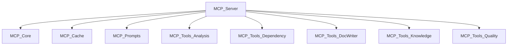

# MCP Server

## Overview

The MCP (Model Context Protocol) server is the AI IDE integration layer of CodeWiki. It exposes 22 fine-grained tools via MCP stdio transport, enabling AI agents to drive the full documentation generation pipeline: analyze code, cluster modules, write wiki pages, manage knowledge, and audit quality.

## Architecture

## Submodules

| Module | Components | Purpose |
|--------|-----------|----------|
| [MCP_Core](MCP_Core.md) | 26 | Server, session management, workspace, tool registration |
| [MCP_Cache](MCP_Cache.md) | 10 | SQLite analysis cache with BM25 search |
| [MCP_Prompts](MCP_Prompts.md) | 10 | Workflow prompt templates |
| [MCP_Tools_Analysis](MCP_Tools_Analysis.md) | 24 | analyze_repo, analyze_workspace, incremental detection |
| [MCP_Tools_Dependency](MCP_Tools_Dependency.md) | 19 | list_dependencies, analyze_impact, query_cross_service, list_components |
| [MCP_Tools_DocWriter](MCP_Tools_DocWriter.md) | 38 | write_doc_file, edit_doc_file, save_module_tree, page routing, schema |
| [MCP_Tools_Knowledge](MCP_Tools_Knowledge.md) | 37 | query_wiki, ingest_note, ingest_source, read_code, agents_md |
| [MCP_Tools_Quality](MCP_Tools_Quality.md) | 57 | lint_wiki, wiki_search, wiki_index, issue_tracker, CBM integration |

## Tool Categories

### Code Analysis (7 tools)
analyze_repo, analyze_workspace, list_components, list_dependencies, analyze_impact, read_code_components, view_repo_file

### Cross-Service Analysis (1 tool)
query_cross_service

### Documentation Generation (6 tools)
write_doc_file, edit_doc_file, save_module_tree, get_processing_order, get_prompt, generate_docs (legacy)

### Knowledge Management (5 tools)
query_wiki, ingest_note, ingest_source, retract_source, batch_ingest

### Quality Assurance (2 tools)
lint_wiki, flag_issue

### Session Management (1 tool)
close_session

## Wiki Generation Workflow

1. **analyze_repo** → session_id + component index
2. **get_prompt('cluster')** → clustering rules
3. **save_module_tree** → module hierarchy
4. **get_processing_order** → leaf-first order
5. For each leaf module: **get_prompt('system_leaf')** + **write_doc_file**
6. For each parent module: **get_prompt('overview_module')** + **write_doc_file**
7. **close_session** → rebuild index + search + AGENTS.md

## Design Decisions
- MCP stdio transport for IDE integration (CodeBuddy, Cursor, Claude Desktop)
- 4KB workspace file threshold to keep stdio channel lean
- Session TTL of 2 hours with max 10 concurrent sessions
- SQLite dual-purpose: analysis cache + wiki search index
- Incremental mode for fast re-analysis of unchanged code
