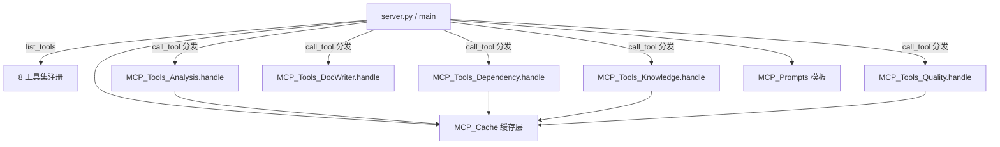
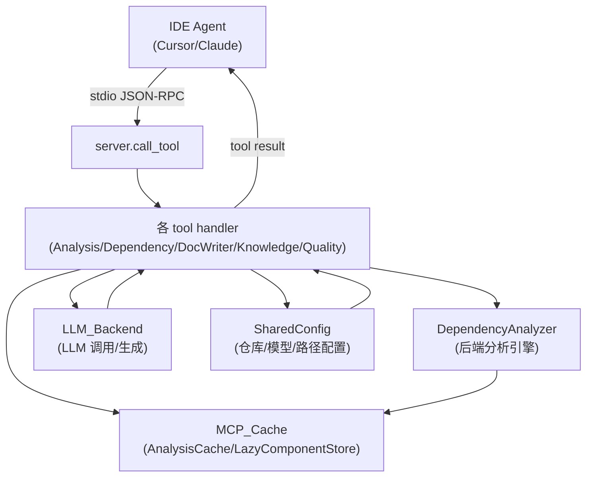

# MCP_Server 模块文档（概览）

## 模块职责
MCP_Server 是 CodeWiki 的 MCP（Model Context Protocol）协议服务端，基于 stdio 传输，把后端的代码分析、文档生成、知识库管理与 Wiki 质量校验能力以「工具（tool）」形式暴露给 IDE Agent（Cursor / Claude Desktop 等）。入口位于 `codewiki/mcp/server.py` 的 `main`，通过 `FastMCP` 的 `list_tools` / `call_tool` 完成工具枚举与分发；资源（resources）与提示模板（prompts）亦在此注册。8 个子模块分别承担骨架、缓存、Prompt 与 6 类工具集，详见下方子模块架构。

## 子模块架构

| 子模块 | 核心文件 | 职责 |
|---|---|---|
| [[MCP_Core]] | `mcp/server.py` | MCP 服务器骨架、`call_tool` 路由分发、Prompt 注册、资源、会话管理 |
| [[MCP_Cache]] | `mcp/cache.py` | SQLite 组件缓存与懒加载（`AnalysisCache` / `LazyComponentStore` / `ComponentMeta`） |
| [[MCP_Prompts]] | `mcp/prompts.py` | 10 个工作流 Prompt 模板（generate-wiki / search-wiki / quality-check 等） |
| [[MCP_Tools_Analysis]] | `mcp/tools/analysis.py` | `analyze_repo` / `analyze_workspace` / 增量检测 |
| [[MCP_Tools_Dependency]] | `mcp/tools/dependency.py` | `list_components` / `list_dependencies` / `query_cross_service` / `analyze_impact` |
| [[MCP_Tools_DocWriter]] | `mcp/tools/docwriter.py` | `write_doc_file` / `edit_doc_file` / `save_module_tree` / schema 生成 |
| [[MCP_Tools_Knowledge]] | `mcp/tools/knowledge.py` | `query_wiki` / `ingest_note` / `ingest_source` / AGENTS.md 生成 |
| [[MCP_Tools_Quality]] | `mcp/tools/quality.py` | `lint_wiki` / `flag_issue` / `wiki_search` / `wiki_index` 重建 |

## 跨模块数据流

## 设计原则
- **关注点分离**：服务器骨架（[[MCP_Core]]）与具体工具实现（5 个 Tools 子模块）解耦，Prompt 模板（[[MCP_Prompts]]）与缓存（[[MCP_Cache]]）独立。
- **零配置工具集 + 遗留工具集**：`call_tool` 同时支持新版零配置（`component_path` 派生自仓库根）与兼容旧式显式参数的工具集，平滑迁移。
- **大结果落盘**：超大文档/索引结果写入临时文件并以路径返回，避免 JSON-RPC 负载超限。
- **会话生命周期与并发模型**：每次 `call_tool` 创建临时 session，复用 [[MCP_Cache]] 与 [[SharedConfig]]，分析任务以仓库为粒度串行、工具调用间并发安全。
- **stdin/stdout 协议健壮性**：`main` 仅消费 stdio，捕获异常并包装为结构化错误返回，不污染协议通道。

## 相关模块
- [[MCP_Core]]：服务器骨架与 `call_tool` 路由、Prompt 注册、资源、会话管理。
- [[MCP_Cache]]：SQLite 组件缓存与懒加载，降低重复分析开销。
- [[MCP_Prompts]]：10 个工作流 Prompt 模板，引导 Agent 使用工具集。
- [[MCP_Tools_Analysis]]：仓库/工作区分析与增量检测工具。
- [[MCP_Tools_Dependency]]：组件、依赖、跨服务与影响面查询工具。
- [[MCP_Tools_DocWriter]]：文档写入/编辑与模块树/schema 生成工具。
- [[MCP_Tools_Knowledge]]：Wiki 查询、笔记/源码摄取与 AGENTS.md 生成工具。
- [[MCP_Tools_Quality]]：Lint、问题标注、搜索与索引重建工具。
- [[DependencyAnalyzer]]：后端核心分析引擎，被分析/依赖工具调用。
- [[LLM_Backend]]：统一 LLM 调用层，支撑文档生成与知识摄取。
- [[SharedConfig]]：全局配置（仓库路径、模型、输出目录），供各工具共享。
