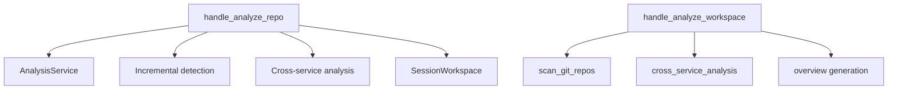

# MCP Analysis Tools

## Overview

Implements the `analyze_repo` and `analyze_workspace` MCP tool handlers. Handles Tree-sitter AST parsing, incremental change detection, monorepo cross-service analysis, and response construction.

## Architecture

## Components

### handle_analyze_repo
Main entry point for repository analysis:
1. Resolves repo path and output directory
2. Gets/creates [AnalysisCache](../../../codewiki/mcp/cache.py) from [SessionStore](../../../codewiki/mcp/session.py)
3. Incremental check: compares file fingerprints via `detect_changes()`
4. No-changes fast path via `_build_no_change_response`
5. Full analysis: delegates to [AnalysisService](../../../codewiki/src/be/dependency_analyzer/analysis/analysis_service.py)
6. Creates session with workspace, writes summary and schema
7. Runs monorepo cross-service detection if applicable

### Incremental Update Pipeline
- **_detect_doc_changes**: Compares git diff or mtime changes
- **_detect_git_from_meta**: Git-based change detection
- **_detect_mtime_from_meta**: Modification time fallback
- **_find_affected_modules**: Maps changed files to modules
- **_check_overview_stale**: Checks if overview needs refresh

### handle_analyze_workspace
Multi-repo workspace analysis:
- **_scan_git_repos**: Discovers git repositories in workspace
- **_run_cross_service_analysis**: Cross-repo dependency matching
- **_generate_overview**: Workspace-level summary

### workspace_result.py
- **resolve_session**: Resolves session from session_id or repo_path
- **write_result**: Writes large results to workspace files (>4KB threshold)

## Cross References

- [MCP_Core](MCP_Core.md): [SessionStore](../../../codewiki/mcp/session.py) and session lifecycle
- [MCP_Cache](MCP_Cache.md): [AnalysisCache](../../../codewiki/mcp/cache.py) for persistence
- [AnalysisPipeline](AnalysisPipeline.md): Core analysis service
- [[MCP_Tools_Dependency]]: list_dependencies uses same cache

<!-- crosslinks (auto-generated) -->
## Related Modules
- Depends on: [AnalysisPipeline](analysispipeline.md), [AnalyzerModels](analyzermodels.md), [CLI_Utils](cli_utils.md), [GraphAndSort](graphandsort.md), [MCP_Cache](mcp_cache.md), [MCP_Core](mcp_core.md), [MCP_Tools_DocWriter](mcp_tools_docwriter.md), [MCP_Tools_Quality](mcp_tools_quality.md), [SharedConfig](sharedconfig.md)
- Used by: [AnalysisPipeline](analysispipeline.md), [CLI_Commands](cli_commands.md), [CLI_Config](cli_config.md), [GraphAndSort](graphandsort.md), [LLM_Backend](llm_backend.md), [LanguageAnalyzers](languageanalyzers.md), [MCP_Cache](mcp_cache.md), [MCP_Core](mcp_core.md), [MCP_Tools_Dependency](mcp_tools_dependency.md), [MCP_Tools_DocWriter](mcp_tools_docwriter.md), [MCP_Tools_Knowledge](mcp_tools_knowledge.md), [MCP_Tools_Quality](mcp_tools_quality.md)
