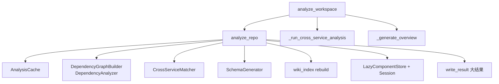

# MCP_Tools_Analysis 模块文档
## 概述
本模块是 [[MCP_Server]] 的"分析类"工具集合，提供仓库级与多仓库工作区级的结构解析入口。核心是 `analyze_repo`（单仓分析）与 `analyze_workspace`（多仓工作区分析）两个 MCP 工具，二者均为**纯 Tree-sitter 静态分析、不调用 LLM**，运行结果缓存进 SQLite（[[MCP_Cache]]），并创建带懒加载组件存储的会话（[[MCP_Core]]）。还提供跨子服务匹配、增量变更检测、影响面分析、overview 过期检测及大结果写入工作区的通用助手。

## 组件清单
| 组件 | 类型 | 文件 | 职责 |
|------|------|------|------|
| `handle_analyze_repo` | 函数 | analysis.py | 单仓分析主入口，构建依赖图、缓存、建会话、写工作区文件 |
| `handle_analyze_workspace` | 函数 | workspace_analyzer.py | 工作区多仓扫描+逐个分析+跨仓拓扑+生成 overview |
| `_run_monorepo_cross_service` | 函数 | analysis.py | 单仓内子服务检测与路由重标记、跨服务匹配 |
| `_run_cross_service_analysis` | 函数 | workspace_analyzer.py | 跨多仓加载路由做 CrossServiceMatcher 匹配 |
| `_generate_overview` | 函数 | workspace_analyzer.py | 生成工作区 overview.md 服务表与跨服务拓扑 |
| `_scan_git_repos` | 函数 | workspace_analyzer.py | 扫描一级子目录中的 .git 仓库 |
| `_build_no_change_response` | 函数 | analysis.py | 无变更时直接由缓存建会话与 summary |
| `_build_symbol_map` | 函数 | analysis.py | 构建 类名→源文件 映射供跨链接 |
| `_detect_doc_changes` | 函数 | analysis.py | 检测文档级变更与受影响模块/级联 |
| `_detect_git_from_meta` | 函数 | analysis.py | 基于 metadata.json commit 的 git 差异检测 |
| `_detect_mtime_from_meta` | 函数 | analysis.py | 基于文件 mtime 的变更回退检测 |
| `_find_affected_modules` | 函数 | analysis.py | 图传播/路径匹配计算受影响模块 |
| `_extract_overview_refs` / `_load_overview_refs` / `_save_overview_refs` | 函数 | analysis.py | overview.md 引用提取与持久化 |
| `_check_overview_stale` | 函数 | analysis.py | 判断 overview 是否过期 |
| `_retag_routes_by_service` | 函数 | analysis.py | 按子服务前缀重标记路由 repo_name |
| `_read_source_from_disk` | 函数 | analysis.py | 按行区间重读组件源码 |
| `_walk` / `_walk_graph` / `_n` / `add` | 辅助 | analysis.py | 树遍历/图遍历/路径归一化小助手 |
| `resolve_session` | 函数 | workspace_result.py | 由 session_id 或 repo_path 解析会话 |
| `write_result` | 函数 | workspace_result.py | 大结果(>4KB)写工作区文件、返回路径 |

## 关键设计
**单仓分析 `handle_analyze_repo`**：参数 `repo_path`(必填)、`output_dir`(默认 `<repo>/repowiki`)、`include_patterns`/`exclude_patterns`、`doc_type`(默认 design)、`custom_instructions`、`incremental`(默认 True)、`detect_services`(默认 True)。流程：① 构建 `Config`（llm 字段占位，分析阶段不调用 [[LLM_Backend]]）；② 取共享 [[MCP_Cache]] 的 `AnalysisCache`；③ 若 `cache.is_fresh()` 且 `detect_changes()` 无变更则走 `_build_no_change_response`；④ 否则调用 `DependencyGraphBuilder.build_dependency_graph(skip_file_paths=...)`（来自 [[DependencyAnalyzer]]）得 `components/leaf_nodes/routes`，增量时仅解析变更文件并合并缓存未变组件、重算 leaf；⑤ `batch_insert_components/routes` 写 SQLite；⑥ 若 `detect_services` 则 `_run_monorepo_cross_service`（调 `detect_services` + `CrossServiceMatcher` + `TopologyVisualizer`）；⑦ 用 `ComponentMeta` 构建 `LazyComponentStore`，`store.create()` 建会话并记录 `analyzed_commit`；⑧ 写 `summary.json`/`schema.yaml`（[[MCP_Tools_DocWriter]]）、`changes.json`、`symbol_map.json`、`overview_refs.json`、重建 wiki 索引（[[MCP_Tools_Quality]]）；⑨ 返回含 `session_id`/`stats`/`files`/`changes`/`cross_service` 的 JSON。

**多仓分析 `handle_analyze_workspace`**：参数 `workspace_path`(必填)、`exclude_dirs`、`output_dir`(默认 `<ws>/repowiki`)。先 `_scan_git_repos` 找 .git 子仓，逐个内部调用 `handle_analyze_repo`，再 `_run_cross_service_analysis` 跨仓匹配，最后 `_generate_overview` 生成 overview.md；返回 `workspace_session_id`/`repos`/`cross_service`。

**增量与影响面**：`_detect_git_from_meta`/`_detect_mtime_from_meta` 识别变更文件；`_find_affected_modules` 优先用 `topo_sort.transitive_impact(depended_by)` 做图传播，回退到路径前缀匹配；`_check_overview_stale` 比对 overview 引用决定是否级联概览。

**大结果助手**：`resolve_session` 支持 `session_id` 或 `repo_path`(`store.find_or_restore` 从 SQLite 恢复)；`write_result` 在数据 >4096 字节时写工作区文件、MCP 通道仅回 `{"file":...}` + summary。

## 数据流（mermaid）


## 依赖关系
[[MCP_Cache]] · [[MCP_Core]] · [[MCP_Tools_DocWriter]] · [[MCP_Tools_Quality]] · [[DependencyAnalyzer]] · [[LLM_Backend]](仅 Config 占位，不实际调用) · [[SharedConfig]]

## 使用示例
```json
// 单仓分析
{ "repo_path": "/path/to/repo", "doc_type": "design", "incremental": true }
// 工作区多仓
{ "workspace_path": "/path/to/ws", "exclude_dirs": "dist,build" }
// 大结果落盘
write_result(session, "cross_service_links.json", data, summary={"total": n})
```

## 扩展点（新增分析工具）
- 新增入口：在 `server.py` 的 `call_tool` 同步分支 `name == "xxx"` 处导入并调用本地 handler（注意 Tree-sitter 非线程安全需主线程）。
- 复用 `AnalysisCache` 缓存组件/路由，复用 `resolve_session`+`write_result` 做无会话恢复与大结果返回。
- 若需新分析维度（如安全/复杂度），在 `analysis.py` 加 helper 后接入 `handle_analyze_repo` 的写文件段，并遵循 `meta_join` 落 `.meta/`。

## 相关模块
[[MCP_Server]] · [[MCP_Core]] · [[MCP_Cache]] · [[MCP_Prompts]] · [[MCP_Tools_Dependency]] · [[MCP_Tools_DocWriter]] · [[MCP_Tools_Knowledge]] · [[MCP_Tools_Quality]] · [[DependencyAnalyzer]] · [[LLM_Backend]] · [[SharedConfig]]