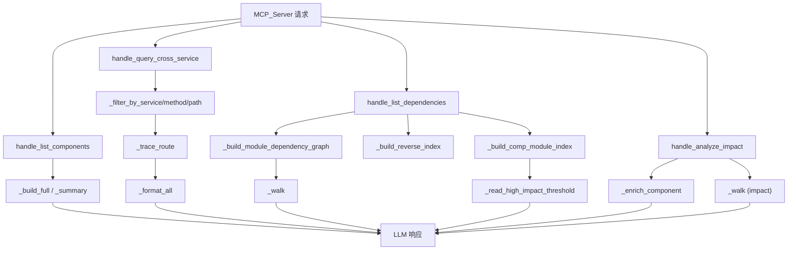

# MCP_Tools_Dependency 模块文档

## 概述

`MCP_Tools_Dependency` 是 CodeWiki 的 MCP 工具集中负责**依赖关系分析**的叶子模块，包含 18 个组件（3 个公开 handler + 15 个私有辅助函数），分布在 4 个源文件中：

- `component_list.py`：列出组件清单（完整/摘要两种视图）。
- `cross_service.py`：按服务、方法、路径过滤并追踪跨服务调用路由。
- `crosslink.py`：构建模块依赖图、组件-模块反向索引，列出依赖关系。
- `impact.py`：分析变更影响范围，递归遍历被依赖方并富集组件信息。

该模块是 [[DependencyAnalyzer]] 能力在 MCP 工具层的封装，服务于 [[MCP_Server]] 暴露给 LLM 的查询类工具。

## 组件清单

| 组件 | 类型 | 文件 | 职责 |
|------|------|------|------|
| handle_list_components | handler | component_list.py | 公开入口：解析参数并按 full/summary 模式返回组件列表 |
| _build_full / _build_summary | 私有辅助 | component_list.py | 构建完整明细视图 / 构建摘要统计视图 |
| handle_query_cross_service | handler | cross_service.py | 公开入口：查询跨服务调用并追踪路由 |
| _filter_by_service / _filter_by_method / _filter_by_path | 私有辅助 | cross_service.py | 按服务名、HTTP 方法、路径片段过滤调用边 |
| _trace_route / _format_all | 私有辅助 | cross_service.py | 从调用图追踪链路、格式化最终输出 |
| handle_list_dependencies | handler | crosslink.py | 公开入口：列出模块/组件间依赖关系 |
| _build_module_dependency_graph / _build_reverse_index / _build_comp_module_index | 私有辅助 | crosslink.py | 构建模块依赖图、组件→模块反向索引、组件↔模块映射 |
| _walk / _read_high_impact_threshold | 私有辅助 | crosslink.py | 递归遍历依赖树、读取高影响阈值配置 |
| handle_analyze_impact | handler | impact.py | 公开入口：分析某组件变更的影响范围 |
| _enrich_component / _walk | 私有辅助 | impact.py | 富集单个组件元数据、递归收集被影响组件 |

## 关键设计

1. **Handler + 私有辅助分层**：每个 handler（`handle_*`）仅做参数解析与编排，具体逻辑下沉到 `_` 前缀辅助函数，便于复用与单测。
2. **图结构驱动**：`crosslink.py` 与 `cross_service.py` 均基于依赖图/调用图进行遍历（`_walk`、`_trace_route`），支持正向与反向（`_build_reverse_index`）两种方向分析。
3. **配置阈值外置**：高影响判定阈值通过 `_read_high_impact_threshold` 从 [[SharedConfig]] 读取，避免硬编码。
4. **双视图输出**：`component_list.py` 提供 full/summary 两种粒度，适配 LLM 上下文长度约束。
5. **可缓存中间结果**：模块依赖图构建开销较大，依赖 [[MCP_Cache]] 缓存图结构以提升查询性能。

## 数据流（mermaid）



## 依赖关系

- [[MCP_Server]]：工具注册与请求分发入口。
- [[MCP_Core]]：提供工具基类、参数 schema 与公共工具函数。
- [[MCP_Cache]]：缓存模块依赖图等中间结果。
- [[DependencyAnalyzer]]：底层依赖解析与图构建引擎。
- [[SharedConfig]]：提供高影响阈值等配置项。

## 使用示例

```python
# 列出组件（摘要视图）
result = handle_list_components({"mode": "summary"})

# 查询跨服务调用并追踪路由
result = handle_query_cross_service({
    "service": "auth-service",
    "method": "POST",
    "path": "/login"
})

# 列出模块依赖
result = handle_list_dependencies({"target": "codewiki.core"})

# 分析某组件变更影响
result = handle_analyze_impact({"component": "codewiki/mcp/tools/impact.py::handle_analyze_impact"})
```

## 扩展点（新增依赖类工具）

1. **新增 handler**：在对应文件新增 `handle_*` 函数，遵循参数解析→调用私有辅助→格式化输出的分层结构。
2. **复用图结构**：新工具应复用 `_build_module_dependency_graph` / `_build_reverse_index` 而非重新解析，并走 [[MCP_Cache]]。
3. **阈值配置化**：涉及"高影响/重要"判定时调用 `_read_high_impact_threshold`，不要硬编码。
4. **注册到 MCP_Core**：新 handler 需在 [[MCP_Core]] 的工具注册表中登记，并由 [[MCP_Server]] 暴露。
5. **可观测性**：建议在 handler 入口增加日志与耗时统计，便于排查图遍历性能问题。

## 相关模块

- [[MCP_Server]]
- [[MCP_Core]]
- [[MCP_Cache]]
- [[MCP_Tools_Analysis]]
- [[MCP_Tools_Quality]]
- [[DependencyAnalyzer]]
- [[SharedConfig]]
- [[LLM_Backend]]
