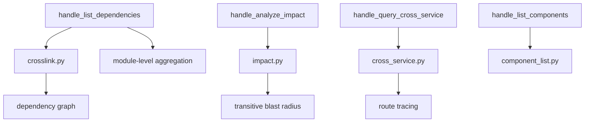

# MCP Dependency Tools

## Overview

MCP tool handlers for querying dependency relationships, listing components, analyzing change impact, and tracing cross-service call chains.

## Architecture

## Components

### list_dependencies (crosslink.py)
- Builds module-level dependency graph from component edges
- Computes reverse index for depended_by queries
- Identifies high-impact components (above threshold)
- Returns depends_on/depended_by data with workspace file output

### analyze_impact (impact.py)
- Computes transitive blast radius of code changes
- Enriches affected components with module context
- Walks dependency graph to find all transitively impacted code
- Returns risk assessment with component details

### query_cross_service (cross_service.py)
- Traces cross-service call chains
- Filters by service name, path, or HTTP method
- Formats results as full topology view
- Supports [RouteNode](../../../codewiki/src/be/dependency_analyzer/models/cross_service.py)-level route matching

### list_components (component_list.py)
- Returns full component index with type and file metadata
- Supports filtering by file_prefix and component_type
- Builds summary for compact MCP response

## Cross References

- [MCP_Cache](MCP_Cache.md): Queries [AnalysisCache](../../../codewiki/mcp/cache.py) for dependency/component data
- [GraphAndSort](GraphAndSort.md): Uses topological sort for impact computation
- [AnalysisPipeline](AnalysisPipeline.md): [CrossServiceMatcher](../../../codewiki/src/be/dependency_analyzer/analysis/cross_service_matcher.py) provides route data

<!-- crosslinks (auto-generated) -->
## Related Modules
- Depends on: [GraphAndSort](graphandsort.md), [MCP_Tools_Analysis](mcp_tools_analysis.md)
